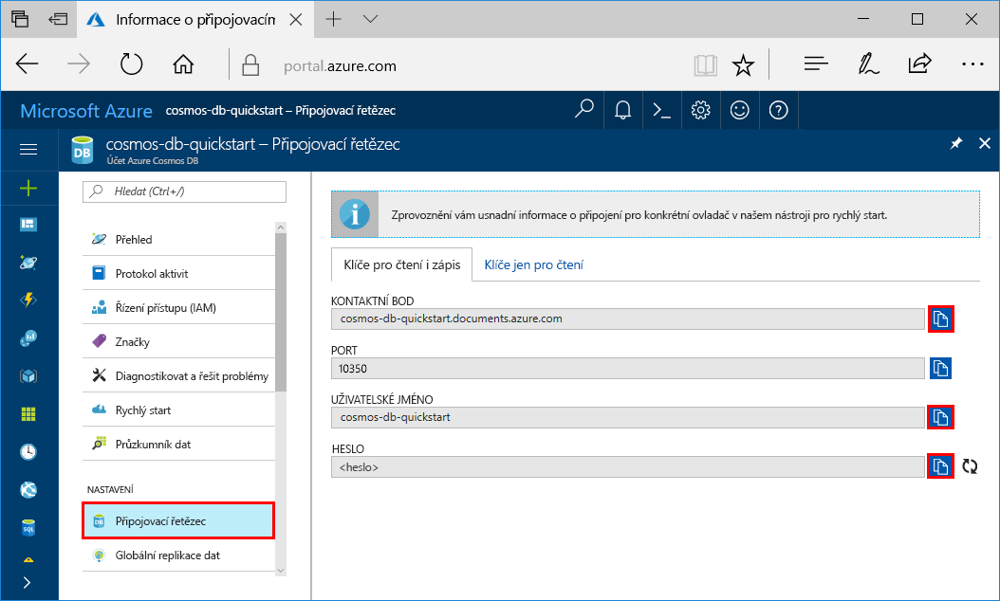
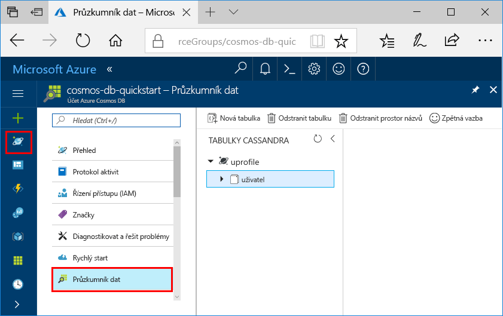

# <a name="quickstart-build-a-cassandra-app-with-nodejs-and-azure-cosmos-db"></a>Rychlý start: Sestavení aplikace Cassandra pomocí Node.js a Azure Cosmos DB

> [!div class="op_single_selector"]
> * [.NET](create-cassandra-dotnet.md)
> * [Java](create-cassandra-java.md)
> * [Node.js](create-cassandra-nodejs.md)
> * [Python](create-cassandra-python.md)
>  

Tento rychlý start ukazuje, jak pomocí Node.js a rozhraní Azure Cosmos DB [Cassandra API](cassandra-introduction.md) sestavit aplikaci profilu naklonováním příkladu z GitHubu. Tento rychlý start také ukazuje, jak pomocí webového portálu Azure Portal vytvořit účet Azure Cosmos DB.

Azure Cosmos DB je globálně distribuovaná databázová služba Microsoftu pro více modelů. Můžete rychle vytvořit a dotazovat databáze dokumentů, párů klíč-hodnota a grafů, které tak můžou využívat výhody možnosti globální distribuce a horizontálního škálování v jádru služby Azure Cosmos DB. 

## <a name="prerequisites"></a>Požadavky

[!INCLUDE [quickstarts-free-trial-note](../../includes/quickstarts-free-trial-note.md)] Alternativně můžete [vyzkoušet službu Azure Cosmos DB zdarma](https://azure.microsoft.com/try/cosmosdb/) bez předplatného Azure, poplatků a závazků.

Kromě toho je potřeba toto:
* [Node.js](https://nodejs.org/en/) verze 0.10.29 nebo vyšší
* [Git](https://git-scm.com/)

## <a name="create-a-database-account"></a>Vytvoření účtu databáze

Než budete moct vytvořit databázi dokumentů, je potřeba pomocí služby Azure Cosmos DB vytvořit účet Cassandra.

[!INCLUDE [cosmos-db-create-dbaccount-cassandra](../../includes/cosmos-db-create-dbaccount-cassandra.md)]

## <a name="clone-the-sample-application"></a>Klonování ukázkové aplikace

Teď naklonujeme aplikaci rozhraní Cassandra API z GitHubu, nastavíme připojovací řetězec a spustíme ji. Uvidíte, jak snadno se pracuje s daty prostřednictvím kódu programu. 

1. Otevřete příkazový řádek. Vytvořte novou složku s názvem `git-samples`. Pak zavřete příkazový řádek.

    ```bash
    md "C:\git-samples"
    ```

2. Otevřete okno terminálu Git, například git bash. Pomocí příkazu `cd` přejděte do nové složky, do které chcete nainstalovat ukázkovou aplikaci.

    ```bash
    cd "C:\git-samples"
    ```

3. Ukázkové úložiště naklonujete spuštěním následujícího příkazu. Tento příkaz vytvoří na vašem počítači kopii ukázkové aplikace.

    ```bash
    git clone https://github.com/Azure-Samples/azure-cosmos-db-cassandra-nodejs-getting-started.git
    ```

## <a name="review-the-code"></a>Kontrola kódu

Tento krok je volitelný. Pokud vás zajímá, jak se pomocí kódu vytvoří prostředky databáze, můžete si prohlédnout následující fragmenty kódu. Všechny fragmenty kódu pocházejí ze souboru `uprofile.js` ve složce `C:\git-samples\azure-cosmos-db-cassandra-nodejs-getting-started`. Jinak můžete přeskočit přímo k části [Aktualizace informací o připojení](#update-your-connection-string). 

* Hodnoty uživatelského jména a hesla se nastaví pomocí stránky připojovacího řetězce na webu Azure Portal. Cesta `path\to\cert` představuje cestu k certifikátu X509. 

   ```nodejs
   var ssl_option = {
        cert : fs.readFileSync("path\to\cert"),
        rejectUnauthorized : true,
        secureProtocol: 'TLSv1_2_method'
        };
   const authProviderLocalCassandra = new cassandra.auth.PlainTextAuthProvider(config.username, config.password);
   ```

* Inicializuje se proměnná `client` s informacemi contactPoint. Hodnota contactPoint se načte z webu Azure Portal.

    ```nodejs
    const client = new cassandra.Client({contactPoints: [config.contactPoint], authProvider: authProviderLocalCassandra, sslOptions:ssl_option});
    ```

* `client` se připojí k rozhraní Azure Cosmos DB Cassandra API.

    ```nodejs
    client.connect(next);
    ```

* Vytvoří se nový prostor klíčů.

    ```nodejs
    function createKeyspace(next) {
        var query = "CREATE KEYSPACE IF NOT EXISTS uprofile WITH replication = {\'class\': \'NetworkTopologyStrategy\', \'datacenter1\' : \'1\' }";
        client.execute(query, next);
        console.log("created keyspace");    
  }
    ```

* Vytvoří se nová tabulka.

   ```nodejs
   function createTable(next) {
    var query = "CREATE TABLE IF NOT EXISTS uprofile.user (user_id int PRIMARY KEY, user_name text, user_bcity text)";
        client.execute(query, next);
        console.log("created table");
   },
   ```

* Vloží se entity klíč-hodnota.

    ```nodejs
    ...
       {
          query: 'INSERT INTO  uprofile.user  (user_id, user_name , user_bcity) VALUES (?,?,?)',
          params: [5, 'IvanaV', 'Belgaum', '2017-10-3136']
        }
    ];
    client.batch(queries, { prepare: true}, next);
    ```

* Spustí se dotaz pro získání všech hodnot klíčů.

    ```nodejs
   var query = 'SELECT * FROM uprofile.user';
    client.execute(query, { prepare: true}, function (err, result) {
      if (err) return next(err);
      result.rows.forEach(function(row) {
        console.log('Obtained row: %d | %s | %s ',row.user_id, row.user_name, row.user_bcity);
      }, this);
      next();
    });
    ```  
    
* Spustí se dotaz pro získání páru klíč-hodnota.

    ```nodejs
    function selectById(next) {
        console.log("\Getting by id");
        var query = 'SELECT * FROM uprofile.user where user_id=1';
        client.execute(query, { prepare: true}, function (err, result) {
        if (err) return next(err);
            result.rows.forEach(function(row) {
            console.log('Obtained row: %d | %s | %s ',row.user_id, row.user_name, row.user_bcity);
        }, this);
        next();
        });
    }
    ```  

## <a name="update-your-connection-string"></a>Aktualizace připojovacího řetězce

Teď se vraťte zpátky na portál Azure Portal, kde najdete informace o připojovacím řetězci, a zkopírujte je do aplikace. Připojovací řetězec umožňuje vaší aplikaci komunikovat s hostovanou databází.

1. Na portálu [Azure Portal](https://portal.azure.com/) vyberte **Připojovací řetězec**. 

    Pomocí tlačítka  na pravé straně obrazovky zkopírujte horní hodnotu KONTAKTNÍ BOD.

    

2. Otevřete soubor `config.js`. 

3. Vložte hodnotu KONTAKTNÍ BOD z portálu místo `<FillMEIN>` na řádku 4.

    Řádek 4 by teď měl vypadat nějak takto: 

    `config.contactPoint = "cosmos-db-quickstarts.cassandra.cosmosdb.azure.com:10350"`

4. Zkopírujte z portálu hodnotu UŽIVATELSKÉ JMÉNO a vložte ji místo `<FillMEIN>` na řádku 2.

    Řádek 2 by teď měl vypadat nějak takto: 

    `config.username = 'cosmos-db-quickstart';`
    
5. Zkopírujte z portálu hodnotu HESLO a vložte ji místo `<FillMEIN>` na řádku 3.

    Řádek 3 by teď měl vypadat nějak takto:

    `config.password = '2Ggkr662ifxz2Mg==';`

6. Uložte soubor `config.js`.
    
## <a name="use-the-x509-certificate"></a>Použití certifikátu X509

1. Stáhněte si certifikát Baltimore CyberTrust Root místně z [https://cacert.omniroot.com/bc2025.crt](https://cacert.omniroot.com/bc2025.crt). Přejmenujte příponu souboru na `.cer`.

   Certifikát má sériové číslo `02:00:00:b9` a otisk SHA1 `d4🇩🇪20:d0:5e:66:fc:53:fe:1a:50:88:2c:78:db:28:52:ca:e4:74`.

2. Otevřete `uprofile.js` a změňte cestu `path\to\cert` tak, aby odkazovala na váš nový certifikát.

3. Uložte `uprofile.js`.

## <a name="run-the-nodejs-app"></a>Spuštění aplikace Node.js

1. V okně terminálu Git spusťte příkaz `npm install`, aby se nainstalovaly požadované moduly npm.

2. Spuštěním příkazu `node uprofile.js` spusťte aplikaci uzlu.

3. Na příkazovém řádku zkontrolujte očekávané výsledky.

    

    Stisknutím kláves CTRL + C zastavte provádění programu a zavřete okno konzoly. 

4. Na portálu Azure Portal otevřete **Data Explorer**, abyste se mohli na tato nová data dotazovat, měnit je a pracovat s nimi. 

     

## <a name="review-slas-in-the-azure-portal"></a>Ověření podmínek SLA na portálu Azure Portal

[!INCLUDE [cosmosdb-tutorial-review-slas](../../includes/cosmos-db-tutorial-review-slas.md)]

## <a name="clean-up-resources"></a>Vyčištění prostředků

[!INCLUDE [cosmosdb-delete-resource-group](../../includes/cosmos-db-delete-resource-group.md)]

## <a name="next-steps"></a>Další postup

V tomto rychlém startu jste se naučili vytvořit účet Azure Cosmos DB, vytvořit kontejner pomocí Průzkumníka dat a spustit aplikaci. Teď můžete do účtu Cosmos DB importovat další data. 

> [!div class="nextstepaction"]
> [Import dat Cassandra do služby Azure Cosmos DB](cassandra-import-data.md)


