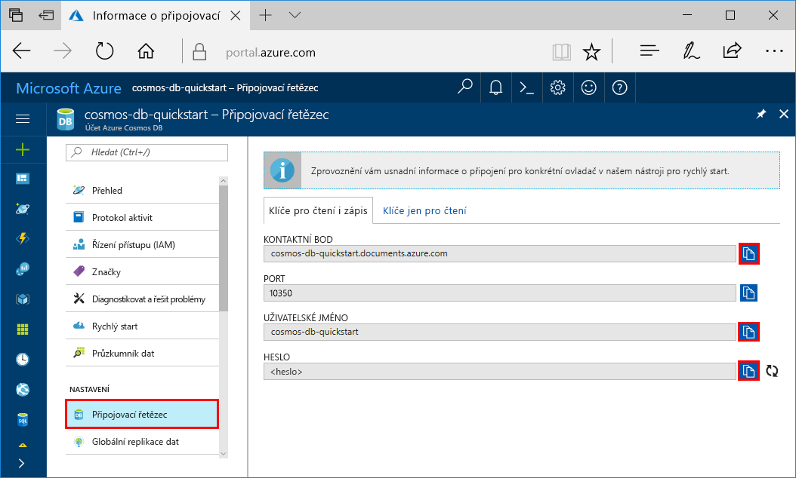
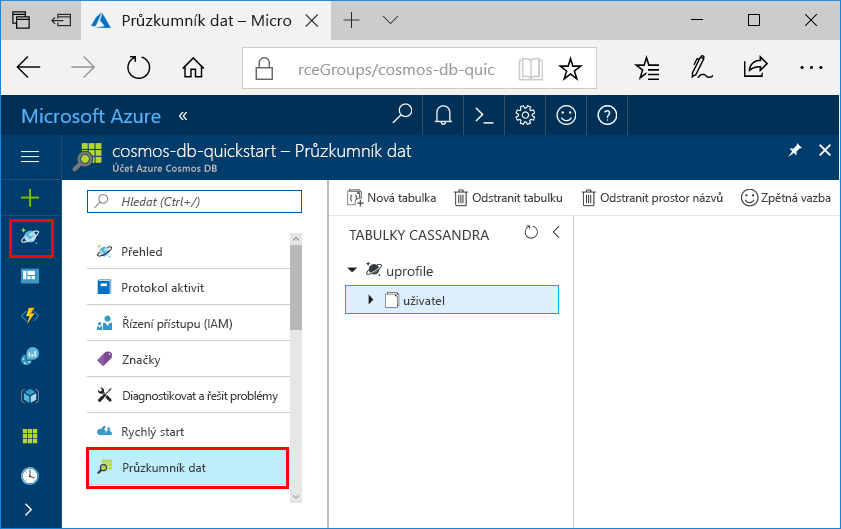

# <a name="quickstart-build-a-cassandra-app-with-python-and-azure-cosmos-db"></a>Rychlý start: Sestavení aplikace Cassandra pomocí Pythonu a Azure Cosmos DB

> [!div class="op_single_selector"]
> * [.NET](create-cassandra-dotnet.md)
> * [Java](create-cassandra-java.md)
> * [Node.js](create-cassandra-nodejs.md)
> * [Python](create-cassandra-python.md)
>  

Tento rychlý start ukazuje, jak pomocí Pythonu a rozhraní Azure Cosmos DB [Cassandra API](cassandra-introduction.md) sestavit aplikaci profilu naklonováním příkladu z GitHubu. Tento rychlý start také ukazuje, jak pomocí webového portálu Azure Portal vytvořit účet Azure Cosmos DB.

Azure Cosmos DB je globálně distribuovaná databázová služba Microsoftu pro více modelů. Můžete rychle vytvořit a dotazovat databáze dokumentů, párů klíč-hodnota a grafů, které tak můžou využívat výhody možnosti globální distribuce a horizontálního škálování v jádru služby Azure Cosmos DB.

## <a name="prerequisites"></a>Požadavky

[!INCLUDE [quickstarts-free-trial-note](../../includes/quickstarts-free-trial-note.md)] Alternativně můžete [vyzkoušet službu Azure Cosmos DB zdarma](https://azure.microsoft.com/try/cosmosdb/) bez předplatného Azure, poplatků a závazků.

Kromě toho je potřeba toto:
* [Python](https://www.python.org/downloads/) verze v2.7.14
* [Git](http://git-scm.com/)
* [Ovladač Python pro Apache Cassandra](https://github.com/datastax/python-driver)

## <a name="create-a-database-account"></a>Vytvoření účtu databáze

Než budete moct vytvořit databázi dokumentů, je potřeba pomocí služby Azure Cosmos DB vytvořit účet Cassandra.

[!INCLUDE [cosmos-db-create-dbaccount-cassandra](../../includes/cosmos-db-create-dbaccount-cassandra.md)]

## <a name="clone-the-sample-application"></a>Klonování ukázkové aplikace

Teď naklonujeme aplikaci rozhraní Cassandra API z GitHubu, nastavíme připojovací řetězec a spustíme ji. Uvidíte, jak snadno se pracuje s daty prostřednictvím kódu programu. 

1. Otevřete příkazový řádek. Vytvořte novou složku s názvem `git-samples`. Pak zavřete příkazový řádek.

    ```bash
    md "C:\git-samples"
    ```

2. Otevřete okno terminálu Git, například Git Bash, a pomocí příkazu `cd` přejděte do nové složky, do které chcete nainstalovat ukázkovou aplikaci.

    ```bash
    cd "C:\git-samples"
    ```

3. Ukázkové úložiště naklonujete spuštěním následujícího příkazu. Tento příkaz vytvoří na vašem počítači kopii ukázkové aplikace.

    ```bash
    git clone https://github.com/Azure-Samples/azure-cosmos-db-cassandra-python-getting-started.git
    ```

## <a name="review-the-code"></a>Kontrola kódu

Tento krok je volitelný. Pokud vás zajímá, jak se pomocí kódu vytvoří prostředky databáze, můžete si prohlédnout následující fragmenty kódu. Všechny fragmenty kódu pocházejí ze souboru pyquickstart.py. Jinak můžete přeskočit přímo k části [Aktualizace informací o připojení](#update-your-connection-string). 

* Hodnoty uživatelského jména a hesla se nastaví pomocí stránky připojovacího řetězce na webu Azure Portal. Cesta `path\to\cert` představuje cestu k certifikátu X509. 

   ```python
    ssl_opts = {
            'ca_certs': 'path\to\cert',
            'ssl_version': ssl.PROTOCOL_TLSv1_2
            }
    auth_provider = PlainTextAuthProvider( username=cfg.config['username'], password=cfg.config['password'])
    cluster = Cluster([cfg.config['contactPoint']], port = cfg.config['port'], auth_provider=auth_provider, ssl_options=ssl_opts)
    session = cluster.connect()
   
   ```

* Inicializuje se proměnná `cluster` s informacemi contactPoint. Hodnota contactPoint se načte z webu Azure Portal.

    ```python
   cluster = Cluster([cfg.config['contactPoint']], port = cfg.config['port'], auth_provider=auth_provider)
    ```

* `cluster` se připojí k rozhraní Azure Cosmos DB Cassandra API.

    ```python
    session = cluster.connect()
    ```

* Vytvoří se nový prostor klíčů.

    ```python
   session.execute('CREATE KEYSPACE IF NOT EXISTS uprofile WITH replication = {\'class\': \'NetworkTopologyStrategy\', \'datacenter1\' : \'1\' }')
    ```

* Vytvoří se nová tabulka.

   ```
   session.execute('CREATE TABLE IF NOT EXISTS uprofile.user (user_id int PRIMARY KEY, user_name text, user_bcity text)');
   ```

* Vloží se entity klíč-hodnota.

    ```Python
    insert_data = session.prepare("INSERT INTO  uprofile.user  (user_id, user_name , user_bcity) VALUES (?,?,?)")
    batch = BatchStatement()
    batch.add(insert_data, (1, 'LyubovK', 'Dubai'))
    batch.add(insert_data, (2, 'JiriK', 'Toronto'))
    batch.add(insert_data, (3, 'IvanH', 'Mumbai'))
    batch.add(insert_data, (4, 'YuliaT', 'Seattle'))
    ....
    session.execute(batch)
    ```

* Spustí se dotaz pro získání všech hodnot klíčů.

    ```Python
    rows = session.execute('SELECT * FROM uprofile.user')
    ```  
    
* Spustí se dotaz pro získání páru klíč-hodnota.

    ```Python
    
    rows = session.execute('SELECT * FROM uprofile.user where user_id=1')
    ```  

## <a name="update-your-connection-string"></a>Aktualizace připojovacího řetězce

Teď se vraťte zpátky na portál Azure Portal, kde najdete informace o připojovacím řetězci, a zkopírujte je do aplikace. Připojovací řetězec umožňuje vaší aplikaci komunikovat s hostovanou databází.

1. Na portálu [Azure Portal](http://portal.azure.com/) vyberte **Připojovací řetězec**. 

    Pomocí tlačítka  na pravé straně obrazovky zkopírujte horní hodnotu KONTAKTNÍ BOD.

    

2. Otevřete soubor `config.py`. 

3. Vložte hodnotu KONTAKTNÍ BOD z portálu místo `<FILLME>` na řádku 10.

    Řádek 10 by teď měl vypadat nějak takto: 

    `'contactPoint': 'cosmos-db-quickstarts.cassandra.cosmosdb.azure.com:10350'`

4. Zkopírujte z portálu hodnotu UŽIVATELSKÉ JMÉNO a vložte ji místo `<FILLME>` na řádku 6.

    Řádek 6 by teď měl vypadat nějak takto: 

    `'username': 'cosmos-db-quickstart',`
    
5. Zkopírujte z portálu hodnotu HESLO a vložte ji místo `<FILLME>` na řádku 8.

    Řádek 8 by teď měl vypadat nějak takto:

    `'password' = '2Ggkr662ifxz2Mg==`';`

6. Uložte soubor config.py.
    
## <a name="use-the-x509-certificate"></a>Použití certifikátu X509

1. Stáhněte si certifikát Baltimore CyberTrust Root místně z [https://cacert.omniroot.com/bc2025.crt](https://cacert.omniroot.com/bc2025.crt). Přejmenujte příponu souboru na `.cer`.

   Certifikát má sériové číslo `02:00:00:b9` a otisk SHA1 `d4🇩🇪20:d0:5e:66:fc:53:fe:1a:50:88:2c:78:db:28:52:ca:e4:74`.

2. Otevřete `pyquickstart.py` a změňte cestu `path\to\cert` tak, aby odkazovala na váš nový certifikát.

3. Uložte `pyquickstart.py`.

## <a name="run-the-python-app"></a>Spuštění aplikace v Pythonu

1. Pomocí příkazu cd v terminálu Git přejděte do složky `azure-cosmos-db-cassandra-python-getting-started`. 

2. Spusťte následující příkazy a nainstalujte požadované moduly:

    ```python
    python -m pip install cassandra-driver
    python -m pip install prettytable
    python -m pip install requests
    python -m pip install pyopenssl
    ```

2. Spusťte následující příkaz a spusťte vaši aplikaci uzlu:

    ```
    python pyquickstart.py
    ```

3. Na příkazovém řádku zkontrolujte očekávané výsledky.

    Stisknutím kláves CTRL + C zastavte provádění programu a zavřete okno konzoly. 

    
    
4. Na portálu Azure Portal otevřete **Data Explorer**, abyste se mohli na tato nová data dotazovat, měnit je a pracovat s nimi. 

    

## <a name="review-slas-in-the-azure-portal"></a>Ověření podmínek SLA na portálu Azure Portal

[!INCLUDE [cosmosdb-tutorial-review-slas](../../includes/cosmos-db-tutorial-review-slas.md)]

## <a name="clean-up-resources"></a>Vyčištění prostředků

[!INCLUDE [cosmosdb-delete-resource-group](../../includes/cosmos-db-delete-resource-group.md)]

## <a name="next-steps"></a>Další kroky

V tomto rychlém startu jste se naučili vytvořit účet Azure Cosmos DB, vytvořit kontejner pomocí Data Exploreru a spustit aplikaci. Teď můžete do účtu Cosmos DB importovat další data. 

> [!div class="nextstepaction"]
> [Import dat Cassandra do služby Azure Cosmos DB](cassandra-import-data.md)

