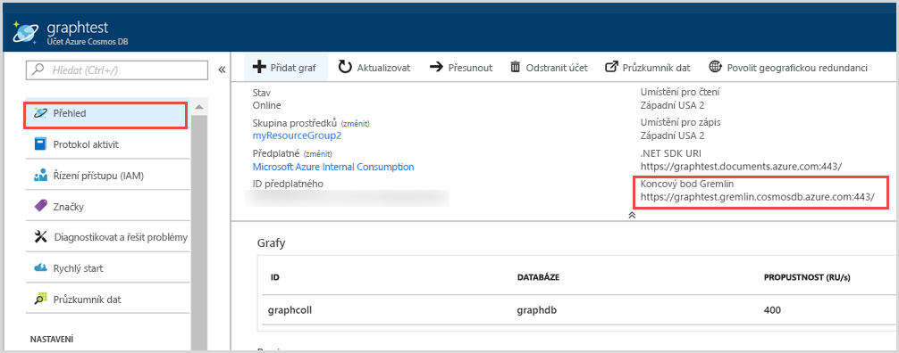
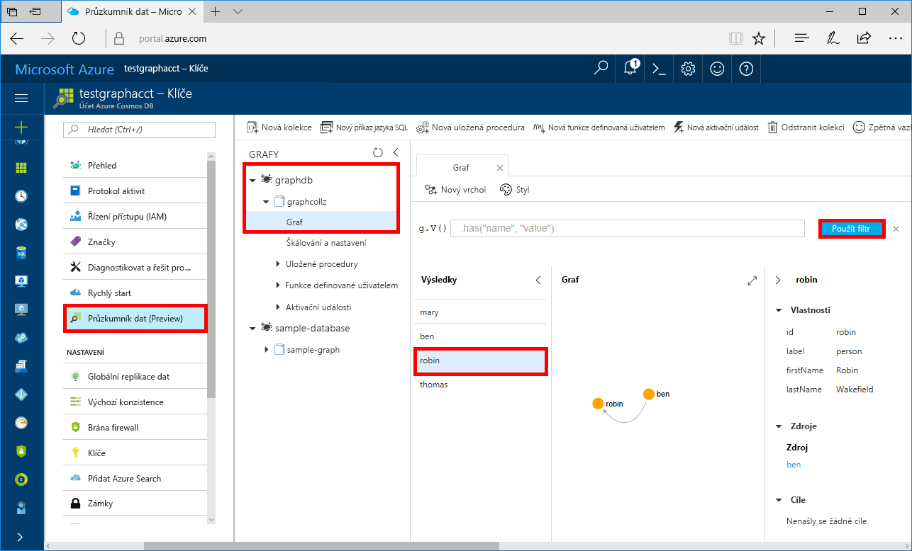

# <a name="azure-cosmos-db-build-a-net-framework-or-core-application-using-the-graph-api"></a>Azure Cosmos DB: Vytvoření aplikace v .NET Framework nebo .NET Core s využitím rozhraní Graph API

Azure Cosmos DB je globálně distribuovaná databázová služba Microsoftu pro více modelů. Můžete snadno vytvořit a dotazovat databáze dotazů, klíčů/hodnot a grafů, které tak můžou využívat výhody použitelnosti v celosvětovém měřítku a možností horizontálního škálování v jádru databáze Azure Cosmos. 

Tento rychlý start popisuje způsob vytvoření účtu rozhraní [Graph API](graph-introduction.md) služby Azure Cosmos DB, databáze a grafu (kontejneru) pomocí webu Azure Portal. Potom sestavíte a spustíte konzolovou aplikaci pomocí open source ovladače [Gremlin.Net](http://tinkerpop.apache.org/docs/3.2.7/reference/#gremlin-DotNet).  

## <a name="prerequisites"></a>Požadavky

Pokud ještě nemáte nainstalovanou sadu Visual Studio 2017, můžete stáhnout a použít **bezplatnou verzi** [Visual Studio 2017 Community Edition](https://www.visualstudio.com/downloads/). Nezapomeňte při instalaci sady Visual Studio povolit možnost **Azure Development**.

Pokud už máte sadu Visual Studio 2017 nainstalovanou, ujistěte se, že máte nainstalovanou sadu [Visual Studio 2017 s aktualizací Update 3](https://www.visualstudio.com/en-us/news/releasenotes/vs2017-relnotes).

[!INCLUDE [quickstarts-free-trial-note](../../includes/quickstarts-free-trial-note.md)]

## <a name="create-a-database-account"></a>Vytvoření účtu databáze

[!INCLUDE [cosmos-db-create-dbaccount-graph](../../includes/cosmos-db-create-dbaccount-graph.md)]

## <a name="add-a-graph"></a>Přidání grafu

[!INCLUDE [cosmos-db-create-graph](../../includes/cosmos-db-create-graph.md)]

## <a name="clone-the-sample-application"></a>Klonování ukázkové aplikace

Teď naklonujeme aplikaci rozhraní Graph API z GitHubu, nastavíme připojovací řetězec a spustíme ji. Přesvědčíte se, jak snadno se pracuje s daty prostřednictvím kódu programu. 

1. Otevřete příkazový řádek, vytvořte novou složku git-samples a potom příkazový řádek zavřete.

    ```bash
    md "C:\git-samples"
    ```

2. Otevřete okno terminálu Git, například Git Bash, a pomocí příkazu `cd` přejděte do nové složky, do které chcete nainstalovat ukázkovou aplikaci.

    ```bash
    cd "C:\git-samples"
    ```

3. Ukázkové úložiště naklonujete spuštěním následujícího příkazu. Tento příkaz vytvoří na vašem počítači kopii ukázkové aplikace.

    ```bash
    git clone https://github.com/Azure-Samples/azure-cosmos-db-graph-gremlindotnet-getting-started.git
    ```

4. Potom otevřete sadu Visual Studio a otevřete soubor řešení.

5. Obnovte balíčky NuGet v projektu. Ty by měly zahrnovat ovladač Gremlin.Net i balíček Newtonsoft.Json.


6. Ovladač Gremlin.Net můžete nainstalovat také ručně, pomocí správce balíčků NuGet nebo pomocí [nástroje příkazového řádku nuget](https://docs.microsoft.com/en-us/nuget/install-nuget-client-tools): 

    ```bash
    nuget install Gremlin.Net
    ```

## <a name="review-the-code"></a>Kontrola kódu

Tento krok je volitelný. Pokud chcete zjistit, jak se v kódu vytvářejí prostředky databáze, můžete si prohlédnout následující fragmenty kódu. Jinak můžete přeskočit přímo k části [Aktualizace informací o připojení](#update-your-connection-string). 

Všechny následující fragmenty kódu pocházejí ze souboru Program.cs.

* Nastaví se parametry připojení podle účtu vytvořeného výše (řádek 19): 

    ```csharp
    private static string hostname = "your-endpoint.gremlin.cosmosdb.azure.com";
    private static int port = 443;
    private static string authKey = "your-authentication-key";
    private static string database = "your-database";
    private static string collection = "your-graph-container";
    ```

* Příkazy Gremlin, které se mají spustit, jsou uvedené ve slovníku (řádek 26):

    ```csharp
    private static Dictionary<string, string> gremlinQueries = new Dictionary<string, string>
    {
        { "Cleanup",        "g.V().drop()" },
        { "AddVertex 1",    "g.addV('person').property('id', 'thomas').property('firstName', 'Thomas').property('age', 44)" },
        { "AddVertex 2",    "g.addV('person').property('id', 'mary').property('firstName', 'Mary').property('lastName', 'Andersen').property('age', 39)" },
        { "AddVertex 3",    "g.addV('person').property('id', 'ben').property('firstName', 'Ben').property('lastName', 'Miller')" },
        { "AddVertex 4",    "g.addV('person').property('id', 'robin').property('firstName', 'Robin').property('lastName', 'Wakefield')" },
        { "AddEdge 1",      "g.V('thomas').addE('knows').to(g.V('mary'))" },
        { "AddEdge 2",      "g.V('thomas').addE('knows').to(g.V('ben'))" },
        { "AddEdge 3",      "g.V('ben').addE('knows').to(g.V('robin'))" },
        { "UpdateVertex",   "g.V('thomas').property('age', 44)" },
        { "CountVertices",  "g.V().count()" },
        { "Filter Range",   "g.V().hasLabel('person').has('age', gt(40))" },
        { "Project",        "g.V().hasLabel('person').values('firstName')" },
        { "Sort",           "g.V().hasLabel('person').order().by('firstName', decr)" },
        { "Traverse",       "g.V('thomas').out('knows').hasLabel('person')" },
        { "Traverse 2x",    "g.V('thomas').out('knows').hasLabel('person').out('knows').hasLabel('person')" },
        { "Loop",           "g.V('thomas').repeat(out()).until(has('id', 'robin')).path()" },
        { "DropEdge",       "g.V('thomas').outE('knows').where(inV().has('id', 'mary')).drop()" },
        { "CountEdges",     "g.E().count()" },
        { "DropVertex",     "g.V('thomas').drop()" },
    };
    ```


* Vytvoří se objekt připojení `GremlinServer` s použitím parametrů zadaných výše (řádek 52):

    ```csharp
    var gremlinServer = new GremlinServer(hostname, port, enableSsl: true, 
                                                    username: "/dbs/" + database + "/colls/" + collection, 
                                                    password: authKey);
    ```

* Vytvoří se nový objekt `GremlinClient` (řádek 56):

    ```csharp
    var gremlinClient = new GremlinClient(gremlinServer);
    ```

* Spustí se všechny dotazy Gremlin s použitím objektu `GremlinClient` s asynchronní úlohou (řádek 63). Tím se načtou dotazy Gremlin ze slovníku definovaného výše (řádek 26):

    ```csharp
    var task = gremlinClient.SubmitAsync<dynamic>(query.Value);
    task.Wait();
    ```

* Načtou se výsledky a přečtou se hodnoty, které se pomocí třídy `JsonSerializer` z Newtonsoft.Json zformátují jako slovník:

    ```csharp
    foreach (var result in task.Result)
    {
        // The vertex results are formed as dictionaries with a nested dictionary for their properties
        string output = JsonConvert.SerializeObject(result);
        Console.WriteLine(String.Format("\tResult:\n\t{0}", output));
    }
    ```

## <a name="update-your-connection-string"></a>Aktualizace připojovacího řetězce

Teď se vraťte zpátky na portál Azure Portal, kde najdete informace o připojovacím řetězci, a zkopírujte je do aplikace.

1. Na webu [Azure Portal](http://portal.azure.com/) přejděte k vašemu účtu databáze grafů. Na kartě **Přehled** se zobrazují dva koncové body: 
 
   **.Net SDK URI** – Tato hodnota se použije, když se k účtu databáze grafů připojíte s využitím knihovny Microsoft.Azure.Graphs. 

   **Koncový bod Gremlin** – Tato hodnota se použije, když se k účtu databáze grafů připojíte s využitím knihovny Gremlin.Net.

    

   Pokud chcete spustit tuto ukázku, zkopírujte hodnotu **Koncový bod Gremlin** a odstraňte číslo portu na konci. To znamená, že URI pak má tvar `https://<your cosmos db account name>.gremlin.cosmosdb.azure.com`.

2. V souboru Program.cs vložte místo hodnoty `your-endpoint` v proměnné `hostname` na řádku 19 název vašeho koncového bodu. 

    `"private static string hostname = "<your cosmos db account name>.gremlin.cosmosdb.azure.com";`

    Hodnota koncového bodu by teď měla vypadat takto:

    `"private static string hostname = "testgraphacct.gremlin.cosmosdb.azure.com";`

3. Potom přejděte na kartu **Klíče**, zkopírujte z portálu hodnotu **PRIMÁRNÍ KLÍČ** a vložte ji do proměnné `authkey` na řádku 21 místo zástupné hodnoty `"your-authentication-key"`. 

    `private static string authKey = "your-authentication-key";`

4. S použitím informací o databázi vytvořené výše vložte název databáze do proměnné `database` na řádku 22. 

    `private static string database = "your-database";`

5. Podobně s použitím informací o kontejneru vytvořeném výše vložte název kolekce (což je zároveň název grafu) do proměnné `collection` na řádku 23. 

    `private static string collection = "your-collection-or-graph";`

6. Uložte soubor Program.cs. 

Teď jste aktualizovali aplikaci a zadali do ní všechny informace potřebné ke komunikaci s Azure Cosmos DB. 

## <a name="run-the-console-app"></a>Spuštění aplikace konzoly

Spusťte aplikaci stisknutím CTRL+F5. Aplikace vypíše v konzole příkazy i výsledky dotazů Gremlin.

   V okně konzoly se zobrazí vrcholy a hrany, které se přidávají do grafu. Po dokončení skriptu stisknutím klávesy ENTER zavřete okno konzoly.

## <a name="browse-using-the-data-explorer"></a>Procházení pomocí Průzkumníku dat

Teď se můžete vrátit do Průzkumníku dat na webu Azure Portal, procházet nová data grafu a zadávat na ně dotazy.

1. V Průzkumníku dat se nová databáze zobrazí v podokně Graphs (Grafy). Rozbalte uzly databáze a kontejneru a pak klikněte na **Graph**.

2. Kliknutím na tlačítko **Použít filtr** použijte výchozí dotaz k zobrazení všech vrcholů v grafu. V podokně Graphs (Grafy) se zobrazí data vygenerovaná ukázkovou aplikací.

    Graf můžete přiblížit nebo oddálit, můžete rozšířit prostor pro zobrazení grafu, přidat další vrcholy a přesouvat vrcholy na zobrazovací ploše.

    

## <a name="review-slas-in-the-azure-portal"></a>Ověření podmínek SLA na portálu Azure Portal

[!INCLUDE [cosmosdb-tutorial-review-slas](../../includes/cosmos-db-tutorial-review-slas.md)]

## <a name="clean-up-resources"></a>Vyčištění prostředků

[!INCLUDE [cosmosdb-delete-resource-group](../../includes/cosmos-db-delete-resource-group.md)]

## <a name="next-steps"></a>Další kroky

V tomto rychlém startu jste se seznámili s postupem vytvoření účtu databáze Azure Cosmos, vytvoření grafu pomocí Průzkumníku dat a spuštění aplikace. Teď můžete pomocí konzoly Gremlin vytvářet složitější dotazy a implementovat účinnou logiku procházení grafů. 

> [!div class="nextstepaction"]
> [Dotazování pomocí konzoly Gremlin](tutorial-query-graph.md)

