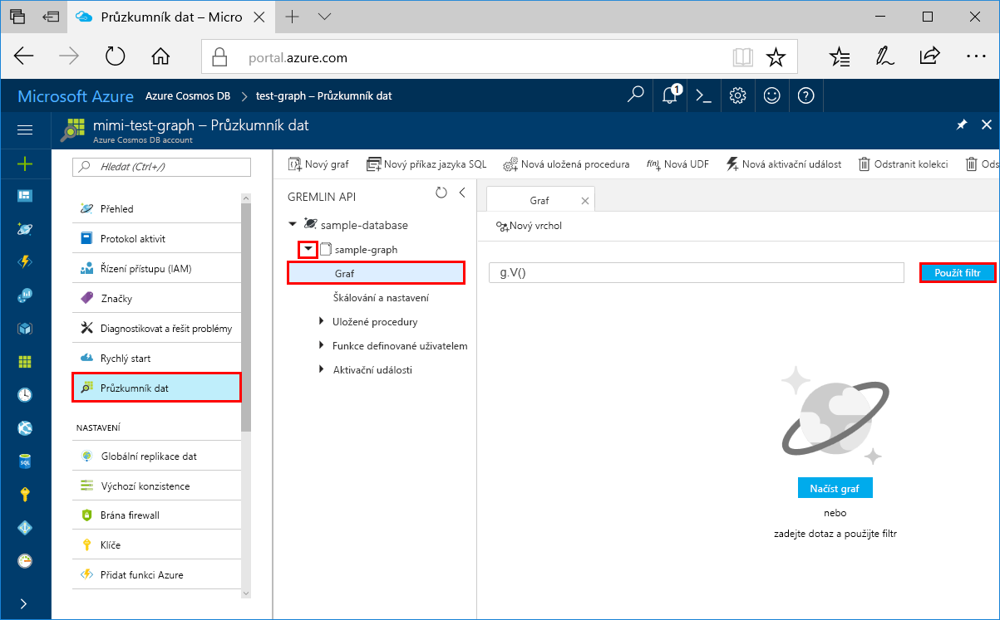
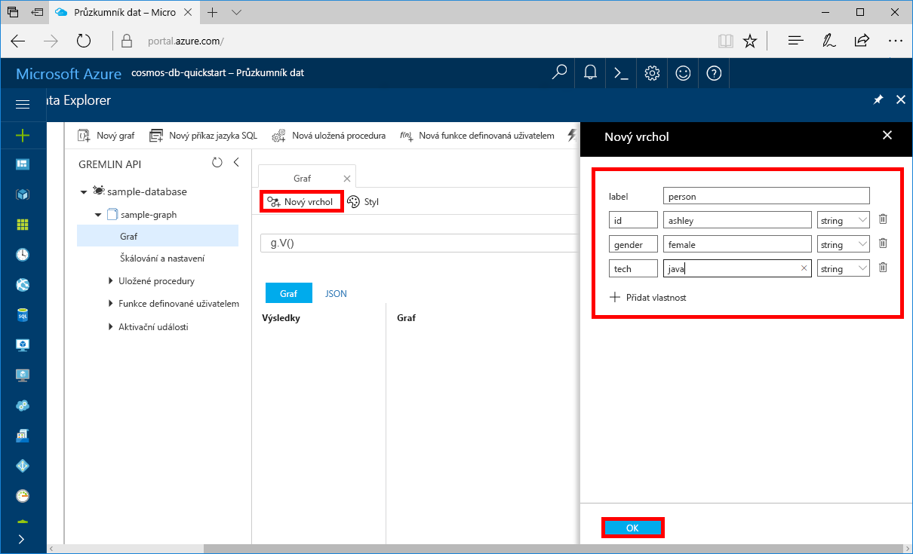

# <a name="quickstart-build-a-graph-database-with-the-java-sdk-and-the-azure-cosmos-db-gremlin-api"></a>Úvodní příručka: Vytvoření databáze grafů pomocí sady Java SDK a rozhraní Azure Cosmos DB Gremlin API

> [!div class="op_single_selector"]
> * [Konzola Gremlin](create-graph-gremlin-console.md)
> * [.NET](create-graph-dotnet.md)
> * [Java](create-graph-java.md)
> * [Node.js](create-graph-nodejs.md)
> * [Python](create-graph-python.md)
> * [PHP](create-graph-php.md)
>  

V tomto rychlém startu vytvoříte a spravujete účet rozhraní API Azure Cosmos DB Gremlin (graf) z webu Azure Portal a přidáte data pomocí aplikace Java naklonované z GitHubu. Azure Cosmos DB je vícemodelová databázová služba, která umožňuje rychle vytvářet a dotazovat databáze dokumentů, tabulek, hodnot klíče a grafů s možností globální distribuce a horizontálního škálování.

## <a name="prerequisites"></a>Požadavky
- Účet Azure s aktivním předplatným. [Vytvořte si ho zdarma](https://azure.microsoft.com/free/?ref=microsoft.com&utm_source=microsoft.com&utm_medium=docs&utm_campaign=visualstudio). 
- [Java Vývojová sada (JDK) 8](https://www.azul.com/downloads/azure-only/zulu/?&version=java-8-lts&architecture=x86-64-bit&package=jdk). Najeďte `JAVA_HOME` proměnnou prostředí do složky, do které je nainstalována sada JDK.
- [Maven binární archiv](https://maven.apache.org/download.cgi). 
- [Git](https://www.git-scm.com/downloads). 

## <a name="create-a-database-account"></a>Vytvoření účtu databáze

Než budete moct vytvořit databázi grafu, je potřeba pomocí služby Azure Cosmos DB vytvořit účet databáze Gremlin (Graph).

[!INCLUDE [cosmos-db-create-dbaccount-graph](../../includes/cosmos-db-create-dbaccount-graph.md)]

## <a name="add-a-graph"></a>Přidání grafu

[!INCLUDE [cosmos-db-create-graph](../../includes/cosmos-db-create-graph.md)]

## <a name="clone-the-sample-application"></a>Klonování ukázkové aplikace

Teď přejděme k práci s kódem. Pojďme naklonovat aplikaci rozhraní Gremlin API z GitHubu, nastavit připojovací řetězec a spustit ji. Přesvědčíte se, jak snadno se pracuje s daty prostřednictvím kódu programu.  

1. Otevřete příkazový řádek, vytvořte novou složku git-samples a pak příkazový řádek zavřete.

    ```bash
    md "C:\git-samples"
    ```

2. Otevřete okno terminálu Git, například Git Bash, a pomocí příkazu `cd` přejděte do složky, do které chcete nainstalovat ukázkovou aplikaci.  

    ```bash
    cd "C:\git-samples"
    ```

3. Ukázkové úložiště naklonujete spuštěním následujícího příkazu. Tento příkaz vytvoří na vašem počítači kopii ukázkové aplikace. 

    ```bash
    git clone https://github.com/Azure-Samples/azure-cosmos-db-graph-java-getting-started.git
    ```

## <a name="review-the-code"></a>Kontrola kódu

Tento krok je volitelný. Pokud chcete zjistit, jak se v kódu vytvářejí prostředky databáze, můžete si prohlédnout následující fragmenty kódu. Jinak můžete přeskočit přímo k části [Aktualizace informací o připojení](#update-your-connection-information).

Všechny následující úryvky jsou převzaty ze souboru *C:\git-samples\azure-cosmos-db-graph-java-started\src\GetStarted\Program.java.*

Tato konzolová aplikace Java používá [databázi Rozhraní API Gremlin](graph-introduction.md) s ovladačem OSS [Apache TinkerPop.](https://tinkerpop.apache.org/) 

- Gremlin `Client` je inicializován z konfigurace v souboru *C:\git-samples\azure-cosmos-db-graph-java-getting-started\src\remote.yaml.*

    ```java
    cluster = Cluster.build(new File("src/remote.yaml")).create();
    ...
    client = cluster.connect();
    ```

- Pomocí metody `client.submit` se provede série kroků Gremlin.

    ```java
    ResultSet results = client.submit(gremlin);

    CompletableFuture<List<Result>> completableFutureResults = results.all();
    List<Result> resultList = completableFutureResults.get();

    for (Result result : resultList) {
        System.out.println(result.toString());
    }
    ```

## <a name="update-your-connection-information"></a>Aktualizace informací o připojení

Teď se vraťte na portál Azure, kde najdete informace o připojení, a zkopírujte je do aplikace. Tato nastavení umožní aplikaci komunikovat s hostovanou databází.

1. Ve svém účtu Azure Cosmos DB na [webu Azure Portal](https://portal.azure.com/)vyberte **Keys**. 

    Zkopírujte první část hodnoty identifikátoru URI.

    
2. Otevřete soubor *src/remote.yaml* a vložte `$name$` jedinečnou hodnotu ID do aplikace `hosts: [$name$.graphs.azure.com]`.

    Řádek 1 *remote.yaml* by nyní měl vypadat podobně jako 

    `hosts: [test-graph.graphs.azure.com]`

3. V `endpoint` změňte `graphs` na `gremlin.cosmosdb`. (Pokud jste účet databáze grafu vytvořili před 20. prosincem, 2017, neprovádějte žádné změny hodnoty koncového bodu a pokračujte dalším krokem.)

    Hodnota koncového bodu by teď měla vypadat takto:

    `"endpoint": "https://testgraphacct.gremlin.cosmosdb.azure.com:443/"`

4. Na webu Azure Portal pomocí tlačítka pro kopírování zkopírujte PRIMÁRNÍ KLÍČ a vložte ho místo `$masterKey$` v části `password: $masterKey$`.

    Linka 4 *remote.yaml* by nyní měla vypadat podobně jako 

    `password: 2Ggkr662ifxz2Mg==`

5. Změna řádku 3 *remote.yaml* z

    `username: /dbs/$database$/colls/$collection$`

    na 

    `username: /dbs/sample-database/colls/sample-graph`

    Pokud jste pro svou ukázkovou databázi nebo graf použili jedinečný název, aktualizujte hodnoty odpovídajícím způsobem.

6. Uložte soubor *remote.yaml.*

## <a name="run-the-console-app"></a>Spuštění aplikace konzoly

1. V okně terminálu Git přejděte příkazem `cd` do složky azure-cosmos-db-graph-java-getting-started folder.

    ```git
    cd "C:\git-samples\azure-cosmos-db-graph-java-getting-started"
    ```

2. V okně terminálu Git pomocí následujícího příkazu nainstalujte požadované balíčky Java.

   ```git
   mvn package
   ```

3. V okně terminálu Git pomocí následujícího příkazu spusťte aplikaci v Javě.
    
    ```git
    mvn exec:java -D exec.mainClass=GetStarted.Program
    ```

    V okně terminálu se zobrazí vrcholy, které se přidávají do grafu. 
    
    Pokud dochází k chybám časového limitu, zkontrolujte, že jste v části [Aktualizace informací o připojení](#update-your-connection-information) správně aktualizovali informace o připojení, a zkuste poslední příkaz spustit znovu. 
    
    Jakmile se program zastaví, vyberte Enter a pak přepněte zpět na portál Azure v internetovém prohlížeči. 

<a id="add-sample-data"></a>
## <a name="review-and-add-sample-data"></a>Kontrola a přidání ukázkových dat

Teď můžete přejít zpět do Průzkumníku dat a zobrazit vrcholy přidané do grafu a přidat další datové body.

1. Ve svém účtu Azure Cosmos DB na webu Azure Portal vyberte **Průzkumník dat**, rozbalte **ukázkový graf**, vyberte **Graf**a pak vyberte **Použít filtr**. 

   

2. V seznamu **Výsledky** si všimněte nových uživatelů přidaných do grafu. Vyberte **ben** a všimněte si, že tento uživatel je propojený s uživatelem robin. Vrcholy můžete přesouvat přetahováním, přibližovat a oddalovat můžete pomocí kolečka myši a zvětšit plochu grafu můžete pomocí obousměrné šipky. 

   

3. Teď přidáme několik nových uživatelů. Vyberte **Nový vrchol,** chcete-li do grafu přidat data.

   

4. Do pole popisku zadejte *person* (osoba).

5. Vyberte **Přidat vlastnost,** chcete-li přidat každou z následujících vlastností. Všimněte si, že pro každou osobu v grafu můžete vytvořit jedinečné vlastnosti. Vyžaduje se pouze klíč id.

    key|value|Poznámky
    ----|----|----
    id|ashley|Jedinečný identifikátor pro vrchol. Pokud identifikátor nezadáte, vygeneruje se pro vás.
    gender (pohlaví)|female (žena)| 
    tech (technologie) | java | 

    > [!NOTE]
    > V tomto rychlém startu vytvoříte kolekci bez oddílů. Pokud však vytvoříte dělenou kolekci zadáním klíče oddílu při vytváření kolekce, pak každý nový vrchol bude muset zahrnovat klíč oddílu jako klíč. 

6. Vyberte **OK**. Možná bude nutné zvětšit obrazovku, aby se tlačítko **OK** zobrazilo v dolní části obrazovky.

7. Znovu vyberte **Nový vrchol a** přidejte dalšího nového uživatele. 

8. Zadejte popisek *person* (osoba).

9. Vyberte **Přidat vlastnost,** chcete-li přidat každou z následujících vlastností:

    key|value|Poznámky
    ----|----|----
    id|rakesh|Jedinečný identifikátor pro vrchol. Pokud identifikátor nezadáte, vygeneruje se pro vás.
    gender (pohlaví)|male (muž)| 
    school (škola)|MIT| 

10. Vyberte **OK**. 

11. Chcete-li zobrazit všechny `g.V()` hodnoty v **grafu,** vyberte tlačítko Použít filtr s výchozím filtrem. Teď se v seznamu **Výsledky** zobrazí všichni uživatelé. 

    S přidáváním dalších dat můžete pomocí filtrů omezit výsledky. Průzkumník dat ve výchozím nastavení pomocí filtru `g.V()` načte všechny vrcholy v grafu. Můžete ho změnit na jiný [dotaz grafu](tutorial-query-graph.md), třeba `g.V().count()`, který vrátí počet všech vrcholů v grafu ve formátu JSON. Pokud jste filtr změnili, změňte filtr zpět na `g.V()` a vyberte Použít **filtr,** aby se znovu zobrazily všechny výsledky.

12. Teď můžete propojit uživatele rakesh a ashley. Ujistěte se, **že ashley** je  vedle **cíle** na pravé dolní straně. Možná budete muset rozšířit okno, aby se tlačítko zobrazilo.

    

13. Do pole **Cíl** zadejte *rakesh*a do pole **Popisek okraje** zadejte *"ví*" a zaškrtněte políčko .

    

14. Teď vyberte ze seznamu výsledků uživatele **rakesh** a zobrazí se propojení mezi uživateli ashley a rakesh. 

    

Tím je dokončená část tohoto kurzu věnovaná vytváření prostředků. Můžete pokračovat přidáním vrcholů do grafu, úpravou existujících vrcholů nebo změnou dotazů. Teď si projdeme metriky, které služba Azure Cosmos DB nabízí, a potom vyčistíme prostředky. 

## <a name="review-slas-in-the-azure-portal"></a>Ověření smluv SLA na webu Azure Portal

[!INCLUDE [cosmosdb-tutorial-review-slas](../../includes/cosmos-db-tutorial-review-slas.md)]

## <a name="clean-up-resources"></a>Vyčištění prostředků

[!INCLUDE [cosmosdb-delete-resource-group](../../includes/cosmos-db-delete-resource-group.md)]

## <a name="next-steps"></a>Další kroky

V tomto rychlém startu jste se naučili, jak vytvořit účet Azure Cosmos DB, vytvořit graf pomocí Průzkumníka dat a spustit aplikaci Java, která přidá data do grafu. Teď můžete pomocí konzoly Gremlin vytvářet složitější dotazy a implementovat účinnou logiku procházení grafů. 

> [!div class="nextstepaction"]
> [Dotazování pomocí konzoly Gremlin](tutorial-query-graph.md)

