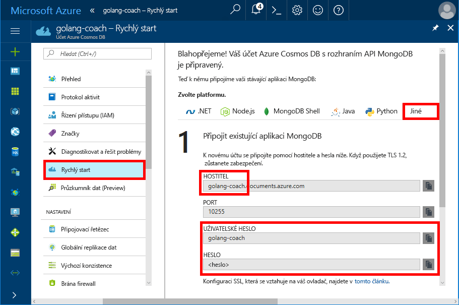
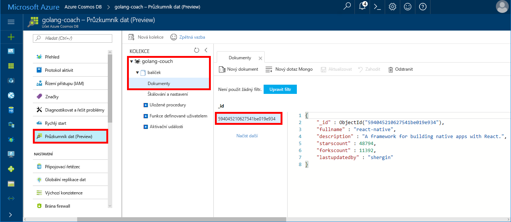

# <a name="build-a-console-app-using-azure-cosmos-dbs-api-for-mongodb-and-golang-sdk"></a>Sestavit aplikaci konzoly pomocí rozhraní API služby Azure Cosmos DB pro MongoDB a sada go SDK

> [!div class="op_single_selector"]
> * [.NET](create-mongodb-dotnet.md)
> * [Java](create-mongodb-java.md)
> * [Node.js](create-mongodb-nodejs.md)
> * [Python](create-mongodb-flask.md)
> * [Xamarin](create-mongodb-xamarin.md)
> * [Golang](create-mongodb-golang.md)
>  

Azure Cosmos DB je globálně distribuovaná databázová služba Microsoftu pro více modelů. Můžete rychle vytvořit a dotazovat dokument, klíč/hodnota a databáze grafů, které můžou využívat výhody globální distribuce a možností horizontálního škálování v jádru služby Cosmos DB.

Tento rychlý start ukazuje, jak využít stávající aplikace MongoDB napsané [Golang](https://golang.org/) a jejím připojení k databázi Cosmos pomocí rozhraní Azure Cosmos DB API pro MongoDB.

Jinými slovy aplikace v jazyce go ví pouze to, že se připojuje pomocí klienta MongoDB. Je transparentní pro aplikace, že jsou data uložená v databázi Cosmos.

## <a name="prerequisites"></a>Požadavky

- Předplatné Azure. Pokud ještě nemáte předplatné Azure, vytvořte si [bezplatný účet](https://azure.microsoft.com/free) před tím, než začnete. 

  [!INCLUDE [cosmos-db-emulator-mongodb](../../includes/cosmos-db-emulator-mongodb.md)]

- [Go](https://golang.org/dl/) a základní znalost jazyka [Go](https://golang.org/).
- Integrované vývojové prostředí – [GoLand](https://www.jetbrains.com/go/) od Jetbrains, [Visual Studio Code](https://code.visualstudio.com/) společností Microsoft, nebo [Atom](https://atom.io/). V tomto kurzu používám GoLand.

<a id="create-account"></a>
## <a name="create-a-database-account"></a>Vytvoření účtu databáze

[!INCLUDE [cosmos-db-create-dbaccount](../../includes/cosmos-db-create-dbaccount-mongodb.md)]

## <a name="clone-the-sample-application"></a>Klonování ukázkové aplikace

Naklonujte ukázkovou aplikaci a nainstalujte požadované balíčky.

1. Vytvořte složku s názvem CosmosDBSample ve složce GOROOT\src, což je ve výchozím nastavení C:\Go\.
2. V okně terminálu Git, jako je třeba Git Bash, spusťte následující příkaz, který naklonuje ukázkové úložiště do složky CosmosDBSample. 

    ```bash
    git clone https://github.com/Azure-Samples/azure-cosmos-db-mongodb-golang-getting-started.git
    ```
3.  Spuštěním následujícího příkazu získejte balíček mgo. 

    ```
    go get gopkg.in/mgo.v2
    ```

[Mgo](https://labix.org/mgo) ovladač [MongoDB](https://www.mongodb.com/) ovladač [jazyk Go](https://golang.org/) , který implementuje bohatý a dobře otestovaný výběr funkcí v rámci velmi jednoduchého rozhraní API následující standardní Go idiomy.

<a id="connection-string"></a>

## <a name="update-your-connection-string"></a>Aktualizace připojovacího řetězce

Teď se vraťte zpátky na web Azure Portal, kde najdete informace o připojovacím řetězci, a zkopírujte je do aplikace.

1. Informace o připojovacím řetězci požadované aplikací v jazyce Go zobrazíte tak, že v navigační nabídce vlevo kliknete na **Rychlý start** a pak na **Jiné**.

2. V prostředí Gogland otevřete soubor main.go v adresáři GOROOT\CosmosDBSample a aktualizujte následující řádky kódu s použitím informací o připojovacím řetězci z webu Azure Portal, jak je znázorněno na následujícím snímku obrazovky. 

    Název databáze je předpona hodnoty **Hostitel** v podokně připojovacího řetězce na webu Azure Portal. Pro účet znázorněný v obrázku níže je název databáze golang-coach.

    ```go
    Database: "The prefix of the Host value in the Azure portal",
    Username: "The Username in the Azure portal",
    Password: "The Password in the Azure portal",
    ```

    

3. Uložte soubor main.go.

## <a name="review-the-code"></a>Kontrola kódu

Tento krok je volitelný. Pokud chcete zjistit, jak se v kódu vytvářejí prostředky databáze, můžete si prohlédnout následující fragmenty kódu. Jinak můžete přeskočit přímo k části [Spuštění aplikace](#run-the-app). 

Všechny následující fragmenty kódu pocházejí ze souboru main.go.

### <a name="connecting-the-go-app-to-cosmos-db"></a>Připojení aplikace v jazyce Go ke službě Cosmos DB

Rozhraní API služby Azure Cosmos DB pro MongoDB podporuje připojení s podporou protokolu SSL. Pro připojení, budete muset definovat **MgO.dialinfo** fungovat v [mgo. DialInfo](https://godoc.org/gopkg.in/mgo.v2#DialInfo)a ujistěte se, použití [tls. *Volání* ](https://golang.org/pkg/crypto/tls#Dial) provést připojení.

Následující fragment kódu jazyka go připojí aplikaci Go s rozhraním API služby Azure Cosmos DB pro MongoDB. *DialInfo* třída obsahuje možnosti pro vytvoření relace.

```go
// DialInfo holds options for establishing a session.
dialInfo := &mgo.DialInfo{
    Addrs:    []string{"golang-couch.documents.azure.com:10255"}, // Get HOST + PORT
    Timeout:  60 * time.Second,
    Database: "database", // It can be anything
    Username: "username", // Username
    Password: "Azure database connect password from Azure Portal", // PASSWORD
    DialServer: func(addr *mgo.ServerAddr) (net.Conn, error) {
        return tls.Dial("tcp", addr.String(), &tls.Config{})
    },
}

// Create a session which maintains a pool of socket connections
// to Cosmos database (using Azure Cosmos DB's API for MongoDB).
session, err := mgo.DialWithInfo(dialInfo)

if err != nil {
    fmt.Printf("Can't connect, go error %v\n", err)
    os.Exit(1)
}

defer session.Close()

// SetSafe changes the session safety mode.
// If the safe parameter is nil, the session is put in unsafe mode, 
// and writes become fire-and-forget,
// without error checking. The unsafe mode is faster since operations won't hold on waiting for a confirmation.
// 
session.SetSafe(&mgo.Safe{})
```

Metoda **mgo.Dial()** se používá v případě, že není k dispozici připojení SSL. Pro připojení SSL se vyžaduje metoda **mgo.DialWithInfo()**.

Instance objektu **DialWIthInfo{}** slouží k vytvoření objektu relace. Po vytvoření relace můžete je kolekci přistupovat pomocí následujícího fragmentu kódu:

```go
collection := session.DB("database").C("package")
```

<a id="create-document"></a>

### <a name="create-a-document"></a>Vytvoření dokumentu

```go
// Model
type Package struct {
    Id bson.ObjectId  `bson:"_id,omitempty"`
    FullName      string
    Description   string
    StarsCount    int
    ForksCount    int
    LastUpdatedBy string
}

// insert Document in collection
err = collection.Insert(&Package{
    FullName:"react",
    Description:"A framework for building native apps with React.",
    ForksCount: 11392,
    StarsCount:48794,
    LastUpdatedBy:"shergin",

})

if err != nil {
    log.Fatal("Problem inserting data: ", err)
    return
}
```

### <a name="query-or-read-a-document"></a>Dotazování nebo čtení dokumentu

Cosmos DB podporuje bohaté dotazy na data uložená v každé z kolekcí. Následující ukázka kódu obsahuje dotaz, který je možné spustit proti dokumentům v kolekci.

```go
// Get a Document from the collection
result := Package{}
err = collection.Find(bson.M{"fullname": "react"}).One(&result)
if err != nil {
    log.Fatal("Error finding record: ", err)
    return
}

fmt.Println("Description:", result.Description)
```


### <a name="update-a-document"></a>Aktualizace dokumentu

```go
// Update a document
updateQuery := bson.M{"_id": result.Id}
change := bson.M{"$set": bson.M{"fullname": "react-native"}}
err = collection.Update(updateQuery, change)
if err != nil {
    log.Fatal("Error updating record: ", err)
    return
}
```

### <a name="delete-a-document"></a>Odstranění dokumentu

Cosmos DB podporuje odstraňování dokumentů.

```go
// Delete a document
query := bson.M{"_id": result.Id}
err = collection.Remove(query)
if err != nil {
   log.Fatal("Error deleting record: ", err)
   return
}
```
    
## <a name="run-the-app"></a>Spuštění aplikace

1. V jazyce go, ujistěte se, že GOPATH (k dispozici v rámci **souboru**, **nastavení**, **Přejít**, **GOPATH**) zahrnuje umístění, ve kterém byl balíček gopkg nainstalovaný, což je profil_uživatele\go ve výchozím nastavení. 
2. Okomentujte řádky pro odstranění dokumentu (řádky 103–107), abyste dokument po spuštění aplikace mohli zobrazit.
3. V jazyce go, klikněte na tlačítko **spustit**a potom klikněte na tlačítko **spuštění "Main.go sestavit a spustit"**.

    Aplikace dokončí dokument vytvořený v části [Vytvoření dokumentu](#create-document) a zobrazí jeho popis.
    
    ```
    Description: A framework for building native apps with React.
    
    Process finished with exit code 0
    ```

    
    
## <a name="review-your-document-in-data-explorer"></a>Kontrola dokumentu v Průzkumníku dat

Vraťte se na web Azure Portal a zobrazte dokument v Průzkumníku dat.

1. V navigační nabídce vlevo klikněte na **Průzkumník dat (Preview)**, rozbalte **golang-coach**, **balíček** a pak klikněte na **Dokumenty**. Na kartě **Dokumenty** klikněte na \_id a zobrazte dokument v pravém podokně. 

    
    
2. S dokumentem pak můžete přímo pracovat a kliknutím na **Aktualizovat** ho uložit. Můžete také odstranit dokument nebo vytvořit nové dokumenty nebo dotazy.

## <a name="review-slas-in-the-azure-portal"></a>Ověření podmínek SLA na portálu Azure Portal

[!INCLUDE [cosmosdb-tutorial-review-slas](../../includes/cosmos-db-tutorial-review-slas.md)]

## <a name="clean-up-resources"></a>Vyčištění prostředků

[!INCLUDE [cosmosdb-delete-resource-group](../../includes/cosmos-db-delete-resource-group.md)]

## <a name="next-steps"></a>Další postup

V tomto rychlém startu jste zjistili, jak vytvořit účet Cosmos a spuštění aplikace v jazyce go. Teď můžete importovat další data k databázi Cosmos. 

> [!div class="nextstepaction"]
> [Importování dat MongoDB do služby Azure Cosmos DB](mongodb-migrate.md)
