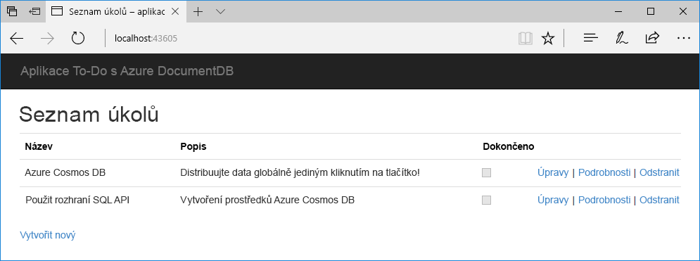
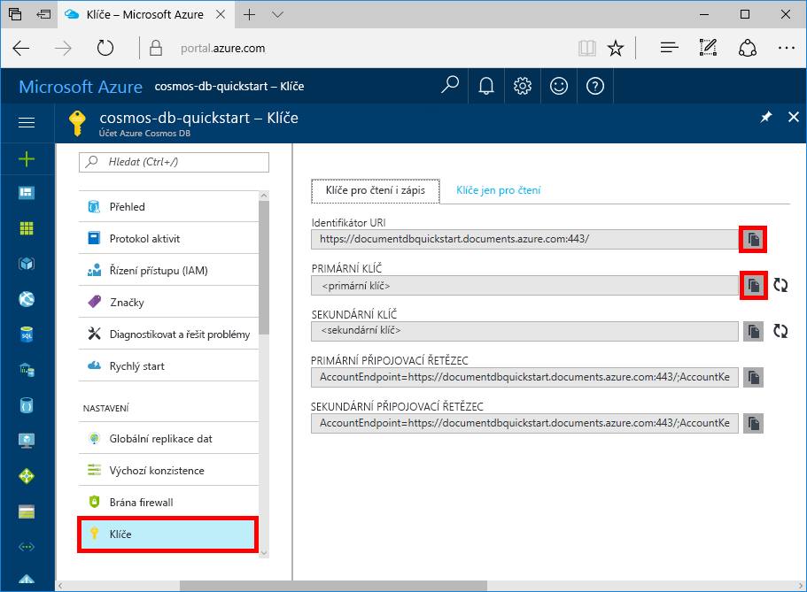

# <a name="quickstart-build-a-net-web-app-with-azure-cosmos-db-using-the-sql-api-and-the-azure-portal"></a>Rychlý start: Vytvoření webové aplikace .NET se službou Azure Cosmos DB pomocí rozhraní SQL API a webu Azure Portal

Azure Cosmos DB je globálně distribuovaná databázová služba Microsoftu pro více modelů. Můžete snadno vytvořit a dotazovat databáze dotazů, klíčů/hodnot a grafů, které tak můžou využívat výhody použitelnosti v celosvětovém měřítku a možností horizontálního škálování v jádru databáze Azure Cosmos. 

Tento rychlý start popisuje způsob vytvoření účtu rozhraní [SQL API](sql-api-introduction.md) služby Azure Cosmos DB, databáze dokumentů a kolekce pomocí webu Azure Portal. Potom budete moci sestavit a nasadit webovou aplikaci seznamu úkolů založenou na rozhraní [SQL .NET API](sql-api-sdk-dotnet.md), jak znázorňuje následující snímek obrazovky. 



## <a name="prerequisites"></a>Požadavky

Pokud ještě nemáte nainstalovanou sadu Visual Studio 2017, můžete stáhnout a použít **bezplatnou verzi** [Visual Studio 2017 Community Edition](https://www.visualstudio.com/downloads/). Nezapomeňte při instalaci sady Visual Studio povolit možnost **Azure Development**.

[!INCLUDE [quickstarts-free-trial-note](../../includes/quickstarts-free-trial-note.md)] 
[!INCLUDE [cosmos-db-emulator-docdb-api](../../includes/cosmos-db-emulator-docdb-api.md)]  

<a id="create-account"></a>
## <a name="create-a-database-account"></a>Vytvoření účtu databáze

[!INCLUDE [cosmos-db-create-dbaccount](../../includes/cosmos-db-create-dbaccount.md)]

<a id="create-collection"></a>
## <a name="add-a-collection"></a>Přidání kolekce

[!INCLUDE [cosmos-db-create-collection](../../includes/cosmos-db-create-collection.md)]

<a id="add-sample-data"></a>
## <a name="add-sample-data"></a>Přidání ukázkových dat

[!INCLUDE [cosmos-db-create-sql-api-add-sample-data](../../includes/cosmos-db-create-sql-api-add-sample-data.md)]

## <a name="query-your-data"></a>Dotazování dat

[!INCLUDE [cosmos-db-create-sql-api-query-data](../../includes/cosmos-db-create-sql-api-query-data.md)]

## <a name="clone-the-sample-application"></a>Klonování ukázkové aplikace

Teď přejděme k práci s kódem. Naklonujeme aplikaci SQL API z GitHubu, nastavíme připojovací řetězec a spustíme ji. Přesvědčíte se, jak snadno se pracuje s daty prostřednictvím kódu programu. 

1. Otevřete příkazový řádek, vytvořte novou složku git-samples a potom příkazový řádek zavřete.

    ```bash
    md "C:\git-samples"
    ```

2. Otevřete okno terminálu Git, například Git Bash, a pomocí příkazu `cd` přejděte do nové složky, do které chcete nainstalovat ukázkovou aplikaci.

    ```bash
    cd "C:\git-samples"
    ```

3. Ukázkové úložiště naklonujete spuštěním následujícího příkazu. Tento příkaz vytvoří na vašem počítači kopii ukázkové aplikace.

    ```bash
    git clone https://github.com/Azure-Samples/documentdb-dotnet-todo-app.git
    ```

4. Potom otevřete soubor řešení todo v sadě Visual Studio. 

## <a name="review-the-code"></a>Kontrola kódu

Tento krok je volitelný. Pokud chcete zjistit, jak se v kódu vytvářejí prostředky databáze, můžete si prohlédnout následující fragmenty kódu. Jinak můžete přeskočit přímo k části [Aktualizace informací o připojení](#update-your-connection-string). 

Všechny následující fragmenty kódu pocházejí ze souboru DocumentDBRepository.cs.

* Na řádku 76 se inicializuje DocumentClient.

    ```csharp
    client = new DocumentClient(new Uri(ConfigurationManager.AppSettings["endpoint"]), ConfigurationManager.AppSettings["authKey"]);
    ```

* Na řádku 91 se vytvoří nová databáze.

    ```csharp
    await client.CreateDatabaseAsync(new Database { Id = DatabaseId });
    ```

* Na řádku 110 se vytvoří nová kolekce.

    ```csharp
    await client.CreateDocumentCollectionAsync(
        UriFactory.CreateDatabaseUri(DatabaseId),
        new DocumentCollection
            {
               Id = CollectionId
            },
        new RequestOptions { OfferThroughput = 400 });
    ```

## <a name="update-your-connection-string"></a>Aktualizace připojovacího řetězce

Teď se vraťte zpátky na portál Azure Portal, kde najdete informace o připojovacím řetězci, a zkopírujte je do aplikace.

1. Na webu [Azure Portal](http://portal.azure.com/) klikněte v účtu databáze Azure Cosmos v levém navigačním panelu na možnost **Klíče** a potom klikněte na **Klíče pro čtení i zápis**. V dalším kroku zkopírujte pomocí tlačítek kopírování na pravé straně obrazovky identifikátor URI a primární klíč do souboru web.config.

    

2. V sadě Visual Studio 2017 otevřete soubor web.config. 

3. Z portálu zkopírujte hodnotu identifikátoru URI (pomocí tlačítka kopírování) a nastavte ji jako hodnotu klíče koncového bodu v souboru web.config. 

    `<add key="endpoint" value="FILLME" />`

4. Pak z portálu zkopírujte hodnotu PRIMÁRNÍHO KLÍČE a nastavte ji jako hodnotu authKey v souboru web.config. Teď jste aktualizovali aplikaci a zadali do ní všechny informace potřebné ke komunikaci s Azure Cosmos DB. 

    `<add key="authKey" value="FILLME" />`
    
## <a name="run-the-web-app"></a>Spuštění webové aplikace
1. V sadě Visual Studio klikněte v **Průzkumníku řešení** pravým tlačítkem myši na projekt a potom klikněte na **Spravovat balíčky NuGet**. 

2. Do pole **Procházet** v NuGetu zadejte *DocumentDB*.

3. Z výsledků nainstalujte knihovnu **Microsoft.Azure.DocumentDB**. Tím se nainstaluje balíček Microsoft.Azure.DocumentDB a zároveň všechny závislosti.

4. Spusťte aplikaci stisknutím CTRL+F5. Aplikace se zobrazí v prohlížeči. 

5. V prohlížeči klikněte na **Vytvořit nový** a vytvořte v aplikaci seznamu úkolů několik nových úloh.

   

Teď se můžete vrátit do Průzkumníku dat a zobrazit dotaz nebo provést úpravy a pracovat s těmito novými daty. 

## <a name="review-slas-in-the-azure-portal"></a>Ověření podmínek SLA na portálu Azure Portal

[!INCLUDE [cosmosdb-tutorial-review-slas](../../includes/cosmos-db-tutorial-review-slas.md)]

## <a name="clean-up-resources"></a>Vyčištění prostředků

[!INCLUDE [cosmosdb-delete-resource-group](../../includes/cosmos-db-delete-resource-group.md)]

## <a name="next-steps"></a>Další kroky

V tomto rychlém startu jste se seznámili s postupem vytvoření účtu Azure Cosmos DB, vytvoření kolekce pomocí Průzkumníka dat a spuštění webové aplikace. Teď můžete do účtu Cosmos DB importovat další data. 

> [!div class="nextstepaction"]
> [Importování dat do služby Azure Cosmos DB](import-data.md)


