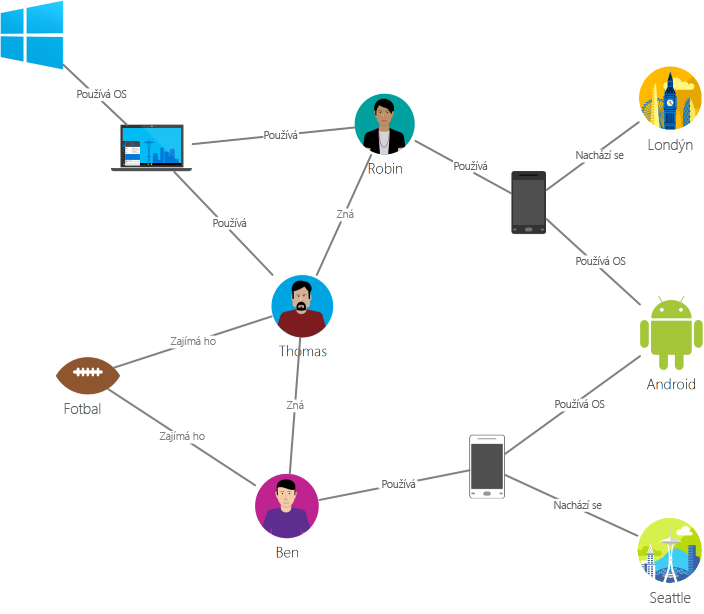

# Úvod do služby Azure Cosmos DB: rozhraní Gremlin API

[Azure Cosmos DB](introduction.md) je globálně distribuovaná databázová služba s více modely od Microsoftu pro klíčové aplikace. Databáze pro více modelů podporuje modely dokumentů, klíčových hodnot, grafů a sloupcových dat. Rozhraní Gremlin API databáze Azure Cosmos DB se používá k ukládání dat grafu a práci s nimi. Rozhraní Gremlin API podporuje modelování dat grafu a nabízí rozhraní API k procházení dat grafu.

Tento článek obsahuje přehled rozhraní Gremlin API služby Azure Cosmos DB a vysvětluje, jak ho můžete použít k ukládání ohromných grafů s miliardami vrcholů a hran. Grafy můžete dotazovat s latencí v řádu milisekund a snadno rozvíjet strukturu a schéma grafu. K dotazování služby Azure Cosmos DB můžete použít jazyk pro procházení grafů [Apache TinkerPop](http://tinkerpop.apache.org) nebo [Gremlin](http://tinkerpop.apache.org/docs/current/reference/#graph-traversal-steps).

## Co je databáze grafu
Data, která existují v reálném světě, jsou přirozeně propojená. Tradiční modelování dat se zaměřuje na entity. U mnoha aplikací je také zapotřebí přirozeně modelovat jak entity, tak vztahy.

[Graf](http://mathworld.wolfram.com/Graph.html) je struktura složená z [vrcholů](http://mathworld.wolfram.com/GraphVertex.html) a [hran](http://mathworld.wolfram.com/GraphEdge.html). Vrcholy i hrany mohou mít libovolný počet vlastností. 

* **Vrcholy** – znázorňují diskrétní (nespojité) objekty, jako jsou osoby, místa nebo události. 

* **Hrany** – znázorňují vztahy mezi vrcholy. Nějaká osoba například může znát jinou osobu, účastnit se nějaké události a nacházet se na určitém místě. 

* **Vlastnosti** vyjadřují informace o vrcholech a hranách. Příkladem vlastností vrcholu je třeba jméno a věk osoby. Příkladem vlastnosti hrany je třeba časové razítko a/nebo výška. Formálněji se tento model označuje jako [graf vlastností](http://tinkerpop.apache.org/docs/current/reference/#intro). Azure Cosmos DB tento model grafu vlastností podporuje.

Následující ukázkový graf například znázorňuje vztahy mezi lidmi, mobilními zařízeními, zájmy a operačními systémy:

Databáze grafu umožňují přirozené a efektivní modelování a ukládání grafů, díky čemuž jsou užitečné v mnoha situacích. Databáze grafu jsou zpravidla databázemi NoSQL, protože tyto případy použití často potřebují flexibilní schéma a rychlou iteraci.

Zkombinováním rychlého procházení, které nabízí databáze grafu, s algoritmy grafu, ke kterým patří hledání do hloubky, hledání do šířky a algoritmus Dijkstra, můžete řešit problémy v různých oborech, jako jsou sociální sítě, správa obsahu, geoprostorové úlohy a doporučení.

## Funkce databáze grafu Azure Cosmos DB
 
Azure Cosmos DB je plně spravovaná databáze grafu, která nabízí globální distribuci, elastické škálování úložiště a propustnosti, automatické indexování a dotazování, nastavitelné úrovně konzistence a podporu standardu TinkerPop.

Služba Azure Cosmos DB nabízí následující možnosti, kterými se odlišuje od jiných databází grafu na trhu:

* Elasticky škálovatelná propustnost a úložiště

 Grafy v reálném světě je potřeba škálovat nad kapacitu jednoho serveru. Se službu Azure Cosmos DB můžete grafy bezproblémově škálovat na několik serverů. Můžete také nezávisle škálovat propustnost grafu na základě způsobů přístupu. Azure Cosmos DB podporuje databáze grafu, které lze škálovat na prakticky neomezenou velikost úložiště a zřízenou propustnost.

* Replikace mezi více oblastmi

 Azure Cosmos DB transparentně replikuje data vašeho grafu do všech oblastí přidružených k vašemu účtu. Replikace umožňuje vývoj aplikací, které vyžadují přístup k datům po celém světě. Existují určité kompromisy v oblasti konzistence, dostupnosti, výkonu a odpovídajících záruk. Díky multihostingu rozhraní API nabízí Azure Cosmos DB transparentní převzetí služeb při selhání mezi oblastmi. Propustnost a úložiště můžete elasticky škálovat v globálním měřítku.

* Rychlé dotazy a procházení pomocí známé syntaxe Gremlin

 Můžete ukládat heterogenní vrcholy a hrany a dotazovat tyto dokumenty pomocí známé syntaxe Gremlin. Azure Cosmos DB využívá vysoce souběžnou technologii indexování strukturovanou do protokolů, která nevyžaduje zamykání a automaticky indexuje veškerý obsah. Tato funkce umožňuje plnohodnotné dotazy a procházení v reálném čase bez nutnosti specifikace parametrů schématu, sekundárních indexů nebo zobrazení. Další informace najdete v článku o [dotazování grafů pomocí jazyka Gremlin](gremlin-support.md).

* S plnou správou

 Azure Cosmos DB eliminuje nutnost správy databáze a počítačových prostředků. Protože se jedná o plně spravovanou službu Microsoft Azure, nemusíte spravovat virtuální počítače, nasazovat a konfigurovat software, spravovat škálování nebo řešit komplexní upgrady datové vrstvy. Každý graf je automaticky zálohovaný a chráněný proti selháním v dané oblasti. Jednoduše si můžete přidat účet služby Azure Cosmos DB a zřídit kapacitu podle potřeby. Díky tomu se můžete soustředit na svou aplikaci, ne na provoz a správu databáze.

* Automatické indexování

 Azure Cosmos DB standardně automaticky indexuje všechny vlastnosti v uzlech a hranách grafu a neočekává ani nevyžaduje žádné schéma nebo vytvoření sekundárních indexů.

* Kompatibilita s Apache TinkerPop

 Služba Azure Cosmos DB nativně podporuje Open Source standard TinkerPop a může být integrovaná s jinými systémy grafů, které tento standard podporují. Snadno tak můžete migrovat z jiných databází grafu, jako jsou Titan nebo Neo4j, nebo Azure Cosmos DB použít s rozhraními pro analýzu grafů, jako je Apache Spark GraphX.

* Nastavitelné úrovně konzistence

 Pro dosažení optimálního kompromisu mezi konzistencí a výkonem si můžete vybrat z pěti jasně definovaných úrovní konzistence. Pro dotazy a operace čtení nabízí služba Azure Cosmos DB pět různých úrovní konzistence: silná, omezená neaktuálnost, relace, konzistentní předpona a konečný výsledek. Tyto podrobné a jasně definované úrovně konzistence umožňují zvolit vhodný kompromis mezi konzistencí, dostupností a latencí. Další informace najdete v článku o [nastavitelných úrovních konzistence dat v Azure Cosmos DB](consistency-levels.md).

Azure Cosmos DB dokáže ve stejných kontejnerech/databázích použít několik modelů, například dokument a graf. Kontejner dokumentů můžete použít k uložení dat grafu a zároveň dokumentů. K dotazování stejných dat ve formě grafu můžete použít dotazy SQL přes JSON i dotazy Gremlin.

## Začínáme

K vytvoření účtů rozhraní Gremlin API služby Azure Cosmos DB a připojení k nim použijte rozhraní příkazového řádku Azure (CLI), Azure PowerShell nebo Azure Portal. Po vytvoření účtu budete mít přístup k databázím grafů v rámci tohoto účtu prostřednictvím koncového bodu služby Gremlin API `https://<youraccount>.gremlin.cosmosdb.azure.com`, který nabízí front-end protokolu WebSocket pro Gremlin. Nástroje kompatibilní s TinkerPop (například [konzolu Gremlin](http://tinkerpop.apache.org/docs/current/reference/#gremlin-console)) můžete nakonfigurovat tak, aby se k tomuto koncovému bodu připojily, a vytvořit aplikace v jazyku Java, Node.js nebo klientský ovladač Gremlin.

Následující tabulka ukazuje oblíbené ovladače Gremlin, které můžete použít vůči Azure Cosmos DB:

| Ke stažení | Dokumentace | Začínáme | Podporovaná verze konektoru |
| --- | --- | --- | --- |
| [.NET](http://tinkerpop.apache.org/docs/3.3.1/reference/#gremlin-DotNet) | [Gremlin.NET na GitHubu](https://github.com/apache/tinkerpop/tree/master/gremlin-dotnet) | [Vytvoření grafu pomocí jazyka .NET](create-graph-dotnet.md) | 3.4.0-RC2 |
| [Java](https://mvnrepository.com/artifact/com.tinkerpop.gremlin/gremlin-java) | [Gremlin JavaDoc](http://tinkerpop.apache.org/javadocs/current/full/) | [Vytvoření grafu pomocí jazyka Java](create-graph-java.md) | 3.2.0 nebo novější |
| [Node.js](https://www.npmjs.com/package/gremlin) | [Gremlin-JavaScript na GitHubu](https://github.com/jbmusso/gremlin-javascript) | [Vytvoření grafu pomocí jazyka Node.js](create-graph-nodejs.md) | 2.6.0|
| [Python](http://tinkerpop.apache.org/docs/3.3.1/reference/#gremlin-python) | [Gremlin-Python na GitHubu](https://github.com/apache/tinkerpop/tree/master/gremlin-python) | [Vytvoření grafu pomocí jazyka Python](create-graph-python.md) | 3.2.7 |
| [PHP](https://packagist.org/packages/brightzone/gremlin-php) | [Gremlin-PHP na GitHubu](https://github.com/PommeVerte/gremlin-php) | [Vytvoření grafu pomocí jazyka PHP](create-graph-php.md) | 3.1.0 |
| [Konzola Gremlin](https://tinkerpop.apache.org/downloads.html) | [Dokumentace k TinkerPop](http://tinkerpop.apache.org/docs/current/reference/#gremlin-console) |  [Vytvoření grafu pomocí konzoly Gremlin](create-graph-gremlin-console.md) | 3.2.0 nebo novější |

## Na co si dát pozor při návrhu databáze grafu

Pokud se při návrhu grafu rozhodnete modelovat entitu jako samostatný vrchol, a ne jako vlastnost jiných entit vrcholů, může to mít vliv na výkon a náklady. Při tomto rozhodování má rozhodující význam předpokládaný způsob dotazování na data a také škálovatelnost samotného modelu.

Než začnete plánovat model entity, odpovězte na následující otázky:

* Jaké entity je potřeba u většiny dotazů načíst jako vrcholy?

* Jaké informace zahrnuté v grafu přidám kvůli filtrování dat?

* Jaké entity jsou pouhými spojnicemi jiných entit, které se následně načítají kvůli hodnotám?

* Jaké informace musí dotaz načíst a jaký poplatek za jednotku žádosti (RU) se tím bude generovat?

Představte si třeba následující návrh grafu:

* V závislosti na dotazech můžete vztah District->Store (Oblast->Obchod) použít jenom k filtrování vrcholů v podobě obchodů. Dotazy mohou být například ve formátu „získat všechny obchody, které patří do určité oblasti“. Pokud tomu tak je, můžete uvažovat o sbalení entity District (Oblast) z vlastního vrcholu do vlastnosti vrcholu Store (Obchod). 

* Výhodou tohoto přístupu je, že snížíte náklady při na načítání každého vrcholu Store (Obchod) současně ze tří objektů grafu (District, District->Store, Store) na jeden vrchol Store (Obchod). Můžete tím zlepšit výkon a současně snížit náklady na dotaz.

* Vrchol Store (Obchod) je propojený se dvěma různými entitami Employee (Zaměstnanec) a Product (Produkt). Vrchol Store je potřeba, protože nabízí další možnosti procházení.  

## Scénáře použití rozhraní Gremlin API
Tady je několik scénářů, ve kterých je možné využít podporu grafů služby Azure Cosmos DB:

* Sociální sítě

 Zkombinováním dat o zákaznících a jejich interakcích s jinými lidmi můžete vytvořit individualizované prostředí, předvídat chování zákazníků nebo spojit osoby s lidmi, kteří mají podobné zájmy. Azure Cosmos DB lze použít ke správě sociálních sítí a sledování zákaznických preferencí a dat.

* Generátory doporučení

 Tento scénář se často používá v maloobchodě. Zkombinováním informací o produktech, uživatelích a interakcích uživatelů (jako je nákup, procházení nebo hodnocení položky) můžete vytvořit přizpůsobená doporučení. Nízká latence, elastické škálování a nativní podpora grafů služby Azure Cosmos DB se k modelování těchto interakcí ideálně hodí.

* Geoprostorové

 V mnoha aplikacích v oboru telekomunikací, logistiky a plánování cest je potřeba najít místo zájmu v určité oblasti nebo vyhledat nejkratší/optimální trasu mezi dvěma místy. Azure Cosmos DB se k řešení těchto problémů skvěle hodí.

* Internet věcí

 Pomocí sítě a propojení mezi zařízeními IoT modelovanými ve formě grafu můžete zajistit lepší porozumění stavu vašich zařízení a majetku. Zároveň zjistíte, jak změny v jedné části sítě mohou potenciálně ovlivnit jinou část.

## Další kroky
Další informace o podpoře grafů ve službě Azure Cosmos DB najdete tady:

* Začněte [kurzem věnovaným grafu služby Azure Cosmos DB](create-graph-dotnet.md).
* Naučte se, jak [dotazovat grafy ve službě Azure Cosmos DB pomocí jazyka Gremlin](gremlin-support.md).
