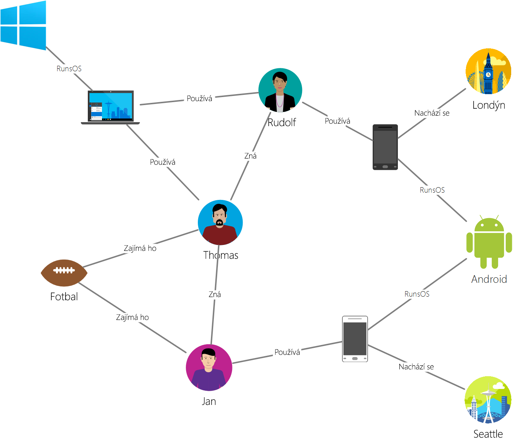

# <a name="azure-cosmos-db-gremlin-graph-support"></a>Podpora grafu Gremlin ve službě Azure Cosmos DB
Azure Cosmos DB podporuje [Gremlin](https://tinkerpop.apache.org/docs/current/reference/#graph-traversal-steps) – jazyk pro procházení grafu od společnosti [Apache Tinkerpop](https://tinkerpop.apache.org), což je rozhraní Gremlin API pro vytváření grafových entit a provádění operací dotazování grafu. Pomocí jazyka Gremlin můžete vytvářet grafové entity (vrcholy a okraje), upravovat vlastnosti v rámci těchto entit, provádět dotazy a přechody a odstraňovat entity. 

Azure Cosmos DB přidává ke grafovým databázím funkce připravené pro podniky. Tyto funkce zahrnují globální distribuci, nezávislé škálování úložiště a propustnosti, předvídatelné latence v řádu jednotek milisekund, automatické indexování, smlouvy SLA nebo dostupnost čtení databázových účtů pokrývajících dvě a více oblastí Azure. Vzhledem k tomu, že Azure Cosmos DB podporuje TinkerPop/Gremlin, můžete snadno migrovat aplikace napsané s využitím jiné grafové databáze bez nutnosti měnit kód. Díky podpoře jazyka Gremlin se Azure Cosmos DB také bez problémů integruje s analytickými architekturami s podporou standardu TinkerPop, například [Apache Spark GraphX](https://spark.apache.org/graphx/). 

V tomto článku vás rychle provedeme jazykem Gremlin a seznámíme vás s jeho funkcemi a kroky, které podporuje Gremlin API.

## <a name="gremlin-by-example"></a>Ukázka jazyka Gremlin
Ukázkový graf vám pomůže pochopit, jak lze v jazyce Gremlin vyjádřit dotazy. Na následujícím obrázku je znázorněna obchodní aplikace, která spravuje data o uživatelích, zájmech a zařízeních v podobě grafu.  

 

Tento graf má následující typy vrcholů (v jazyce Gremlin se jim říká popisky):

- Uživatelé: Graf má tři lidi, Robin Thomas a Petr
- Zájmy: Jejich zájmů, v tomto příkladu hru fotbalového
- Zařízení: Zařízení, která používá
- Operační systémy: Operační systémy, které zařízení běží v

Vztahy mezi těmito entitami vyjádříme pomocí následujících typů okrajů/popisků:

- Ví: Například "Thomas ví Robin"
- Chtěli byste: K reprezentaci zájmy uživatelů v našem grafu, například "Ben má zájem o Football"
- RunsOS: Přenosný počítač spustí operační systém Windows
- Používá: K reprezentaci zařízení uživatel používá. Robin například používá telefon Motorola se sériovým číslem 77.

Nyní pomocí [konzoly Gremlin](https://tinkerpop.apache.org/docs/current/reference/#gremlin-console) spustíme u tohoto grafu několik operací. K jejich provedení můžete také použít ovladače Gremlin na platformě dle vlastního výběru (Java, Node.js, Python nebo .NET).  Než se podíváme na to, co Azure Cosmos DB podporuje, projděme si několik příkladů, abychom se blíže seznámili se syntaxí.

Nejprve se podívejme na CRUD. Následující příkaz Gremlinu vloží do grafu vrchol Thomas:

```
:> g.addV('person').property('id', 'thomas.1').property('firstName', 'Thomas').property('lastName', 'Andersen').property('age', 44)
```

Tento příkaz Gremlinu dále vloží do grafu mezi Thomase a Robina okraj knows (zná).

```
:> g.V('thomas.1').addE('knows').to(g.V('robin.1'))
```

Následující dotaz vrátí vrcholy person (osoba) seřazené podle jmen osob v sestupném pořadí:
```
:> g.V().hasLabel('person').order().by('firstName', decr)
```

Graf je užitečný zejména v případě, kdy potřebujete získat odpověď na otázky, jako je Které operační systémy přátelé Thomase používají? Abyste z grafu tyto informace získali, můžete v Gremlinu spustit toto jednoduché procházení:

```
:> g.V('thomas.1').out('knows').out('uses').out('runsos').group().by('name').by(count())
```
Nyní se podívejme na to, co Azure Cosmos DB může nabídnout vývojářům v Gremlinu.

## <a name="gremlin-features"></a>Funkce jazyka Gremlin
TinkerPop je standard, který zahrnuje širokou řadu grafových technologií. Proto má standardní terminologii popisující, které funkce poskytovatel grafu nabízí. Azure Cosmos DB poskytuje trvalou grafovou databázi s možností zápisu a vysokou souběžností, kterou je možné rozdělit na více serverů nebo clusterů. 

V následující tabulce najdete přehled funkcí TinkerPop, které Azure Cosmos DB implementuje: 

| Kategorie | Implementace služby Azure Cosmos DB |  Poznámky | 
| --- | --- | --- |
| Funkce grafů | Poskytuje trvalost a souběžný přístup. Navrženo s podporou transakcí. | Počítačové metody je možné implementovat prostřednictvím konektoru Spark. |
| Funkce proměnných | Podporuje datové typy Boolean, Integer, Byte, Double, Float, Integer, Long, String. | Podporuje primitivní typy, prostřednictvím datového modelu je kompatibilní s komplexními typy. |
| Funkce vrcholů | Podporuje RemoveVertices, MetaProperties, AddVertices, MultiProperties, StringIds, UserSuppliedIds, AddProperty, RemoveProperty.  | Podporuje vytváření, úpravy a odstraňování vrcholů. |
| Funkce vlastností vrcholů | StringIds, UserSuppliedIds, AddProperty, RemoveProperty, BooleanValues, ByteValues, DoubleValues, FloatValues, IntegerValues, LongValues, StringValues | Podporuje vytváření, úpravy a odstraňování vlastností vrcholů. |
| Funkce okrajů | AddEdges, RemoveEdges, StringIds, UserSuppliedIds, AddProperty, RemoveProperty | Podporuje vytváření, úpravy a odstraňování okrajů. |
| Funkce vlastností okrajů | Properties, BooleanValues, ByteValues, DoubleValues, FloatValues, IntegerValues, LongValues, StringValues | Podporuje vytváření, úpravy a odstraňování vlastností okrajů. |

## <a name="gremlin-wire-format-graphson"></a>Gremlin přenosový formát: GraphSON

Při vracení výsledků z operací Gremlinu služba Azure Cosmos DB používá [formát GraphSON](https://github.com/thinkaurelius/faunus/wiki/GraphSON-Format). GraphSON je standardní formát jazyka Gremlin pro reprezentaci vrcholů, okrajů a vlastností (vlastností s jednou i více hodnotami) pomocí formátu JSON. 

Následující fragment kódu například zobrazuje reprezentaci vrcholu *vráceného klientovi* ze služby Azure Cosmos DB ve formátu GraphSON. 

```json
  {
    "id": "a7111ba7-0ea1-43c9-b6b2-efc5e3aea4c0",
    "label": "person",
    "type": "vertex",
    "outE": {
      "knows": [
        {
          "id": "3ee53a60-c561-4c5e-9a9f-9c7924bc9aef",
          "inV": "04779300-1c8e-489d-9493-50fd1325a658"
        },
        {
          "id": "21984248-ee9e-43a8-a7f6-30642bc14609",
          "inV": "a8e3e741-2ef7-4c01-b7c8-199f8e43e3bc"
        }
      ]
    },
    "properties": {
      "firstName": [
        {
          "value": "Thomas"
        }
      ],
      "lastName": [
        {
          "value": "Andersen"
        }
      ],
      "age": [
        {
          "value": 45
        }
      ]
    }
  }
```

Vlastnosti, které GraphSON používá pro vrcholy:

| Vlastnost | Popis |
| --- | --- |
| id | ID vrcholu. Musí být jedinečné (v odpovídajícím případě v kombinaci s hodnotou _partition). |
| label | Popisek vrcholu. Tato vlastnost je volitelná a slouží k popisu typu entity. |
| type | Slouží k odlišení vrcholů od jiných než grafových dokumentů. |
| properties | Sada uživatelem definovaných vlastností přidružených k vrcholu. Každá vlastnost může mít více hodnot. |
| _partition (konfigurovatelná) | Klíč oddílu vrcholu. Jeho prostřednictvím je možné horizontálně navýšit kapacitu grafů na více serverů. |
| outE | Tato vlastnost obsahuje seznam vnějších okrajů z vrcholu. Ukládání informací o sousedství spolu s vrcholem umožňuje rychlé procházení. Hrany jsou seskupeny podle svých popisků. |

Hrana obsahuje následující informace, které usnadňují navigaci do ostatních částí grafu.

| Vlastnost | Popis |
| --- | --- |
| id | ID okraje. Musí být jedinečné (v odpovídajícím případě v kombinaci s hodnotou _partition). |
| label | Popisek okraje. Tato vlastnost je volitelná a slouží k popisu typu vztahu. |
| inV | Tato vlastnost obsahuje seznam vrcholů pro okraj. Ukládání informací o sousedství spolu s okraj umožňuje rychlé procházení. Vrcholy jsou seskupeny podle svých popisků. |
| properties | Sada uživatelem definovaných vlastností přidružených k okraji. Každá vlastnost může mít více hodnot. |

Každá vlastnost může ukládat více hodnot v rámci pole. 

| Vlastnost | Popis |
| --- | --- |
| hodnota | Hodnota vlastnosti.

## <a name="gremlin-steps"></a>Kroky v jazyce Gremlin
Nyní se podívejme na kroky v jazyce Gremlin, které Azure Cosmos DB podporuje. Úplné referenční informace o jazyce Gremlin najdete v [referenčních materiálech ke standardu TinkerPop](https://tinkerpop.apache.org/docs/current/reference).

| Krok | Popis | Dokumentace TinkerPop 3.2 |
| --- | --- | --- |
| `addE` | Přidá okraj mezi dva vrcholy. | [addE step](https://tinkerpop.apache.org/docs/current/reference/#addedge-step) |
| `addV` | Přidá do grafu vrchol. | [addV step](https://tinkerpop.apache.org/docs/current/reference/#addvertex-step) |
| `and` | Zajišťuje, že všechna procházení vrátí hodnotu. | [and step](https://tinkerpop.apache.org/docs/current/reference/#and-step) |
| `as` | Modulátor kroku pro přiřazení proměnné k výstupu kroku. | [as step](https://tinkerpop.apache.org/docs/current/reference/#as-step) |
| `by` | Modulátor kroku používaný s krokem `group` a `order`. | [by step](https://tinkerpop.apache.org/docs/current/reference/#by-step) |
| `coalesce` | Vrátí první procházení, které vrátí výsledek. | [coalesce step](https://tinkerpop.apache.org/docs/current/reference/#coalesce-step) |
| `constant` | Vrátí konstantní hodnotu. Používá se s krokem `coalesce`.| [constant step](https://tinkerpop.apache.org/docs/current/reference/#constant-step) |
| `count` | Vrátí počet procházení. | [count step](https://tinkerpop.apache.org/docs/current/reference/#count-step) |
| `dedup` | Vrátí hodnoty s odebranými duplicitními objekty. | [dedup step](https://tinkerpop.apache.org/docs/current/reference/#dedup-step) |
| `drop` | Zahodí hodnoty (vrchol/hrana). | [drop step](https://tinkerpop.apache.org/docs/current/reference/#drop-step) |
| `fold` | Slouží jako bariéra, která vypočítá agregaci výsledků.| [fold step](https://tinkerpop.apache.org/docs/current/reference/#fold-step) |
| `group` | Seskupí hodnoty na základě zadaných popisků.| [group step](https://tinkerpop.apache.org/docs/current/reference/#group-step) |
| `has` | Slouží k filtrování vlastností, vrcholů a okrajů. Podporuje varianty `hasLabel`, `hasId`, `hasNot` a `has`. | [has step](https://tinkerpop.apache.org/docs/current/reference/#has-step) |
| `inject` | Vloží hodnoty do streamu.| [inject step](https://tinkerpop.apache.org/docs/current/reference/#inject-step) |
| `is` | Slouží k filtrování pomocí logického výrazu. | [is step](https://tinkerpop.apache.org/docs/current/reference/#is-step) |
| `limit` | Slouží k omezení počtu položek v procházení.| [limit step](https://tinkerpop.apache.org/docs/current/reference/#limit-step) |
| `local` | Místně zabalí oddíl procházení podobně jako u vnořeného dotazu. | [local step](https://tinkerpop.apache.org/docs/current/reference/#local-step) |
| `not` | Slouží k vytvoření negace filtru. | [not step](https://tinkerpop.apache.org/docs/current/reference/#not-step) |
| `optional` | Vrátí výsledek zadaného procházení, pokud vrací výsledek, jinak vrátí volající element. | [optional step](https://tinkerpop.apache.org/docs/current/reference/#optional-step) |
| `or` | Zajišťuje, že alespoň jedno procházení vrátí hodnotu. | [or step](https://tinkerpop.apache.org/docs/current/reference/#or-step) |
| `order` | Vrátí výsledky v zadaném pořadí řazení. | [order step](https://tinkerpop.apache.org/docs/current/reference/#order-step) |
| `path` | Vrátí úplnou cestu procházení. | [path step](https://tinkerpop.apache.org/docs/current/reference/#path-step) |
| `project` | Zobrazí vlastnosti jako mapu. | [project step](https://tinkerpop.apache.org/docs/current/reference/#project-step) |
| `properties` | Vrátí vlastnosti zadaných popisků. | [properties step](https://tinkerpop.apache.org/docs/current/reference/#properties-step) |
| `range` | Vyfiltruje zadaný rozsah hodnot.| [range step](https://tinkerpop.apache.org/docs/current/reference/#range-step) |
| `repeat` | Opakuje krok po zadaný počet opakování. Slouží k vytváření cyklů. | [repeat step](https://tinkerpop.apache.org/docs/current/reference/#repeat-step) |
| `sample` | Slouží k zobrazení ukázkových výsledků z procházení. | [sample step](https://tinkerpop.apache.org/docs/current/reference/#sample-step) |
| `select` | Slouží k zobrazení výsledků z procházení. |  [select step](https://tinkerpop.apache.org/docs/current/reference/#select-step) | |
| `store` | Slouží k zobrazení neblokujících agregací z procházení. | [store step](https://tinkerpop.apache.org/docs/current/reference/#store-step) |
| `tree` | Agreguje cesty z vrcholu do stromu. | [tree step](https://tinkerpop.apache.org/docs/current/reference/#tree-step) |
| `unfold` | Rozbalí iterátor jako krok.| [unfold step](https://tinkerpop.apache.org/docs/current/reference/#unfold-step) |
| `union` | Sloučí výsledky z více procházení.| [union step](https://tinkerpop.apache.org/docs/current/reference/#union-step) |
| `V` | Zahrnuje kroky nutné pro procházení mezi vrcholy a okraji: `V`, `E`, `out`, `in`, `both`, `outE`, `inE`, `bothE`, `outV`, `inV`, `bothV` a `otherV`. | [vertex steps](https://tinkerpop.apache.org/docs/current/reference/#vertex-steps) |
| `where` | Slouží k filtrování výsledků z procházení. Podporuje operátory `eq`, `neq`, `lt`, `lte`, `gt`, `gte` a `between`.  | [where step](https://tinkerpop.apache.org/docs/current/reference/#where-step) |

Modul optimalizovaný pro zápis, který Azure Cosmos DB poskytuje, podporuje ve výchozím nastavení automatické indexování všech vlastností v rámci vrcholů a okrajů. Proto se dotazy s filtry, rozsahové dotazy, řazení nebo agregace u všech vlastností zpracovávají z indexu a efektivně předávají. Další informace o tom, jak funguje indexování ve službě Azure Cosmos DB, najdete v našem dokumentu, který se věnuje [indexování bez schémat](https://www.vldb.org/pvldb/vol8/p1668-shukla.pdf).

## <a name="next-steps"></a>Další postup
* Pusťte se do vytváření grafové aplikace [pomocí našich sad SDK](create-graph-dotnet.md). 
* Přečtěte si další informace o [podpoře grafu](graph-introduction.md) ve službě Azure Cosmos DB.
