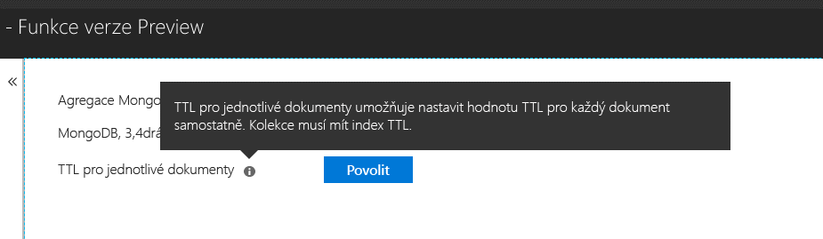

# <a name="expire-data-with-azure-cosmos-dbs-api-for-mongodb"></a>Vypršení platnosti dat pomocí rozhraní API služby Azure Cosmos DB pro MongoDB

Funkce TTL (Time to Live) umožňuje automatické vypršení platnosti dat v databázi. Rozhraní API služby Azure Cosmos DB pro MongoDB využívá základní funkce TTL pro Cosmos DB. Podporují se dva režimy: nastavení výchozí hodnoty TTL pro celou kolekci a nastavení hodnot TTL pro každý dokument zvlášť. Logika, kterými se řídí indexy TTL a interval TTL, ZÍSKÁ každý dokument hodnoty v Cosmos DB přes rozhraní API pro MongoDB, je [stejné jako u služby Cosmos DB](../cosmos-db/mongodb-indexing.md).

## <a name="ttl-indexes"></a>Indexy TTL
Pokud chcete v kolekci povolit všeobecnou hodnotu TTL, je potřeba vytvořit [index TTL (Time to Live)](../cosmos-db/mongodb-indexing.md). Index TTL je index u pole _ts s hodnotou expireAfterSeconds.

Příklad:
```JavaScript
globaldb:PRIMARY> db.coll.createIndex({"_ts":1}, {expireAfterSeconds: 10})
{
        "_t" : "CreateIndexesResponse",
        "ok" : 1,
        "createdCollectionAutomatically" : true,
        "numIndexesBefore" : 1,
        "numIndexesAfter" : 4
}
```

Příkaz v předchozím příkladu vytvoří index s funkcí TTL. Po vytvoření indexu databáze z dané kolekce automaticky odstraní všechny dokumenty, které se během posledních 10 sekund neupravily. 

> [!NOTE]
> Pole **_ts** je pole specifické pro službu Cosmos DB a není přístupné z klientů MongoDB. Jedná se o vyhrazenou (systémovou) vlastnost obsahující časové razítko poslední úpravy dokumentu.
>
    
Tady je navíc příklad v jazyce C#: 

```csharp
var options = new CreateIndexOptions {ExpireAfter = TimeSpan.FromSeconds(10)}; 
var field = new StringFieldDefinition<BsonDocument>("_ts"); 
var indexDefinition = new IndexKeysDefinitionBuilder<BsonDocument>().Ascending(field); 
await collection.Indexes.CreateOneAsync(indexDefinition, options); 
``` 

## <a name="set-time-to-live-value-for-a-document"></a>Nastavení hodnoty TTL pro dokument 
Podporují se také hodnoty TTL pro jednotlivé dokumenty. Dokumenty musí obsahovat vlastnost ttl (malými písmeny) na kořenové úrovni a pro danou kolekci musí být vytvořený index TTL, jak je popsáno výše. Hodnoty TTL nastavené pro dokument přepíší hodnotu TTL kolekce.

Hodnota TTL musí být typu int32. Případně to může být hodnota typu int64, která se vejde do typu int32, nebo typu double bez desetinné části, která se vejde do typu int32. Hodnoty vlastnosti TTL, které neodpovídají těmto specifikacím, jsou povolené, ale nepovažují se za smysluplné hodnoty TTL dokumentu.

Hodnota TTL pro dokument je volitelná – do kolekce je možné vkládat i dokumenty bez hodnoty TTL.  V takovém případě se bude respektovat hodnota TTL kolekce. 

Následující dokumenty mají platné hodnoty TTL. Po vložení dokumentů jejich hodnoty TTL přepíší hodnoty TTL kolekce. Dokumenty se proto odeberou po 20 sekundách.  

```JavaScript 
globaldb:PRIMARY> db.coll.insert({id:1, location: "Paris", ttl: 20.0}) 
globaldb:PRIMARY> db.coll.insert({id:1, location: "Paris", ttl: NumberInt(20)}) 
globaldb:PRIMARY> db.coll.insert({id:1, location: "Paris", ttl: NumberLong(20)}) 
```

Následující dokumenty mají neplatné hodnoty TTL. Dokumenty se vloží, ale hodnota TTL dokumentu se nebude respektovat. Dokumenty se proto kvůli hodnotě TTL kolekce odeberou po 10 sekundách. 

```JavaScript 
globaldb:PRIMARY> db.coll.insert({id:1, location: "Paris", ttl: 20.5}) //TTL value contains non-zero decimal part. 
globaldb:PRIMARY> db.coll.insert({id:1, location: "Paris", ttl: NumberLong(2147483649)}) //TTL value is greater than Int32.MaxValue (2,147,483,648). 
``` 

## <a name="how-to-activate-the-per-document-ttl-feature"></a>Postup aktivace funkce TTL pro jednotlivé dokumenty

Funkci interval TTL, ZÍSKÁ každý dokument můžete aktivovat pomocí rozhraní API služby Azure Cosmos DB pro MongoDB.

 

## <a name="next-steps"></a>Další postup
* [Vypršení platnosti dat v Azure Cosmos DB automaticky s časem TTL](../cosmos-db/time-to-live.md)
* [Indexování databáze Cosmos nakonfigurovaný pro MongoDB API služby Azure Cosmos DB](../cosmos-db/mongodb-indexing.md)
