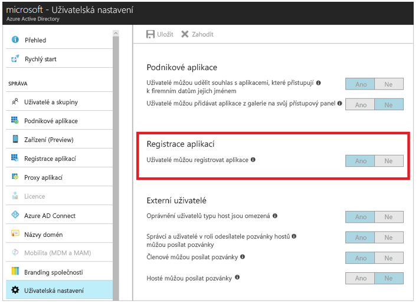
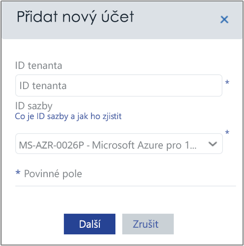
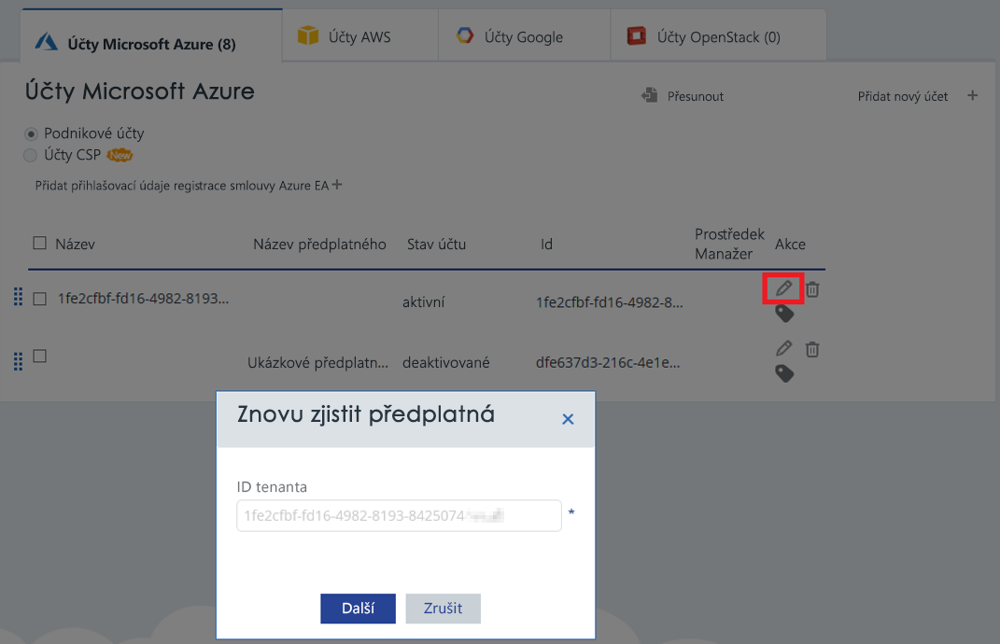

# <a name="activate-azure-subscriptions-and-accounts-with-azure-cost-management"></a>Aktivace účtů a předplatných Azure pomocí Azure Cost Managementu

Přidání nebo aktualizace přihlašovacích údajů Azure Resource Manageru umožňuje službě Azure Cost Management zjistit všechny účty a všechna předplatná ve vašem tenantovi Azure. Pokud navíc máte na virtuálních počítačích povolené rozšíření Azure Diagnostics, může služba Azure Cost Management shromažďovat rozšířené metriky – například o procesoru a paměti. Tento článek popisuje, jak povolit přístup pomocí rozhraní API Azure Resource Manageru pro nové a stávající účty. Také popisuje, jak řešit běžné problémy s účty.

Azure Cost Management nemá přístup k většině dat vašeho předplatného Azure, pokud je toto předplatné _neaktivované_. Je potřeba upravit _neaktivované_ účty, aby k nim měla služba Azure Cost Management přístup.

## <a name="required-azure-permissions"></a>Vyžadovaná oprávnění Azure

K dokončení postupů v tomto článku jsou potřeba určitá oprávnění. Vy nebo váš správce tenanta musíte mít obě následující oprávnění:

- Oprávnění k registraci aplikace CloudynCollector v tenantovi Azure AD
- Možnost přiřadit aplikaci k roli ve vašich předplatných Azure

Vaše účty v předplatných Azure musí mít přístup `Microsoft.Authorization/*/Write` pro přiřazení aplikace CloudynCollector. Tato akce se povoluje prostřednictvím role [vlastníka](../role-based-access-control/built-in-roles.md#owner) nebo [správce uživatelských přístupů](../role-based-access-control/built-in-roles.md#user-access-administrator).

Pokud je vašemu účtu přiřazena role **přispěvatele**, nemáte dostatečná oprávnění k přiřazení aplikace. Při pokusu o přiřazení aplikace CloudynCollector k předplatnému Azure dojde k chybě.

### <a name="check-azure-active-directory-permissions"></a>Kontrola oprávnění Azure Active Directory

1. Přihlaste se k portálu [Azure Portal](https://portal.azure.com).
2. Na portálu Azure Portal vyberte **Azure Active Directory**.
3. V Azure Active Directory vyberte **Uživatelská nastavení**.
4. Zkontrolujte nastavení **Registrace aplikací**.
    - Pokud je nastavená možnost **Ano**, můžou aplikace AD registrovat i uživatelé, kteří nemají oprávnění správce. V případě tohoto nastavení může aplikaci zaregistrovat kterýkoli uživatel v tenantovi Azure AD. Můžete přejít na vyžadovaná oprávnění pro předplatná Azure.  
    
    - Pokud je pro položku **Registrace aplikací** nastavená možnost **Ne**, můžou aplikace Azure Active Directory registrovat jenom uživatelé v roli správce tenanta. Aplikaci CloudynCollector musí zaregistrovat správce tenanta.


## <a name="add-an-account-or-update-a-subscription"></a>Přidání účtu nebo aktualizace předplatného

Když přidáte účet nebo aktualizujete předplatné, povolíte službě Azure Cost Management přístup k vašim datům Azure.

### <a name="add-a-new-account-subscription"></a>Přidání nového účtu (předplatného)

1. Na portálu služby Azure Cost Management klikněte v pravém horním rohu na symbol ozubeného kola a vyberte **Cloud Accounts** (Účty v cloudu).
2. Klikněte na **Add new account** (Přidat nový účet). Zobrazí se dialog **Add new account**. Zadejte požadované informace.  
    

### <a name="update-a-subscription"></a>Aktualizace předplatného

1. Pokud chcete aktualizovat _neaktivované_ předplatné, které už ve službě Azure Cost Management v nástroji pro správu účtů máte, klikněte na symbol tužky pro úpravy napravo od nadřazeného _identifikátoru GUID tenanta_. Předplatná jsou seskupená pod nadřazeným tenantem, neaktivujte je tedy jednotlivě.
    
2. Pokud je potřeba, zadejte ID tenanta. Jestliže ID tenanta neznáte, vyhledejte ho pomocí následujících kroků:
    1. Přihlaste se k webu [Azure Portal](https://portal.azure.com).
    2. Na portálu Azure Portal vyberte **Azure Active Directory**.
    3. K získání ID tenanta vyberte v tenantovi Azure AD možnost **Vlastnosti**.
    4. Zkopírujte GUID adresáře. Tato hodnota představuje ID tenanta.
    Další informace najdete v tématu o [získání ID tenanta](../azure-resource-manager/resource-group-create-service-principal-portal.md#get-tenant-id).
3. V případě potřeby vyberte ID sazby. Pokud neznáte své ID sazby, najděte ho pomocí následujících kroků.
    1. V pravém horním rohu portálu Azure Portal klikněte na informace o uživateli a potom na **Zobrazit účet**.
    2. V části **Billing Account** (Fakturační účet) klikněte na **Subscriptions** (Předplatná).
    3. V části **My subscriptions** (Moje předplatná) vyberte požadované předplatné.
    4. Vaše ID sazby se zobrazí v části **Offer ID** (ID nabídky). Zkopírujte ID nabídky pro toto předplatné.
4. V dialogu pro přidání nového účtu nebo úpravu předplatného klikněte na **Save** (Uložit) nebo na **Next** (Další). Budete přesměrováni na Azure Portal.
5. Přihlaste se k portálu. Kliknutím na **Accept** (Přijmout) udělíte kolektoru služby Azure Cost Management přístup k vašemu účtu Azure.

    Budete přesměrováni na stránku pro správu účtů služby Azure Cost Management a vaše předplatné se aktualizuje se stavem účtu **active** (aktivní). Ve sloupci Resource Manager (Správce prostředku) by se mělo zobrazit zelené zatržítko.

    Pokud u některých předplatných zelené zatržítko nevidíte, znamená to, že nemáte oprávnění vytvářet pro ně aplikaci čtečky (CloudynCollector). Je potřeba, aby tento proces zopakoval uživatel, který má k těmto předplatným vyšší oprávnění.

Podívejte se na [toto video](https://youtu.be/oCIwvfBB6kk), které vás provede připojením k Azure Resource Manageru prostřednictvím služby Azure Cost Management.

>[!VIDEO https://www.youtube.com/embed/oCIwvfBB6kk?ecver=1]

## <a name="resolve-common-indirect-enterprise-set-up-problems"></a>Řešení běžných nepřímých potíží s podnikovým nastavením

Pokud jste uživatel se smlouvou Enterprise nebo Cloud Solution Provider (CSP), můžou se vám při prvním použití portálu Azure Cost Management zobrazit následující zprávy:

- *The specified API key is not a top level enrollment key* (Zadaný klíč rozhraní API není klíč registru nejvyšší úrovně) – zobrazí se v průvodci **nastavením služby Azure Cost Management**.
- *Direct Enrollment – No* (Přímá registrace – ne) – zobrazí se na portálu se smlouvou Enterprise.
- *No usage data was found for the last 30 days. Please contact your distributor to make sure markup was enabled for your Azure account* (Za posledních 30 dní nebyla nalezena žádná data o využití. Ověřte prosím u svého distributora, jestli byly pro váš účet Azure povoleny revize) – zobrazí se na portálu Azure Cost Management.

Z předchozích zpráv vyplývá, že jste si smlouvu Azure Enterprise zakoupili přes prodejce nebo poskytovatele CSP. Abyste mohli zobrazovat data ve službě Azure Cost Management, musí váš prodejce nebo poskytovatel CSP pro váš účet Azure povolit _revize_.

Tady je postup řešení těchto potíží:

1. Váš prodejce musí pro váš účet povolit _revize_. Postup najdete v [pokynech k nepřímé registraci zákazníka](https://ea.azure.com/api/v3Help/v2IndirectCustomerOnboardingGuide).
2. Vygenerujte klíč smlouvy Azure Enterprise pro použití se službou Azure Cost Management. Pokyny najdete v článku o [registraci smlouvy Azure Enterprise a zobrazení informací o nákladech](https://docs.microsoft.com/azure/cost-management/quick-register-ea).

Než budete moct vygenerovat klíč rozhraní API smlouvy Azure Enterprise k nastavení služby Azure Cost Management, musíte podle následujících pokynů povolit rozhraní API pro fakturaci Azure:

- [Přehled rozhraní API pro vytváření sestav pro podnikové zákazníky](../billing/billing-enterprise-api.md)
- [Rozhraní API pro vytváření sestav na podnikovém portálu Microsoft Azure](https://ea.azure.com/helpdocs/reportingAPI) v části o **povolení přístupu k datům pro rozhraní API**

Také může být potřeba, abyste udělili oprávnění _zobrazovat poplatky_ v rozhraní API pro fakturaci správcům oddělení, vlastníkům účtů a podnikovým správcům.

Službu Cost Management může povolit jenom správce služeb Azure. Oprávnění spolusprávce k tomu nestačí. Tento požadavek můžete nicméně obejít. Požádejte správce Azure Active Directory o udělení oprávnění k autorizaci aplikace **CloudynAzureCollector** skriptem PowerShellu. Níže uvedený skript udělí oprávnění k registraci aplikace **CloudynAzureCollector** instančního objektu služby Azure Active Directory. Po úspěšném spuštění se na konci operace zobrazí v prohlížeči adresa URL http://localhost:8080/CloudynJava.

```
#THE SOFTWARE IS PROVIDED "AS IS", WITHOUT WARRANTY OF ANY KIND, EXPRESS OR IMPLIED, INCLUDING BUT NOT LIMITED TO THE WARRANTIES OF MERCHANTABILITY, FITNESS FOR A PARTICULAR PURPOSE AND NONINFRINGEMENT. IN NO EVENT SHALL THE AUTHORS OR COPYRIGHT HOLDERS BE LIABLE FOR ANY CLAIM, DAMAGES OR OTHER LIABILITY, WHETHER IN AN ACTION OF CONTRACT, TORT OR OTHERWISE, ARISING FROM, OUT OF OR IN CONNECTION WITH THE SOFTWARE OR THE USE OR OTHER DEALINGS IN THE SOFTWARE.

#Tenant - enter your tenant ID or Name
$tenant = "<ReplaceWithYourTenantID>"

#Cloudyn Collector application ID
$appId = "83e638ef-7885-479f-bbe8-9150acccdb3d"

#URL to activate the consent screen
$url = "https://login.windows.net/"+$tenant+"/oauth2/authorize?api-version=1&response_type=code&client_id="+$appId+"&redirect_uri=http%3A%2F%2Flocalhost%3A8080%2FCloudynJava&prompt=consent"

#Choose your browser, the default is Internet Explorer

#Chrome
#[System.Diagnostics.Process]::Start("chrome.exe", "--incognito $url")

#Firefox
#[System.Diagnostics.Process]::Start("firefox.exe","-private-window $url" )

#IExplorer
[System.Diagnostics.Process]::Start("iexplore.exe","$url -private" )

```

## <a name="next-steps"></a>Další kroky

- Pokud jste ještě nedokončili první kurz ke službě Cost Management, přečtěte si část o [kontrole využití a nákladů](tutorial-review-usage.md).
