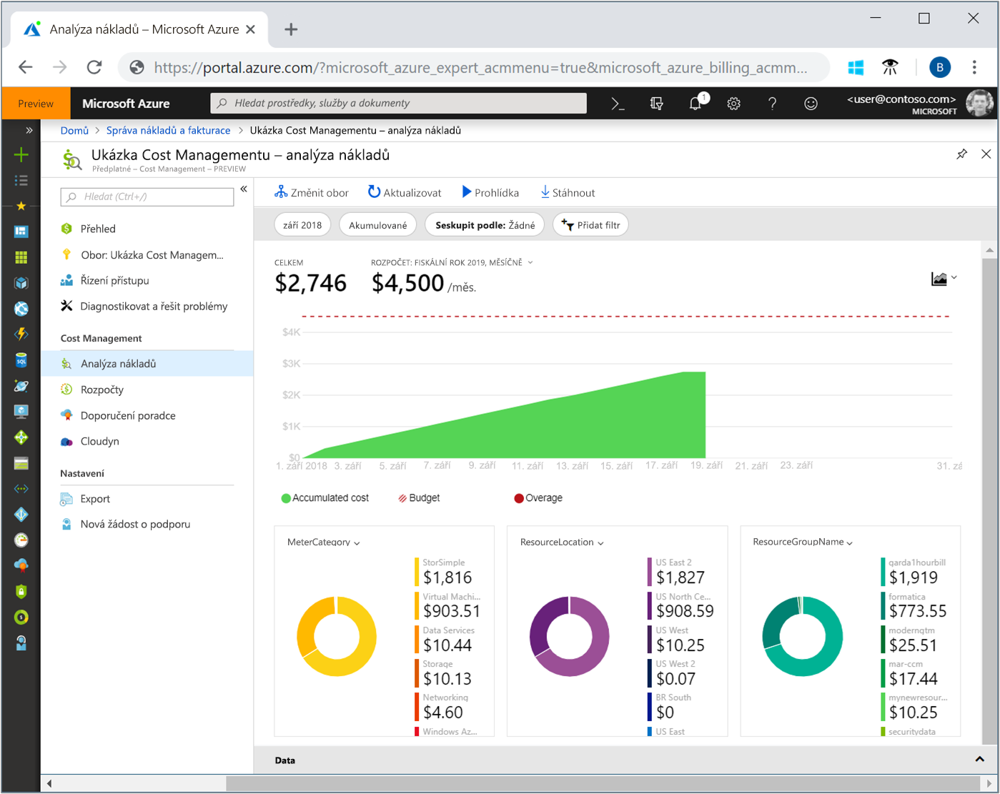
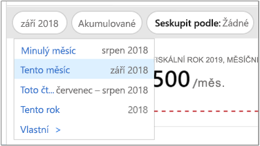
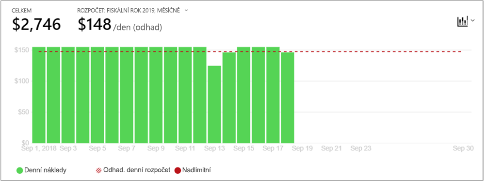
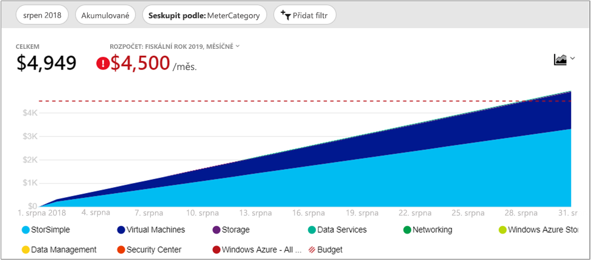
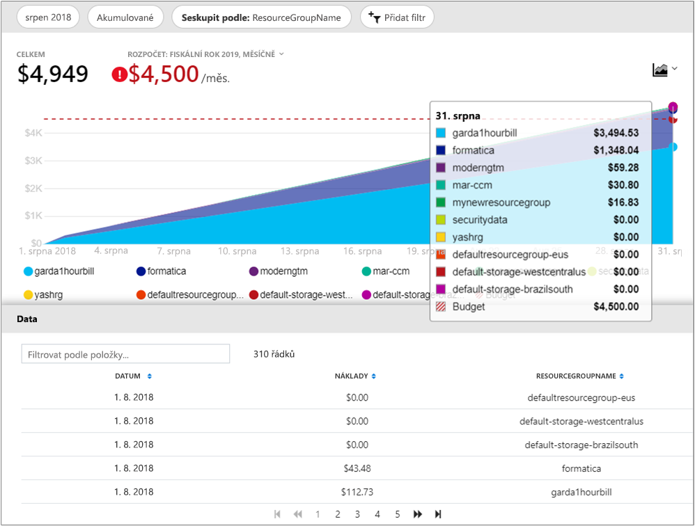

# Rychlý start: Prozkoumání a analýza nákladů pomocí analýzy nákladů

Než budete moci správně řídit a optimalizovat náklady na Azure, musíte porozumět tomu, kde se náklady ve vaší organizaci generují. Je také užitečné znát, kolik vás stojí služby a podpora prostředí a systémů. Náhled do celého spektra nákladů je důležitý, abyste přesně porozuměli výdajovým schématům organizace. Výdajová schémata mohou sloužit k prosazování mechanismů řízení nákladů, jako jsou rozpočty.

V tomto rychlém startu použijete analýzu nákladů a prozkoumáte a analyzujete náklady organizace. Můžete se podívat na agregované náklady na úrovni organizace, abyste porozuměli tomu, kde se náklady v průběhu času generují, a mohli identifikovat trendy útrat. Můžete si také zobrazit kumulované náklady v průběhu času, abyste mohli odhadnout měsíční, čtvrtletní a dokonce i roční trendy nákladů oproti rozpočtu. Rozpočet vám pomůže dodržet finanční omezení. Slouží také k zobrazení denních nebo měsíčních nákladů, abyste mohli izolovat nepravidelnosti v útratách. Dále si můžete stáhnout data aktuální sestavy, abyste je mohli dále analyzovat nebo použít v externím systému.

V tomto rychlém startu se naučíte:

- Kontrola nákladů v analýze nákladů
- Přizpůsobit zobrazení nákladů
- Stažení dat analýzy nákladů

## Požadavky

Analýza nákladů je dostupná pro všechny zákazníky se [smlouvou Enterprise (EA)](https://azure.microsoft.com/pricing/enterprise-agreement/). Abyste mohli zobrazit data nákladů, musíte mít alespoň přístup pro čtení k nejméně jednomu z následujících oborů. Další informace o přiřazování přístupu k datům služby Cost Management najdete v tématu [přiřazení přístupu k datům](assign-access-acm-data.md).

- Fakturační účet
- Oddělení
- Registrační účet
- Skupina pro správu
- Předplatné
- Skupina prostředků

## Přihlášení k Azure

- Přihlaste se k webu Azure Portal na adrese https://portal.azure.com.

## Kontrola nákladů v analýze nákladů

Pokud chcete zkontrolovat náklady pomocí analýzy nákladů, přejděte na webu Azure Portal na **Správa nákladů a fakturace** &gt; **Správa nákladů** &gt; **Změnit obor**, zvolte obor a klikněte na **Vybrat**.

Vybraný obor se použije v celé službě Cost Management k poskytování konsolidace dat a k řízení přístupu k informacím o nákladech. Při použití oborů nevybíráte více oborů. Místo toho vyberete rozsáhlejší obor, který zahrnuje ostatní obory, a potom vyfiltrujete přesně to, co potřebujete. To je důležité vědět, protože někteří uživatelé nemusí mít přístup k nadřazenému oboru, který zahrnuje data z podřízených oborů.

Klikněte na **Otevřít analýzu nákladů**.

Počáteční zobrazení analýzy nákladů zahrnuje tyto oblasti:

**Celkem** – zobrazuje celkové náklady za aktuální měsíc.

**Rozpočet** – zobrazuje plánovaný limit útraty pro vybraný obor (pokud je k dispozici).

**Kumulované náklady** – zobrazuje celkovou denní útratu od začátku měsíce. Po [vytvoření rozpočtu](tutorial-acm-create-budgets.md) pro fakturační účet nebo předplatné můžete rychle zobrazit trend útraty oproti rozpočtu. Po najetí myší na datum se zobrazí kumulované náklady pro daný den.

**Kontingenční (prstencové) grafy** – poskytují dynamické pivoty a rozdělení nákladů podle společné sady standardních vlastností. Zobrazují nejaktuálnější náklady pro aktuální měsíc. Kontingenční grafy můžete kdykoli změnit výběrem jiného pivotu. Náklady jsou standardně zařazeny do těchto kategorií: služba (kategorie měřiče), umístění (oblast) a podřízený obor. Například registrační účty spadají pod fakturační účty, skupiny prostředků pod předplatná a prostředky pod skupiny prostředků.

## Přizpůsobení zobrazení nákladů

Výchozí zobrazení poskytuje rychlé odpovědi na běžné otázky, jako jsou:

- Kolik jsem utratil(a)?
- Dodržím rozpočet?

Existuje ale mnoho případů, kdy budete potřebovat podrobnější analýzu. Přizpůsobení začíná nahoře na stránce, kde můžete vybrat datum.

Analýza nákladů zobrazuje standardně data pro aktuální měsíc. Pomocí výběru data můžete rychle přepnout na minulý měsíc, tento měsíc, toto kalendářní čtvrtletí, tento kalendářní rok, ale můžete i vybrat vlastní rozsah kalendářní dat. Výběr minulého měsíce představuje nejrychlejší způsob analýzy nejnovější faktury Azure a snadného odsouhlasení poplatků. Možnosti aktuálního čtvrtletí a roku usnadňují sledování nákladů oproti dlouhodobým rozpočtům. Můžete také vybrat jiný rozsah kalendářních dat. Můžete například vybrat jeden den, posledních sedm dnů nebo jakékoli období až rok do minulosti od aktuálního měsíce.

Ve výchozím nastavení analýza nákladů zobrazuje **kumulované** náklady. Kumulované náklady zahrnují všechny náklady za každý den plus předchozí dny pro neustále rostoucí zobrazení denně generovaných nákladů. Toto zobrazení je optimalizované tak, aby zobrazilo váš trend oproti rozpočtu za vybraný časový rozsah.

K dipozici máte také **denní** zobrazení, abyste se mohli podívat na náklady v jednotlivých dnech. Denní zobrazení nezobrazuje trend růstu. Toto zobrazení je navrženo tak, aby zobrazovalo nepravidelnosti, protože ze dne na den dochází k prudkému nárůstu nebo poklesu nákladů. Pokud jste vybrali rozpočet, denní zobrazení také zobrazuje odhad toho, jak může vypadat váš denní rozpočet. Pokud vaše denní náklady neustále překračují odhadovaný denní rozpočet, můžete očekávat, že překročíte měsíční rozpočet. Odhadovaný denní rozpočet jednoduše představuje prostředek, který vám pomůže vizualizovat rozpočet na nižší úrovni. Pokud denní náklady kolísají, je srovnání odhadovaného denního rozpočtu s měsíčním rozpočtem méně přesné.

Výběrem možnosti **Seskupit podle** můžete vybrat kategorii skupiny a změnit data zobrazená v horním celkovém plošném grafu. Seskupení umožňuje rychle zjistíte, jak vaší útraty jsou rozdělené do kategorií podle společné vlastnosti prostředku a využití, jako jsou skupiny prostředků nebo značky prostředku. Seskupit podle značky, vyberte klíč značky, které chcete seskupit podle a uvidíte náklady porušena každá hodnota značky, další segment pro prostředky, které nemají dané klíčové slovo použít. Všimněte si, že Cost Management podporuje pouze značky prostředků ode dne, kdy jsou značky použít přímo na prostředek. Skupiny značky prostředku se nepodporují ještě dnes. Tady je zobrazení nákladů na služby Azure pro zobrazení minulého měsíce.

Kontingenční grafy v rámci hlavní grafu zobrazit různé seskupení abyste získali širší představu o celkové náklady pro vybrané časové období a filtry. Vyberte vlastnost nebo značek zobrazíte souhrnné náklady podle dimenzí. Kompletní sadu dat pro celkový počet zobrazení je v dolní části obrazovky tak, že rozbalíte **Data** zásobník nebo tak, že vyberete **Exportovat > stáhnout CSV** v horní části obrazovky. Tady je příklad dat zásobník pro skupiny prostředků.

Na předchozím obrázku jsou znázorněny názvy skupin prostředků. Zatímco můžete seskupit podle značky, chcete-li zobrazit celkové náklady pro jednotlivé značky, zobrazení všech značek na prostředek nebo skupina prostředků není k dispozici v zobrazení analýzy nákladů.

Při seskupování nákladů podle konkrétního atributu je zobrazeno deset nejvýznamnějších přispěvatelů k nákladům, od nejvyššího k nejnižšímu. Pokud je skupin více než deset, je zobrazeno devět horních přispěvatelů a potom skupina **Ostatní**, která pokrývá všechny zbývající skupiny dohromady. Při seskupování podle klíčových slov, může se zobrazit také **Untagged** pro náklady, které nemají značku klíč použít. **Neoznačených** je vždy poslední, i když nejsou více neoznačených nákladů než příznakem náklady. Pokud existuje 10 nebo více hodnot značek, neoznačených nákladů bude součástí **ostatní**.

Prostředky virtuálních počítačů, sítě a úložiště *Classic* (Azure Service Management nebo ASM) nesdílí podrobná data o fakturaci. Ta jsou při seskupování nákladů sloučena do položky **Classic services**.

## Stažení dat analýzy nákladů

Informace z analýzy dat si můžete **stáhnout** a vygenerovat tak soubor CSV pro veškerá data aktuálně zobrazená na webu Azure Portal. Všechny použité filtry a seskupení jsou v souboru zahrnuty. Do souboru CSV se zahrnou i podkladová data pro horní celkový graf, která nejsou aktivně zobrazena.

## Další postup

Pokračujte prvním kurzem, ve kterém se dozvíte, jak vytvořit a spravovat rozpočty.

> [!div class="nextstepaction"]
> [Vytváření a správa rozpočtů](tutorial-acm-create-budgets.md)
