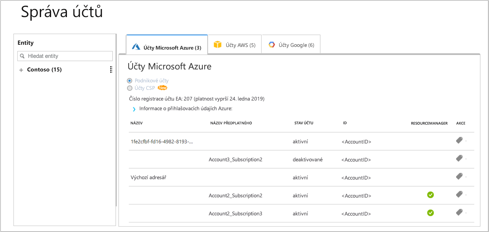

# Registrace samostatného předplatného Azure a zobrazení informací o nákladech

Pomocí svého předplatného Azure se zaregistrujete ve službě Azure Cost Management. Registrací získáte přístup k portálu Cloudyn. Tento rychlý start podrobně popisuje proces registrace nezbytný k vytvoření zkušebního předplatného a přihlášení k portálu Cloudyn. Ukazuje také, jak rovnou začít zobrazovat informace o nákladech.

## Přihlášení k Azure

- Přihlaste se k webu Azure Portal na adrese http://portal.azure.com.

## Registrace ve službě Azure Cost Management

1. Na webu Azure Portal klikněte v seznamu služeb na **Cost Management a fakturace**.
2. V části **Přehled** klikněte na **Cost Management**.  
    
3. Na stránce **Cost Management** klikněte na **Přejít do služby Cost Management** a v novém okně se otevře stránka pro registraci do Cloudyn.
4. Na stránce pro registraci zkušební verze portálu Cloudyn zadejte název vaší společnosti, vyberte **Vlastník samostatného předplatného Azure** a pak klikněte na **Další**. Do formuláře se automaticky přidá název vašeho účtu a ID tenanta.  
    
5. Vyberte **ID nabídky – Název** přidružený k vašemu předplatnému. Pokud si nejste jisti, jaké je ID sazby pro vaše předplatné, můžete se podívat na fakturu za Azure, na které najdete **ID nabídky**.
6. Vyjádřete souhlas s podmínkami použití, ověřte své údaje a pak klikněte na **Další**.
7. Na stránce **Shromažďování dalších dat** kliknutím na **Další** udělte Cloudyn oprávnění ke shromažďování dat o prostředcích Azure. Mezi shromažďovaná data patří informace o využití, výkonu, fakturaci a značkách z vašich předplatných.  
    
8. Váš prohlížeč vás přesměruje na přihlašovací stránku pro Cloudyn. Přihlaste se pomocí přihlašovacích údajů vašeho předplatného Azure.
9. Kliknutím na **Přejít do Cloudyn** otevřete portál Cloudyn a na stránce **Správa účtů** by se měly zobrazit informace o vašem účtu předplatného Azure.  
    

Pokud chcete zhlédnout videokurz k registraci předplatného Azure, podívejte se na video [Finding your Directory GUID and Rate ID for use in Azure Cost Management](https://youtu.be/PaRjnyaNGMI) (Vyhledání GUID adresáře a ID sazby pro použití ve službě Azure Cloud Management).

[!INCLUDE [cost-management-create-account-view-data](../../includes/cost-management-create-account-view-data.md)]

## Další kroky

V tomto rychlém startu jste použili informace o svém předplatném Azure k registraci ve službě Cost Management. Také jste se přihlásili k portálu Cloudyn a začali jste zobrazovat informace o nákladech. Další informace o službě Azure Cost Management najdete v kurzu pro službu Cost Management.

> [!div class="nextstepaction"]
> [Kontrola využití a nákladů](./tutorial-review-usage.md)
