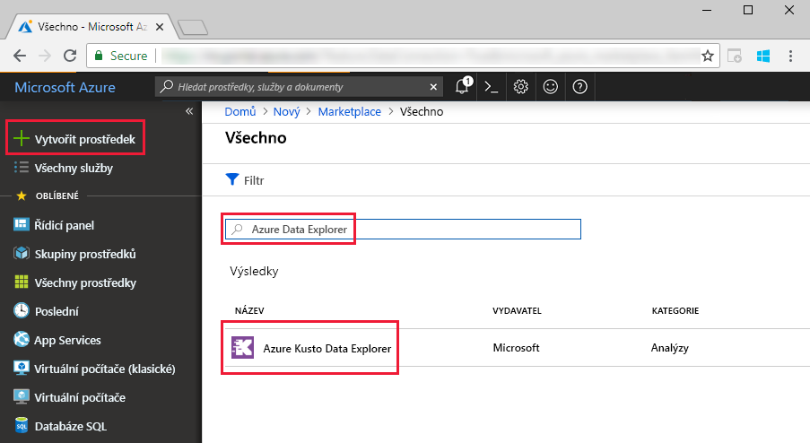
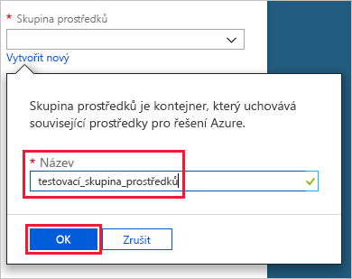
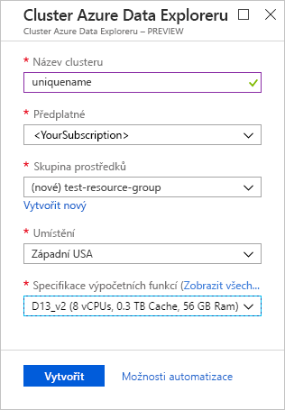
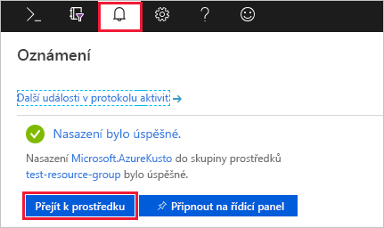
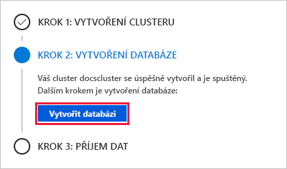
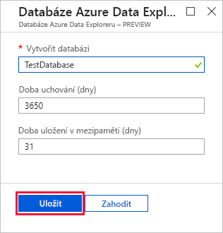
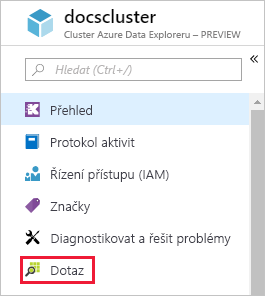
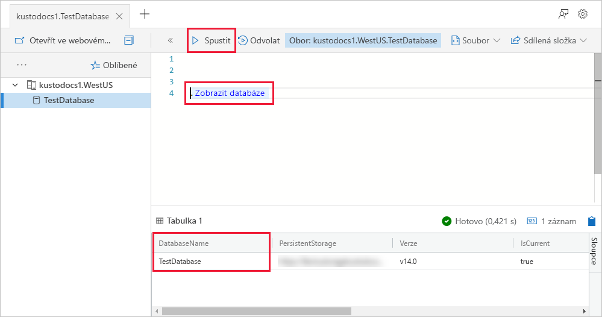
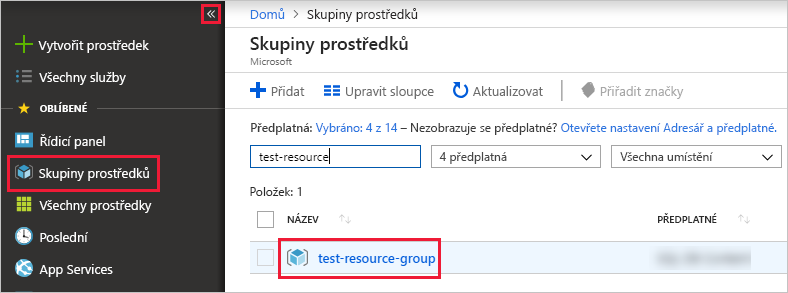

# Rychlý start: Vytvoření clusteru a databáze Azure Data Exploreru

Azure Data Explorer je rychlá a vysoce škálovatelná služba pro zkoumání dat protokolů a telemetrie. Pokud chcete použít Azure Data Explorer, musíte nejdříve vytvořit *cluster* a v něm vytvořit jednu nebo více *databází*. Do databáze potom *ingestujete* (načtete) data, abyste se na ně mohli dotazovat spouštěním dotazů. V tomto rychlém startu vytvoříte cluster a databázi. V dalších článcích vám ukážeme, jak ingestovat data.

Pokud ještě nemáte předplatné Azure, vytvořte si [bezplatný účet Azure](https://azure.microsoft.com/free/) před tím, než začnete.

## Přihlášení k webu Azure Portal

Přihlaste se k webu [Azure Portal](https://portal.azure.com/).

## Vytvoření clusteru

Cluster Azure Data Exploreru vytvoříte ve skupině prostředků Azure s definovanou sadou výpočetních prostředků a prostředků úložiště.

1. Vyberte tlačítko **Vytvořit prostředek** (+) v levém horním rohu portálu.

1. Vyhledejte *Azure Data Explorer*.

   

1. V dolní části obrazovky v části **Azure Data Explorer** vyberte **Vytvořit**.

1. Zadejte pro svůj cluster jedinečný název, vyberte svoje předplatné a vytvořte skupinu prostředků s názvem *test-resource-group*.

    

1. Do formuláře zadejte následující informace.

   

    **Nastavení** | **Navrhovaná hodnota** | **Popis pole**
    |---|---|---|
    | Název clusteru | Jedinečný název clusteru | Zvolte jedinečný název, který identifikuje váš cluster. Například *mytestcluster*. K názvu clusteru, který zadáte, bude připojen název domény *[oblast].kusto.windows.net*. Název může obsahovat jenom malá písmena a číslice. Musí se skládat ze 3 až 22 znaků.
    | Předplatné | Vaše předplatné | Vyberte předplatné Azure, které chcete použít pro svůj cluster.|
    | Skupina prostředků | *test-resource-group* | Vytvořte novou skupinu prostředků. |
    | Umístění | *Západní USA* | V tomto rychlém startu vyberte *USA – západ*. Pro produkční systém vyberte oblast, která nejlépe vyhovuje vašim potřebám.
    | Specifikace výpočetních prostředků | *D13_v2* | Pro tento rychlý start vyberte specifikaci nejnižší ceny. Pro produkční systém vyberte specifikaci, která nejlépe vyhovuje vašim potřebám.
    | | |

1. Výběrem možnosti **Vytvořit** spusťte zřizování clusteru. Zřizování obvykle trvá asi deset minut. Pokud chcete proces zřizování monitorovat, vyberte na panelu nástrojů **Oznámení**.

    

1. Po dokončení procesu vyberte **Oznámení** a pak vyberte **Přejít k prostředku**.

    

## Vytvoření databáze

Teď jste připraveni na druhý krok procesu: vytvoření databáze.

1. Na kartě **Přehled** vyberte **Vytvořit databázi**.

    

1. Do formuláře zadejte následující informace.

    

    **Nastavení** | **Navrhovaná hodnota** | **Popis pole**
    |---|---|---|
    | Název databáze | *TestDatabase* | Název databáze musí být v rámci clusteru jedinečný.
    | Doba uchovávání | *3650* | Období, v rámci kterého je zaručeno, že budou data k dispozici pro dotazy. Časový rozsah se začíná měřit od okamžiku, kdy jsou data ingestována.
    | Doba uložení v mezipaměti | *31* | Časový rozsah, po který chcete ponechat často dotazovaná data k dispozici v úložišti SSD nebo paměti RAM místo v dlouhodobém úložišti.
    | | | |

1. Výběrem možnosti **Uložit** vytvořte databázi. Vytvoření obvykle trvá méně než minutu. Po dokončení procesu budete zpět na kartě **Přehled** clusteru.

## Spuštění základních příkazů v databázi

Teď, když máte cluster a databázi, můžete spouštět dotazy a příkazy. V databázi ještě nemáte žádná data, i tak ale můžete vidět, jak nástroje fungují.

1. V rámci svého clusteru vyberte **Dotaz**.

    

1. Do okna dotazu vložte následující příkaz: `.show databases` a pak vyberte **Spustit**.

    

    Sada výsledků dotazu obsahuje databázi **TestDatabase**, což je jediná databáze v clusteru.

1. Do okna dotazu vložte následující příkaz: `.show tables` a tento příkaz pak vyberte v okně. Vyberte **Run** (Spustit).

    Tento příkaz vrátí prázdnou sadu výsledků dotazu, protože zatím nemáte žádné tabulky. Tabulku přidáte v dalším článku v této sérii.

## Zastavení a restartování clusteru

Cluster můžete v závislosti na potřebách firmy zastavit a restartovat.

1. Zastavíte ho tak, že v horní části karty **Přehled** vyberete možnost **Zastavit**.

    Při zastavení clusteru nejsou data k dispozici pro dotazy a nemůže ingestovat nová data.

1. Cluster restartujete tak, že v horní části karty **Přehled** vyberete možnost **Spustit**.

    Při restartování clusteru to trvá přibližně deset minut, než bude cluster k dispozici (podobně jako při jeho prvotním zřizování). Chvíli pak také trvá načtení dat do aktivní mezipaměti.  

## Vyčištění prostředků

Pokud plánujete postupovat podle našich dalších rychlých startů a kurzů, vytvořené prostředky zachovejte. Pokud ne, pak skupinu prostředků **test-resource-group** vyčistěte, abyste se vyhnuli účtování poplatků.

1. Úplně nalevo na webu Azure Portal vyberte **Skupiny prostředků** a pak vyberte skupinu prostředků, kterou jste vytvořili.  

    Pokud je nabídka vlevo sbalená, výběrem  ji rozbalte.

   

1. Ve skupině prostředků **test-resource-group** vyberte **Odstranit skupinu prostředků**.

1. V novém okně zadejte název skupiny prostředků, kterou chcete odstranit (*test-resource-group*), a pak klikněte na **Odstranit**.

## Další kroky

> [!div class="nextstepaction"]
> [Rychlý start: Ingestování dat z centra událostí do Azure Data Exploreru](ingest-data-event-hub.md)

