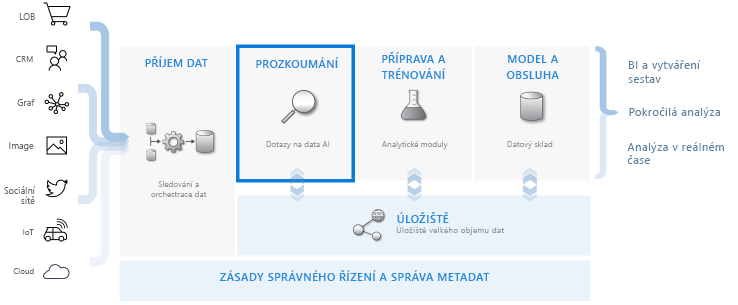
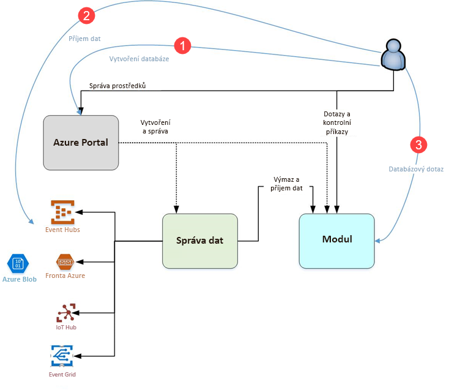

# Co je Azure Data Explorer?

Azure Data Explorer je rychlá a vysoce škálovatelná služba pro zkoumání dat protokolů a telemetrie. Pomáhá zpracovávat celou řadu datových proudů generovaných moderním softwarem, takže můžete shromažďovat, ukládat a analyzovat data. Azure Data Explorer je ideální pro analýzu velkých objemů různých dat z libovolného zdroje dat, jako jsou weby, aplikace, zařízení IoT a další. Tato data se používají pro diagnostiku, monitorování, vytváření sestav, strojové učení a další možnosti analýzy. Azure Data Explorer umožňuje tato data snadno ingestovat a umožňuje také provádět komplexní ad-hoc dotazy na data v řádu sekund.

## Čím je Azure Data Explorer jedinečný?

- Umožňuje rychlé škálování na terabajty dat v řádech minut a provádět rychlé iterace zkoumání dat k získání relevantních přehledů.

- Nabízí inovativní dotazovací jazyk optimalizovaný pro vysoce výkonnou analýzu dat.

- Podporuje analýzu velkých objemů heterogenních dat (strukturovaných i nestrukturovaných).

- Ve spojení s dalšími službami zajišťuje komplexní, výkonné a interaktivní řešení pro analýzu dat a umožňuje tak vytvářet a nasazovat přesně to, co potřebujete.

## Pracovní postup pro datové sklady

Azure Data Explorer se integruje s dalšími důležitými službami, aby zajišťoval ucelené řešení, které zahrnuje shromažďování, ingestování, ukládání a indexování dat, dotazování se na ně a jejich vizualizace. Má velmi důležitou roli v rámci toku datových skladů, kterou je provádění kroku **zkoumání** v rámci toku na terabajtech různorodých nezpracovaných dat.

Azure Data Explorer podporuje řadu různých metod ingestování dat, včetně konektorů k běžným službám, jako je Event Hubs, programové ingestování dat pomocí sad SDK, jako je .NET a Python, a přímý přístup k modulu pro účely zkoumání. Azure Data Explorer se integruje se službami analýzy a modelování, díky čemuž umožňuje provádět rozšířené analýzy a vizualizace dat.

## Tok Azure Data Exploreru

Následující diagram znázorňuje různé aspekty práce s Azure Data Explorerem.

Práce v Azure Data Explorer obecně probíhá podle tohoto modelu:

1. **Vytvoření databáze:** Vytvoříte *cluster* a v něm pak jednu nebo více *databází*. [Rychlý start: Vytvoření clusteru a databáze Azure Data Exploreru](create-cluster-database-portal.md)

1. **Ingestování dat:** Načtete data do databázových tabulek, abyste se na ně mohli dotazovat spouštěním dotazů. [Rychlý start: Ingestování dat z centra událostí do Azure Data Exploreru](ingest-data-event-hub.md)

1. **Dotazování na databázi:** Použijete naši webovou aplikaci ke spuštění, zkontrolování a nasdílení dotazů a výsledků. Je dostupná na webu Azure Portal a jako samostatná aplikace. Kromě toho můžete posílat dotazy prostřednictvím kódu programu (s použitím sad SDK) nebo do koncového bodu rozhraní REST API. [Rychlý start: Dotazování na data v Azure Data Exploreru](web-query-data.md)

## Práce s dotazy

Dotaz v Azure Data Exploreru je požadavek na zpracování dat, který je jen pro čtení a který vrací výsledky tohoto zpracování, aniž by se při tom měnila data nebo metadata. Dotazy můžete podle potřeby ladit, abyste získali kompletní analýzu. Azure Data Explorer tento proces usnadňuje díky tomu, jak rychle pracuje s ad-hoc dotazy.

Azure Data Explorer zpracovává stejně dobře velké objemy strukturovaných, částečně strukturovaných (vnořené typy podobné formátu JSON) i nestrukturovaných dat (volný text). Umožňuje hledat konkrétní textové pojmy, konkrétní události a provádět výpočty se strukturovanými daty ve stylu metrik. Azure Data Explorer přemosťuje svět nestrukturovaných textových protokolů a strukturovaných čísel a dimenzí extrahováním hodnot v modulu runtime z textových polí obsahujících libovolný text. Zkoumání dat je zjednodušeno díky kombinaci rychlého indexování textu, úložiště sloupců a operací s časovými řadami.

Možnosti Azure Data Exploreru rozšiřují další služby postavené na výkonném dotazovacím jazyku, včetně služeb [Log Analytics](/azure/log-analytics/), [Application Insights](/azure/application-insights/), [Time Series Insights](/azure/time-series-insights/) a [Rozšířené ochrany před internetovými útoky programu Windows Defender](/windows/security/threat-protection/windows-defender-atp/windows-defender-advanced-threat-protection/).

## Váš názor

Budeme rádi, když nám napíšete svůj názor na službu Azure Data Explorer a její dotazovací jazyk. Svoje názory nám můžete psát tady:

- Ptejte se
  - [Stack Overflow](https://stackoverflow.com/questions/tagged/azure-data-explorer)
  - [Technická komunita Microsoftu](https://techcommunity.microsoft.com/t5/Azure-Data-Explorer/bd-p/Kusto)
  - [MSDN](https://social.msdn.microsoft.com/Forums/en-US/home?forum=AzureKusto)
- [Posílání návrhů na vylepšení produktu prostřednictvím služby User Voice](http://aka.ms/AzureDataExplorer.UserVoice)

## Další kroky

[Rychlý start: Vytvoření clusteru a databáze Azure Data Exploreru](create-cluster-database-portal.md)

[Rychlý start: Ingestování dat z centra událostí do Azure Data Exploreru](ingest-data-event-hub.md)

[Rychlý start: Dotazování na data v Azure Data Exploreru](web-query-data.md)
