# <a name="quickstart-ingest-data-from-event-hub-into-azure-data-explorer"></a>Rychlý start: Ingestovat data z centra událostí do Průzkumníku dat Azure

Azure Data Explorer je rychlá a vysoce škálovatelná služba pro zkoumání dat protokolů a telemetrie. Azure Data Explorer nabízí ingestování (načítání) dat ze služby Event Hubs, platformy pro streamování velkých objemů dat a služby pro ingestování událostí. [Event Hubs](/azure/event-hubs/event-hubs-about) dokáže zpracovat miliony událostí za sekundu téměř v reálném čase. V tomto rychlém startu vytvoříte centrum událostí, připojíte se k němu z Azure Data Exploreru a podíváte se na tok dat v rámci systému.

## <a name="prerequisites"></a>Požadavky

* Pokud ještě nemáte předplatné Azure, vytvořte si [bezplatný účet Azure](https://azure.microsoft.com/free/) před tím, než začnete.

* [Testovací cluster a databázi](create-cluster-database-portal.md)

* [Ukázková aplikace](https://github.com/Azure-Samples/event-hubs-dotnet-ingest) , který generuje data a odesílá je do centra událostí. Stáhněte si ukázkovou aplikaci v systému.

* [Visual Studio 2017 verze 15.3.2 nebo vyšší](https://www.visualstudio.com/vs/) ke spuštění ukázkové aplikace

## <a name="sign-in-to-the-azure-portal"></a>Přihlášení k webu Azure Portal

Přihlaste se k webu [Azure Portal](https://portal.azure.com/).

## <a name="create-an-event-hub"></a>Vytvoření centra událostí

V tomto rychlém startu vygenerujete ukázková data a odešlete je do centra událostí. Prvním krokem je vytvoření centra událostí. To provedete pomocí šablony Azure Resource Manageru na webu Azure Portal.

1. Vytvoření centra událostí, použijte ke spuštění nasazení na následující tlačítko. Klikněte pravým tlačítkem a vyberte **otevřít v novém okně**, takže můžete postupujte podle zbývajících kroků v tomto článku.

    [](https://portal.azure.com/#create/Microsoft.Template/uri/https%3A%2F%2Fraw.githubusercontent.com%2FAzure%2Fazure-quickstart-templates%2Fmaster%2F201-event-hubs-create-event-hub-and-consumer-group%2Fazuredeploy.json)

    Výběrem tlačítka **Deploy to Azure** (Nasadit do Azure) přejdete na web Azure Portal, kde vyplníte formulář nasazení.

    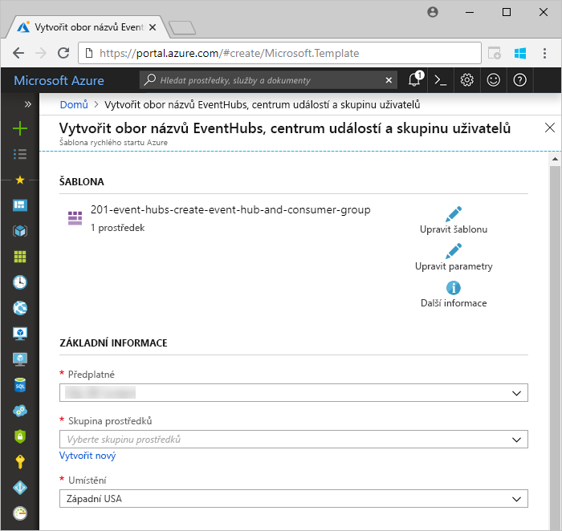

1. Vyberte předplatné, ve kterém chcete centrum událostí vytvořit, a vytvořte skupinu prostředků s názvem *test-hub-rg*.

    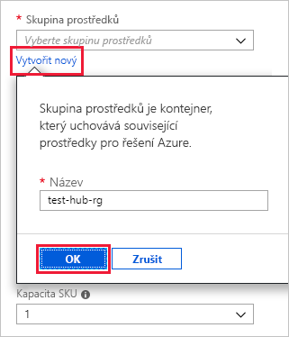

1. Do formuláře zadejte následující informace.

    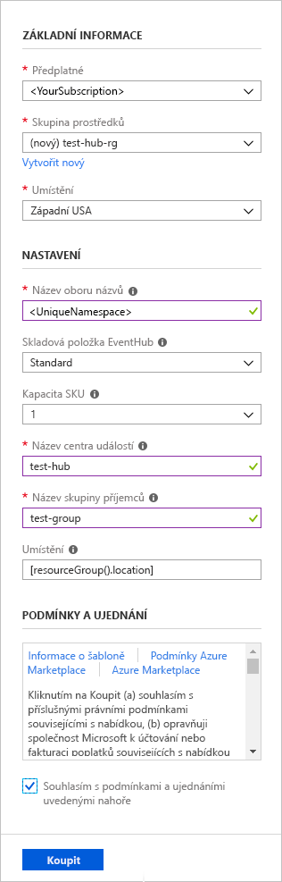

    Pro všechna nastavení, která nejsou uvedená v následující tabulce, použijte výchozí hodnoty.

    **Nastavení** | **Navrhovaná hodnota** | **Popis pole**
    |---|---|---|
    | Předplatné | Vaše předplatné | Vyberte předplatné Azure, které chcete použít pro svoje centrum událostí.|
    | Skupina prostředků | *test-hub-rg* | Vytvořte novou skupinu prostředků. |
    | Umístění | *Západní USA* | V tomto rychlém startu vyberte *Západní USA*. Pro produkční systém vyberte oblast, která nejlépe vyhovuje vašim potřebám. Vytvořte obor názvů centra událostí ve stejném umístění jako cluster Kusto pro zajištění nejlepšího výkonu (nejdůležitější pro obory názvů centra událostí při vysoké propustnosti).
    | Název oboru názvů | Jedinečný název oboru názvů | Zvolte jedinečný název, který identifikuje váš obor názvů. Například *mytestnamespace*. K názvu, který zadáte, bude připojen název domény *servicebus.windows.net*. Název může obsahovat pouze písmena, číslice a pomlčky. Musí začínat písmenem a končit písmenem nebo číslicí. Počet znaků musí být mezi 6 a 50.
    | Název centra událostí | *test-hub* | Centrum událostí se nachází v rámci oboru názvů, který poskytuje jedinečný kontejner oboru. Název centra událostí musí být v rámci oboru názvů jedinečný. |
    | Název skupiny uživatelů | *test-group* | Skupiny uživatelů umožňují, aby měla každá z aplikací samostatné zobrazení streamu událostí. |
    | | |

1. Výběrem možnosti **Purchase** (Zakoupit) potvrdíte vytvoření prostředků ve vašem předplatném.

1. Pokud chcete proces zřizování monitorovat, vyberte na panelu nástrojů **Oznámení**. Úspěšné nasazení může trvat několik minut, můžete teď ale přejít na další krok.

    

## <a name="create-a-target-table-in-azure-data-explorer"></a>Vytvoření cílové tabulky v Azure Data Exploreru

Teď v Azure Data Exploreru vytvoříte tabulku, do které bude služba Event Hubs odesílat data. Tabulku vytvoříte v clusteru a databázi, které jste zřídili v části **Požadavky**.

1. Na webu Azure Portal přejděte ke svému clusteru a vyberte **Dotaz**.

    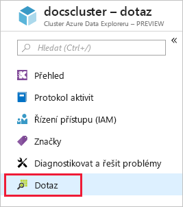

1. Zkopírujte následující příkaz do okna a vyberte **spustit** k vytvoření tabulky (TestTable), který bude přijímat přijaté data.

    ```Kusto
    .create table TestTable (TimeStamp: datetime, Name: string, Metric: int, Source:string)
    ```

    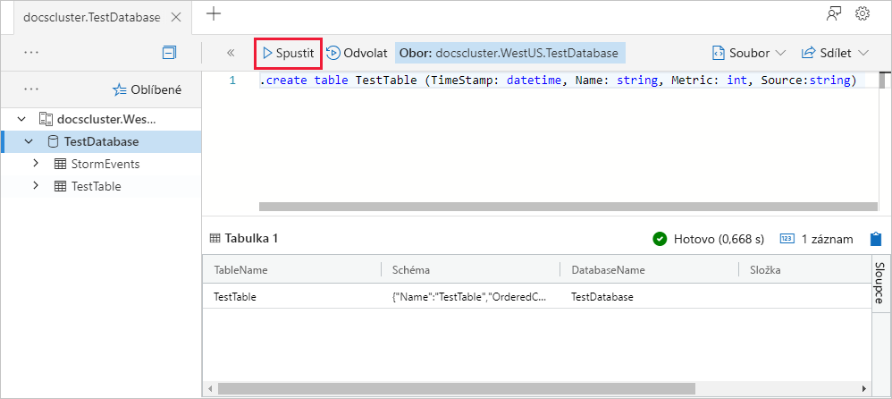

1. Zkopírujte následující příkaz do okna a vyberte **spustit** k mapování příchozích dat JSON pro sloupec názvy a datové typy v tabulce (TestTable).

    ```Kusto
    .create table TestTable ingestion json mapping 'TestMapping' '[{"column":"TimeStamp","path":"$.timeStamp","datatype":"datetime"},{"column":"Name","path":"$.name","datatype":"string"},{"column":"Metric","path":"$.metric","datatype":"int"},{"column":"Source","path":"$.source","datatype":"string"}]'
    ```

## <a name="connect-to-the-event-hub"></a>Připojení k centru událostí

Teď se můžete z Azure Data Exploreru připojit k centru událostí. Po navázání připojení se budou data, která tečou do centra událostí, streamovat do testovací tabulky, kterou jste vytvořili v dřívější části tohoto článku.

1. Výběrem možnosti **Oznámení** na panelu nástrojů ověřte úspěšné nasazení centra událostí.

1. V rámci clusteru, který jste vytvořili, vyberte **Databáze** a pak **TestDatabase**.

    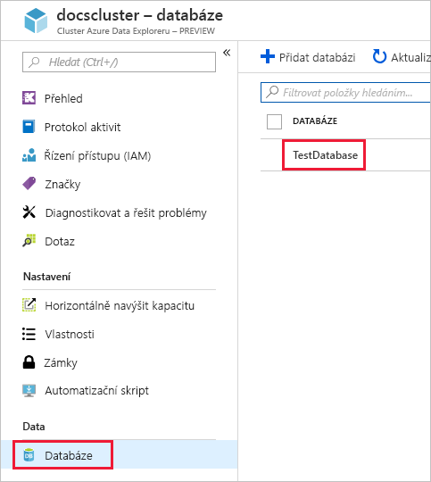

1. Vyberte **Ingestace dat** a pak **Přidat datové připojení**.

    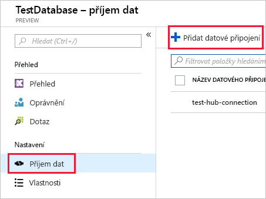

1. Do formuláře zadejte následující informace a vyberte **Vytvořit**.

    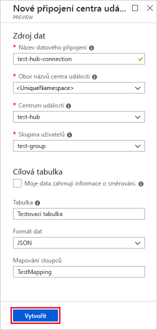

    Zdroj dat:

    **Nastavení** | **Navrhovaná hodnota** | **Popis pole**
    |---|---|---|
    | Název datového připojení | *test-hub-connection* | Název připojení, které chcete vytvořit v Azure Data Exploreru|
    | Obor názvů centra událostí | Jedinečný název oboru názvů | Název, který jste zvolili dříve a který identifikuje váš obor názvů |
    | Centrum událostí | *test-hub* | Centrum událostí, které jste vytvořili |
    | Skupina uživatelů | *test-group* | Skupina uživatelů, kterou jste definovali v centrum událostí, které jste vytvořili |
    | | |

    Cílová tabulka:

    Existují dvě možnosti směrování: *statické* a *dynamické*. Pro účely tohoto rychlého startu použijete statické směrování (výchozí), kde zadáte název tabulky, formát souboru a mapování. Proto nechte **Moje data zahrnují informace o směrování** nezaškrtnuté.
    Můžete použít také dynamické směrování, kde vaše data zahrnují nezbytné informace o směrování.

     **Nastavení** | **Navrhovaná hodnota** | **Popis pole**
    |---|---|---|
    | Table | *TestTable* | Tabulka, kterou jste vytvořili v databázi **TestDatabase** |
    | Formát dat | *JSON* | Podporované formáty jsou Avro, CSV, JSON, VÍCEŘÁDKOVÉM formátu JSON, PSV, SOH, SCSV, TSV a TXT. |
    | Mapování sloupců | *TestMapping* | Mapování, které jste vytvořili v databázi **TestDatabase** a které mapuje příchozí data JSON na názvy sloupců a datové typy tabulky **TestTable**.|
    | | |

## <a name="copy-the-connection-string"></a>Zkopírování připojovacího řetězce

Při spuštění [ukázkové aplikace](https://github.com/Azure-Samples/event-hubs-dotnet-ingest) uvedené v části Požadavky potřebujete připojovací řetězec pro obor názvů centra událostí.

1. V rámci oboru názvů centra událostí, který jste vytvořili, vyberte **Zásady sdíleného přístupu** a pak vyberte **RootManageSharedAccessKey**.

    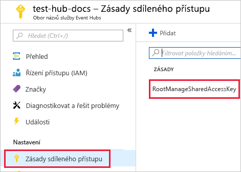

1. Zkopírujte **připojovací řetězec – primární klíč**. Tuto hodnotu vložíte v další části.

    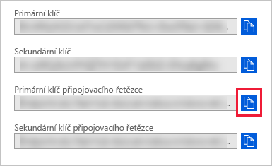

## <a name="generate-sample-data"></a>Generování ukázkových dat

Použití [ukázkovou aplikaci](https://github.com/Azure-Samples/event-hubs-dotnet-ingest) jste si stáhli generují data.

1. Otevřete řešení ukázkové aplikace v sadě Visual Studio.

1. V souboru *program.cs* aktualizujte konstantu `connectionString` na připojovací řetězec, který jste zkopírovali z oboru názvů centra událostí.

    ```csharp
    const string eventHubName = "test-hub";
    // Copy the connection string ("Connection string-primary key") from your Event Hub namespace.
    const string connectionString = @"<YourConnectionString>";
    ```

1. Sestavte a spusťte aplikaci. Aplikace odešle zprávy do centra událostí a každých deset sekund vypíše stav.

1. Po tom, co aplikace odešle několik zpráv, přejděte na další krok: kontrola toku dat do centra událostí a testovací tabulky.

## <a name="review-the-data-flow"></a>Kontrola toku dat

Když teď aplikace generuje data, můžete zobrazit tok těchto dat z centra událostí do tabulky ve vašem clusteru.

1. Na portálu Azure Portal v rámci vašeho centra událostí uvidíte při běhu aplikace špičkový nárůst aktivity.

    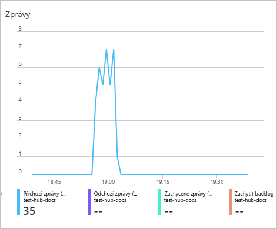

1. Pokud chcete zkontrolovat, kolik zpráv se zatím dostalo do databáze, spusťte v testovací databázi následující dotaz.

    ```Kusto
    TestTable
    | count
    ```

1. Pokud chcete zobrazit obsah zprávy, spusťte následující dotaz:

    ```Kusto
    TestTable
    ```

    Sadu výsledků dotazu by měl vypadat nějak takto:

    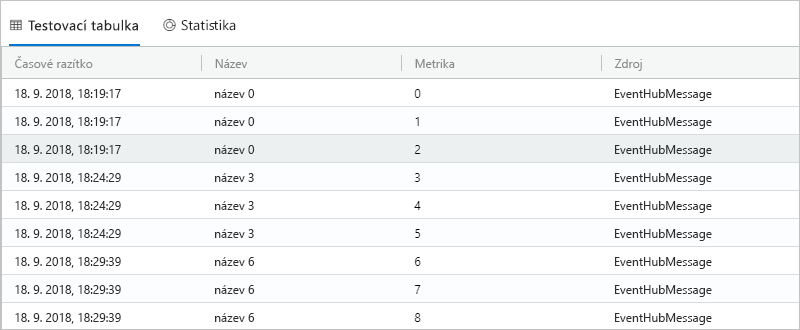

    > [!NOTE]
    > Průzkumník služby Azure Data má zásady agregace (dávkování) pro příjem dat, určená k optimalizaci procesu ingestování. U nakonfigurované na 5 minut, může docházet k latenci.

## <a name="clean-up-resources"></a>Vyčištění prostředků

Pokud už centrum událostí nebudete chtít dál používat, vyčistěte **test-hub-rg**, abyste zabránili vzniku dalších nákladů.

1. Úplně nalevo na webu Azure Portal vyberte **Skupiny prostředků** a pak vyberte skupinu prostředků, kterou jste vytvořili.  

    Pokud je nabídka vlevo sbalená, výběrem  ji rozbalte.

   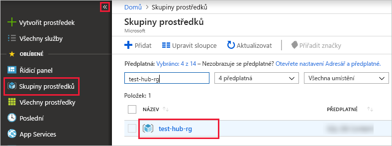

1. Ve skupině prostředků **test-resource-group** vyberte **Odstranit skupinu prostředků**.

1. V novém okně zadejte název skupiny prostředků, kterou chcete odstranit (*test-resource-group*), a pak vyberte **Odstranit**.

## <a name="next-steps"></a>Další postup

> [!div class="nextstepaction"]
> [Rychlé zprovoznění: Dotazování dat v Průzkumníku dat Azure](web-query-data.md)
