# <a name="quickstart-query-data-in-azure-data-explorer"></a>Rychlý start: Dotazování na data v Azure Data Exploreru

Azure Data Explorer je rychlá a vysoce škálovatelná služba pro zkoumání dat protokolů a telemetrie. Azure Data Explorer poskytuje webovou aplikaci, která umožňuje spouštět a sdílet dotazy. Aplikace je dostupná na portálu Azure Portal a jako samostatná webová aplikace. V tomto článku pracujete v samostatné verzi, která umožňuje připojení k více clusterům a sdílení přímých odkazů na vaše dotazy.

Pokud ještě nemáte předplatné Azure, vytvořte si [bezplatný účet Azure](https://azure.microsoft.com/free/) před tím, než začnete.

## <a name="prerequisites"></a>Požadavky

Kromě předplatného Azure budete k dokončení tohoto rychlého startu potřebovat [testovací cluster a databázi](create-cluster-database-portal.md).

## <a name="sign-in-to-the-application"></a>Přihlášení k aplikaci

Přihlaste se k [aplikaci](https://dataexplorer.azure.com/).

## <a name="add-clusters"></a>Přidání clusterů

Při prvním otevření aplikace nejsou k dispozici žádná připojení.


Abyste mohli začít spouštět dotazy, musíte přidat připojení aspoň k jednomu clusteru. V této části přidáte připojení ke *clusteru nápovědy* Azure Data Exploreru, který jsme zřídili na podporu výuky, a k testovacímu clusteru, který jste vytvořili v předchozím rychlém startu.

1. V levém horním rohu aplikace vyberte **Přidat cluster**.

1. V dialogovém okně **Přidat cluster** zadejte `https://help.kusto.windows.net` a pak vyberte **Přidat**.

1. V levém podokně byste teď měli vidět cluster **nápovědy**. Rozbalením databáze **Ukázky** si zobrazte ukázkové tabulky, ke kterým máte přístup.

    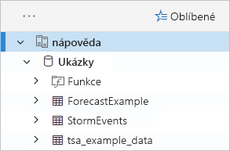

    Dále v tomto rychlém startu a v dalších článcích týkajících se Azure Data Exploreru používáme tabulku **StormEvents**.

Teď přidejte testovací cluster, který jste vytvořili.

1. Vyberte **Přidat cluster**.

1. V dialogovém okně **Přidat cluster** zadejte adresu URL vašeho testovacího clusteru (v této podobě: `https://<ClusterName>.<Region>.kusto.windows.net/`) a pak vyberte **Přidat**.

    V následujícím příkladu uvidíte cluster **nápovědy** a nový cluster, **docscluster.westus** (úplná adresa URL je `https://docscluster.westus.kusto.windows.net/`).

    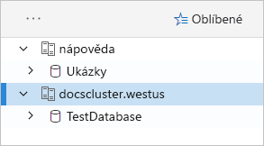

## <a name="run-queries"></a>Spouštění dotazů

Teď můžete spouštět dotazy na kterýkoli z clusterů, ke kterému jste připojení (za předpokladu, že máte ve svém testovacím clusteru data). Zaměříme se na cluster **nápovědy**.

1. V levém podokně v clusteru **nápovědy** vyberte databázi **Ukázky**.

1. Zkopírujte následující dotaz a vložte ho do okna dotazu. V horní části okna vyberte **Spustit**.

    ```Kusto
    StormEvents
    | sort by StartTime desc
    | take 10
    ```
    Tento dotaz vrátí deset nejnovějších záznamů z tabulky **StormEvents**. Levá strana výsledku by měla vypadat tak, jak je vidět v následující tabulce.

    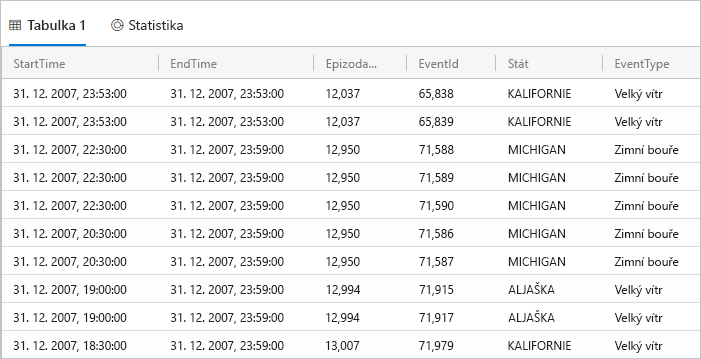

    Následující obrázek ukazuje stav, ve kterém by teď aplikace měla být (s přidanými clustery), a dotaz s výsledky.

    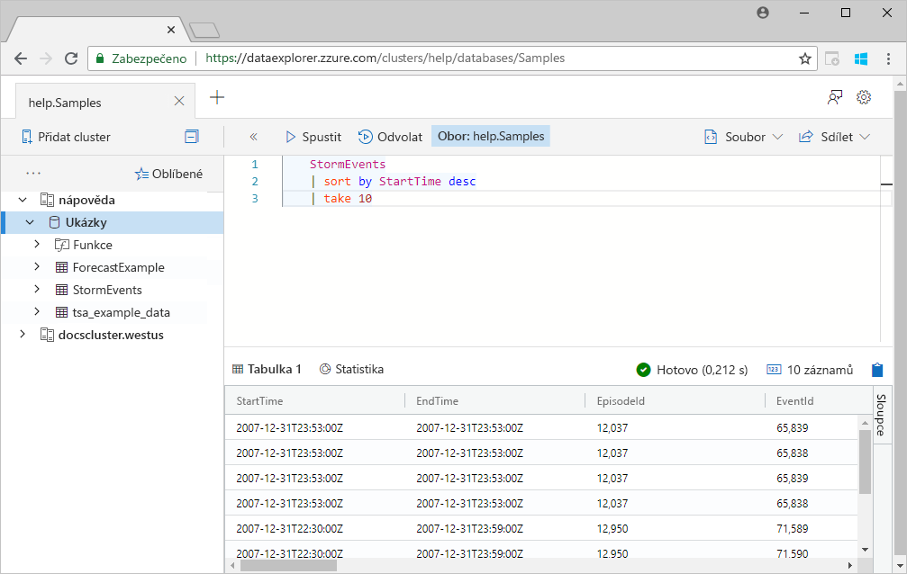

1. Zkopírujte následující dotaz a vložte ho do okna dotazu pod první dotaz. Všimněte si, že není naformátovaný na samostatných řádcích jako první dotaz.

    ```Kusto
    StormEvents | sort by StartTime desc | project StartTime, EndTime, State, EventType, DamageProperty, EpisodeNarrative | take 10
    ```

1. Klikněte na nový dotaz v okně, čímž dotaz vyberete. Stisknutím kombinace kláves Shift+Alt+F dotaz naformátujte, aby vypadal následovně.

    

1. Stiskněte klávesy Shift+Enter, což je klávesová zkratka pro spuštění dotazu.

   Tento dotaz vrátí stejné záznamy jako první dotaz, ale obsahuje jenom sloupce zadané v příkazu `project`. Výsledek by měl vypadat tak, jak je vidět v následující tabulce.

    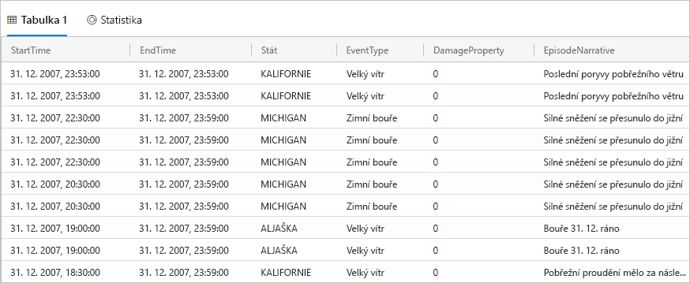

1. V horní části okna dotazu vyberte **Svolat**.

    V okně dotazu se teď zobrazí sada výsledků dotazu z prvního dotazu bez nutnosti spouštět dotaz znovu. Během analýzy často spustíte více dotazů a možnost **Svolat** vám umožní se vrátit k výsledkům z předchozích dotazů.

1. Pojďme spustit ještě jeden další dotaz a podívat se na jiný typ výstupu.

    ```Kusto
    StormEvents
    | summarize event_count=count(), mid = avg(BeginLat) by State
    | sort by mid
    | where event_count > 1800
    | project State, event_count
    | render columnchart
    ```
    Výsledek by měl vypadat tak, jak je vidět na následujícím grafu.

    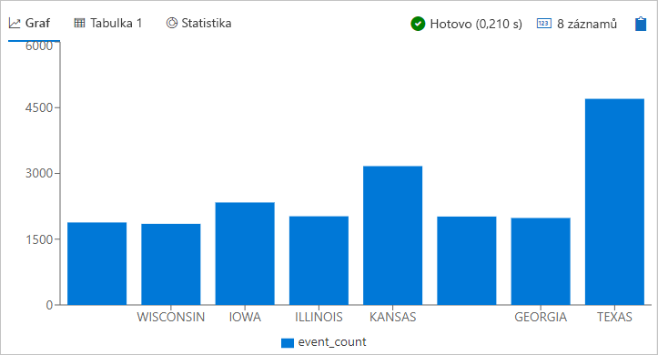

## <a name="work-with-the-table-grid"></a>Práce s mřížkou tabulky

Už víte, jak fungují základní dotazy. Teď se pojďme podívat na to, jak si pomocí mřížky tabulky výsledky upravit a provést hlubší analýzu.

1. Spusťte znovu první dotaz. Přejděte myší na sloupec **State** (Stát), vyberte nabídku a pak vyberte **Group by State** (Seskupit podle státu).

    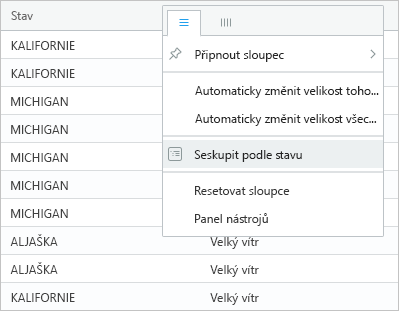

1. V mřížce si rozbalením možnosti **California** (Kalifornie) zobrazte záznamy pro tento stát.

    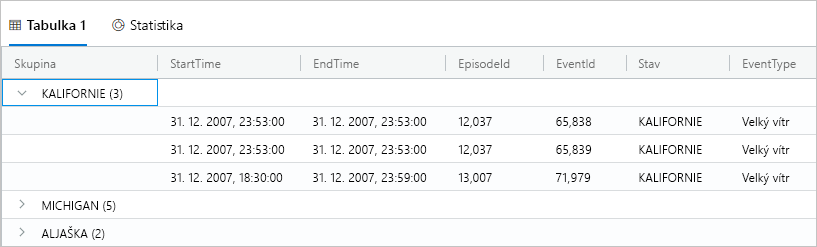

    Tento typ seskupení může být užitečný při provádění zjišťovací analýzy.

1. Přejděte myší na sloupec **Group** (Seskupit) a potom vyberte **Reset columns** (Resetovat sloupce).

    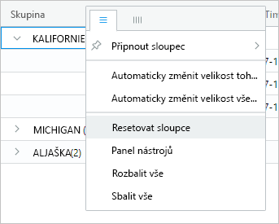

    Tím se mřížka vrátí do původního stavu.

1. Spusťte následující dotaz.

    ```Kutso
    StormEvents
    | sort by StartTime desc
    | where DamageProperty > 5000
    | project StartTime, State, EventType, DamageProperty, Source
    | take 10
    ```

1. Výběrem možnosti **Columns** (Sloupce) na pravé straně mřížky zobrazíte panel nástrojů.

    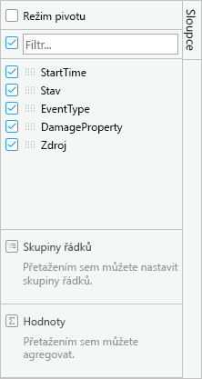

    Tento panel funguje podobně jako seznam polí kontingenční tabulky v Excelu, protože vám přímo v mřížce umožňuje provádět další analýzu.

1. Zaškrtněte políčko **Režim pivotu** a potom přetáhněte sloupce následovně: **State** do části **Row groups** (Skupiny řádků); **DamageProperty** do části **Values** (Hodnoty) a **EventType** do části **Column labels** (Popisky sloupců).  

    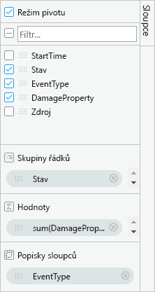

    Výsledek by měl vypadat tak, jak je vidět v následující kontingenční tabulce.

    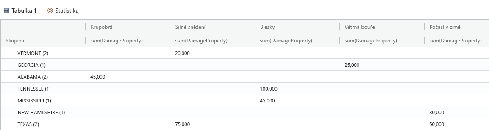

    Všimněte si, že Vermont i Alabama mají dvě události v rámci stejné kategorie, zatímco Texas má dvě události v různých kategoriích. Právě takové věci vám kontingenční tabulky umožňují rychle odhalit a jsou tak skvělým nástrojem pro rychlou analýzu.

## <a name="share-queries"></a>Sdílení dotazů

V řadě případů budete chtít dotazy, které vytvoříte, nasdílet ostatním. Můžete jim poskytnout přímý odkaz, aby mohli uživatelé s přístupem ke clusteru spouštět dotazy.

1. V okně dotazu vyberte první dotaz, který jste zkopírovali.

1. V horní části okna dotazu vyberte **Share** (Sdílet).

1. Vyberte **Link, query to clipboard** (Odkaz, dotaz do schránky).

1. Zkopírujte odkaz a dotaz do textového souboru.

1. Vložte odkaz do nového okna prohlížeče. Výsledek by měl po spuštění dotazu vypadat následovně.

    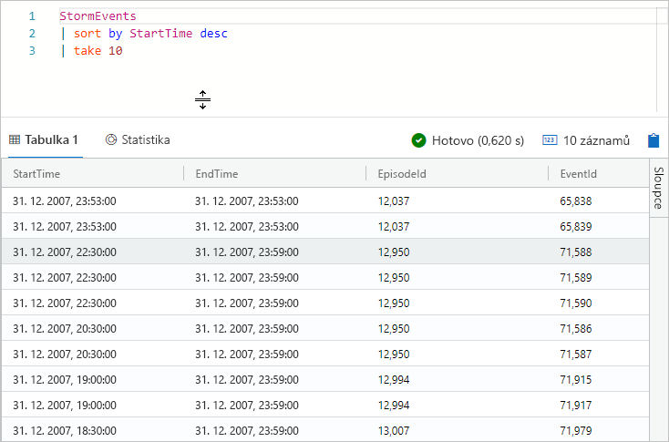

## <a name="provide-feedback"></a>Poskytnutí zpětné vazby

Data Explorer je aktuálně ve verzi Preview a uvítáme jakékoli názory a připomínky uživatelů. Svůj názor nám můžete poslat hned nebo nebo až později, až se s Data Explorerem trochu lépe seznámíte.

1. V pravém horním rohu aplikace vyberte ikonu pro odeslání názoru: .

1. Zadejte svůj názor a pak vyberte **Submit** (Odeslat).

## <a name="clean-up-resources"></a>Vyčištění prostředků

V tomto rychlém startu jste nevytvořili žádné prostředky, ale pokud byste chtěli z aplikace odebrat jeden nebo oba clustery, klikněte na cluster pravým tlačítkem myši a vyberte **Odebrat připojení**.

## <a name="next-steps"></a>Další kroky

> [!div class="nextstepaction"]
> [Psaní dotazů pro Azure Data Explorer](write-queries.md)