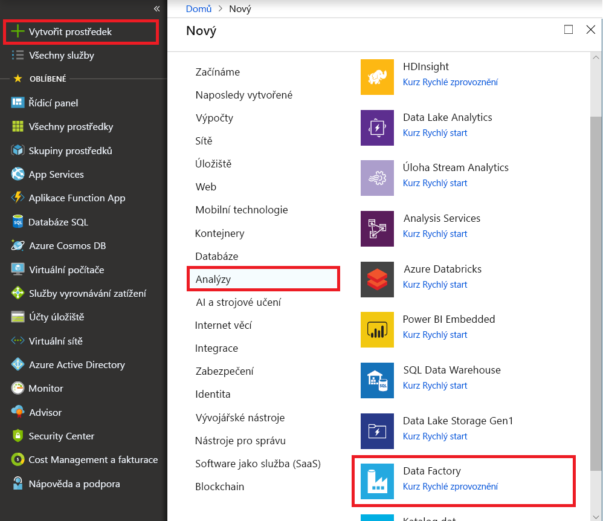

# Načtení dat do Azure Data Lake Storage Gen1 pomocí Azure Data Factory

[!INCLUDE[appliesto-adf-xxx-md](includes/appliesto-adf-xxx-md.md)]

[Azure Data Lake Storage Gen1](../data-lake-store/data-lake-store-overview.md) (dříve označované jako Azure Data Lake Store) je úložiště škálovatelné v podnikové síti pro analytické úlohy s velkými objemy dat. Data Lake Storage Gen1 umožňuje zaznamenávat data libovolné velikosti, typu a rychlosti přijímání. Data jsou zachycena na jednom místě pro provozní a průzkumné analýzy.

Azure Data Factory je plně spravovaná cloudová služba pro integraci dat. Službu můžete použít k naplnění dat ze stávajícího systému na data a ušetřit čas při vytváření analytických řešení.

Azure Data Factory nabízí následující výhody pro načítání dat do Data Lake Storage Gen1:

* **Snadné nastavení** : intuitivní průvodce 5 kroky bez nutnosti skriptování.
* **Bohatá Podpora úložiště dat** : Integrovaná podpora pro bohatou sadu místních a cloudových úložišť dat. Podrobný seznam najdete v tabulce [podporovaných úložišť dat](copy-activity-overview.md#supported-data-stores-and-formats).
* **Zabezpečení a dodržování předpisů** : data se přenáší přes protokol HTTPS nebo ExpressRoute. Přítomnost globální služby zajišťuje, že vaše data nikdy neopustí zeměpisnou hranici.
* **Vysoký výkon** : rychlost načítání dat až 1 GB/s do data Lake Storage Gen1. Podrobnosti najdete v tématu o [výkonu aktivity kopírování](copy-activity-performance.md).

V tomto článku se dozvíte, jak pomocí nástroje Data Factory Kopírování dat _načíst data ze služby Amazon S3 do data Lake Storage Gen1_ . Můžete postupovat podle podobných kroků a kopírovat data z jiných typů úložišť dat.

> [!NOTE]
> Další informace najdete v tématu [kopírování dat do nebo z Data Lake Storage Gen1 pomocí Azure Data Factory](connector-azure-data-lake-store.md).

## Předpoklady

* Předplatné Azure: Pokud ještě nemáte předplatné Azure, vytvořte si [bezplatný účet](https://azure.microsoft.com/free/) před tím, než začnete.
* Účet Data Lake Storage Gen1: Pokud nemáte účet Data Lake Storage Gen1, přečtěte si pokyny v tématu [Vytvoření účtu Data Lake Storage Gen1](../data-lake-store/data-lake-store-get-started-portal.md#create-a-data-lake-storage-gen1-account).
* Amazon S3: v tomto článku se dozvíte, jak kopírovat data z Amazon S3. Pomocí podobných kroků můžete použít další úložiště dat.

## Vytvoření datové továrny

1. V nabídce vlevo vyberte **vytvořit**  >  **Analytics**  >  **Data Factory** analýzy prostředků:
   
   

2. Na stránce **Nová datová továrna** zadejte hodnoty pro pole, která jsou zobrazena na následujícím obrázku: 
      
   
 
    * **Název** : zadejte globálně jedinečný název pro objekt pro vytváření dat Azure. Pokud se zobrazí chyba "název objektu pro vytváření dat \" LoadADLSG1Demo \" není k dispozici", zadejte jiný název pro datovou továrnu. Můžete například použít název _**Your**_**ADFTutorialDataFactory** . Zkuste vytvořit datovou továrnu znovu. Pravidla pojmenování artefaktů služby Data Factory najdete v tématu [Data Factory – pravidla pojmenování](naming-rules.md).
    * **Předplatné** : vyberte předplatné Azure, ve kterém chcete vytvořit datovou továrnu. 
    * **Skupina prostředků** : v rozevíracím seznamu vyberte existující skupinu prostředků nebo vyberte možnost **vytvořit novou** a zadejte název skupiny prostředků. Informace o skupinách prostředků najdete v článku [Použití skupin prostředků ke správě prostředků Azure](../azure-resource-manager/management/overview.md).  
    * **Verze** : Vyberte **V2** .
    * **Umístění** : vyberte umístění pro datovou továrnu. V rozevíracím seznamu se zobrazí pouze podporovaná umístění. Úložiště dat, která služba Data Factory používá, můžou být v jiných umístěních a oblastech. Mezi Tato úložiště dat patří Azure Data Lake Storage Gen1, Azure Storage, Azure SQL Database a tak dále.

3. Vyberte **Vytvořit** .
4. Až se vytváření dokončí, přejdete do vaší datové továrny. Zobrazí se Domovská stránka **Data Factory** , jak je znázorněno na následujícím obrázku: 
   
   

   Výběrem dlaždice **Author & Monitor** (Vytvořit a monitorovat) otevřete na samostatné kartě aplikaci pro integraci dat.

## Načíst data do Data Lake Storage Gen1

1. Na stránce **Začínáme** vyberte dlaždici **kopírování dat** pro spuštění nástroje kopírování dat: 

   
2. Na stránce **vlastnosti** zadejte **CopyFromAmazonS3ToADLS** pro pole **název úlohy** a vyberte **Další** :

    
3. Na stránce **zdrojové úložiště dat** klikněte na **+ vytvořit nové připojení** :

    
    
    Vyberte **Amazon S3** a vyberte **pokračovat** .
    
    
    
4. Na stránce **zadání připojení k Amazon S3** proveďte následující kroky: 
   1. Zadejte hodnotu **ID přístupového klíče** .
   2. Zadejte hodnotu **tajného přístupového klíče** .
   3. Vyberte **Dokončit** .
   
      
   
   4. Zobrazí se nové připojení. Vyberte **Další** .
   
   
   
5. Na stránce pro **volbu vstupního souboru nebo složky** přejděte ke složce a souboru, který chcete zkopírovat. Vyberte složku nebo soubor, vyberte **zvolit** a pak vybrat **Další** :

    

6. Zvolte chování kopírování, a to tak, že vyberete možnosti **Kopírovat soubory rekurzivně** a **binární kopírování** (kopírování souborů jako je). Vyberte **Další** :

    
    
7. Na stránce **cílové úložiště dat** klikněte na **+ vytvořit nové připojení** a pak vyberte **Azure Data Lake Storage Gen1** a **pokračovat** :

    

8. Na stránce **Nová propojená služba (Azure Data Lake Storage Gen1)** proveďte následující kroky: 

   1. Jako **název účtu Data Lake Store** vyberte svůj účet Data Lake Storage Gen1.
   2. Zadejte **tenanta** a vyberte Dokončit.
   3. Vyberte **Další** .
   
   > [!IMPORTANT]
   > V tomto návodu použijete spravovanou identitu pro prostředky Azure k ověření účtu Data Lake Storage Gen1. Nezapomeňte mu udělit správná oprávnění v Data Lake Storage Gen1 pomocí následujících [pokynů](connector-azure-data-lake-store.md#managed-identity).
   
   
9. Na stránce **zvolte výstupní soubor nebo složku** zadejte **copyfroms3** jako název výstupní složky a vyberte **Další** : 

    

10. Na stránce **Nastavení** vyberte **Další** :

    
11. Na stránce **Souhrn** zkontrolujte nastavení a vyberte **Další** :

    
12. Na **stránce nasazení** vyberte **monitorovat** a Sledujte kanál (úkol):

    
13. Všimněte si, že je vlevo automaticky vybraná karta **Monitorování** . Sloupec **Actions (akce** ) obsahuje odkazy na zobrazení podrobností o spuštění aktivit a opětovné spuštění kanálu:

    
14. Pokud chcete zobrazit spuštění aktivit související se spuštěním kanálu, vyberte odkaz **Zobrazit spuštění aktivit** ve sloupci **Akce** . Kanál obsahuje pouze jednu aktivitu (aktivita kopírování), takže se zobrazí pouze jedna položka. Pokud chcete přejít zpátky k zobrazení spuštění kanálu, vyberte odkaz **kanály** v horní části. Seznam můžete aktualizovat kliknutím na **Aktualizovat** . 

    

15. Chcete-li monitorovat podrobnosti o spuštění každé aktivity kopírování, vyberte odkaz **Podrobnosti** v části **Akce** v zobrazení monitorování aktivit. Můžete monitorovat podrobnosti, jako je objem dat zkopírovaných ze zdroje, do jímky, propustnosti dat, kroky provádění s odpovídající dobou trvání a používané konfigurace:

    

16. Ověřte, že se data zkopírují do účtu Data Lake Storage Gen1: 

    

## Další kroky

V následujícím článku se dozvíte o podpoře Data Lake Storage Gen1: 

> [!div class="nextstepaction"]
>[Konektor Azure Data Lake Storage Gen1](connector-azure-data-lake-store.md)
