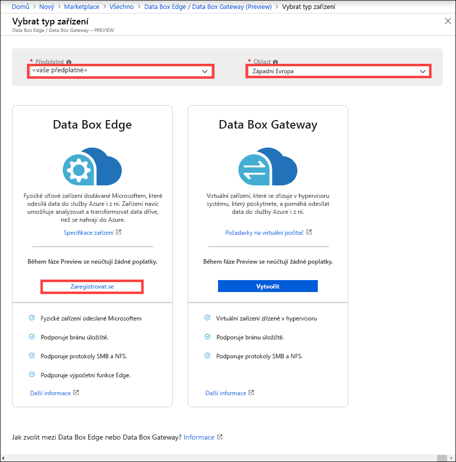
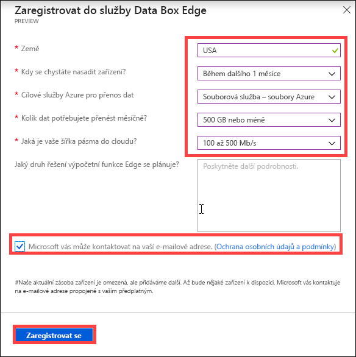

# Co je Azure Data Box Edge (Preview)? 

Azure Data Box Edge je řešení úložiště, které umožňuje zpracovat data a odeslat je přes síť do Azure. Tento článek poskytuje přehled řešení Data Box Edge, jeho výhody, klíčové funkce a scénáře, ve kterých můžete toto zařízení nasadit. 

K urychlení bezpečného přenosu dat používá Data Box Edge fyzické zařízení dodané Microsoftem. Fyzické zařízení se nachází ve vašich prostorách a data na něj zapisujete pomocí protokolů NFS a SMB. 

Data Box Edge má všechny funkce zařízení Data Box Gateway. Zařízení Data Box je navíc vybavené hraničními výpočetními prostředky s podporou AI, které pomáhají analyzovat, zpracovávat a filtrovat data při přesunu do objektů blob bloku nebo objektů blob stránky Azure, případně do souborů Azure.  

> [!IMPORTANT]
> - Data Box Edge je ve verzi Preview. [Zaregistrujte si](#sign-up) tuto službu.
> - Před nasazením tohoto řešení si přečtěte [podmínky použití verze Preview](https://azure.microsoft.com/support/legal/preview-supplemental-terms/).

## Případy použití

Azure Data Box Edge je zařízení s hraničními výpočetními funkcemi s podporou AI, které má funkce pro síťový přenos dat. Zde je několik různých scénářů, ve kterých je vhodné k přenosu dat použít Data Box Edge.

- **Předzpracování dat** – umožňuje analyzovat data z místních zařízení nebo zařízení IoT, abyste rychle získali výsledek, i když jste v blízkosti místa, kde se data generují. Data Box Edge přenese úplnou sadu dat do cloudu, aby bylo možné provést rozšířené zpracování nebo podrobnější analýzy.  Předzpracování lze použít k těmto účelům: 

    - Agregace dat
    - Změna dat, například odebrání osobních údajů
    - Vytvoření podmnožin dat potřebných pro podrobnější analýzu v cloudu a jejich přenos
    - Analýza a reakce na události IoT 

- **Odvození Azure Machine Learning** – pomocí Data Box Edge můžete spouštět modely Machine Learning (ML), abyste rychle získali výsledky, u kterých můžete provést akce dříve, než se data odešlou do cloudu. Přenáší se úplná sada dat, abyste mohli pokračovat v trénování a vylepšování modelů ML.

- **Přenos dat do Azure přes síť** – Data Box Edge umožňuje snadno a rychle přenášet data do Azure, aby bylo možné provádět další výpočetní operace a analýzy pro účely archivace. 

## Výhody

Data Box Edge má následující výhody:

- **Snadný přenos dat** – přenos dat do a z úložiště Azure je stejně snadný jako práce s místní sdílenou síťovou složkou.  
- **Vysoký výkon** – umožňuje vysoce výkonné přenosy dat do a z Azure. 
- **Rychlý přístup** – poslední soubory ukládá do mezipaměti z důvodu rychlého přístupu k místním souborům.  
- **Využití omezené šířky pásma** – data lze zapisovat do Azure, i když je síť omezena, aby se snížilo využití během frekventované pracovní doby.  
- **Transformace dat** – umožňuje analýzu, zpracování a filtrování dat při přesunu do Azure.

## Klíčové funkce

Data Box Edge nabízí následující funkce:

|Schopnost |Popis  |
|---------|---------|
|Vysoký výkon     | Plně automatizovaný a vysoce optimalizovaný přenos dat a šířka pásma.|
|Podporované protokoly     | Podpora standardních protokolů SMB a NFS pro příjem dat.   Další informace o podporovaných verzích najdete v [systémových požadavcích pro Data Box Edge](https://aka.ms/dbe-docs).|
|Výpočetní operace       |Umožňuje analýzu, zpracování a filtrování dat.|
|Přístup k datům     | Přímý přístup k datům z rozšíření Azure Storage Blob a ze souborů Azure pomocí cloudových rozhraní API za účelem dalšího zpracování dat v cloudu.|
|Rychlý přístup     | Místní mezipaměť na zařízení pro rychlý přístup k naposledy použitým souborům.|
|Nahrání offline     | Odpojený režim podporuje scénáře nahrání v režimu offline.|
|Aktualizace dat     | Možnost aktualizovat místní soubory pomocí nejnovějších souborů z cloudu.|
|Šifrování    | BitLocker podporuje místní šifrování dat a bezpečný přenos dat do cloudu přes protokol *https*.       |
|Odolnost     | Integrovaná odolnost sítě.        |

## Funkce a specifikace

Fyzické zařízení Data Box Edge má následující funkce:

| Funkce/specifikace                                          | Popis              |
|---------------------------------------------------------|--------------------------|
| Dimenze   | Šířka: 43,8 cm, délka: 69,2 cm, výška: 4,5 cm (bez oušek a úchytů PSU)  |            
| Místo v racku|1U při umístění v racku|
| Kabely| 2× napájecí kabel 2× kabely RJ45 1 GB/s 2× měděný kabel SFP 10 GB/s|
| Komponenty|2 integrované jednotky PSU (Power Supply Unit)|
| Procesor|2 procesory Intel Xeon, každý s 10 jádry  |
| Memory (Paměť)| 64 GB RAM|
| Disky| 8 disků SSD NVMe, každý o kapacitě 1,6 TB   Pokud selže jeden z disků SSD NVMe, selže celý systém. |
| Kapacita místního úložiště| Celková kapacita 12,8 TB|
| Síťová rozhraní| 2× rozhraní 1 GbE, z nichž jedno slouží pro správu, uživatelé ho nemohou konfigurovat a používá se pro počáteční instalaci. Druhé datové rozhraní je konfigurovatelné a standardně je DHCP.  2× rozhraní 25 GbE – mohou fungovat také jako rozhraní 10 GbE. Tato datová rozhraní mohou uživatelé konfigurovat jako DHCP (výchozí) nebo statická.   2× rozhraní 25 GbE – tato datová rozhraní mohou uživatelé konfigurovat jako DHCP (výchozí) nebo statická.|

## Komponenty

Řešení Data Box Edge sestává z prostředku Data Box Edge, fyzického zařízení Data Box Edge a místního webového uživatelského rozhraní.

* **Fyzické zařízení Data Box Edge** – server 1U namontovaný Microsoftem do racku, který lze nakonfigurovat na odeslání dat do Azure. 
    
* **Prostředek Data Box Edge** – prostředek na webu Azure Portal, který vám umožní spravovat zařízení Data Box Edge z webového rozhraní, ke kterému můžete získat přístup z různých geografických umístění. Prostředek Data Box Edge slouží k vytvoření a správě prostředků, zobrazení, správě zařízení a výstrah a ke správě sdílených složek.  

    <!---->

    Další informace najdete v dokumentu, který se zabývá [použitím služby Data Box Edge ke správě zařízení Data Box Edge](https://aka.ms/dbe-docs).

* **Místní webové uživatelské rozhraní Data Box** – můžete ho použít ke spuštění diagnostiky, vypnutí nebo restartování zařízení Data Box Edge, zobrazení protokolů kopírování a kontaktování podpory Microsoftu, aby vytvořila žádost o služby.

    <!---->

    Informace o používání uživatelského rozhraní založeného na webu najdete v tématu [Použití uživatelského rozhraní založeného na webu ke správě vašeho zařízení Data Box](https://aka.ms/dbe-docs).

## Dostupnost v oblastech

Fyzické zařízení Data Box Edge, prostředek Azure a účet cílového úložiště, do kterého přenášíte data, se nemusí nacházet ve stejné oblasti.

- **Dostupnost prostředku** – u této vydané verze je prostředek Data Box Edge dostupný v následujících oblastech:
    - **Spojené státy americké** – Západní USA 2 a Východní USA
    - **Evropská unie** – Západní Evropa
    - **Asie a Tichomoří** – Jihovýchodní Asie

- **Cílové účty úložiště** – účty úložiště, do kterých se ukládají data, jsou dostupné ve všech oblastech Azure. 

    Oblasti, do kterých účty úložiště ukládají data služby Data Box, by se měly nacházet v blízkosti umístění zařízení, aby byl zajištěn optimální výkon. Účet úložiště umístěný daleko od zařízení bude vykazovat dlouhé latence a nižší výkon. 

## Registrace

Služba Data Box Edge je ve verzi Preview a musíte se k ní zaregistrovat. Data Box Gateway si zaregistrujete následujícím způsobem:

1. Přihlaste se k portálu Azure Portal na adrese: [https://aka.ms/databox-edge](https://aka.ms/databox-edge).

2. Vyberte předplatné, které chcete použít pro Data Box Edge ve verzi Preview. Vyberte oblast, ve které chcete prostředek Data Box Edge nasadit. U možnosti Data Box Edge klikněte na **Zaregistrovat se**.

    

3.  Odpovězte na otázky týkající země trvalého umístění dat, časového rámce, cílové služby Azure pro přenos dat, šířky pásma sítě a frekvence přenosu dat. Projděte si **ochranu osobních údajů a podmínky** a zaškrtněte políčko, že **Microsoft může použít vaši e-mailovou adresu, aby vás kontaktoval**.

    

4. Po registraci a povolení verze Preview si můžete objednat službu Data Box Edge.

## Další kroky

- Přečtěte si [systémové požadavky služby Data Box Edge](https://aka.ms/dbe-docs).
- Seznamte se s [omezeními služby Data Box Edge](https://aka.ms/dbe-docs).
- Rychle nasaďte [Azure Data Box Edge](https://aka.ms/dbe-docs) na webu Azure Portal.

