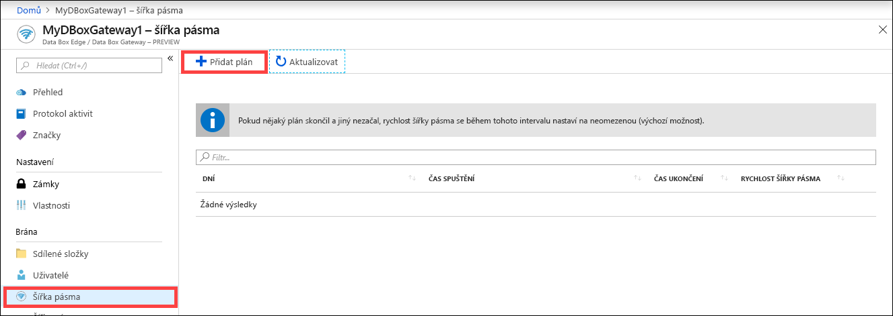
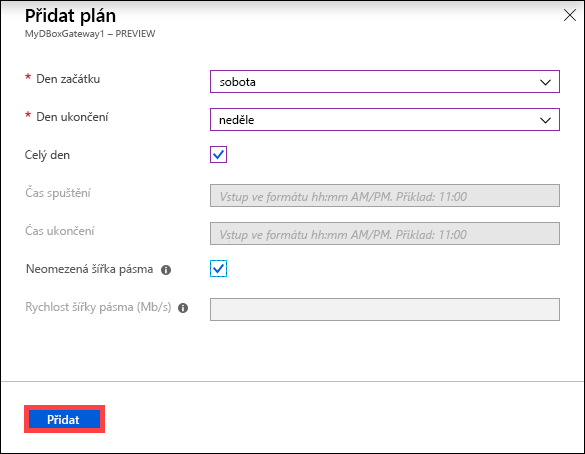
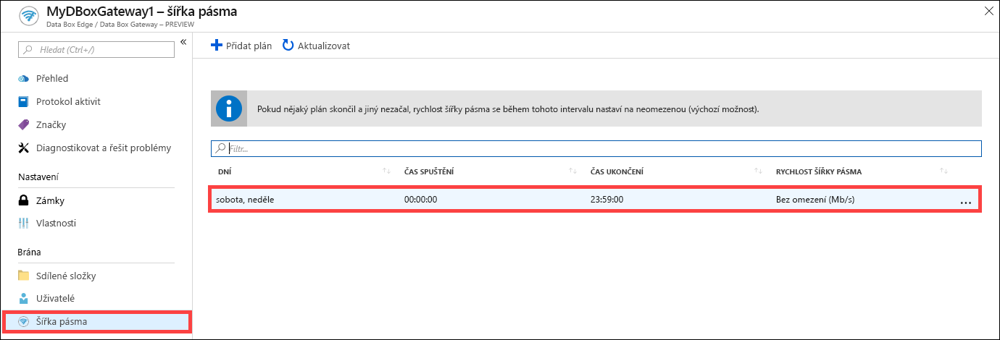
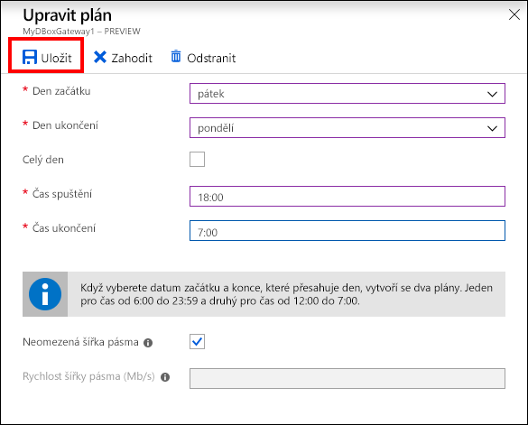
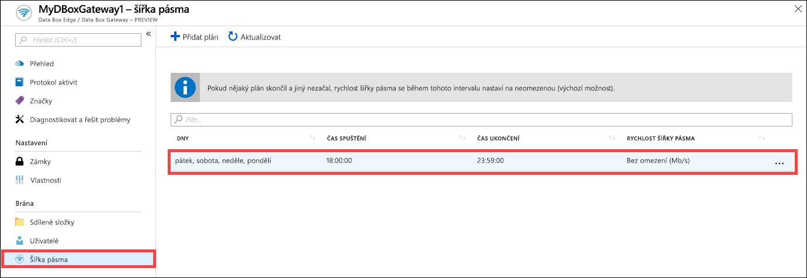
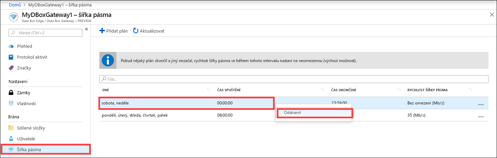

# Web Azure Portal můžete použít ke správě plánů služby Bandwidth ve službě Azure Data Box Gateway  

Tento článek popisuje postup správy uživatelů ve službě Azure Data Box Gateway. Plány služby Bandwidth vám umožňují nakonfigurovat využití šířky pásma sítě pro více denních plánů. Tyto plány lze použít k operacím nahrávání a stahování ze zařízení do cloudu a naopak. 

Prostřednictvím webu Azure Portal můžete přidávat, upravovat nebo odstraňovat plány služby Bandwidth pro vaši službu Data Box Gateway.

> [!IMPORTANT]
> - Data Box Gateway je ve verzi Preview. Před objednáním a nasazením tohoto řešení si přečtěte [podmínky užívání pro předběžné verze systému Azure](https://azure.microsoft.com/support/legal/preview-supplemental-terms/).

V tomto článku získáte informace o těchto tématech:

> [!div class="checklist"]
> * Přidání plánu
> * Úprava plánu
> * Odstranění plánu 

## Přidání plánu

Pokud chcete přidat uživatele, proveďte na webu Azure Portal následující kroky.

1. Na webu Azure Portal pro váš prostředek služby Data Box Gateway přejděte na **Bandwidth**.
2. V pravém podokně klikněte na tlačítko **+ Přidat plán**.

    

3. V části **Přidání plánu**: 

    1. Zadejte **den spuštění**, **den ukončení**, **čas spuštění** a **čas ukončení** plánu. 
    2. Pokud tento plán běží celý den, můžete zaškrtnout možnost **Celý den**. 
    3. **Rychlost šířky pásma** je šířka pásma v megabitech za sekundu (Mb/s), používaná vašim zařízením při operacích zahrnujících cloud (nahrávání i stahování). Do tohoto pole zadejte číslo od 1 do 1 000. 
    4. Pokud nechcete omezit nahrávání a stahování dat, zaškrtněte možnost **Neomezená šířka pásma**. 
    5. Klikněte na tlačítko **Add** (Přidat).

    

3. Vytvoří se plán se zadanými parametry. Tento plán se následně zobrazí v seznamu plánů služby Bandwidth na portálu.

## Úprava plánu

Chcete-li upravit plán služby Bandwidth, postupujte následovně. 

1. Na webu Azure Portal přejděte k prostředku služby Data Box Gateway a pak přejděte na Bandwidth. 
2. V seznamu plánů služby Bandwidth vyberte a klikněte na plán, který chcete upravit.
    

3. Proveďte požadované změny a uložte je.

    

4. Po úpravě plánu se seznam plánů aktualizuje tak, aby odrážel změněný plán.

    

## Odstranění plánu

Chcete-li odstranit plán služby Bandwidth spojený s vaším zařízením služby Data Box Gateway, postupujte následovně.

1. Na webu Azure Portal přejděte k prostředku služby Data Box Gateway a pak přejděte na **Bandwidth**.  

2. V seznamu plánů služby Bandwidth vyberte a klikněte na plán, který chcete odstranit. Kliknutím pravým tlačítkem si zobrazte kontextovou nabídku a klikněte na **Odstranit**. 

   

3.  Po odstranění plánu se aktualizuje seznam plánů.

## Další kroky

- Další informace o [správě šířky pásma](data-box-gateway-manage-bandwidth-schedules.md).
