# Použití webu Azure Portal ke správě sdílených složek ve službě Azure Data Box Gateway 

Tento článek popisuje postup správy sdílených složek ve službě Azure Data Box Gateway. Azure Data Box Gateway můžete spravovat přes web Azure Portal nebo v místním webovém uživatelském rozhraní. Použijte web Azure Portal k přidání, odstranění a aktualizaci sdílených složek nebo k synchronizaci klíče úložiště pro účet úložiště, který ke sdíleným složkám přidružený.

> [!IMPORTANT]
> - Data Box Gateway je ve verzi Preview. Před objednáním a nasazením tohoto řešení si přečtěte [podmínky užívání pro předběžné verze systému Azure](https://azure.microsoft.com/support/legal/preview-supplemental-terms/).

## Informace o sdílených složkách

Pokud chcete přenášet data do Azure, potřebujete ve službě Azure Data Box Gateway vytvořit sdílené složky. Sdílené složky, které přidáte do zařízení Data Box Gateay, jsou cloudové sdílené složky. Data z těchto sdílených složek se automaticky nahrávají do cloudu. Na tyto sdílené složky se vztahují všechny funkce cloudu, například aktualizace a synchronizovat klíče úložiště. Cloudové sdílené složky použijte, když chcete data ze zařízení automaticky nasdílet s účtem úložiště v cloudu.

V tomto článku získáte informace o těchto tématech:

> [!div class="checklist"]
> * Přidání sdílené složky
> * Odstranění sdílené složky
> * Aktualizace sdílených složek
> * Synchronizace klíče úložiště

## Přidání sdílené složky

Pokud chcete sdílenou složku vytvořit, proveďte na webu Azure Portal následující kroky.

1. Na webu Azure Portal přejděte k prostředku Data Box Gateway a pak přejděte na **Přehled**. Na panelu příkazů klikněte na **+ Přidat sdílenou složku**.
2. V části **Přidat sdílenou složku** zadejte nastavení sdílené složky. Zadejte jedinečný název sdílené složky.

    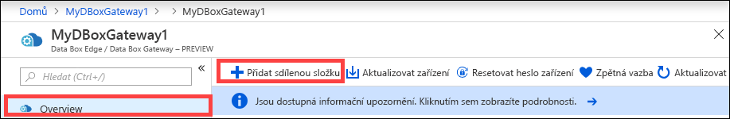

    Názvy sdílených složek můžou obsahovat pouze číslice, malá písmena a spojovníky. Název sdílené složky musí mít délku 3 až 63 znaků a začínat písmenem nebo číslicí. Před i za každým spojovníkem musí být jiný znak než spojovník.

3. Vyberte **Typ** sdílené složky. Typ může být **SMB** nebo **NFS**, přičemž výchozí typ je SMB. Protokol SMB je standardem pro klienty Windows a systém souborů NFS se používá pro klienty Linuxu. V závislosti na tom, jestli vyberete sdílené složky SMB nebo systému souborů NFS, se budou mírně lišit zobrazené možnosti.

4. Je nutné zadat **účet úložiště**, ve kterém se bude sdílená složka nacházet. V účtu úložiště se vytvoří kontejner s názvem sdílené složky, pokud ještě neexistuje. Pokud už kontejner existuje, použije se existující kontejner.

5. V části **Služba úložiště** zvolte Objekt blob bloku, Objekt blob stránky nebo Soubory. Zvolený typ služby závisí na tom, v jakém formátu chcete ukládat data v Azure. V tomto případě chceme, aby se ukládala jako objekty blob bloku v Azure, proto vybereme **Objekt blob bloku**. Pokud zvolíte **Objekt blob stránky**, je nutné zajistit, aby vaše data byla zarovnaná na 512 bajtů. Formát VHDX je například vždy zarovnaný na 512 bajtů.

6. Postup v tomto kroku závisí na tom, jestli vytváříte sdílenou složku SMB nebo systému souborů NFS.
    - **Pokud vytváříte sdílenou složku SMB** – v poli **Místní uživatel se všemi oprávněními** zvolte **Vytvořit nový** nebo **Použít existující**. Pokud vytváříte nového místního uživatele, zadejte **uživatelské jméno**, **heslo** a pak potvrďte heslo. Tím se místnímu uživateli přiřadí oprávnění. Jakmile tady přiřadíte oprávnění, můžete pak tato oprávnění upravit pomocí Průzkumníka souborů.

        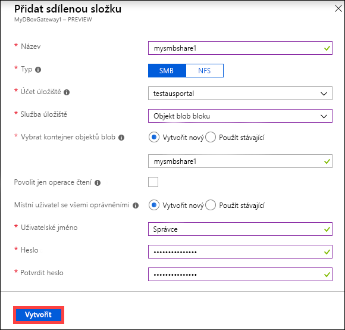

        Pokud pro data této sdílené složky zaškrtnete možnost Povolit jen operace čtení, můžete určit uživatele jen pro čtení.
    - **Pokud vytváříte sdílenou složku systému souborů NFS** – je nutné zadat **IP adresy klientů s povoleným přístupem** ke sdílené složce.

        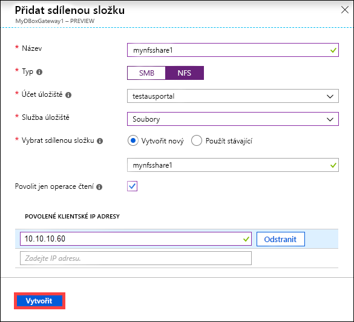

7. Kliknutím na **Vytvořit** vytvořte sdílenou složku. Zobrazí se oznámení o probíhajícím vytváření sdílené složky. Po vytvoření sdílené složky se zadaným nastavením se okno **Sdílené složky** aktualizuje a zobrazí se v něm nová sdílená složka.
 
## Odstranění sdílené složky

Pokud chcete sdílenou složku odstranit, proveďte na webu Azure Portal následující kroky.

1. V seznamu sdílených složek vyberte a klikněte na sdílenou složku, kterou chcete odstranit.

    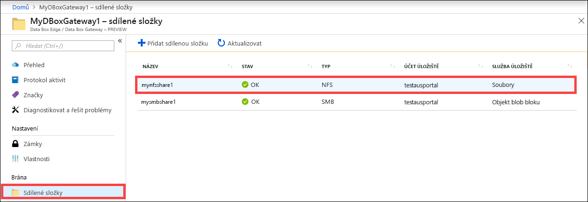

2. Klikněte na **Odstranit**. 

    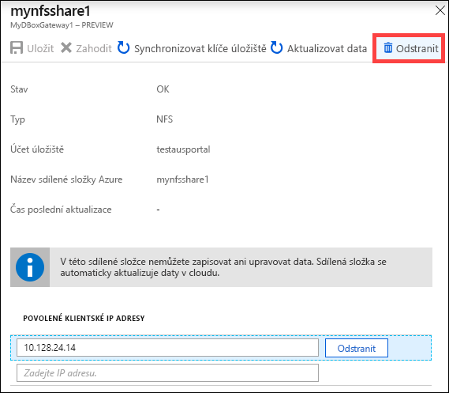

3. Po zobrazení výzvy k potvrzení klikněte na **Ano**.

    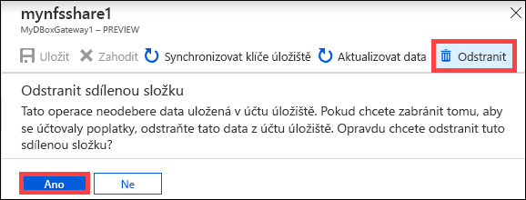

Seznam sdílených složek se aktualizuje tak, aby se v něm odstranění promítlo.

## Aktualizace sdílených složek

Funkce aktualizace umožňuje aktualizovat obsah místní sdílené složky. Když aktualizujete sdílenou složku, spustí se vyhledávání, které najde všechny objekty Azure včetně objektů blob a souborů, které byly do cloudu přidány od poslední aktualizace. Tyto další soubory se pak použijí k aktualizaci obsah místní sdílené složky na zařízení. 

Pokud chcete sdílenou složku aktualizovat, proveďte na webu Azure Portal následující kroky.

1.  Na webu Azure Portal přejděte na **Sdílené složky**. Vyberte a klikněte na sdílenou složku, kterou chcete aktualizovat.

    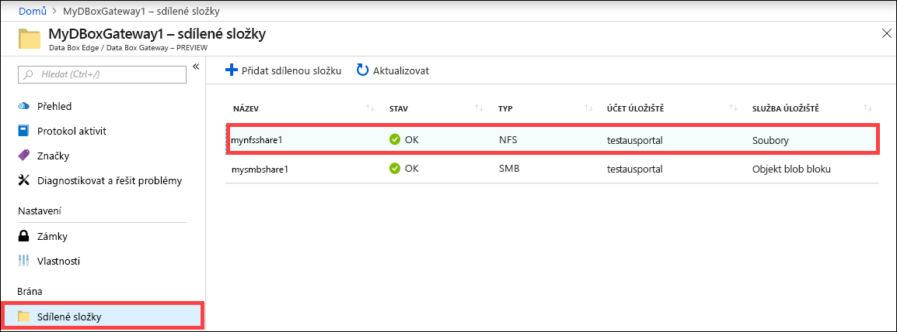

2.  Klikněte na **Aktualizovat**. 

    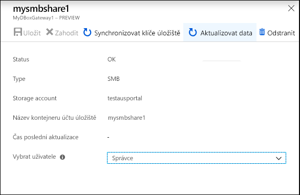
 
3.  Po zobrazení výzvy k potvrzení klikněte na **Ano**. Spustí se úloha, která zaktualizuje obsah místní sdílené složky. 

    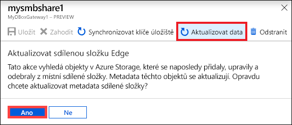
 
4.  Když aktualizace probíhá, bude možnost aktualizace v místní nabídce neaktivní. Kliknutím na oznámení úlohy zobrazte stav úlohy aktualizace.

5.  Doba aktualizace závisí na počtu souborů v kontejneru Azure a také na souborech v zařízení. Po úspěšném dokončení aktualizace se zaktualizuje časové razítko sdílené složky. Operace se považuje za úspěšnou i v případě částečně neúspěšné aktualizace a časové razítko zaktualizuje. 

    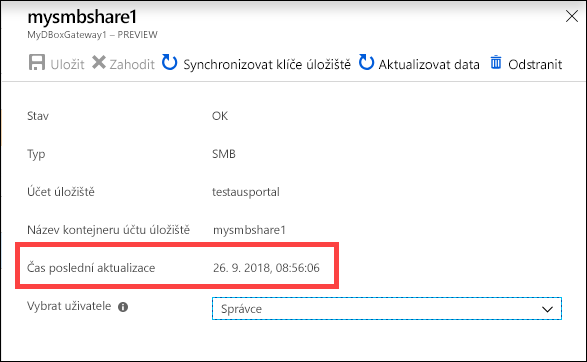
 
Pokud dojde k selhání, bude vydána výstraha. Výstraha uvede podrobnosti příčiny a doporučení k vyřešení problému. Výstraha obsahuje také odkazy na soubor s úplným souhrnem chyb, včetně souborů, které se nepovedlo aktualizovat nebo odstranit.

>[!IMPORTANT]
> V této verzi Preview neaktualizujte více než jednou sdílenou složkou najednou.

## Synchronizace klíčů úložiště

Pokud se klíče k vašemu účtu úložiště obměňovaly, bude potřeba provést synchronizaci přístupových klíčů k úložišti. Synchronizace pomáhá zařízení se získáním nejnovějších klíčů k účtu úložiště.

Pokud chcete synchronizovat přístupový klíč úložiště, proveďte na webu Azure Portal následující kroky.

1. Ve svém prostředku přejděte na **Přehled**. 
2. V seznamu sdílených složek zvolte a klikněte na sdílenou složku, která je přidružená k účtu úložiště, které potřebujete synchronizovat. Klikněte na **Synchronizovat klíč úložiště**. 

     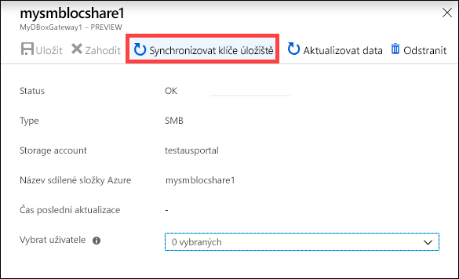

3. Po zobrazení výzvy k potvrzení klikněte na **Ano**. Po dokončení synchronizace zavřete dialogové okno.

     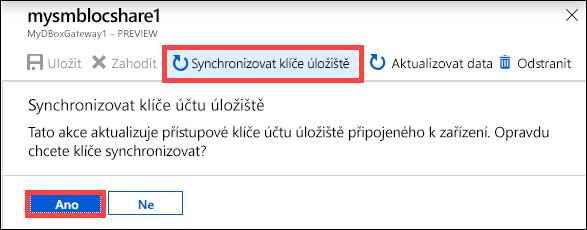

>[!NOTE]
> U každého účtu úložiště to stačí provést jednou. Není nutné tento postup opakovat u každé sdílené složky, která je přidružená ke stejnému účtu úložiště.

## Další kroky

- Přečtěte si, jak [spravovat uživatele pomocí webu Azure Portal](data-box-gateway-manage-users.md).
