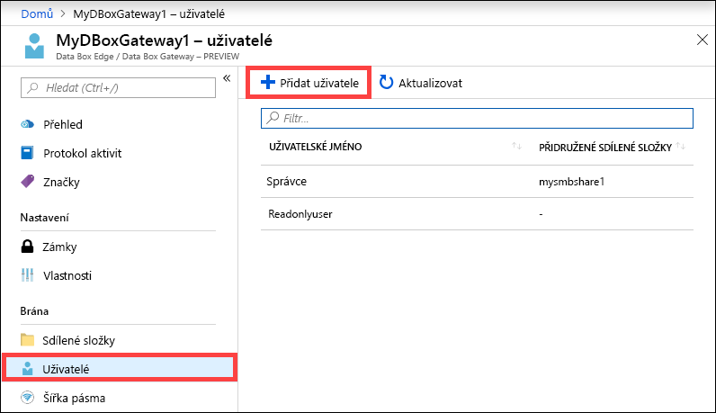
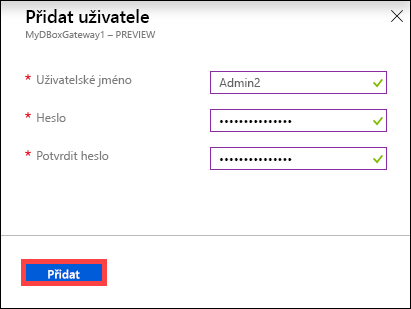
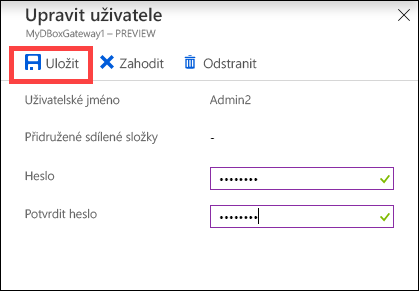
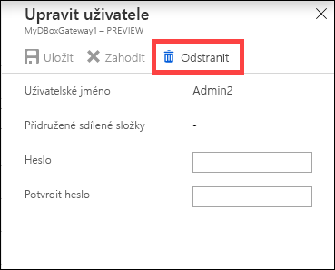
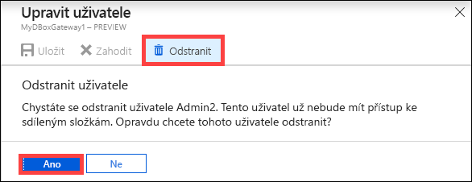
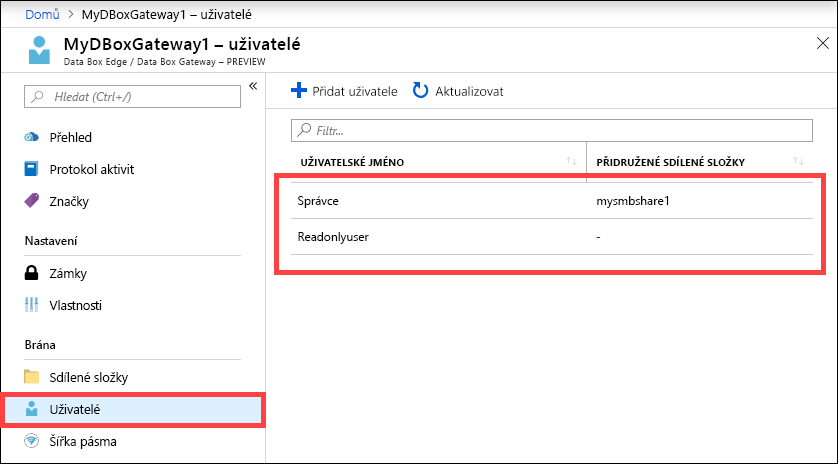

# Použití webu Azure Portal ke správě uživatelů ve službě Azure Data Box Gateway 

Tento článek popisuje postup správy uživatelů ve službě Azure Data Box Gateway. Azure Data Box Gateway můžete spravovat přes web Azure Portal nebo v místním webovém uživatelském rozhraní. Azure Portal můžete použít k přidání, úpravě nebo odstranění uživatelů.

> [!IMPORTANT]
> - Data Box Gateway je ve verzi Preview. Před objednáním a nasazením tohoto řešení si přečtěte [podmínky užívání pro předběžné verze systému Azure](https://azure.microsoft.com/support/legal/preview-supplemental-terms/).

V tomto článku získáte informace o těchto tématech:

> [!div class="checklist"]
> * Přidání uživatele
> * Úprava uživatele
> * Odstranění uživatele 

## Informace o uživatelích

Uživatelé můžou být typu jen pro čtení, nebo s úplnými oprávněními. Jak názvy naznačují, uživatelé jen pro čtení můžou jenom zobrazit data ve sdílené složce. Uživatelé s úplnými oprávněními mohou číst data ve sdílené složce, zapisovat do těchto sdílených složek a upravovat nebo odstraňovat data ve sdílené složce. 

 - **Uživatel s úplnými oprávněními** – místní uživatele s úplným přístupem. 
 - **Uživatel jen pro čtení** –místní uživatel s přístupem jen pro čtení. Tito uživatelé jsou přidruženi ke sdíleným složkám, které umožňují operace jen pro čtení.

Oprávnění uživatele jsou definována při vytváření uživatele během vytváření sdílené složky. Po definování oprávnění spojených s uživatelem je možné později tato oprávnění upravit pomocí Průzkumníka souborů. 

## Přidání uživatele

Pokud chcete přidat uživatele, proveďte na webu Azure Portal následující kroky.

1. Na webu Azure Portal přejděte k prostředku Data Box Gateway a pak přejděte na **Přehled**. Klikněte na tlačítko **+ Přidat uživatele** na panelu příkazů.

    

2. Zadejte uživatelské jméno a heslo pro uživatele, kterého chcete přidat. Potvrďte heslo a klikněte na **Přidat**.

    

    > [!IMPORTANT] 
    > Tito uživatelé jsou rezervováni systémem a není možné je používat: Administrator, EdgeUser, EdgeSupport, HcsSetupUser, WDAGUtilityAccount, CLIUSR, DefaultAccount, Guest.  

3. Budete informováni o zahájení vytváření uživatele a jeho dokončení. Po vytvoření uživatele klikněte na panelu příkazů na **Aktualizovat**, abyste zobrazili aktualizovaný seznam uživatelů.

## Úprava uživatele

Po vytvoření uživatele můžete změnit heslo přidružené k uživateli. Vyberte a klikněte na uživatele v seznamu. Zadejte a potvrďte nové heslo. Uložte změny.
 

## Odstranění uživatele

Pokud chcete uživatele odstranit, proveďte na webu Azure Portal následující kroky.

1. Vyberte a klikněte na uživatele v seznamu uživatelů a potom klikněte na **Odstranit**.  

   

2. Po zobrazení výzvy potvrďte odstranění. 

   

Seznam uživatelů se aktualizuje a odstraněný uživatel z něj zmizí.

## Další kroky

- Další informace o [správě šířky pásma](data-box-gateway-manage-bandwidth-schedules.md).
