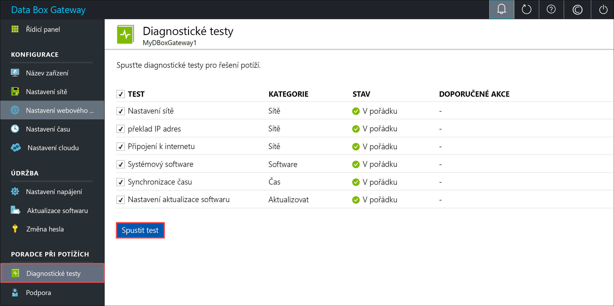
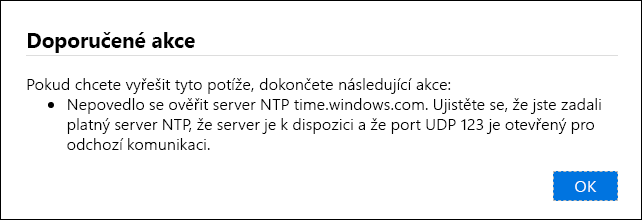
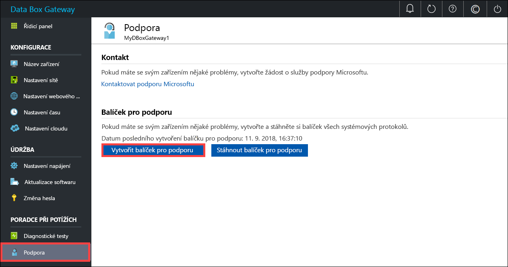
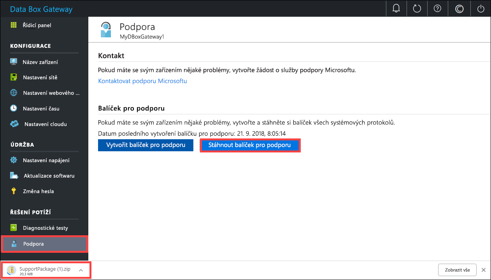
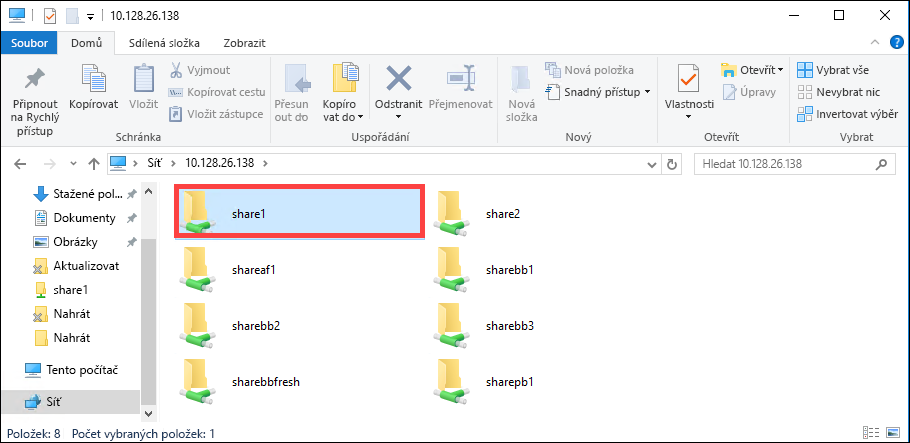

# <a name="troubleshoot-your-azure-data-box-gateway-issues"></a>Vyřešte potíže s Azure Data Box Gateway 

Tento článek popisuje postup řešení potíží s Azure Data Box Gateway. 

> [!IMPORTANT]
> - Data Box Gateway je ve verzi Preview. Před objednáním a nasazením tohoto řešení si přečtěte [podmínky užívání pro předběžné verze systému Azure](https://azure.microsoft.com/support/legal/preview-supplemental-terms/).

V tomto článku získáte informace o těchto tématech:

> [!div class="checklist"]
> * Spuštění diagnostiky
> * Shromáždění balíčku pro podporu
> * Použití protokolů k řešení potíží


## <a name="run-diagnostics"></a>Spuštění diagnostiky

Pokud chcete diagnostikovat a vyřešit potíže s libovolnými chybami zařízení, můžete spustit diagnostické testy. Diagnostické testy spustíte pomocí následujících kroků v místním webovém uživatelském rozhraní vašeho zařízení.

1. V místním webovém uživatelském rozhraní přejděte na **Řešení potíží > Diagnostické testy**. Vyberte test, který chcete spustit a klikněte na tlačítko **Spustit test**. Tím se spustí testy, které provedou diagnostiku všech možných problémů se sítí, zařízením, webovým proxy serverem, časem nebo nastavením cloudu. Na spuštěné testy v zařízení budete upozorněni.

    
 
2. Po dokončení testů se zobrazí výsledky. Pokud bude test neúspěšný, zobrazí se adresa URL s doporučenou akcí. Můžete na adresu URL kliknout a doporučenou akci zobrazit. 
 
    


## <a name="collect-support-package"></a>Shromáždění balíčku pro podporu

Balíček protokolů se skládá z příslušných protokolů, které mohou podpoře Microsoftu pomoci s řešením potíží na libovolném zařízení. Balíček protokolů můžete vygenerovat prostřednictvím místního webového uživatelského rozhraní.

Pokud chcete balíček pro podporu vyzvednout, proveďte následující kroky. 

1. V místním webovém uživatelském rozhraní přejděte na **Řešení potíží > Podpora**. Klikněte na **Vytvořit balíček pro podporu**. Systém začne shromažďovat balíček pro podporu. Shromažďování balíčků může několik minut trvat.

    
 
2. Po vytvoření balíčku pro podporu klikněte na **Stáhnout balíček pro podporu**. Komprimovaný balíček se stáhne do vámi vybrané cesty. Balíček můžete rozbalit a zobrazit soubory systémového protokolu.

    

## <a name="use-logs-to-troubleshoot"></a>Použití protokolů k řešení potíží

Veškeré chyby, ke kterým během procesu nahrávání a aktualizace došlo, budou součástí příslušných chybových souborů.

1. Pokud chcete chybové soubory zobrazit, přejděte do sdílené složky a kliknutím na ni obsah zobrazte. 

      

2. Klikněte na _Složka Microsoft Data Box Gateway_. Tato složka obsahuje dvě podsložky:

    - Složku nahrávání, která obsahuje soubory protokolů s chybami nahrávání.
    - Složku aktualizací s chybami, ke kterým došlo během aktualizace.

    Tady je ukázkový soubor protokolu pro aktualizace.

    ```
    <root container="brownbag1" machine="VM15BS020663" timestamp="07/18/2018 00:11:10" />
    <file item="test.txt" local="False" remote="True" error="16001" />
    <summary runtime="00:00:00.0945320" errors="1" creates="2" deletes="0" insync="3" replaces="0" pending="9" />
    ``` 

3. Když v tomto souboru uvidíte chybu (zvýrazněné v ukázce), poznamenejte si kód chyby – v tomto případě je to 16001. Vyhledejte popis tohoto kódu chyby v následující referenci k chybám.

    |     Kód chyby     |     Název výjimky                                         |     Popis chyby                                                                                                                                                                                                                     |
    |--------------------|------------------------------------------------------------|-------------------------------------------------------------------------------------------------------------------------------------------------------------------------------------------------------------------------------------------|
    |    100             |    ERROR_CONTAINER_OR_SHARE_NAME_LENGTH                    |    Název kontejneru nebo sdílené složky musí být dlouhý 3 až 63 znaků.                                                                                                                                                                     |
    |    101             |    ERROR_CONTAINER_OR_SHARE_NAME_ALPHA_NUMERIC_DASH        |    Název kontejneru nebo sdílené složky se musí skládat pouze z písmen, číslic a spojovníků.                                                                                                                                                       |
    |    102             |    ERROR_CONTAINER_OR_SHARE_NAME_IMPROPER_DASH             |    Název kontejneru nebo sdílené složky se musí skládat pouze z písmen, číslic a spojovníků.                                                                                                                                                       |
    |    103             |    ERROR_BLOB_OR_FILE_NAME_CHARACTER_CONTROL               |    Název objektu blob nebo souboru obsahuje nepodporované řídicí znaky.                                                                                                                                                                       |
    |    104             |    ERROR_BLOB_OR_FILE_NAME_CHARACTER_ILLEGAL               |    Název objektu blob nebo souboru obsahuje neplatné znaky.                                                                                                                                                                                   |
    |    105             |    ERROR_BLOB_OR_FILE_NAME_SEGMENT_COUNT                   |    Název objektu blob nebo souboru obsahuje příliš mnoho segmentů (jednotlivé segmenty jsou oddělené lomítkem -/).                                                                                                                                              |
    |    106             |    ERROR_BLOB_OR_FILE_NAME_AGGREGATE_LENGTH                |    Název objektu blob nebo souboru je příliš dlouhý.                                                                                                                                                                                                     |
    |    107             |    ERROR_BLOB_OR_FILE_NAME_COMPONENT_LENGTH                |    Jeden ze segmentů v názvu objektu blob nebo souboru je příliš dlouhý.                                                                                                                                                                            |
    |    108             |    ERROR_BLOB_OR_FILE_SIZE_LIMIT                           |    Velikost souboru překračuje maximální velikost souboru pro nahrání.                                                                                                                                                                              |
    |    109             |    ERROR_BLOB_OR_FILE_SIZE_ALIGNMENT                       |    Objekt blob nebo soubor je nesprávně zarovnán.                                                                                                                                                                                               |
    |    110             |    ERROR_NAME_NOT_VALID_UNICODE                            |    Název souboru s kódováním Unicode nebo objekt blob není platný.                                                                                                                                                                                  |
    |    111             |    ERROR_RESERVED_NAME_NOT_ALLOWED                         |    Název nebo předpona soubor nebo objektu blob je vyhrazeným názvem, který není podporovaný (například COM1).                                                                                                                             |
    |    2000            |    ERROR_ETAG_MISMATCH                                     |    Neshoda značek etag znamená, že došlo ke konfliktu mezi objektem blob v cloudu a v zařízení. Pokud chcete tento konflikt vyřešit, odstraňte jeden z těchto souborů – buď verzi v cloudu nebo verzi v zařízení.    |
    |    2001            |    ERROR_UNEXPECTED_FINALIZE_FAILURE                       |    Při zpracování souboru po jeho nahrání došlo k neočekávané chybě.    Pokud tuto chybu uvidíte a její trvání bude delší než 24 hodin, kontaktujte podporu.                                                      |
    |    2002            |    ERROR_ALREADY_OPEN                                      |    Soubor je již otevřený v jiném procesu a není možné ho nahrát, dokud nebude obslužná rutina zavřena.                                                                                                                                       |
    |    2003            |    ERROR_UNABLE_TO_OPEN                                    |    Nelze otevřít soubor pro nahrání. Pokud uvidíte tuto chybu, kontaktujte podporu Microsoftu.                                                                                                                                                |
    |    2004            |    ERROR_UNABLE_TO_CONNECT                                 |    Nelze se připojit ke kontejneru, do kterého se mají data nahrávat.                                                                                                                                                                             |
    |    2005            |    ERROR_INVALID_CLOUD_CREDENTIALS                         |    Nelze se připojit ke kontejneru, protože oprávnění účtu jsou nesprávná nebo zastaralá. Zkontrolujte svůj přístup.                                                                                                               |
    |    2006            |    ERROR_CLOUD_ACCOUNT_DISABLED                            |    Nelze nahrát data na účet, protože účet nebo sdílená složka jsou zakázané.                                                                                                                                                            |
    |    2007            |    ERROR_CLOUD_ACCOUNT_PERMISSIONS                         |    Nelze se připojit ke kontejneru, protože oprávnění účtu jsou nesprávná nebo zastaralá. Zkontrolujte svůj přístup.                                                                                                               |
    |    2008            |    ERROR_CLOUD_CONTAINER_SIZE_LIMIT_REACHED                |    Nelze přidat nová data, protože kontejner je plný. Nahlédněte do specifikací Azure a ověřte podporované velikosti kontejnerů podle typu. Soubor Azure například podporuje pouze maximální velikost 5 TB.                                     |
    |    2998            |    ERROR_UNMAPPED_FAILURE                                  |    Došlo k neočekávané chybě. Chyba se může vyřešit sama, ale pokud přetrvá déle než 24 hodin, obraťte se na podporu Microsoftu.                                                                                                     |
    |    16000           |    RefreshException                                        |    Tento soubor nelze zpracovat.                                                                                                                                                                                                        |
    |    16001           |    RefreshAlreadyExistsException                           |    Tento soubor nelze zpracovat, protože už v místním systému existuje.                                                                                                                                                         |
    |    16002           |    RefreshWorkNeededException                              |    Tento soubor nelze aktualizovat, protože ještě není zcela nahraný.                                                                                                                                                                          | 


## <a name="next-steps"></a>Další kroky

- Další informace o [známých potížích v této verzi](data-box-gateway-release-notes.md).
