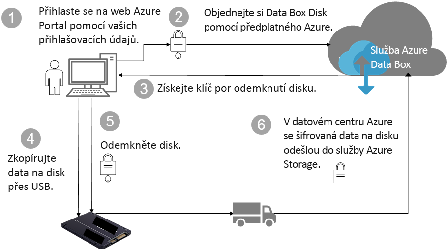

# Azure Data Box Disk zabezpečení a ochrana dat

Tento článek popisuje bezpečnostní funkce Azure Data Box Disku, které pomáhají chránit všechny komponenty řešení Data Box i uložená data. 

## Tok dat přes jednotlivé komponenty

Řešení Microsoft Azure Data Box se skládá ze čtyř hlavních komponent, které spolu navzájem spolupracují:

- **Služba Azure Data Box hostovaná v Azure** – služba pro správu, kterou použijete pro vytváření diskového pořadí, konfiguraci disků a sledování průběhu operací.
- **Data Box Disk** – fyzický disk, který vám bude doručen za účelem přenosu vašich místních dat do Azure. 
- **Klienti/hostitelé připojení k diskům** – klienti ve vaší infrastruktuře, kteří se k Data Box Disku připojí přes USB a kteří obsahují data, která je třeba přenést a chránit.
- **Cloudové úložiště** – umístění v cloudu Azure, kam se data uloží. Typicky jde o účet úložiště spojený s prostředkem Azure Data Box, který jste vytvořili.

Následující schéma představuje tok dat přes Azure Data Box Disk od místních systémů až do Azure.

## Funkce zabezpečení

Data Box Disk představuje bezpečné řešení pro přenos dat díky tomu, že prohlížet, upravovat a mazat data mohou jen oprávněné entity. Bezpečnostní funkce tohoto řešení se týkají disku a související služby a zajišťují maximální bezpečí uložených dat.

### Ochrana Data Box Disku

Data Box Disk je chráněný následujícími funkcemi:

- Nepřetržité 128bitové šifrování celého disku nástrojem BitLocker AES-128.
- Funkce aktualizace zabezpečení disků.
- Disky se dodávají v uzamčeném stavu a je možné je odemknout jenom odemykacím nástrojem Data Box Disku. Odemykací nástroj je k dispozici na portálu služby Data Box Disk.

### Ochrana dat na Data Box Disku

Data, která se do Data Box Disku ukládají a která se z něho kopírují, jsou chráněna následujícími funkcemi:

- Šifrování uložených dat nástrojem BitLocker za všech okolností.
- Bezpečné vymazání dat z disku po dokončení nahrávání dat do Azure. Vymazání dat je v souladu se standardy NIST 800-88r1.

### Ochrana služby Data Box

Služba Data Box Disk je chráněná následujícími funkcemi.

- Přístup ke službě Data Box Disk vyžaduje, aby vaše organizace měla předplatné Azure, který zahrnuje Data Box Disk. Vaše předplatné určuje funkce, které máte na webu Azure Portal dostupné.
- Protože služba Data Box je hostovaná v Azure, je chráněna funkcemi zabezpečení Azure. Další informace o funkcích zabezpečení poskytovaných v prostředí Microsoft Azure najdete v [Centru zabezpečení Microsoft Azure](https://www.microsoft.com/TrustCenter/Security/default.aspx).
- Na Data Box Disku je uložený klíč, který se používá k odemknutí disku v rámci služby. 
- Služba Data Box Disk ukládá údaje o objednávce a stavu přenosu v úložišti služby. Tyto informace se odstraní při smazání objednávky.

## Správa osobních údajů

[!INCLUDE [GDPR-related guidance](../../includes/gdpr-intro-sentence.md)]

Azure Data Box Disk shromažďuje a zobrazuje osobní údaje v následujících instancích služby:

- **Nastavení oznámení** – při vytvoření objednávky můžete nastavit e-mailovou adresu uživatele v rámci nastavení oznámení. Tyto údaje může prohlížet pouze správce. Tyto údaje se odstraní, jakmile úloha dosáhne konečného stavu nebo když objednávku smažete.

- **Údaje objednávky** – po vytvoření objednávky se na webu Azure Portal uloží dodací adresa, e-mail a kontaktní informace uživatelů. Uložené údaje zahrnují:

  - Jméno kontaktu
  - Telefonní číslo
  - E-mail
  - Ulice a číslo
  - City (Město)
  - PSČ
  - Stav
  - Provincie/kraj/oblast
  - ID disku
  - Číslo účtu dopravce
  - Sledovací číslo zásilky

    Údaje objednávky služba Data Box smaže po dokončení úlohy nebo když objednávku smažete.

- **Dodací adresa** – po objednání služba Data Box předá dodací adresu externímu dopravci, jako je například UPS nebo DHL. 

Další informace najdete v Zásadách ochrany osobních údajů společnosti Microsoft v [Centru zabezpečení](https://www.microsoft.com/trustcenter).

## Další kroky

- Projděte si [požadavky služby Data Box Disk](data-box-disk-system-requirements.md).
- Seznamte se s [omezeními služby Data Box Disk](data-box-disk-limits.md).
- Rychlé nasazení řešení [Azure Data Box Disk](data-box-disk-quickstart-portal.md) na webu Azure Portal
