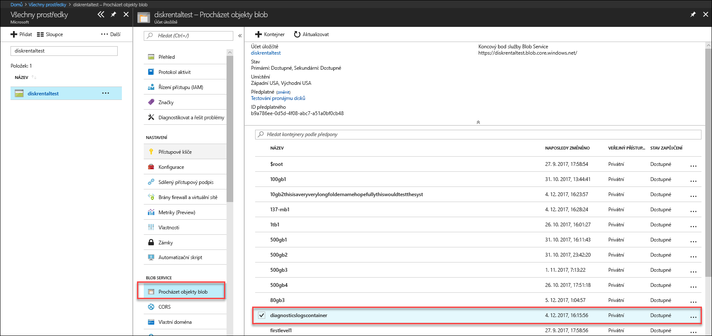
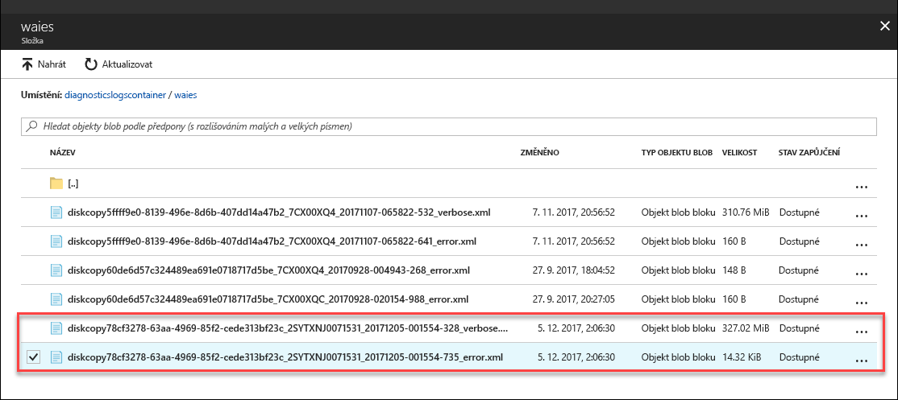

# Řešení potíží v disku Azure Data Box

V tomto článku se vztahuje na Microsoft Azure Data Box Disk a popisuje pracovních postupech, používat k řešení problémů, na které se zobrazí při nasazení tohoto řešení. 

Tento článek obsahuje následující oddíly:

- Stažení diagnostických protokolů
- Dotazy na protokoly aktivit
- Chyby odemykacího nástroje Data Box Disku
- Chyby nástroje rozdělení/kopírování Data Box Disku

## Stažení diagnostických protokolů

Pokud při procesu kopírování dat nedojde k žádným chybám, na portálu se objeví cesta ke složce, ve které najdete diagnostické protokoly. 

Diagnostické protokoly mohou zahrnovat:
- Protokoly chyb
- Podrobné protokoly  

Chcete-li se dostat do příslušného umístění a zkopírovat si protokoly, přejděte na účet úložiště spojený s vaší objednávkou Data Box. 

1.  Přejděte na **Obecné > Podrobnosti objednávky** a poznamenejte si účet úložiště přidružený k vaší objednávce.
 

2.  Přejděte na stránku **Všechny prostředky** a vyhledejte účet úložiště získaný v předchozím kroku. Vyberte a klikněte na účet úložiště.

    

3.  Přejděte na **Blob service > Procházet objekty blob** a vyhledejte blob odpovídající účtu úložiště. Přejděte na **diagnosticslogcontainer > waies**. 

    

    Měli byste vidět protokoly chyb i podrobné protokoly. Vyberte a klikněte na každý soubor a stáhněte si místní kopii.

## Dotazy na protokoly aktivit

Protokoly aktivit můžete použít k vyhledání chyby při řešení potíží nebo k monitorování toho, jak uživatel ve vaší organizaci upravil prostředek. Na základě protokolů aktivit můžete zjistit:

- Jaké operace byly provedeny s prostředky ve vašem předplatném.
- Kdo operaci zahájil. 
- Kdy k operaci došlo.
- Stav operace.
- Hodnoty dalších vlastností, které vám mohou pomoci při zkoumání operace.

Protokoly aktivit obsahují všechny operace zápisu (jako PUT, POST nebo DELETE) prováděné s vašimi prostředky, ale neobsahuje operace čtení (např. GET). 

Protokoly aktivit se uchovávají 90 dnů. Můžete se dotazovat na libovolný rozsah kalendářních dat, pokud počáteční datum neleží více než 90 dnů v minulosti. Můžete také filtrovat protokol s použitím některého z předdefinovaných dotazů ve službě Insights. Například můžete kliknout na chybu a pak na konkrétní selhání, abyste zjistili hlavní příčinu.

## Chyby odemykacího nástroje Data Box Disku

| Chybová zpráva / chování nástroje      | Doporučení                                                                                               |
|-------------------------------------------------------------------------------------------------------------------------------------|------------------------------------------------------------------------------------------------------|
| Žádný  Odemykací nástroj Data Box Disku skončí s chybou.                                                                            | BitLocker není nainstalovaná. Ujistěte se, že na hostitelském počítači, na kterém běží odemykací nástroj Data Box Disku, je nainstalovaný nástroj BitLocker.                                                                            |
| Aktuální rozhraní .NET Framework není podporováno. Podporovány jsou verze 4.5 a vyšší.  Nástroj skončí s chybovou zprávou.  | Rozhraní .NET 4.5 není nainstalováno. Na hostitelský počítač, na kterém běží odemykací nástroj Data Box Disku, nainstalujte rozhraní .NET 4.5 nebo novější.                                                                            |
| Nepodařilo se odemknout nebo ověřit žádné svazky. Obraťte se na podporu Microsoftu.    Nástroji se nepodařilo odemknout nebo ověřit žádnou uzamčenou jednotku. | Nástroji se s použitím zadaného klíče nepodařilo odemknout žádnou ze zamčených jednotek. O dalších krocích se poraďte s podporou Microsoftu.                                                |
| Následující svazky jsou odemčené a ověřené.  Svazek písmena jednotek: E: Nepodařilo se odemknout žádné svazky s použitím následujících klíčů: werwerqomnf, qwerwerqwdfda   Nástroj odemkl některé jednotky a zobrazil písmena úspěšných a neúspěšných jednotek.| Částečný úspěch. Nástroji se s použitím zadaného klíče nepodařilo odemknout některé ze zamčených jednotek. O dalších krocích se poraďte s podporou Microsoftu. |
| Nepovedlo se najít zamčené svazky. Zkontrolujte, že je disk od Microsoftu správně připojený a zamčený.          | Nástroji se nepodařilo najít žádné zamčené jednotky. Buď jsou jednotky už odemčené, nebo nebyly nalezeny. Zkontrolujte, že jsou jednotky připojené a zamčené.                                                           |
| Závažná chyba: Neplatný parametr Název parametru: invalid_arg POUŽITÍ: DataBoxDiskUnlock /PassKeys:<seznam_klíčů_oddělený_středníky>  Příklad: DataBoxDiskUnlock /PassKeys:passkey1;passkey2;passkey3 Příklad: DataBoxDiskUnlock /SystemCheck Příklad: / Help DataBoxDiskUnlock  / Klíčů:       Tento klíč získáte z objednávka disku Azure DataBox. Klíč vaše disky odemkne. / Help:           Tato možnost poskytuje nápovědy k rutině využití a příklady. / SystemCheck:    Tato možnost zkontroluje, pokud váš systém splňuje požadavky na spuštění nástroje.  Nástroj ukončíte stisknutím libovolné klávesy. | Byl zadán neplatný parametr. Jediné povolené parametry jsou /SystemCheck /PassKey a /Help.                                                                            |

## Chyby nástroje rozdělení/kopírování Data Box Disku

|Chybová zpráva / upozornění  |Doporučení |
|---------|---------|
|[Info] Načítání hesla nástroje BitLocker pro svazek: m  [Chyba] Došlo k výjimce při načítání klíče nástroj BitLocker pro svazek m:  Sekvence neobsahuje žádné prvky.|Tato chyba je vyvolána, pokud je cílový Data Box Disk offline.   Používejte nástroj `diskmgmt.msc` na disky, které jsou online.|
|[Chyba] Došlo k výjimce: Operace WMI se nezdařilo:  Method=UnlockWithNumericalPassword, ReturnValue=2150694965,  Win32Message=Formát poskytnutého hesla pro obnovení je neplatný.  Hesla pro obnovení nástroje BitLocker mají 48 číslic.  Zkontrolujte, jestli je heslo pro obnovení ve správném formátu, a pak to zkuste znovu.|Pomocí odemykacího nástroje Data Box Disku nejdřív disk odemkněte a pak zkuste příkaz znovu. Další informace najdete v článcích <li> [Odemknutí Data Box Disku pro klienty Windows](data-box-disk-deploy-set-up.md#unlock-disks-on-windows-client). </li><li> [Odemknutí Data Box Disku pro klienty Linux](data-box-disk-deploy-set-up.md#unlock-disks-on-linux-client). </li>|
|[Chyba] Došlo k výjimce: DriveManifest.xml soubor existuje na cílové jednotce.   To signalizuje, že cílový disk mohl být připraven s jiným souborem deníku.  Pokud chcete přidat další data na stejnou jednotku, použijte předchozí soubor deníku. Pokud chcete odstranit existující data a znovu použít cílovou jednotku pro novou úlohu importu, odstraňte soubor DriveManifest.xml na jednotce. Spusťte tento příkaz znovu s novým souborem deníku.| Tato chyba se zobrazí, když se pokusíte použít stejnou sadu jednotek pro více relací importu.   Používejte jednu sadu jednotek jenom pro jednu relaci rozdělení a kopírování.|
|[Chyba] Došlo k výjimce: Data importu CopySessionId – září test-1 odkazuje na předchozí relace kopírování a nesmí znovu použít pro novou relaci kopírování.|Tato chyba se zobrazí, když se pokusíte použít pro novou úlohu stejný název jako měla předchozí úspěšně dokončená úloha.  Přiřaďte nové úloze jedinečný název.|
|[Info] Název cílového souboru nebo adresáře překračuje limit délky platný v systému souborů NTFS. |Tato zpráva je nahlášena, když byl cílový soubor přejmenován z důvodu příliš dlouhé cesty.  Toto chování můžete řídit úpravou možnosti disposition v souboru `config.json`.|
|[Chyba] Došlo k výjimce: Chybný JSON řídicí sekvence. |Tato zpráva je nahlášena, když má soubor config.json neplatný formát.   Před uložením ověřte platnost souboru `config.json` pomocí nástroje [JSONlint](https://jsonlint.com/).|

## Problémy s nasazením pro Linux

Tato část podrobně popisuje některé z hlavních problémů při používání klienta Linux pro kopírování dat ve během nasazení disku Data Box.

### Problém: Jednotka získání připojit jako jen pro čtení
 
**Příčina** 

To může být způsobeno systém souborů musí provést. 

Jednotky pro čtení i zápis opakovanému připojení nebude fungovat s disků Data Box. Tento scénář není podporován s jednotkami dislocker dešifrovat. Vám může mít úspěšně znovu připojí zařízení, pomocí následujícího příkazu: 

    `# mount -o remount, rw / mnt / DataBoxDisk / mountVol1 ß`

I když opakovanému připojení bylo úspěšné, data nezachovají.

**Řešení**

Pokud se zobrazí chyba výše, můžete zkusit jedno z následujících řešení:

- Nainstalujte [ `ntfsfix` ](https://linux.die.net/man/8/ntfsfix) (k dispozici v `ntfsprogs` balíčku) a spusťte jej na relevantní oddílu.

- Pokud máte přístup k systému Windows

    - Načtěte jednotky do systému Windows.
    - Otevřete příkazový řádek s oprávněními správce. Spustit `chkdsk` na svazku.
    - Bezpečně odeberte svazek a zkuste to znovu.
 
### Problém: Chyba s daty není uchování po kopírování
 
**Příčina** 

Pokud zjistíte, že jednotka nemá data poté, co byla odpojit (v případě, že data byla zkopírována do ní), je možné znovu připojit jednotku pro čtení i zápis, po jednotky byl připojený jen pro čtení.

**Řešení**
 
Pokud je to tento případ, podívat na řešení pro [jednotky získávání připojit jako jen pro čtení](#issue-drive-getting-mounted-as-read-only).

Pokud, který nebyl tento případ, zkopírovat protokoly ze složky, která se má nástroj Data Box Disk odemknutí a [obraťte se na Microsoft Support](data-box-disk-contact-microsoft-support.md).

## Problémy při nasazení pro Windows

Tato část podrobně popisuje některé z hlavních problémů, kterým čelí během nasazení disku Data Box při používání klienta Windows pro kopírování dat

### Problém: Nepovedlo se odemknout jednotku z nástroje BitLocker
 
**Příčina** 

Použili jste heslo v dialogovém okně nástroje BitLocker a pokusu o odemknutí disku pomocí nástroje BitLocker odemknutí jednotky dialogu. To nebude fungovat. 

**Řešení**

Odemknout disků Data Box, budete muset použít nástroj Data Box Disk odemknutí a zadejte heslo z portálu Azure portal. Další informace najdete v části [kurzu: Rozbalit, připojení a odemknutí disku Azure Data Box](data-box-disk-deploy-set-up.md#connect-to-disks-and-get-the-passkey).
 
### Problém: Nepodařilo se odemknout nebo ověřit některé svazky. Obraťte se na podporu Microsoftu.
 
**Příčina** 

Může se zobrazit následující chyba v protokolu chyb a nejsou odemknout nebo ověřit některé svazky.

`Exception System.IO.FileNotFoundException: Could not load file or assembly 'Microsoft.Management.Infrastructure, Version=1.0.0.0, Culture=neutral, PublicKeyToken=31bf3856ad364e35' or one of its dependencies. The system cannot find the file specified.`
 
To znamená, že jsou pravděpodobně chybí odpovídající verzi prostředí Windows PowerShell na klientovi Windows.

**Řešení**

Můžete nainstalovat [v prostředí Windows PowerShell 5.0](https://www.microsoft.com/download/details.aspx?id=54616) a zkuste operaci zopakovat.
 
Pokud jste pořád nejste schopni odemknout svazky, zkopírovat protokoly ze složky, který má nástroj Data Box Disk odemknutí a [obraťte se na Microsoft Support](data-box-disk-contact-microsoft-support.md).

## Další postup

- Přečtěte si, jak [spravovat Data Box Disk pomocí webu Azure Portal](data-box-portal-ui-admin.md).
