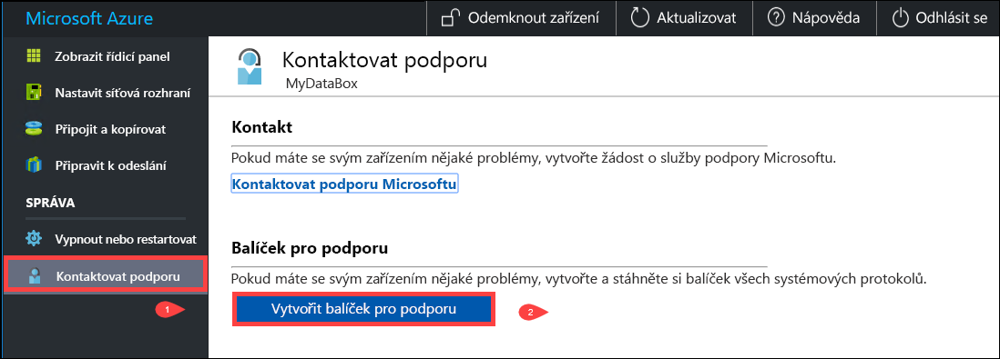
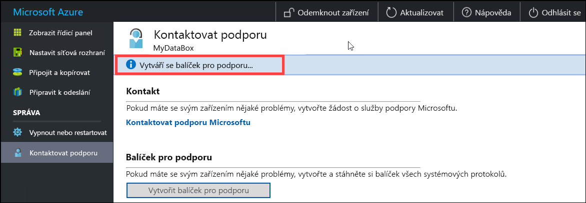
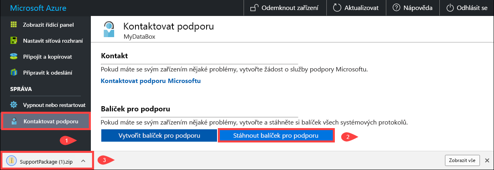
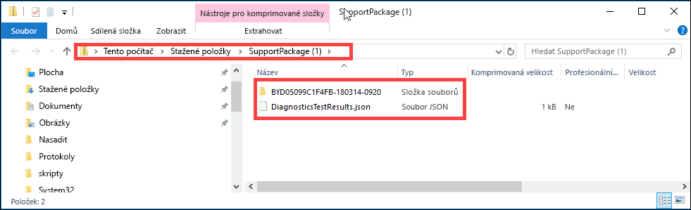
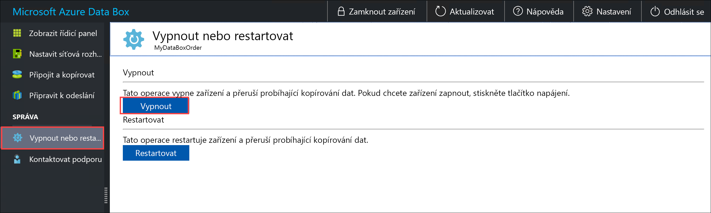
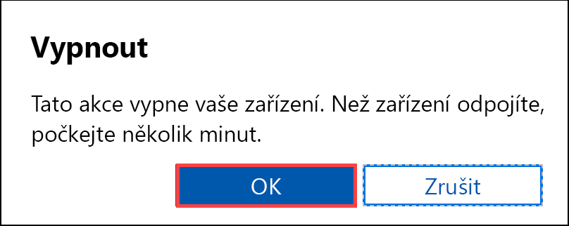
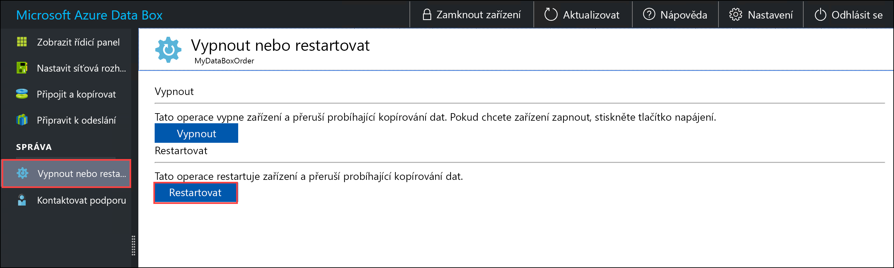
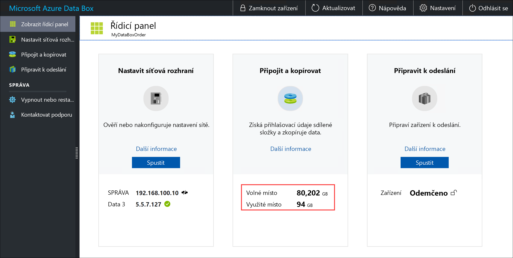
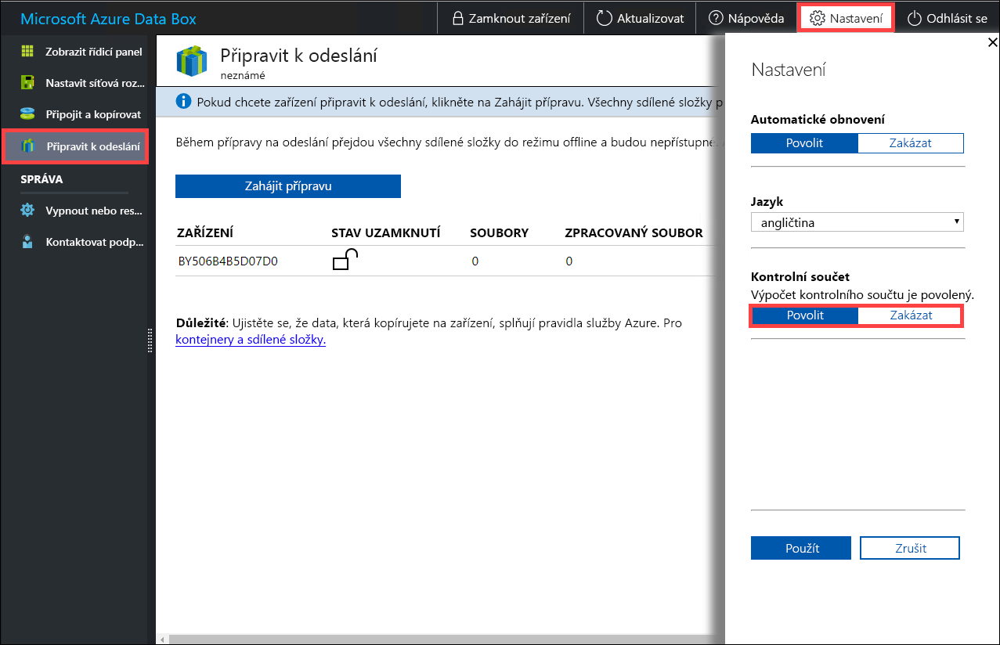

# Použití místního webového uživatelského rozhraní při správě Data Boxu

Článek popisuje část konfigurace a úlohy správy, které se dají provádět v Data Boxu. Data Box můžete spravovat přes uživatelské rozhraní webu Azure Portal a místní webové uživatelské rozhraní pro zařízení. Tento článek se zaměřuje na úlohy, které můžete provádět pomocí místního webového uživatelského rozhraní.

Místní webové uživatelské rozhraní pro Data Box se používá pro počáteční konfiguraci zařízení. Místní webové uživatelské rozhraní můžete také použít k vypnutí nebo restartování Data Boxu, spuštění diagnostických testů, aktualizaci softwaru, zobrazení protokolů kopírování a generování balíčku protokolů pro podporu Microsoftu.

Tento článek obsahuje následující návody:

- Generování balíčku pro podporu
- Vypnutí nebo restartování zařízení
- Bezpečné vymazání dat ze zařízení
- Monitorování dostupné kapacity zařízení
- Přeskočení ověření kontrolního součtu 

## Generování balíčku pro podporu

Pokud budete mít se zařízením jakékoliv problémy, můžete vytvořit ze systémových protokolů balíček pro podporu. Podpora Microsoftu používá tento balíček k řešení příslušných potíží. Pokud chcete vygenerovat balíček pro podporu, postupujte takto:

1. V místním webovém uživatelském rozhraní přejděte na **Kontaktovat podporu** a klikněte na **Vytvořit balíček pro podporu**.

    

2. Shromáždí se položky balíčku pro podporu. Tato operace trvá několik minut.

    

3. Po dokončení vytváření balíčku pro podporu klikněte na **Stáhnout balíček pro podporu**. 

    

4. Přejděte k umístění pro stahování a vyberte ho. Otevřete složku a zobrazte obsah.

    

## Vypnutí nebo restartování zařízení

Data Box můžete vypnout nebo restartovat pomocí místního webového uživatelského rozhraní. Doporučujeme před restartováním přepnout sdílené složky na hostiteli a potom na zařízení do offline režimu. Minimalizuje se tak možnost poškození dat. Při vypnutí zařízení zkontrolujte, že se nekopírují data.

Při vypnutí Data Boxu postupujte podle následujících pokynů.

1. V místním webovém uživatelském rozhraní přejděte na **Vypnout nebo restartovat**.
2. Klikněte na **Vypnout**.

    

3. Po zobrazení výzvy k potvrzení pokračujte kliknutím na **OK**.

    

Zařízení po vypnutí zapněte tlačítkem napájení na předním panelu.

Při restartování Data Boxu postupujte podle následujících pokynů.

1. V místním webovém uživatelském rozhraní přejděte na **Vypnout nebo restartovat**.
2. Klikněte na **Restartovat**.

    

3. Po zobrazení výzvy k potvrzení pokračujte kliknutím na **OK**.

   Zařízení se vypne a restartuje.

## Zobrazení dostupné kapacity zařízení

Dostupnou a využitou kapacitu zařízení můžete zobrazit na řídicím panelu zařízení. 

1. V místním webovém uživatelském rozhraní přejděte na **Zobrazit řídicí panel**.
2. V části **Připojit a kopírovat** se zobrazí volné a využité místo zařízení.

    

## Přeskočení ověření kontrolního součtu

Při přípravě k odeslání se pro data standardně generují kontrolní součty. V některých výjimečných případech může být v závislosti na typu dat (malé velikosti souborů) výkon velmi pomalý. V takových případech můžete kontrolní součet přeskočit. 

Důrazně doporučujeme kontrolní součet nezakazovat, pokud to výrazně neovlivňuje výkon.

1. V pravém horním rohu místního webového uživatelského rozhraní zařízení přejděte na Nastavení.

    

2. **Zakázání** ověření kontrolního součtu
3. Klikněte na tlačítko **Použít**.

## Další kroky

- Přečtěte si, jak [spravovat Data Box prostřednictvím webu Azure Portal](data-box-portal-admin.md).

