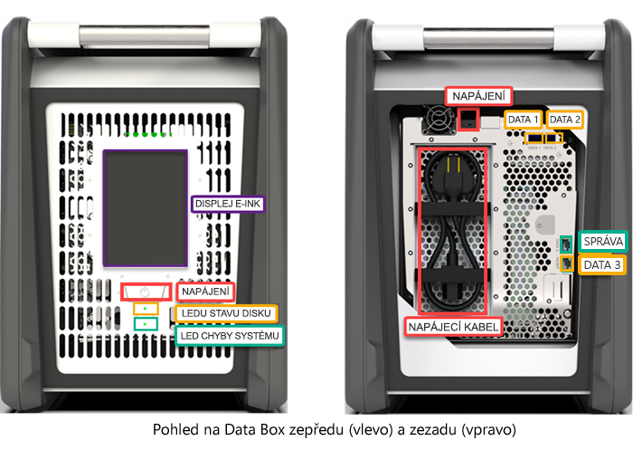
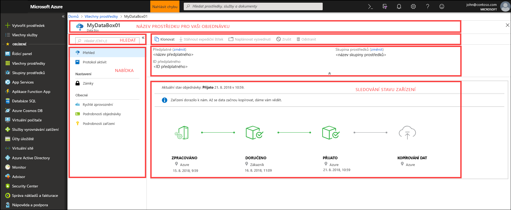

# Co je Azure Data Box?

Cloudové řešení Microsoft Azure Data Box umožňuje do Azure odeslat rychle, levně a bezpečně terabajty dat. Zabezpečený a rychlý přenos dat se zajišťuje zasláním speciálního zařízení úložiště Data Box. Každé zařízení úložiště má maximální využitelnou kapacitu úložiště 80 TB a do datového centra ho transportuje místní přepravce. Zařízení má robustní obal, který data během převozu chrání a zabezpečí.

Zařízení Data Box si můžete objednat na webu Azure Portal. Jakmile vám zařízení přijde, můžete ho rychle nastavit. Použijete k tomu místní webové uživatelské rozhraní. Zkopírujte data ze serverů do zařízení a pošlete ho zpět do Azure. V datacentru Azure se vaše data nahrají ze zařízení do Azure automaticky. Celý proces se od začátku do konce sleduje ve službě Data Box na webu Azure Portal.

## Případy použití

Data Box je ideální k přenosu dat o objemu větším než 40 TB v případech s omezeným nebo žádným síťovým připojením. Data můžete přesunout jednorázově, přesunovat je pravidelně nebo provést počáteční hromadný přesun a posléze data přenášet pravidelně. Zde je několik různých scénářů, ve kterých je vhodné k přenosu dat použít Data Box.

 - **Jednorázová migrace** – při tomto typu migrace se do Azure přesune velký objem místních dat. 
     - Přesun knihovny médií z offline pásek do Azure za účelem vytvoření online knihovny médií
     - Migrace farmy virtuálních počítačů, SQL serveru a aplikací do Azure
     - Přesun historických dat do Azure za účelem hloubkové analýzy a vytváření sestav pomocí HDInsight

 - **Počáteční hromadný přesun** – při tomto typu migrace provedete počáteční hromadný přesun pomocí služby Data Box (kompletní) a přírůstkové přenosy potom provádíte po síti. 
     - Například partneři řešení zálohování, jako je Commvault a Data Box, se používají k přesunu počátečních velkých historických záloh do Azure. Poté se už přírůstková data přenáší prostřednictvím sítě do Azure Storage.

- **Pravidelné nahrávání** – provádí se v případech, kdy pravidelně dochází ke generování velkých objemů dat, která je nutná přesunout do Azure. Příkladem může být výzkum energie, kdy se u vrtných plošin a soustavy větrných generátorů generuje videoobsah.      

## Výhody

Data Box slouží k přesunu velkých objemů dat do Azure bez výraznějšího dopadu na síť. Toto řešení má následující výhody:

- **Rychlost** – Data Box používá k přesunutí až 80 TB dat do Azure síťová rozhraní 1 Gb/s nebo 10 Gb/s.

- **Zabezpečení** – Data Box má integrovanou ochranu zařízení, dat a samotné služby.
    - Zařízení má robustní obal, který zabezpečují šroubky odolné vůči neoprávněné manipulaci a nálepky odhalující manipulaci. 
    - Data na zařízení nepřetržitě chrání 256bitové šifrování AES.
    - Zařízení je možné odemknout pouze heslem, které najdete na webu Azure Portal.
    - Služba samotná je chráněna funkcemi zabezpečení Azure.
    - Po nahrání dat do Azure se disky na zařízení zcela vymažou podle standardů NIST 800-88r1.
    
    Další informace najdete v článku o [zabezpečení a ochraně dat ve službě Azure Data Box](data-box-security.md).

## Funkce a specifikace

Zařízení Data Box má v této verzi následující funkce.

| Specifikace                                          | Popis              |
|---------------------------------------------------------|--------------------------|
| Hmotnost                                                  | < 23 kg                |
| Dimenze                                              | Zařízení – šířka: 309,0 mm, výška: 430,4 mm, hloubka: 502.0 mm |            
| Místo v racku                                              | 7U při umístění do racku na boku (montáž do racku není možná)|
| Potřebné kabely                                         | 1 napájecí kabel (je součástí balení)   2 kabely RJ45   2 měděné kabely SFP+ Twinax|
| Kapacita úložiště                                        | 100 TB   Využitelná kapacita 80 TB po zapnutí ochrany RAID 5|
| Síťová rozhraní                                      | 2 rozhraní 1 GbE rozhraní – MGMT, DATA 3   MGMT – pro správu, nemůžou konfigurovat uživatelé, používá se pro počáteční instalaci   DATA3 – pro data, můžou konfigurovat uživatelé, výchozí je dynamické nastavení   MGMT a DATA 3 fungují také jako 10 GbE   2 rozhraní 10 GbE – DATA 1, DATA 2   Oboje slouží pro data, dají se konfigurovat jako dynamická (výchozí) nebo statická |
| Média pro přenos dat                                     | RJ45, měděný kabel SFP+ 10 GbE Ethernet  |
| Zabezpečení                                                | Robustní obal zařízení se šroubky odolnými vůči neoprávněné manipulaci   Nálepky odhalující manipulaci na spodní straně zařízení|
| Rychlost přenosu dat                                      | Až 80 TB za den přes síťové rozhraní 10GbE        |
| Správa                                              | Místní webové uživatelské rozhraní – jednorázové počáteční nastavení a konfigurace   Azure Portal – každodenní správa zařízení        |

## Součásti Data Boxu

Data Box má následující součásti:

* **Zařízení Data Box** – fyzické zařízení, které poskytuje primární úložiště, spravuje komunikaci s cloudovým úložištěm a pomáhá zajistit zabezpečení a důvěrnost všech dat, která jsou v zařízení uložená. Použitelná kapacita zařízení Data Box je 80 TB. 

    

    
* **Služba Data Box** – rozšíření webu Azure Portal, které vám umožní spravovat zařízení Data Box z webového rozhraní, ke kterému můžete získat přístup z různých geografických umístění. Pomocí služby Data Box můžete zařízení Data Box spravovat každodenně. Mezi úlohy služby patří postup vytvoření a správy objednávek, zobrazení a správa výstrah a správa sdílených složek.  

    

    Další informace najdete v tématu [Použití služby Data Box ke správě vašeho zařízení Data Box](data-box-portal-ui-admin.md).

* **Místní webové uživatelské rozhraní** – uživatelské rozhraní na webovém základu, které se používá ke konfiguraci zařízení, aby se mohlo připojit k místní síti a potom mohlo pomocí služby Data Box zaregistrovat zařízení. Místní webové uživatelské rozhraní můžete také použít k vypnutí nebo restartování zařízení Data Box, zobrazení protokolů kopírování a kontaktování podpory Microsoftu, aby vytvořila žádost o služby.

    

    Informace o používání uživatelského rozhraní založeného na webu najdete v tématu [Použití uživatelského rozhraní založeného na webu ke správě vašeho zařízení Data Box](data-box-portal-ui-admin.md).

## Pracovní postup

Typický postup zahrnuje tyto kroky:

1. **Objednávka** – na portálu Azure Portal vytvoříte objednávku, zadáte doručovací údaje a cílový účet úložiště Azure pro svoje data. Pokud je zařízení k dispozici, připraví se v Azure a odešle se s identifikačním číslem pro sledování zásilky.

2. **Přijetí** – jakmile zařízení obdržíte, připojte ho pomocí přiložených kabelů k síti a napájení. Zařízení zapněte a připojte se k němu. Nakonfigurujte síť zařízení a připojte sdílené složky hostitelského počítače, ze kterého chcete kopírovat data.

3. **Kopírování dat** – zkopírujte data do sdílených složek služby Data Box.

4. **Vrácení** – zařízení připravte, vypněte a odešlete zpět do datacentra Azure.

5. **Nahrání** – data ze zařízení se automaticky zkopírují do Azure. Disky zařízení se bezpečně vymažou podle pokynů organizace NIST (National Institute of Standards and Technology).

Během tohoto procesu budete e-mailem dostávat oznámení o všech změnách stavu. Další informace o podrobném postupu najdete v článku o [nasazení služby Data Box na webu Azure Portal](data-box-deploy-ordered.md).

## Dostupnost v oblastech

Data Box může přenášet data na základě oblasti, ve které se služba nasazuje, země do které se zařízení odesílá, a cíle účtu Azure Storage, do kterého data přenášíte. 

- **Dostupnost služby** – u této vydané verze je služba Data Box dostupná v následujících oblastech:
    - Všechny oblasti ve Spojených státech amerických: USA – středozápad, USA – západ 2, USA – západ, USA (střed) – jih, USA – střed, USA (střed) – sever, USA – východ a USA – východ 2
    - Evropská unie: západní a severní Evropa
    - Spojené království: Velká Británie – jih a Velká Británie – západ
    - Francie: Francie – střed a Francie – jih

- **Cílové účty úložiště** – účty úložiště, do kterých se ukládají data, jsou dostupné ve všech oblastech Azure, ve kterých je tato služba k dispozici.  

## Další kroky

- Přečtěte si [systémové požadavky služby Data Box](data-box-system-requirements.md).
- Seznamte se s [omezeními služby Data Box](data-box-limits.md).
- Rychle nasaďte [Azure Data Box](data-box-quickstart-portal.md) na webu Azure Portal.

