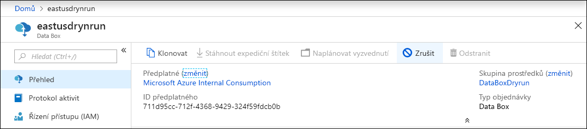
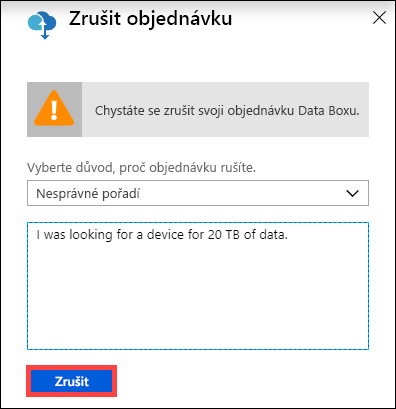
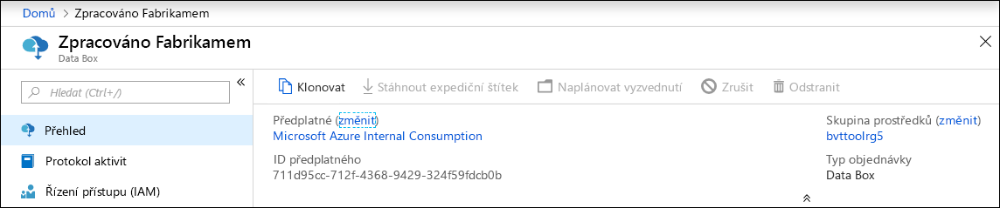
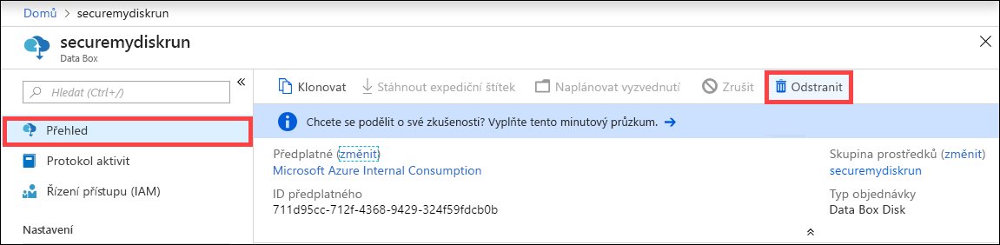
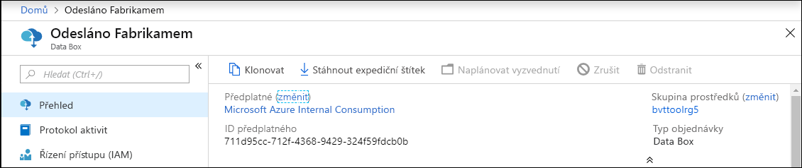
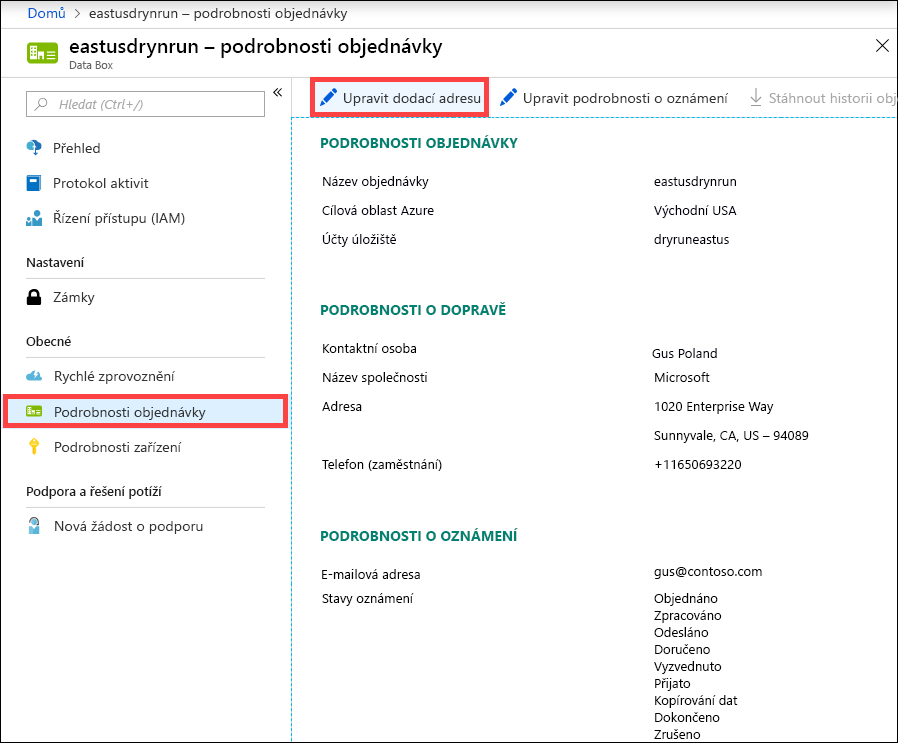
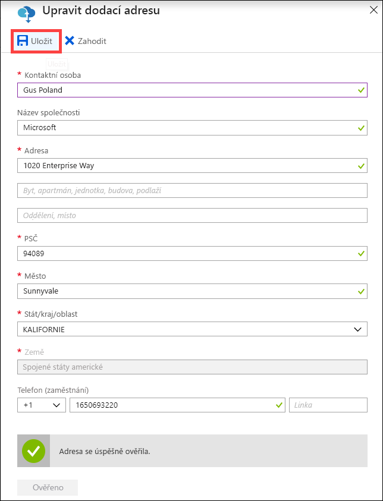
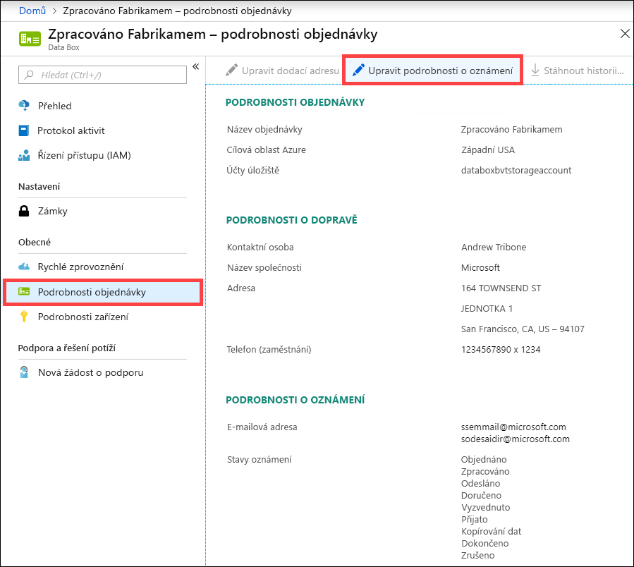
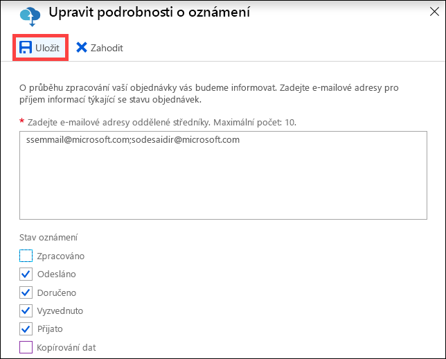

# Správa Data Boxu pomocí portálu Azure Portal

Tento článek popisuje některé komplexní pracovní postupy a úlohy správy, které se dají provádět u Data Boxu. Data Box můžete spravovat přes Azure Portal nebo v místním webovém uživatelském rozhraní. 

Tento článek se zaměřuje na úlohy, které můžete provést pomocí webu Azure Portal. Azure Portal můžete použít ke správě objednávek a Data Boxu a ke sledování stavu objednávek až do jejich dokončení.

## Zrušení objednávky

Může se stát, že po zadání objednávky budete muset tuto objednávku z různých důvodů zrušit. Objednávku je možné zrušit jen do doby, než je zpracována. Jakmile je objednávka zpracovaná a je připravený Data Box, není už možné objednávku zrušit. 

Když chcete zrušit objednávku, postupujte následovně.

1.  Přejděte na **Přehled > Zrušit**. 

    

2.  Zadejte důvod zrušení objednávky.  

    

3.  Po zrušení objednávky se na portálu aktualizuje její stav na **Zrušeno**. 

## Klonování objednávky

V některých situacích může být užitečné klonování. Uživatel například používá Data Box k přenosu dat. Jak se postupně generují další data, může být potřeba další Data Box k přenosu těchto dat do Azure. V takovém případě se dá stejná objednávka jednoduše naklonovat.

Pokud chcete naklonovat objednávku, proveďte následující kroky.

1.  Přejděte na **Přehled > Klonovat**. 

    

2.  Všechny podrobnosti o objednávce zůstávají stejné. Název objednávky má podobu názvu původní objednávky s příponou *-Clone*. Zaškrtnutím políčka potvrďte, že jste si přečetli informace o ochraně osobních údajů. Klikněte na možnost **Vytvořit**.    

Během pár minut se vytvoří klon, portál se aktualizuje a zobrazí se na něm nová objednávka.

## Odstranění objednávky

Po dokončení objednávky můžete chtít objednávku odstranit. Objednávka obsahuje vaše osobní údaje jako jméno, adresu a kontaktní údaje. Při odstranění objednávky se tyto osobní údaje odstraní.

Odstranit se dají jenom dokončené nebo zrušené objednávky. Pokud chcete odstranit objednávku, proveďte následující kroky.

1. Přejděte na **Všechny prostředky**. Vyhledejte svoji objednávku.

2. Klikněte na objednávku, kterou chcete odstranit, a přejděte na **Přehled**. Na panelu příkazů klikněte na **Odstranit**.

    

3. Po zobrazení výzvy k potvrzení odstranění objednávky zadejte název objednávky. Klikněte na **Odstranit**.

## Stažení expedičního štítku

Pokud displej E-ink vašeho Data Boxu nefunguje a nezobrazuje zpětný expediční štítek, budete možná muset expediční štítek stáhnout. 

Pokud chcete stáhnout expediční štítek, proveďte následující kroky.
1.  Přejděte na **Přehled > Stáhnout expediční štítek**. Tato možnost je dostupná teprve po odeslání zařízení. 

    

2.  Tato akce stáhne následující zpětný expediční štítek. Štítek uložte a vytiskněte ho. Štítek přeložte a vložte do průhledného obalu na zařízení. Ujistěte se, že je štítek vidět. Odstraňte všechny nálepky, které jsou na zařízení z předchozí expedice.

    

## Úprava dodací adresy

Po zadání objednávky může být potřeba upravit dodací adresu. Tato možnost je dostupná jenom do odeslání zařízení. Po odeslání zařízení už tato možnost dostupná není.

Pokud chcete upravit objednávku, proveďte následující kroky.

1. Přejděte na **Podrobnosti objednávky > Upravit dodací adresu**.

    

2. Upravte a zkontrolujte dodací adresu a pak uložte změny.

    

## Úprava podrobností o oznámení

Může být potřeba změnit uživatele, kteří mají dostávat e-maily se stavem objednávky. Některý uživatel například může potřebovat informaci o doručení nebo vyzvednutí zařízení. Jiný uživatel zase může potřebovat oznámení o dokončení kopírování dat, aby mohl zkontrolovat, jestli se data nacházejí na účtu služby Azure Storage, a potom je odstranit ze zdroje. V takových případech můžete upravit podrobnosti o oznámení.

Pokud chcete upravit podrobnosti o oznámení, proveďte následující kroky.

1. Přejděte na **Podrobnosti objednávky > Upravit podrobnosti o oznámení**.

    

2. Teď můžete upravit podrobnosti o oznámení a uložit změny.
 
    

## Zobrazení stavu objednávky

Když se stav zařízení na portálu změní, dostanete upozornění prostřednictvím e-mailu.

|Stav objednávky |Popis |
|---------|---------|
|Objednáno     | Došlo k úspěšnému zadání objednávky.  Pokud je zařízení dostupné, určí Microsoft zařízení k odeslání a toto zařízení připraví.   Pokud zařízení není dostupné okamžitě, bude objednávka zpracována, až bude zařízení dostupné. Zpracování objednávky může trvat od několika dnů až do dvou měsíců. Pokud objednávku nelze vyřídit do 90 dnů, je objednávka zrušena a budete upozorněni.         |
|Zpracováno     | Proběhlo zpracování objednávky. Zařízení je připravené k odeslání v datovém centru podle objednávky.         |
|Odesláno     | Došlo k odeslání objednávky. Zásilku můžete sledovat pomocí ID pro sledování, které je uvedené ve vaší objednávce na portálu.        |
|Doručeno     | Zásilka byla doručena na adresu uvedenou v objednávce.        |
|Vyzvednuto     |Zpáteční zásilka byla vyzvednuta a naskenována dopravcem.         |
|Přijato     | Zařízení bylo přijato a naskenováno v datovém centru Azure.   Po kontrole zásilky začne nahrávání dat ze zařízení.      |
|Kopírování dat     | Probíhá kopírování dat. Sledujte průběh kopírování u vaší objednávky na portálu Azure Portal.   Počkejte, dokud se kopírování dat nedokončí. |
|Dokončeno       |Objednávka se úspěšně dokončila.  Než odstraníte data z místních serverů, zkontrolujte, jestli se data objevila v Azure.         |
|Dokončeno s chybami| Kopírování dat se dokončilo, ale během kopírování došlo k chybám.   Zkontrolujte protokoly kopírování pomocí cesty uvedené na portálu Azure Portal.   |
|Zrušeno            |Došlo ke zrušení objednávky.   Buď jste objednávku zrušili, nebo došlo k chybě a objednávku zrušila služba. Pokud objednávku nelze vyřídit do 90 dnů, je objednávka také zrušena a budete upozorněni.     |
|Vyčištění | Vymažou se data na discích zařízení. Jakmile je na portálu Azure Portal k dispozici sestava s protokolem, je vyčištění zařízení považováno za dokončené.|

## Další kroky

- Zjistěte, jak [řešit problémy s Data Boxem](data-box-faq.md).
