# Správa Data Box Disku (Preview) pomocí webu Azure Portal

Kurzy v tomto článku se týkají Microsoft Azure Data Box Disku ve verzi Preview. Článek popisuje některé komplexní pracovní postupy a úlohy správy, které se dají provádět v Data Box Disku. 

Data Box Disk je možné spravovat prostřednictvím webu Azure Portal. Tento článek se zaměřuje na úlohy, které můžete provést pomocí webu Azure Portal. Azure Portal můžete použít ke správě objednávek a disků a ke sledování stavu objednávek až do koncové fáze.

> [!IMPORTANT]
> Data Box Disk je ve verzi Preview. Než toto řešení nasadíte, přečtěte si [podmínky užívání pro předběžné verze systému Azure](https://azure.microsoft.com/support/legal/preview-supplemental-terms/).

## Zrušení objednávky

Může se stát, že po zadání objednávky budete muset tuto objednávku z různých důvodů zrušit. Objednávku je možné zrušit do té doby, než začne příprava disku. Jakmile jsou disky připravené a objednávka je zpracovaná, už se nedá zrušit. 

Pokud chcete zrušit objednávku, proveďte následující kroky.

1.  Přejděte na **Přehled > Zrušit**. 

    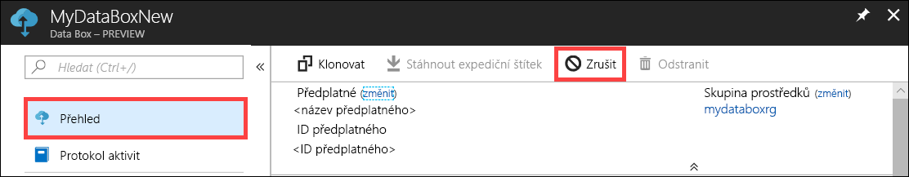

2.  Zadejte důvod zrušení objednávky.  

    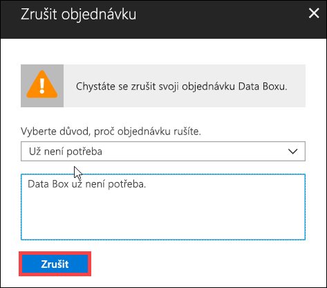

3.  Po zrušení objednávky se na portálu aktualizuje její stav na **Zrušeno**.

    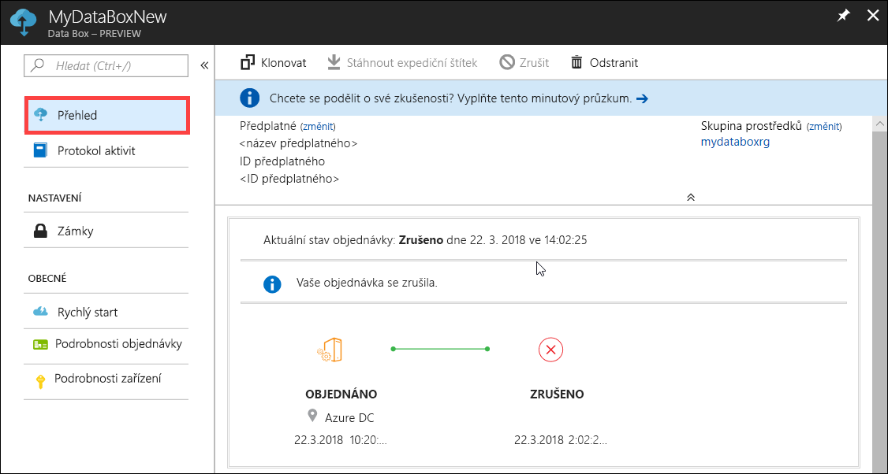

Při zrušení objednávky nedostanete e-mailem oznámení.

## Klonování objednávky

V některých situacích může být užitečné klonování. Uživatel například použije Data Box Disk k přenosu dat. Postupně se generují další a další data, takže jsou potřeba další disky k přenosu těchto dat do Azure. V takovém případě se dá stejná objednávka jednoduše naklonovat.

Pokud chcete naklonovat objednávku, proveďte následující kroky.

1.  Přejděte na **Přehled > Klonovat**. 

    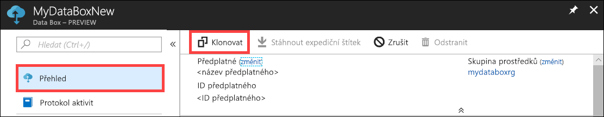

2.  Všechny podrobnosti o objednávce zůstávají stejné. Název objednávky má podobu názvu původní objednávky s příponou *-Clone*. Zaškrtnutím políčka potvrďte, že jste si přečetli informace o ochraně osobních údajů. Klikněte na možnost **Vytvořit**.    

Během pár minut se vytvoří klon, portál se aktualizuje a zobrazí se na něm nová objednávka.

[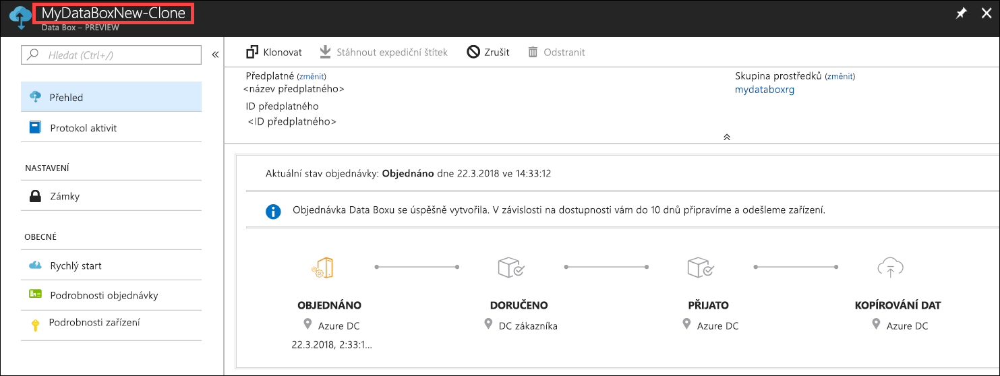](media/data-box-portal-ui-admin/clone-order3.png#lightbox) 

## Odstranění objednávky

Po dokončení objednávky můžete chtít objednávku odstranit. Objednávka obsahuje vaše osobní údaje jako jméno, adresu a kontaktní údaje. Při odstranění objednávky se tyto osobní údaje odstraní.

Odstranit se dají jenom dokončené nebo zrušené objednávky. Pokud chcete odstranit objednávku, proveďte následující kroky.

1. Přejděte na **Všechny prostředky**. Vyhledejte svoji objednávku.

    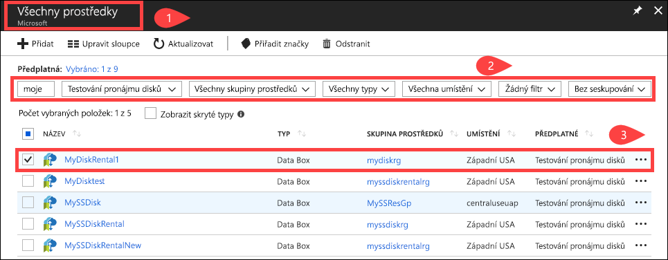

2. Klikněte na objednávku, kterou chcete odstranit, a přejděte na **Přehled**. Na panelu příkazů klikněte na **Odstranit**.

    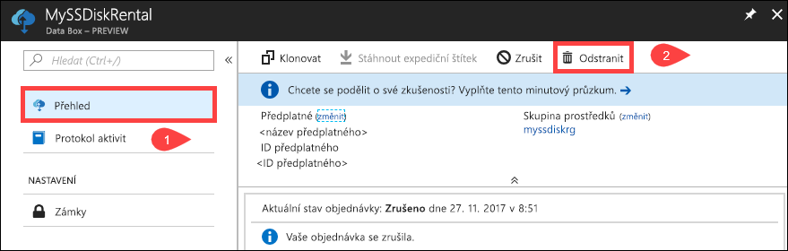

3. Po zobrazení výzvy k potvrzení odstranění objednávky zadejte název objednávky. Klikněte na **Odstranit**.

     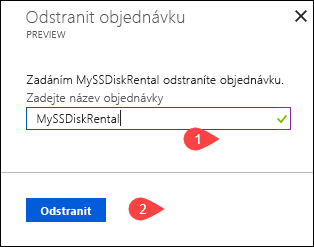

## Stažení expedičního štítku

Pokud se zpětný expediční štítek zaslaný s vašimi disky někam zatoulá nebo ztratí, můžete si expediční štítek stáhnout. 

Pokud chcete stáhnout expediční štítek, proveďte následující kroky.
1.  Přejděte na **Přehled > Stáhnout expediční štítek**. Tato možnost je dostupná teprve po odeslání disku. 

    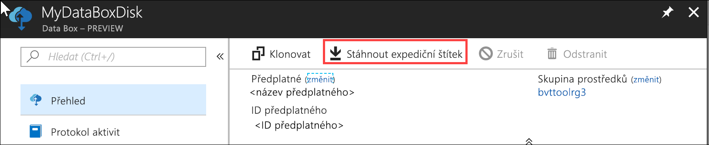

2.  Tato akce stáhne následující zpětný expediční štítek. Štítek uložte, vytiskněte ho a připojte ho ke zpětné zásilce.

    

## Úprava dodací adresy

Po zadání objednávky může být potřeba upravit dodací adresu. Tato možnost je dostupná jenom do odeslání disku. Po odeslání disku už tato možnost nebude dostupná.

Pokud chcete upravit objednávku, proveďte následující kroky.

1. Přejděte na **Podrobnosti objednávky > Upravit dodací adresu**.

    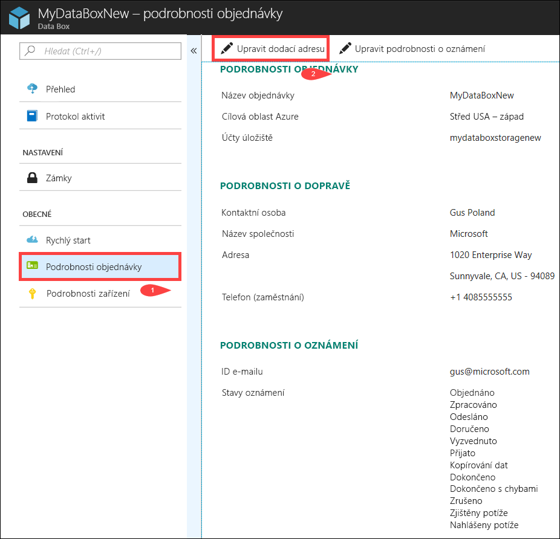

2. Teď můžete upravit dodací adresu a uložit změny.

    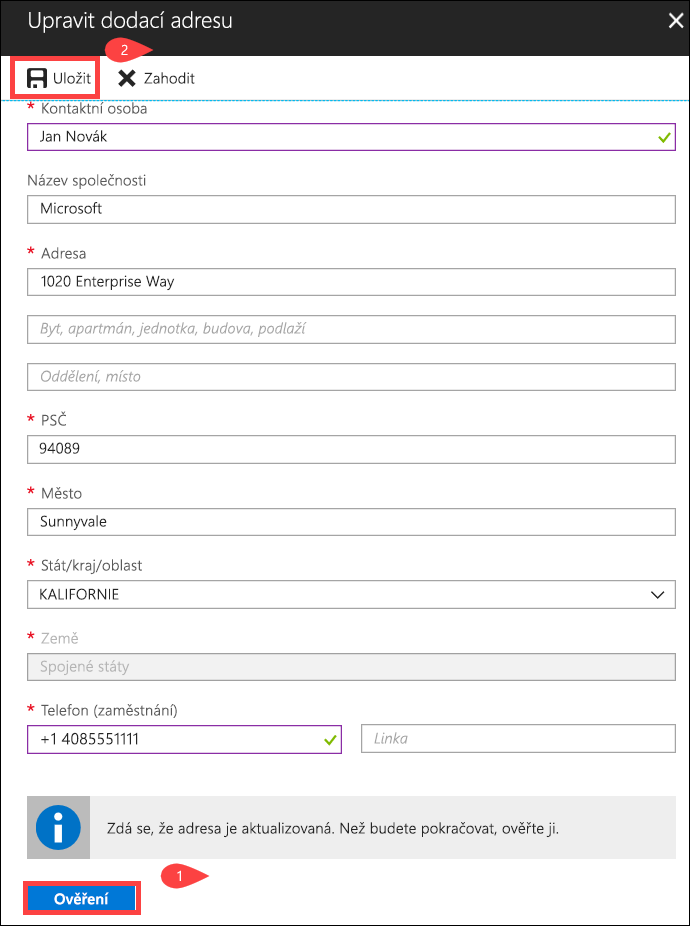

## Úprava podrobností o oznámení

Může být potřeba změnit uživatele, kteří mají dostávat e-maily se stavem objednávky. Některý uživatel například může potřebovat informaci o doručení nebo vyzvednutí disku. Jiný uživatel zase může potřebovat oznámení o dokončení kopírování dat, aby mohl zkontrolovat, jestli se data nacházejí na účtu služby Azure Storage, a potom je odstranit ze zdroje. V takových případech můžete upravit podrobnosti o oznámení.

Pokud chcete upravit podrobnosti o oznámení, proveďte následující kroky.

1. Přejděte na **Podrobnosti objednávky > Upravit podrobnosti o oznámení**.

    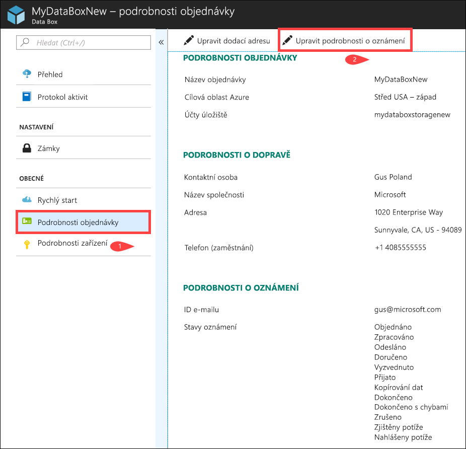

2. Teď můžete upravit podrobnosti o oznámení a uložit změny.
 
    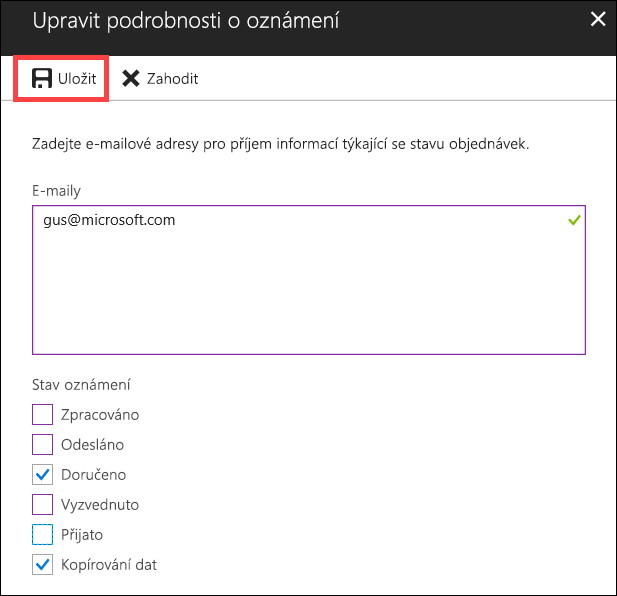

## Zobrazení stavu objednávky

|Stav objednávky |Popis |
|---------|---------|
|Objednáno     | Došlo k úspěšnému zadání objednávky.   Pokud nejsou disky dostupné, dostanete oznámení.  Pokud jsou disky dostupné, Microsoft určí disky k odeslání a připraví balíček s disky.        |
|Zpracováno     | Proběhlo zpracování objednávky.   Během zpracování objednávky dochází k těmto akcím:<li>Disky se zašifrují pomocí šifrování AES-128 nástrojem BitLocker. </li> <li>Data Box Disk se uzamkne, aby se zabránilo neoprávněnému přístupu.</li><li>Během tohoto procesu se vygeneruje klíč k odemknutí disků.</li>        |
|Odesláno     | Došlo k odeslání objednávky. Objednávka by k vám měla dorazit během 1–2 dnů.        |
|Doručeno     | Proběhlo doručení objednávky na uvedenou adresu.        |
|Vyzvednuto     |Došlo k vyzvednutí zpáteční zásilky.   Po přijetí dodávky v datovém centru Azure data se automaticky nahraje do Azure.         |
|Přijato     | Vaše disky dorazily do datového centra Azure. Brzy začne kopírování dat.        |
|Data se zkopírovala     |Probíhá kopírování dat.  Počkejte, dokud se kopírování dat nedokončí.         |
|Dokončeno       |Objednávka se úspěšně dokončila.  Než odstraníte data z místních serverů, zkontrolujte, jestli se data objevila v Azure.         |
|Dokončeno s chybami| Kopírování dat se dokončilo, ale došlo k chybám.   Zkontrolujte protokoly kopírování pomocí cesty uvedené v části **Přehled**. Další informace najdete v článku [Stažení diagnostických protokolů](data-box-disk-troubleshoot.md#download-diagnostic-logs).   |
|Zrušeno            |Došlo ke zrušení objednávky.   Buď jste objednávku zrušili, nebo došlo k chybě a objednávku zrušila služba.     |

## Další postup

- Zjistěte, jak [řešit problémy s Data Box Diskem](data-box-disk-troubleshoot.md).
