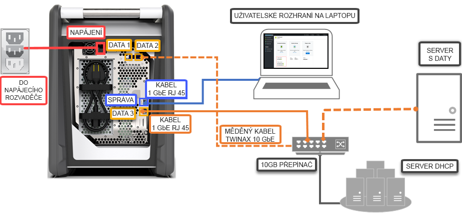

# Rychlý start: Nasazení Azure Data Box pomocí webu Azure portal

Tento rychlý start popisuje, jak nasadit Azure Data Box pomocí webu Azure Portal. V tomto postupu najdete informace o zapojení, konfiguraci a kopírování dat do Data Boxu, aby se data nahrála do služby Azure. Rychlý start se provádí na webu Azure Portal a přes místní webové uživatelské rozhraní zařízení.

Pro podrobné podrobný postup nasazení a pokyny pro sledování, přejděte na [kurzu: Objednávky zařízení Azure Data Box](data-box-deploy-ordered.md)

## Požadavky

Než začnete:

- Typ předplatného, které používáte pro službu Data Box, musí být jeden z následujících:
    - Smlouva Microsoft Enterprise (EA). Další informace o [předplatných se smlouvou Enterprise](https://azure.microsoft.com/pricing/enterprise-agreement/).
    - Cloud Solution Provider (CSP). Další informace o [programu Azure CSP](https://docs.microsoft.com/azure/cloud-solution-provider/overview/azure-csp-overview).
    - Microsoft Azure Sponsorship. Získejte další informace o [programu Azure Sponsorship](https://azure.microsoft.com/offers/ms-azr-0036p/). 

- Pokud chcete vytvořit objednávku Data Boxu, potřebujete mít u předplatného přístup vlastníka nebo přispěvatele.
- Přečtěte si [bezpečnostní pokyny pro Data Box](data-box-safety.md).
- Máte hostitelský počítač, který obsahuje data, která chcete zkopírovat do Data Boxu. Hostitelský počítač musí splňovat tyto požadavky:
    - Musí na něm běžet [podporovaný operační systém](data-box-system-requirements.md).
    - Musí být připojený k vysokorychlostní síti. Důrazně doporučujeme, abyste měli připojení alespoň 10 GbE. Pokud nemáte k dispozici připojení 10 GbE, je možné použít datové propojení 1 GbE, což ale bude mít vliv na rychlosti kopírování. 
- Data Box je potřeba umístit na rovnou plochu. Pokud chcete zařízení umístit na standardní polici v racku, potřebujete v racku datového centra slot 7U. Zařízení můžete v racku umístit na plocho nebo na výšku.
- Pro připojení Data Boxu k hostitelském počítači je potřeba pořídit následující kabely.
    - Dva měděné kabely 10 GbE SFP+ Twinax (pro síťová rozhraní DATA 1, DATA 2)
    - Jeden síťový kabel RJ-45 kategorie 6 (pro síťové rozhraní MGMT)
    - Jeden síťový kabel RJ-45 kategorie 6A NEBO jeden síťový kabel RJ-45 kategorie 6 (pro síťové rozhraní DATA 3 konfigurované jako 10 Gb/s a 1 Gb/s v tomto pořadí)

## Přihlásit se k Azure

Přihlaste se k webu Azure Portal na adrese [http://portal.azure.com](http://portal.azure.com).

## Objednání

Tento krok trvá přibližně 5 minut.

1. Na webu Azure Portal vytvořte nový prostředek Azure Data Box.
2. Vyberte stávající předplatné, ve kterém je tato služba povolená, a zvolte typ přenosu **Import**. Do pole **Zdrojová země** zadejte zemi, kde se data nacházejí, a v poli **Cílová oblast Azure** zvolte oblast, kam se mají data přenést.
3. Vyberte **Data Box**. Maximální využitelná kapacita je 80 TB a v případě většího množství dat můžete zadat více objednávek.
4. Zadejte podrobnosti objednávky a informace o dodání. Pokud je služba dostupná ve vaší oblasti, zadejte adresy pro poslání e-mailu s oznámením, zkontrolujte souhrn a vytvořte objednávku.

Po vytvoření objednávky je zařízení připravené k odeslání.

## Kabel 

Tento krok trvá přibližně 10 minut.

Když obdržíte Data Box, zapojte kabely a zařízení připojte a zapněte podle následujících pokynů. Tento krok zabere asi 10 minut.

1. Pokud vidíte, že je zařízení poškozené nebo že s ním někdo manipuloval, nepokračujte. Požádejte podporu Microsoftu o dodání náhradního zařízení.
2. Před zapojením zařízení zkontrolujte, že máte následující kabely:
    
    - Uzemněný napájecí kabel 10 A nebo více s konektorem IEC60320 C-13 na jednom konci pro připojení k zařízení.
    - Jeden síťový kabel RJ-45 kategorie 6 (pro síťové rozhraní MGMT)
    - Dva měděné kabely 10 GbE SFP+ Twinax (pro síťová rozhraní DATA 1, DATA 2 10 Gb/s)
    - Jeden síťový kabel RJ-45 kategorie 6A NEBO jeden síťový kabel RJ-45 kategorie 6 (pro síťové rozhraní DATA 3 konfigurované jako 10 Gb/s a 1 Gb/s v tomto pořadí)

3. Zařízení vyjměte a položte na rovnou plochu. 
    
4. K zařízení připojte kabely, jak vidíte níže.  

      

    1. K zařízení připojte napájecí kabel.
    2. Pomocí síťového kabelu RJ-45 kategorie 6 připojte hostitelský počítač k portu pro správu (MGMT) na zařízení. 
    3. Pomocí měděného kabelu SFP+ Twinax připojte alespoň jedno síťové rozhraní s rychlostí 10 Gb/s (tomu se dává přednost před rozhraním s rychlostí 1 Gb/s), DATA 1 nebo DATA 2 pro data. 
    4. Zapněte zařízení. Tlačítko napájení je na předním panelu zařízení.

## Připojení

Tento krok trvá 5 až 7 minut.

1. Pokud chcete získat heslo zařízení, přejděte na webu [Azure Portal](http://portal.azure.com) na **Obecné > Podrobnosti o zařízení**.
2. Na adaptéru sítě Ethernet na počítači, pomocí kterého se připojujete k Data Boxu, nakonfigurujte statickou IP adresu 192.168.100.5 a podsíť 255.255.255.0. Přejděte do místního webového uživatelského rozhraní zařízení na adrese `https://192.168.100.10`. Připojení zařízení po zapnutí může trvat až 5 minut. 
3. Přihlaste se pomocí hesla z webu Azure Portal. Zobrazí se vám chyba s informacemi k potížím s certifikátem zabezpečení webu. Postupujte podle pokynů pro konkrétní prohlížeč a přejděte tak na webovou stránku.
4. Standardně je pro nastavení sítě pro datové rozhraní 10 Gb/s (nebo 1 Gb/s) nakonfigurovaný protokol DHCP. V případě potřeby můžete toto rozhraní nakonfigurovat jako statické a zadat IP adresu. 

## Kopírování dat

Doba trvání této operace závisí na množství dat a rychlosti sítě.
 
1. Pokud používáte hostitele Windows, použijte nástroj pro kopírování souborů kompatibilní s protokolem SMB, jako je třeba Robocopy. Pro hostitele systému souborů NFS použijte ke kopírování dat příkaz `cp` nebo `rsync`. Připojte nástroj k zařízení a začněte kopírovat data do sdílených složek. Další informace o tom, jak použít Robocopy ke kopírování dat, získáte v tématu [Robocopy](https://technet.microsoft.com/library/ee851678.aspx).
2. Připojte se ke sdíleným složkám s použitím cesty: `\\<IP address of your device>\ShareName`. Pokud chcete získat přihlašovací údaje ke sdílené složce, přejděte na stránku **Connect & copy** (Připojit a kopírovat) v místním webovém uživatelském rozhraní Data Boxu.
3. Název sdílené složky a složky a data musí vyhovovat pokynům popsaným v tématu [Omezení služby Azure Storage a Data Boxu](data-box-limits.md).

## Odeslání do Azure 

Tato operace trvá asi 10–15 minut.

1. Přejděte na stránku **Prepare to ship** (Připravit k odeslání) v místním webovém uživatelském rozhraní a zahajte přípravu k odeslání. 
2. Z místního webového uživatelského rozhraní vypněte zařízení. Odpojte od zařízení kabely. 
3. Na displeji E-ink byste měli vidět expediční štítek pro vrácení. Pokud se na displeji E-ink štítek nezobrazí, stáhněte si expediční štítek z webu Azure Portal a vložte ho do fólie připojené k zařízení.
4. Zamkněte kryt a odešlete zařízení do Microsoftu. 

## Ověření dat

Doba trvání této operace závisí na množství dat.

1. Když se zařízení Data Box Disk připojí k síti v datovém centru Azure, automaticky se zahájí nahrávání dat do Azure. 
2. Jakmile se kopírování dat dokončí, služba Azure Data Box vám přes web Azure Portal pošle oznámení. 

    1. Zkontrolujte všechna selhání v protokolech chyb a proveďte potřebné kroky.
    2. Než odstraníte data ze zdroje, ujistěte se, že je máte v účtech úložiště.

## Vyčištění prostředků

Dokončení tohoto kroku trvá 2 až 3 minuty.

- Před zpracováním objednávky můžete objednávku Data Boxu zrušit na webu Azure Portal. Po zpracování objednávky už se objednávka zrušit nedá. Průběh objednávky bude pokračovat až do fáze Dokončeno. Pokud chcete objednávku zrušit, přejděte do části **Přehled** a na panelu příkazů klikněte na **Zrušit**.

- Jakmile se na webu Azure Portal objeví stav **Dokončeno** nebo **Zrušeno**, můžete objednávku odstranit. Pokud chcete odstranit objednávku, přejděte do části **Přehled** a na panelu příkazů klikněte na **Odstranit**.

## Další postup

V tomto rychlém startu jste nasadili Azure Data Box, který vám má pomoci s importem dat do Azure. Další informace o správě Azure Data Boxu získáte v následujícím kurzu: 

> [!div class="nextstepaction"]
> [Použití webu Azure Portal ke správě Data Boxu](data-box-portal-admin.md)

