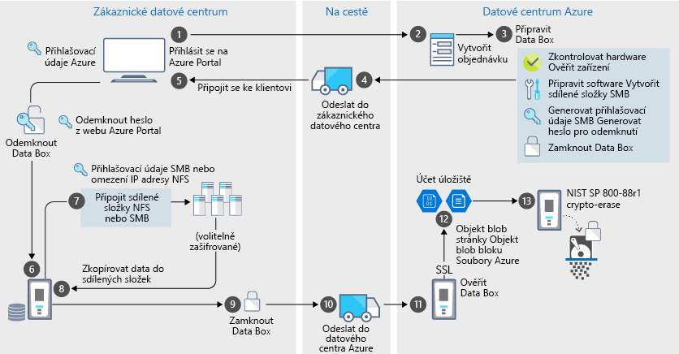

# Zabezpečení a ochrana dat v zařízení Azure Data Box

Data Box představuje bezpečné řešení pro přenos dat díky tomu, že prohlížet, upravovat a mazat data mohou jen oprávněné entity. Tento článek popisuje funkce zabezpečení zařízení Azure Data Box, které pomáhají chránit všechny komponenty řešení Data Box i v něm uložená data. 

[!INCLUDE [GDPR-related guidance](../../includes/gdpr-intro-sentence.md)]

## Tok dat přes jednotlivé komponenty

Řešení Microsoft Azure Data Box se skládá ze čtyř hlavních komponent, které spolu navzájem spolupracují:

- **Služba Azure Data Box hostovaná v Azure** – služba pro správu, kterou použijete pro vytváření pořadí a konfiguraci zařízení a sledování průběhu operací.
- **Zařízení Data Box** – zařízení pro přenos, které vám bude doručeno za účelem přenosu vašich místních dat do Azure. 
- **Klienti/hostitelé připojení k zařízení** – klienti ve vaší infrastruktuře připojující se k zařízení Data Box a obsahující data, která je třeba přenést a chránit.
- **Cloudové úložiště** – umístění v cloudu Azure, kam se data uloží. Typicky jde o účet úložiště spojený s prostředkem Azure Data Box, který jste vytvořili.

Následující schéma představuje tok dat přes řešení Azure Data Box od místních systémů až do Azure.

## Funkce zabezpečení

Data Box představuje bezpečné řešení pro přenos dat díky tomu, že prohlížet, upravovat a mazat data mohou jen oprávněné entity. Bezpečnostní funkce tohoto řešení se týkají disku a související služby a zajišťují maximální bezpečí uložených dat. 

### Ochrana zařízení Data Box

Zařízení Data Box je chráněno následujícími funkcemi.

- Odolné pouzdro zařízení, které odolá nárazům, nešetrné přepravě a vnějším podmínkám. 
- Pečetě, které odhalují manipulaci se zařízením při přepravě.
- Hardwarová a softwarová detekce nedovolené manipulace, která zabrání dalšímu používání zařízení.
- Běží pouze na softwaru specifickém pro Data Box.
- Spouští se v uzamčeném stavu.
- Řídí přístup k zařízení přes heslo pro odemčení zařízení.
- Přístupové přihlašovací údaje ke kopírování na zařízení a ze zařízení.

### Ochrana dat na zařízení Data Box

Data, která se na zařízení Data Box ukládají a která se z něho kopírují, jsou chráněna následujícími funkcemi:

- 256bitové šifrování AES pro neaktivní uložená data. 
- Pro přenášená data je možné použít šifrované protokoly.
- Bezpečné vymazání dat ze zařízení po dokončení jejich nahrání do Azure. Vymazání dat je v souladu se standardy NIST 800-88r1.

### Ochrana služby Data Box

Služba Data Box Disk je chráněná následujícími funkcemi.

- Přístup ke službě Data Box vyžaduje, aby vaše organizace měla předplatné Azure, které zahrnuje Data Box. Vaše předplatné určuje funkce, které máte na webu Azure Portal dostupné.
- Protože služba Data Box je hostovaná v Azure, je chráněna funkcemi zabezpečení Azure. Další informace o funkcích zabezpečení poskytovaných v prostředí Microsoft Azure najdete v [Centru zabezpečení Microsoft Azure](https://www.microsoft.com/TrustCenter/Security/default.aspx). 
- Služba Data Box ukládá heslo pro odemčení, které slouží k odemčení zařízení ve službě. 
- Služba Data Box ukládá údaje o objednávce a stavu přenosu v úložišti služby. Tyto informace se odstraní při smazání objednávky. 

## Správa osobních údajů

Azure Data Box shromažďuje a zobrazuje osobní údaje v následujících klíčových instancích služby:

- **Nastavení oznámení** – při vytvoření objednávky můžete nastavit e-mailovou adresu uživatele v rámci nastavení oznámení. Tyto údaje může prohlížet pouze správce. Tyto údaje se odstraní, jakmile úloha dosáhne konečného stavu nebo když objednávku smažete.

- **Údaje objednávky** – po vytvoření objednávky se na webu Azure Portal uloží dodací adresa, e-mail a kontaktní informace uživatelů. Uložené údaje zahrnují:

    - Jméno kontaktu
    - Telefonní číslo
    - Email
    - Ulice a číslo
    - Město
    - PSČ
    - Stav
    - Provincie/kraj/oblast
    - Číslo účtu dopravce
    - Sledovací číslo zásilky

    Údaje objednávky služba Data Box smaže po dokončení úlohy nebo když objednávku smažete.

- **Dodací adresa** – po objednání služba Data Box předá dodací adresu externímu dopravci, jako je například UPS nebo DHL. 

Další informace najdete v Zásadách ochrany osobních údajů společnosti Microsoft v [Centru zabezpečení](https://www.microsoft.com/trustcenter).

## Referenční pokyny pro zabezpečení

V zařízení Data Box jsou implementovány následující pokyny pro zabezpečení: 

|Pokyn   |Popis   |
|---------|---------|
|[IEC 60529 IP52](http://www.iec.ch/)    | Ochrana před vodou a prachem         |
|[ISTA 2A](https://ista.org/docs/2Aoverview.pdf)     | Odolnost před nešetrným zacházením při přepravě          |
|[NIST SP 800-147](http://nvlpubs.nist.gov/nistpubs/Legacy/SP/nistspecialpublication800-147.pdf)      | Bezpečná aktualizace firmwaru         |
|[FIPS 140-2 Level 2](https://csrc.nist.gov/csrc/media/publications/fips/140/2/final/documents/fips1402.pdf)      | Ochrana dat         |
|[NIST SP 800-88r1](http://nvlpubs.nist.gov/nistpubs/SpecialPublications/NIST.SP.800-88r1.pdf)      | Sanitizace dat         |

## Další kroky

- Projděte si [požadavky zařízení Data Box](data-box-system-requirements.md).
- Seznamte se s [omezeními služby Data Box](data-box-limits.md).
- Rychle nasaďte [Azure Data Box](data-box-quickstart-portal.md) na webu Azure Portal.
