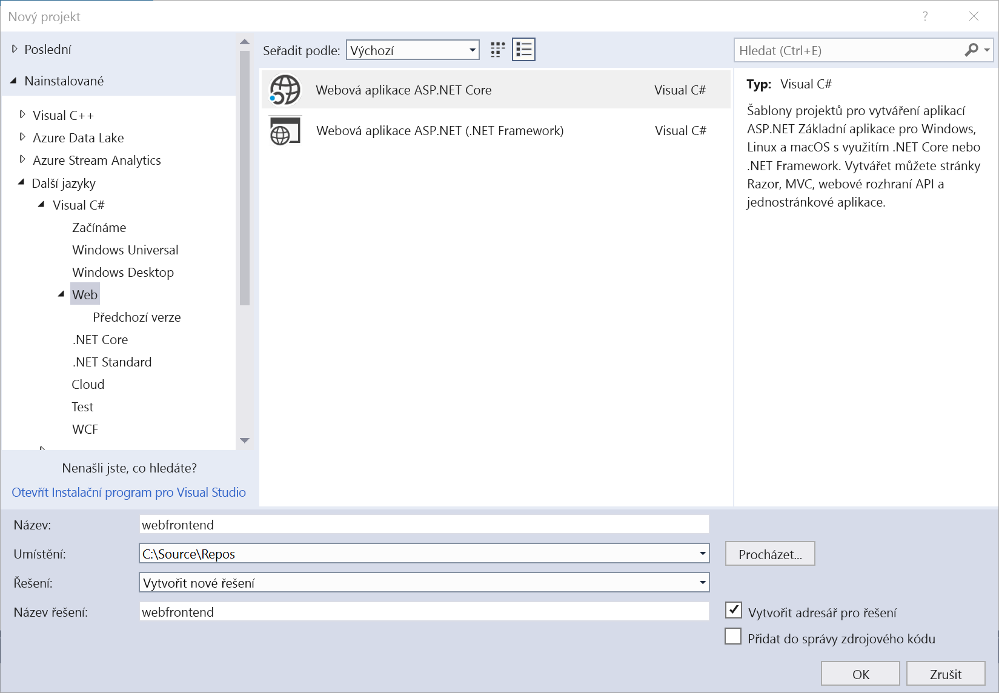
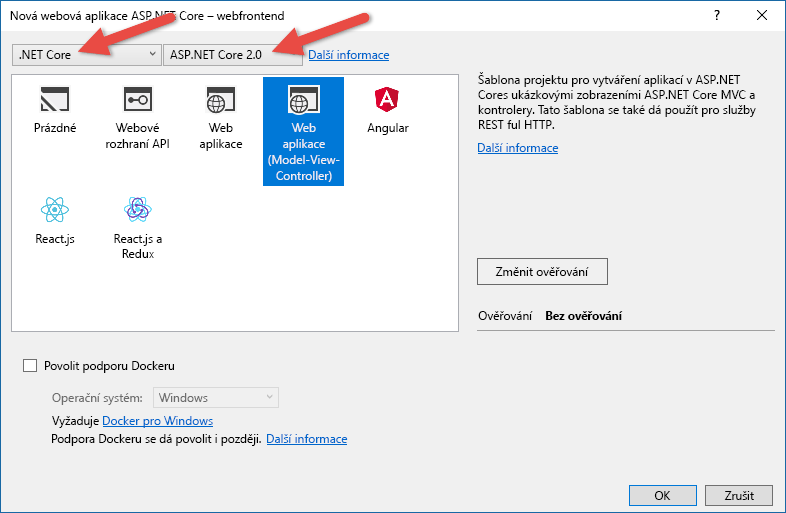
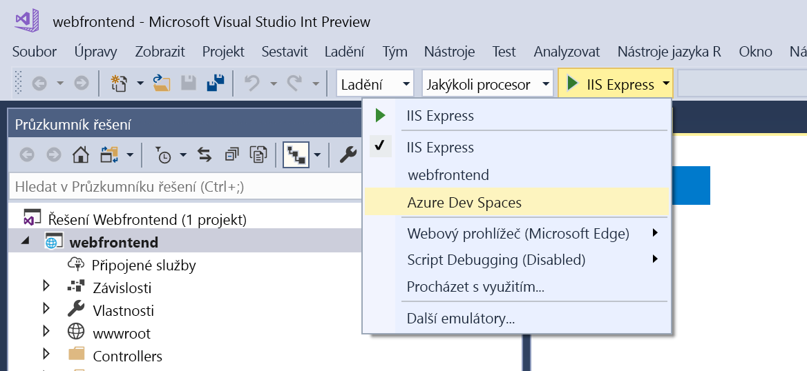
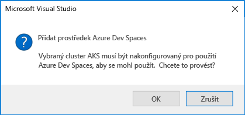
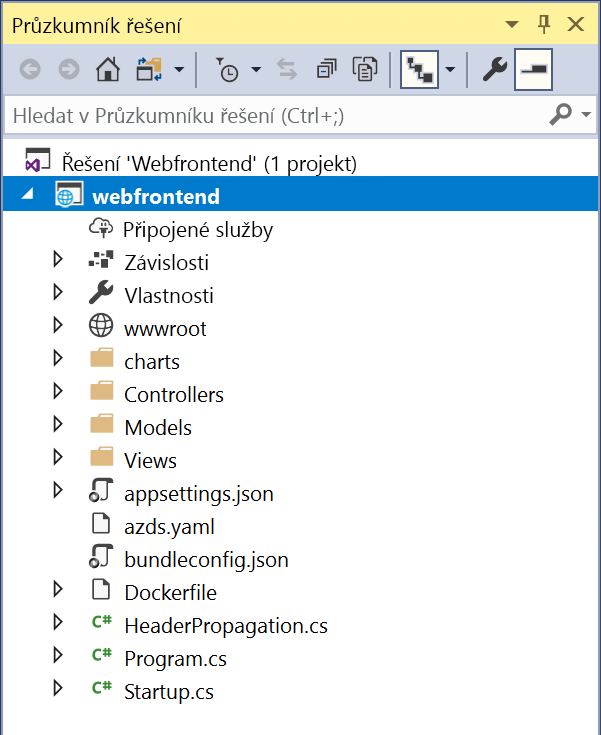

# Zahájení práce se službou Azure Dev Spaces s .NET Core a sadou Visual Studio

V tomto průvodci se naučíte:

- Nastavit Azure Dev Spaces se spravovaným clusterem Kubernetes v Azure
- Iterativně vyvíjet kód v kontejnerech pomocí sady Visual Studio
- Vyvíjet nezávisle dvě samostatné služby a pomocí zjišťování služby DNS v Kubernetes volat jinou službu
- Produktivně vyvíjet a testovat kód v týmovém prostředí

> [!Note]
> **Pokud se někde zaseknete**, podívejte se do části [Řešení potíží](troubleshooting.md) nebo na tuto stránku přidejte komentář.

## Vytvoření clusteru Kubernetes s podporou Azure Dev Spaces

1. Přihlaste se k webu Azure Portal na adrese http://portal.azure.com.
1. Zvolte **Vytvořit prostředek**, vyhledejte **Kubernetes** a vyberte **Služba Kubernetes** > **Vytvořit**.

   Pod jednotlivými nadpisy formuláře pro vytvoření clusteru AKS proveďte následující kroky.

    - **PODROBNOSTI O PROJEKTU:** Vyberte předplatné Azure a novou nebo existující skupinu prostředků Azure.
    - **PODROBNOSTI O CLUSTERU:** Zadejte název, oblast (v současné době můžete vybrat pouze oblast USA – východ, USA – východ 2, USA – střed, Západní Evropa, USA – západ 2, Jihovýchodní Asie, Kanada – střed nebo Kanada – východ), verzi a předponu názvu DNS pro cluster AKS.
    - **ŠKÁLOVÁNÍ:** Vyberte velikost virtuálního počítače pro uzly agentů AKS a počet uzlů. Pokud s Azure Dev Spaces začínáte, na prozkoumání všech funkcí vám stačí jeden uzel. Počet uzlů můžete po nasazení clusteru kdykoli snadno upravit. Mějte na paměti, že velikost virtuálního počítače není možné po vytvoření clusteru AKS změnit. Pokud však potřebujete vertikálně navýšit kapacitu, po nasazení clusteru AKS můžete snadno vytvořit nový cluster AKS s většími virtuálními počítači a pomocí Dev Spaces provést opětovné nasazení do tohoto většího clusteru.

   Nezapomeňte vybrat Kubernetes verze 1.9.6 nebo novější.

   

   Po dokončení vyberte **Další: Ověřování**.

1. Vyberte požadované nastavení pro řízení přístupu na základě role (RBAC). Služba Azure Dev Spaces podporuje clustery s vypnutým i zapnutým řízením přístupu na základě role.

    

1. Ujistěte se, že je povolené směrování aplikace HTTP.

   

    > [!Note]
    > Pokud chcete povolit [Směrování aplikace HTTP](/azure/aks/http-application-routing) v existujícím clusteru, použijte tento příkaz: `az aks enable-addons --resource-group myResourceGroup --name myAKSCluster --addons http_application_routing`

1. Vyberte **Zkontrolovat a vytvořit** a po dokončení vyberte **Vytvořit**.

## Získání nástrojů sady Visual Studio
1. Nainstalujte nejnovější verzi sady [Visual Studio 2017](https://www.visualstudio.com/vs/).
1. V instalačním programu sady Visual Studio se ujistěte, že je vybraná následující úloha:
    * Vývoj pro ASP.NET a web
1. Nainstalujte [Visual Studio Tools for Kubernetes](https://aka.ms/get-azds-visualstudio).

## Vytvoření webové aplikace spuštěné v kontejneru

V této části vytvoříte webovou aplikaci ASP.NET Core a spustíte ji v kontejneru v Kubernetes.

### Vytvoření webové aplikace ASP.NET

V sadě Visual Studio 2017 vytvořte nový projekt. V současné době se musí jednat o projekt **Webová aplikace ASP.NET Core**. Dejte projektu název **webfrontend**.

Vyberte šablonu **Webová aplikace (model-zobrazení-kontroler)** a ujistěte se, že jsou ve dvou rozevíracích seznamech v horní části dialogového okna vybrané položky **.NET Core** a **ASP.NET Core 2.0**. Projekt vytvoříte kliknutím na **OK**.

### Povolení služby Dev Spaces pro cluster AKS

V projektu, který jste právě vytvořili, vyberte v rozevíracím okně nastavení spouštění **Azure Dev Spaces**, jak je znázorněno na následujícím obrázku.

V dalším zobrazeném dialogovém okně zkontrolujte, jestli jste přihlášení pomocí správného účtu, a potom vyberte existující cluster Kubernetes.

V rozevíracím seznamu **Space** (Prostor) zatím nechte vybranou položku `default`. O této možnosti se později dozvíte víc. Zaškrtněte políčko **Publicly Accessible** (Veřejně přístupný), aby byla webová aplikace přístupná prostřednictvím veřejného koncového bodu. Toto nastavení není povinné, ale v rámci tohoto názorného postupu nám pomůže předvést některé koncepty. Nemusíte si ale dělat starosti, v každém případě totiž budete moct ladit svůj web pomocí sady Visual Studio.

Klikněte na **OK** a vyberte nebo vytvořte cluster.

Pokud zvolíte cluster, který není povolený pro práci s Azure Dev Spaces, zobrazí se zpráva s dotazem, jestli ho chcete nakonfigurovat.

Vyberte **OK**.

> [!IMPORTANT]
> Proces konfigurace Azure Dev mezery se odeberou `azds` oboru názvů v clusteru, pokud existuje.

 K provedení této akce se spustí úloha na pozadí. Dokončí se za několik minut. Pokud chcete zjistit, jestli se úloha pořád vytváří, podržte ukazatel myši nad ikonou **úloh na pozadí** v levém dolním rohu stavového řádku, jak znázorňuje následující obrázek.

> [!Note]
> Dokud se vývojový prostor úspěšně nevytvoří, nemůžete ladit aplikaci.

### Prohlédnutí souborů přidaných do projektu
Během čekání na vytvoření vývojového prostoru se podívejte na soubory, které se přidaly do vašeho projektu, když jste zvolili použití vývojového prostoru.

Nejdřív uvidíte, že se přidala složka s názvem `charts` a v ní se vygeneroval [graf Helm](https://docs.helm.sh) pro vaši aplikaci. Tyto soubory slouží k nasazení vaší aplikace do vývojového prostoru.

Uvidíte, že se přidal soubor s názvem `Dockerfile`. Tento soubor obsahuje informace potřebné k zabalení vaší aplikace ve standardním formátu Dockeru.

Nakonec uvidíte soubor `azds.yaml`, který obsahuje konfiguraci v době vývoje, kterou vývojový prostor potřebuje.

## Ladění kontejneru v Kubernetes
Po úspěšném vytvoření vývojového prostoru můžete začít ladit aplikaci. Nastavte v kódu zarážku, třeba na řádku 20 v souboru `HomeController.cs`, kde je nastavená proměnná `Message`. Ladění spustíte kliknutím na **F5**. 

Visual Studio bude komunikovat s vývojovým prostorem, aby se mohla aplikace sestavit a nasadit, a potom otevře prohlížeč se spuštěnou webovou aplikací. I když to může vypadat, že kontejner je spuštěný lokálně, ve skutečnosti je spuštěný ve vývojovém prostoru v Azure. Adresa místního hostitele se zobrazuje proto, že služba Azure Dev Spaces vytvoří dočasný tunel SSH do kontejneru spuštěného v AKS.

Zarážku aktivujete kliknutím na odkaz **O aplikaci** v horní části stránky. Máte plný přístup k informacím o ladění, jako jsou zásobník volání, místní proměnné, informace o výjimkách apod., úplně stejně jako při místním spuštění kódu.

## Iterativní vývoj kódu

Azure Dev Spaces neslouží jenom ke spuštění kódu v prostředí Kubernetes. Umožňuje také rychle opakovaně prohlížet změny kódu, ke kterým dochází v prostředí Kubernetes v cloudu.

### Aktualizace souboru obsahu
1. Najděte soubor `./Views/Home/Index.cshtml` a upravte kód HTML. Můžete změnit řádek 70, na kterém je `<h2>Application uses</h2>`, třeba takto: `<h2>Hello k8s in Azure!</h2>`
1. Uložte soubor.
1. Přejděte do prohlížeče a aktualizujte stránku. Na webové stránce by se měl zobrazit aktualizovaný kód HTML.

Co se stalo? Úpravy souborů obsahu jako HTML a CSS nevyžadují rekompilaci ve webové aplikaci .NET Core. Aktivní relace F5 totiž automaticky synchronizuje všechny upravené soubory obsahu do kontejneru spuštěného v AKS, abyste změny obsahu viděli okamžitě.

### Aktualizace souboru s kódem
Aktualizace souborů s kódem je o něco pracnější, protože aplikace .NET Core musí znovu sestavit a vytvořit aktualizované binární soubory aplikace.

1. Zastavte ladicí program v sadě Visual Studio.
1. Otevřete soubor s kódem, který se jmenuje `Controllers/HomeController.cs`, a upravte zprávu, která se zobrazí na stránce O aplikaci: `ViewData["Message"] = "Your application description page.";`
1. Uložte soubor.
1. Stisknutím klávesy **F5** znovu spusťte ladění. 

Místo opětovného sestavení a nasazení nové image kontejneru po každé provedené změně, což často dlouho trvá, rekompiluje služba Azure Dev Spaces kód po přírůstcích ve stávajícím kontejneru, aby se zrychlil cyklus úprav/ladění.

Aktualizujte webovou aplikaci v prohlížeči a přejděte na stránku O aplikaci. V uživatelském rozhraní by se měla zobrazit vaše upravená zpráva.

## Další postup

> [!div class="nextstepaction"]
> [Informace o týmovém vývoji](team-development-netcore-visualstudio.md)
