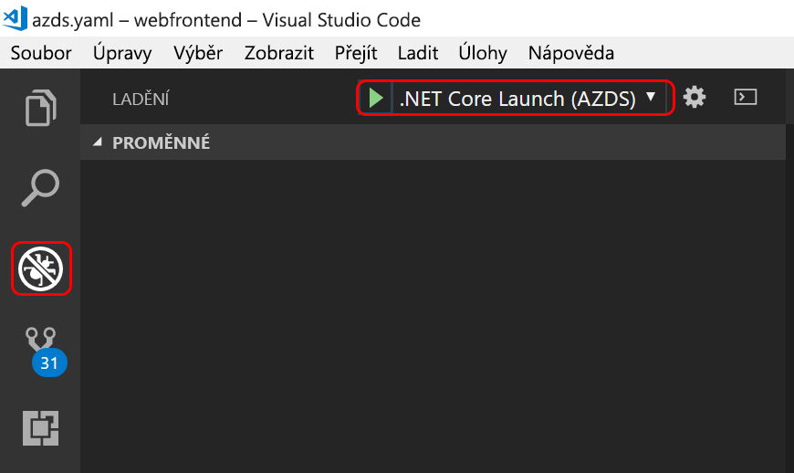

# <a name="get-started-on-azure-dev-spaces-with-net-core"></a>Začínáme s .NET Core v Azure Dev Spaces

V tomto průvodci se naučíte:

- Vytvořit v Azure prostředí založené na Kubernetes, které je optimalizované pro vývoj – _vývojářský prostor_
- Iterativně vyvíjet kód v kontejnerech pomocí editoru VS Code a příkazového řádku
- Produktivně vyvíjet a testovat kód v týmovém prostředí

> [!Note]
> **Pokud se někde zaseknete**, podívejte se do části [Řešení potíží](troubleshooting.md) nebo na tuto stránku přidejte komentář.

Teď můžete v Azure vytvořit vývojový prostor založený na Kubernetes.

## <a name="install-the-azure-cli"></a>Instalace rozhraní příkazového řádku Azure CLI
Azure Dev Spaces vyžaduje minimální nastavení místního počítače. Většina konfigurace vývojového prostoru se ukládá do cloudu, aby ji šlo sdílet s ostatními uživateli. Váš místní počítač může používat systém Windows, Mac nebo Linux. V případě Linuxu se podporují následující distribuce: Ubuntu (18.04, 16.04 a 14.04), Debian 8 a 9, RHEL 7, Fedora 26 a novější, CentOS 7, openSUSE 42.2 a SLES 12.

Nejdřív si stáhněte a spusťte [rozhraní příkazového řádku Azure](/cli/azure/install-azure-cli?view=azure-cli-latest). 

> [!IMPORTANT]
> Pokud už máte Azure CLI nainstalované, ujistěte se, že používáte verzi 2.0.43 nebo novější.

### <a name="sign-in-to-azure-cli"></a>Přihlášení k Azure CLI
Přihlaste se k Azure. V okně terminálu zadejte následující příkaz:

```cmd
az login
```

> [!Note]
> Pokud nemáte předplatné Azure, můžete si vytvořit [bezplatný účet](https://azure.microsoft.com/free).

#### <a name="if-you-have-multiple-azure-subscriptions"></a>Pokud máte více předplatných Azure...
Svoje předplatná můžete zobrazit spuštěním tohoto příkazu: 

```cmd
az account list
```
Vyhledejte předplatné, které ve výstupu JSON obsahuje: `isDefault: true`.
Pokud se nejedná o předplatné, které chcete použít, můžete výchozí předplatné změnit:

```cmd
az account set --subscription <subscription ID>
```

## <a name="create-a-kubernetes-cluster-enabled-for-azure-dev-spaces"></a>Vytvoření clusteru Kubernetes s podporou Azure Dev Spaces

Na příkazovém řádku vytvořte skupinu prostředků. Použijte některou z aktuálně podporovaných oblastí (USA – východ, USA – východ 2, USA – střed, USA – západ 2, Západní Evropa, Jihovýchodní Asie, Kanada – střed nebo Kanada – východ).

```cmd
az group create --name MyResourceGroup --location <region>
```

Pomocí následujícího příkazu vytvořte cluster Kubernetes:

```cmd
az aks create -g MyResourceGroup -n MyAKS --location <region> --kubernetes-version 1.11.2 --enable-addons http_application_routing --generate-ssh-keys
```

Vytvoření clusteru bude trvat několik minut.

### <a name="configure-your-aks-cluster-to-use-azure-dev-spaces"></a>Konfigurace clusteru AKS, aby používal Azure Dev Spaces

Zadejte následující příkaz Azure CLI se skupinou prostředků, která obsahuje váš cluster AKS, a názvem clusteru AKS. Příkaz nakonfiguruje cluster, aby podporoval Azure Dev Spaces.

   ```cmd
   az aks use-dev-spaces -g MyResourceGroup -n MyAKS
   ```

## <a name="get-kubernetes-debugging-for-vs-code"></a>Získání ladění Kubernetes pro VS Code
Výkonné funkce, jako je ladění Kubernetes, jsou prostřednictvím editoru VS Code k dispozici vývojářům .NET Core a Node.js.

1. Pokud [VS Code](https://code.visualstudio.com/Download) nemáte, nainstalujte si ho.
1. Stáhněte a nainstalujte [rozšíření VS Azure Dev Spaces](https://marketplace.visualstudio.com/items?itemName=azuredevspaces.azds). Klikněte na Nainstalovat jednou na stránce rozšíření na webu Marketplace a pak znovu ve VS Code. 

## <a name="create-a-web-app-running-in-a-container"></a>Vytvoření webové aplikace spuštěné v kontejneru

V této části vytvoříte webovou aplikaci ASP.NET Core a spustíte ji v kontejneru v Kubernetes.

### <a name="create-an-aspnet-core-web-app"></a>Vytvoření webové aplikace ASP.NET Core
Pokud jste si nainstalovali [.NET Core](https://www.microsoft.com/net), můžete ve složce `webfrontend` rychle vytvořit webovou aplikaci ASP.NET Core.
    
```cmd
dotnet new mvc --name webfrontend
```

Nebo si **stáhněte ukázkový kód z GitHubu**. Přejděte na https://github.com/Azure/dev-spaces a vyberte **Clone or Download** (Klonovat nebo stáhnout), abyste úložiště GitHub stáhli do místního prostředí. Kód tohoto průvodce je tady: `samples/dotnetcore/getting-started/webfrontend`.

## <a name="preparing-code-for-docker-and-kubernetes-development"></a>Příprava kódu pro vývoj v Dockeru a Kubernetes
Zatím máte základní webovou aplikaci, kterou můžete spustit místně. Teď ji vytvořením prostředků, které definují kontejner aplikace a způsob nasazení do Kubernetes, kontejnerizujete. Tento úkol snadno provedete v Azure Dev Spaces: 

1. Spusťte VS Code a otevřete složku `webfrontend`. (Případné výchozí výzvy ohledně přidání prostředků ladění nebo obnovení projektu můžete ignorovat.)
1. Otevřete ve VS Code integrovaný terminál (v nabídce **Zobrazení > Integrovaný terminál**).
1. Spusťte následující příkaz (přesvědčte se, že je aktuálním adresářem **webfrontend**):

    ```cmd
    azds prep --public
    ```

Příkaz Azure CLI `azds prep` vygeneruje prostředky Dockeru a Kubernetes s výchozím nastavením:
* `./Dockerfile` popisuje image kontejneru aplikace a způsob vytvoření a běhu zdrojového kódu v rámci kontejneru.
* [Helm chart](https://docs.helm.sh) v `./charts/webfrontend` popisuje, jak do Kubernetes nasadit kontejner.

Celému obsahu těchto souborů prozatím rozumět nemusíte. Stojí však za zmínku, že **stejné prostředky konfigurace jako kódu pro Kubernetes a Docker můžete používat v různých fázích od vývoje až po produkci, takže si napříč různými prostředími zajistíte lepší konzistentnost**.
 
Příkaz `prep` také vygeneruje soubor s názvem `./azds.yaml`, což je konfigurační soubor pro Azure Dev Spaces. Doplňuje artefakty Dockeru a Kubernetes další konfigurací, která v Azure zapne iterativní vývojové prostředí.

## <a name="build-and-run-code-in-kubernetes"></a>Sestavení a spuštění kódu v Kubernetes
Teď spustíme náš kód! V okně terminálu spusťte tento příkaz z **kořenové složky kódu** webfrontend:

```cmd
azds up
```

Sledujte výstup příkazu. Během jeho zpracování si můžete všimnout několika věcí:
- Zdrojový kód je synchronizovaný s vývojářským prostorem v Azure.
- V Azure se vytvoří image kontejneru, jak určuje prostředek Docker ve složce kódu.
- Vytvoří se objekty Kubernetes, které využívají image kontejneru podle specifikace Helm Chart ve složce kódu.
- Zobrazí se informace o koncových bodech kontejneru. V našem případě očekáváme veřejnou adresu URL protokolu HTTP.
- Za předpokladu, že se výše uvedené fáze úspěšně dokončily, měl by se začít zobrazovat výstup `stdout` (a `stderr`), jak se kontejner spouští.

> [!Note]
> Při prvním spuštění příkazu `up` budou tyto kroky trvat déle, ale následná spuštění by měla být rychlejší.

### <a name="test-the-web-app"></a>Test webové aplikace
Ve výstupu konzoly vyhledejte informace o veřejné adrese URL, kterou vytvořil příkaz `up`. Bude v tomto tvaru: 

```
(pending registration) Service 'webfrontend' port 'http' will be available at <url>
Service 'webfrontend' port 80 (TCP) is available at http://localhost:<port>
```

Tuto adresu URL otevřete v okně prohlížeče. Mělo by se zobrazit načítání webové aplikace. Během spouštění kontejneru se výstup `stdout` a `stderr` streamuje do okna terminálu.

> [!Note]
> Při prvním spuštění může příprava veřejného záznamu DNS trvat několik minut. Pokud se veřejná adresa URL nepřeloží, můžete použít alternativní adresu URL http://localhost:<portnumber>, která se zobrazí ve výstupu konzoly. Pokud použijete adresu URL místního hostitele, může se zdát, že je kontejner spuštěný v místním prostředí, ale ve skutečnosti je spuštěný v AKS. Pro usnadnění práce a jednodušší interakci se službou z místního počítače vytvoří Azure Dev Spaces dočasný tunel SSH do kontejneru spuštěného v Azure. Můžete se vrátit a vyzkoušet veřejnou adresu URL později, jakmile bude záznam DNS připravený.

### <a name="update-a-content-file"></a>Aktualizace souboru obsahu
Azure Dev Spaces neslouží jenom ke spuštění kódu v prostředí Kubernetes. Umožňuje také rychle opakovaně prohlížet změny kódu, ke kterým dochází v prostředí Kubernetes v cloudu.

1. Najděte soubor `./Views/Home/Index.cshtml` a upravte kód HTML. Můžete změnit řádek 70, na kterém je `<h2>Application uses</h2>`, třeba takto: `<h2>Hello k8s in Azure!</h2>`
1. Uložte soubor. Za chvilku se v okně terminálu zobrazí zpráva o aktualizaci souboru ve spuštěném kontejneru.
1. Přejděte do prohlížeče a aktualizujte stránku. Na webové stránce by se měl zobrazit aktualizovaný kód HTML.

Co se stalo? Úpravy obsahových souborů jako HTML a CSS nevyžadují rekompilaci ve webové aplikaci .NET Core. Aktivní příkaz `azds up` totiž automaticky synchronizuje všechny upravené soubory obsahu do kontejneru spuštěného v Azure, abyste změny obsahu viděli okamžitě.

### <a name="update-a-code-file"></a>Aktualizace souboru s kódem
Aktualizace souborů s kódem je o něco pracnější, protože aplikace .NET Core musí znovu sestavit a vytvořit aktualizované binární soubory aplikace.

1. V okně terminálu stiskněte `Ctrl+C`, abyste zastavili `azds up`.
1. Otevřete soubor s kódem, který se jmenuje `Controllers/HomeController.cs`, a upravte zprávu, která se zobrazí na stránce O aplikaci: `ViewData["Message"] = "Your application description page.";`
1. Uložte soubor.
1. V okně terminálu spusťte `azds up`. 

Tento příkaz znovu sestaví image kontejneru a znovu nasadí Helm chart. Pokud chcete vidět, jak se změny kódu projevily v běžící aplikaci, přejděte do nabídky O aplikaci webové aplikace.


Existuje ještě *rychlejší způsob* vývoje kódu, který si ukážeme v další části. 

## <a name="debug-a-container-in-kubernetes"></a>Ladění kontejneru v Kubernetes

V této části použijete editor VS Code k přímému ladění kontejneru spuštěného v Azure. Naučíte se také, jak zrychlit cyklus úpravy-spuštění-testování.


> [!Note]
> **Pokud se někde zaseknete**, podívejte se do části [Řešení potíží](troubleshooting.md) nebo na tuto stránku přidejte komentář.

### <a name="initialize-debug-assets-with-the-vs-code-extension"></a>Inicializace prostředků ladění s využitím rozšíření VS Code
Nejdřív musíte nakonfigurovat projekt kódu tak, aby editor VS Code komunikoval s naším vývojářským prostorem v Azure. Rozšíření VS Code pro Azure Dev Spaces poskytuje pomocný příkaz pro nastavení konfigurace ladění. 

Otevřete **paletu příkazů** (pomocí nabídky **Zobrazit | Paleta příkazů**) a pomocí automatického dokončování zadejte a vyberte tento příkaz: `Azure Dev Spaces: Prepare configuration files for Azure Dev Spaces`. 

Tím přidáte konfiguraci ladění pro Azure Dev Spaces do složky `.vscode`. Nezaměňujte tento příkaz s příkazem `azds prep`, který projekt nakonfiguruje pro nasazení.


### <a name="select-the-azds-debug-configuration"></a>Výběr konfiguraci AZDS pro ladění
1. Pokud chcete zobrazit ladění, klikněte na boku editoru VS Code na **panelu aktivit** na ikonu Ladění.
1. Jako aktivní konfiguraci ladění vyberte **.NET Core Launch (AZDS)** (Spustit .NET Core (AZDS)).



> [!Note]
> Pokud na paletě příkazů nevidíte příkazy Azure Dev Spaces, ověřte, že máte nainstalované rozšíření VS Code pro Azure Dev Spaces. Ujistěte se, že pracovní prostor, který jste otevřeli ve VS Code, je složka obsahující soubor azds.yaml.


### <a name="debug-the-container-in-kubernetes"></a>Ladění kontejneru v Kubernetes
Když chcete v Kubernetes ladit kód, stiskněte **F5**.

Stejně jako u příkazu `up` se kód synchronizuje s vývojovým prostorem a sestaví se kontejner, který se nasadí v Kubernetes. Ladicí program se tentokrát samozřejmě připojí ke vzdálenému kontejneru.

> [!Tip]
> Na stavovém řádku editoru VS Code se zobrazí adresa URL, na kterou můžete kliknout.


V serverovém souboru s kódem nastavte zarážku, třeba ve funkci `Index()` ve zdrojovém souboru `Controllers/HomeController.cs`. Aktualizace stránky prohlížeče způsobí aktivaci zarážky.

Máte plný přístup k informacím o ladění, jako je zásobník volání, místní proměnné, informace o výjimkách apod., stejně jako při lokálním spuštění kódu.

### <a name="edit-code-and-refresh"></a>Úprava a aktualizace kódu
V aktivním ladicím programu upravte kód. Můžete třeba změnit zprávu na stránce O aplikaci v `Controllers/HomeController.cs`. 

```csharp
public IActionResult About()
{
    ViewData["Message"] = "My custom message in the About page.";
    return View();
}
```

Uložte soubor a v **podokně akcí ladicího programu** klikněte na tlačítko **Aktualizovat**. 


Místo opětovného sestavení a nasazení nové image kontejneru po každé provedené změně, což často dlouho trvá, rekompiluje služba Azure Dev Spaces kód po přírůstcích ve stávajícím kontejneru, aby se zrychlil cyklus úprav/ladění.

Aktualizujte webovou aplikaci v prohlížeči a přejděte na stránku O aplikaci. V uživatelském rozhraní by se měla zobrazit vaše upravená zpráva.

**Teď máte metodu, jak rychle provádět iteraci kódu a jeho ladění v Kubernetes.** Příště si ukážeme, jak vytvořit a volat druhý kontejner.

## <a name="next-steps"></a>Další postup

> [!div class="nextstepaction"]
> [Informace o týmovém vývoji](team-development-netcore.md)
