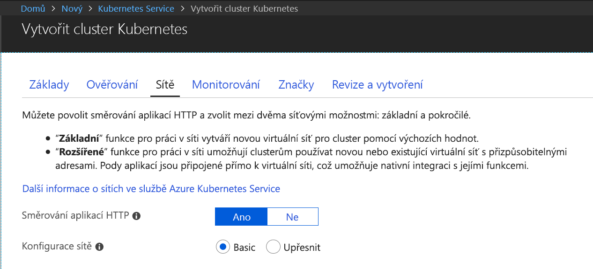
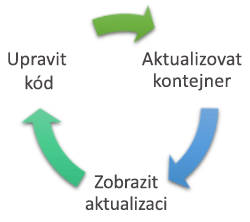
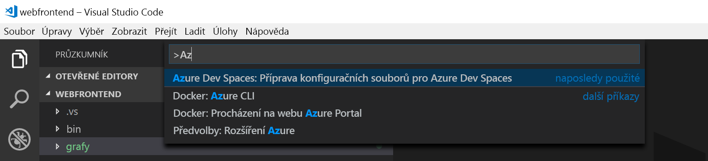
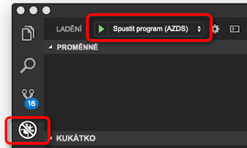
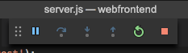

# <a name="quickstart-create-a-kubernetes-dev-space-with-azure-dev-spaces-nodejs"></a>Rychlý start: Vytvoření vývojového prostoru Kubernetes pomocí služby Azure Dev Spaces (Node.js)

V tomto průvodci se naučíte:

- Nastavit Azure Dev Spaces se spravovaným clusterem Kubernetes v Azure
- Iterativně vyvíjet kód v kontejnerech pomocí editoru VS Code a příkazového řádku
- Ladit kód běžící v clusteru

> [!Note]
> **Pokud se někde zaseknete**, podívejte se na článek o [odstraňování potíží](troubleshooting.md) nebo na tuto stránku přidejte komentář. Můžete také zkusit postupovat podle podrobnějšího [kurzu](get-started-nodejs.md).

## <a name="prerequisites"></a>Požadavky

- Předplatné Azure. Pokud nemáte předplatné Azure, můžete si vytvořit [bezplatný účet](https://azure.microsoft.com/free).
- [Cluster Kubernetes](https://ms.portal.azure.com/#create/microsoft.aks) na platformě Kubernetes 1.10.3 v oblasti USA – východ, USA – střed, USA – západ 2, Západní Evropa, Kanada – střed nebo Kanada – východ s povolenou možností **Směrování aplikace HTTP**.

  

- Editor Visual Studio Code, který si můžete stáhnout [odtud](https://code.visualstudio.com/download).

## <a name="set-up-azure-dev-spaces"></a>Nastavení služby Azure Dev Spaces

1. Nainstalujte si [Azure CLI](/cli/azure/install-azure-cli?view=azure-cli-latest) (verze 2.0.38 nebo novější).
1. Nastavte službu Dev Spaces v clusteru AKS: `az aks use-dev-spaces -g MyResourceGroup -n MyAKS`.
1. Stáhněte si [rozšíření Azure Dev Spaces](https://aka.ms/get-azds-code) pro VS Code. Klikněte na Nainstalovat jednou na stránce rozšíření na webu Marketplace a pak znovu ve VS Code.

## <a name="build-and-run-code-in-kubernetes"></a>Sestavení a spuštění kódu v Kubernetes

1. Stáhněte si ukázkový kód z GitHubu: [https://github.com/Azure/dev-spaces](https://github.com/Azure/dev-spaces). 
1. Změňte adresář na složku webfrontend: `cd dev-spaces/samples/nodejs/getting-started/webfrontend`.
1. Vygenerujte prostředky pro Docker a Helm chart: `azds prep --public`.
1. Sestavte a spusťte kód v AKS. V okně terminálu ve **složce webfrontend** spusťte tento příkaz: `azds up`
1. Ve výstupu konzoly vyhledejte informace o adrese URL, kterou vytvořil příkaz `up`. Bude v tomto tvaru: 

   `Service 'webfrontend' port 'http' is available at <url>` 

   Tuto adresu URL otevřete v okně prohlížeče. Mělo by se zobrazit načítání webové aplikace. Během spouštění kontejneru se výstup `stdout` a `stderr` streamuje do okna terminálu.
   
   > [!Note]
   > Při prvním spuštění může příprava veřejného záznamu DNS trvat několik minut. Pokud se veřejná adresa URL nepřeloží, můžete použít alternativní adresu URL http://localhost:<portnumber>, která se zobrazí ve výstupu konzoly. Pokud použijete adresu URL místního hostitele, může se zdát, že je kontejner spuštěný v místním prostředí, ale ve skutečnosti je spuštěný v AKS. Pro usnadnění práce a jednodušší interakci se službou z místního počítače vytvoří Azure Dev Spaces dočasný tunel SSH do kontejneru spuštěného v Azure. Můžete se vrátit a vyzkoušet veřejnou adresu URL později, jakmile bude záznam DNS připravený.

### <a name="update-a-content-file"></a>Aktualizace souboru obsahu
Azure Dev Spaces neslouží jenom ke spuštění kódu v prostředí Kubernetes. Umožňuje také rychle opakovaně prohlížet změny kódu, ke kterým dochází v prostředí Kubernetes v cloudu.

1. Najděte soubor `./public/index.html` a upravte kód HTML. Můžete třeba změnit barvu pozadí stránky na odstín modré:

    ```html
    <body style="background-color: #95B9C7; margin-left:10px; margin-right:10px;">
    ```

1. Uložte soubor. Za chvilku se v okně terminálu zobrazí zpráva o aktualizaci souboru ve spuštěném kontejneru.
1. Přejděte do prohlížeče a aktualizujte stránku. Měli byste vidět novou barvu.

Co se stalo? Úpravy souborů obsahu, jako je HTML a CSS, nevyžadují restartování procesu Node.js. Aktivní příkaz `azds up` automaticky synchronizuje změněné soubory obsahu přímo se spuštěným kontejnerem v Azure, abyste si mohli rychle prohlédnout upravený obsah.

### <a name="test-from-a-mobile-device"></a>Testování na mobilním zařízení
Otevřete webovou aplikaci na mobilním zařízení s použitím veřejné adresy URL webového front-endu. Adresu URL můžete zkopírovat na svém stolním počítači a odeslat ji do zařízení, abyste ji nemuseli celou zadávat. Po načtení webové aplikace na mobilním zařízení si můžete všimnout, že na malém zařízení se uživatelské rozhraní nezobrazuje správně.

Opravíte to tak, že přidáte metaznačku `viewport`:
1. Otevřete soubor `./public/index.html`.
1. Do stávajícího prvku `head` přidejte metaznačku `viewport`:

    ```html
    <head>
        <!-- Add this line -->
        <meta name="viewport" content="width=device-width, initial-scale=1">
    </head>
    ```

1. Uložte soubor.
1. Aktualizujte prohlížeč zařízení. Webová aplikace by se měla vykreslit správně. 

Na tomto příkladu je vidět, že některé problémy nezjistíte, dokud aplikaci neotestujete na zařízení, pro které je určená. V Azure Dev Spaces můžete rychle iterovat kód a ověřovat změny na cílových zařízeních.

### <a name="update-a-code-file"></a>Aktualizace souboru s kódem
Aktualizace souborů s kódem na straně serveru je pracnější, protože aplikaci Node.js je potřeba restartovat.

1. V okně terminálu stiskněte `Ctrl+C` (kvůli zastavení `azds up`).
1. Otevřete soubor s kódem nazvaný `server.js` a změňte úvodní zprávu služby: 

    ```javascript
    res.send('Hello from webfrontend running in Azure!');
    ```

3. Uložte soubor.
1. V okně terminálu spusťte `azds up`. 

Tím znovu sestavíte image kontejneru a znovu nasadíte Helm chart. Načtěte znovu stránku prohlížeče a podívejte se, jestli se promítly změny kódu.

Existuje ještě *rychlejší způsob* vývoje kódu, který si ukážeme v další části. 

## <a name="debug-a-container-in-kubernetes"></a>Ladění kontejneru v Kubernetes

V této části použijete editor VS Code k přímému ladění kontejneru spuštěného v Azure. Naučíte se také, jak zrychlit cyklus úpravy-spuštění-testování.



### <a name="initialize-debug-assets-with-the-vs-code-extension"></a>Inicializace prostředků ladění s využitím rozšíření VS Code
Nejdřív musíte nakonfigurovat projekt kódu tak, aby editor VS Code komunikoval s naším vývojářským prostorem v Azure. Rozšíření VS Code pro Azure Dev Spaces poskytuje pomocný příkaz pro nastavení konfigurace ladění. 

Otevřete **paletu příkazů** (pomocí nabídky **Zobrazit | Paleta příkazů**) a pomocí automatického dokončování zadejte a vyberte tento příkaz: `Azure Dev Spaces: Prepare configuration files for Azure Dev Spaces`.

Tím přidáte konfiguraci ladění pro Azure Dev Spaces do složky `.vscode`.



### <a name="select-the-azds-debug-configuration"></a>Výběr konfiguraci AZDS pro ladění
1. Pokud chcete zobrazit ladění, klikněte na boku editoru VS Code na **panelu aktivit** na ikonu Ladění.
1. Jako aktivní ladicí konfiguraci vyberte **Launch Program (AZDS)**.



> [!Note]
> Pokud na paletě příkazů nevidíte příkazy Azure Dev Spaces, ověřte, že máte nainstalované rozšíření VS Code pro Azure Dev Spaces.

### <a name="debug-the-container-in-kubernetes"></a>Ladění kontejneru v prostředí Kubernetes
Když chcete v prostředí Kubernetes ladit kód, stiskněte **F5**.

Podobně jako při příkazu `up` se na začátku ladění synchronizuje kód s vývojovým prostorem a sestaví se kontejner, který se nasadí v Kubernetes. Tentokrát se ale ladicí program připojí ke vzdálenému kontejneru.

> [!Tip]
> Na stavovém řádku editoru VS Code se zobrazí adresa URL, na kterou můžete kliknout.

V serverovém souboru s kódem nastavte zarážku, třeba ve funkci `app.get('/api'...` v souboru `server.js`. Aktualizujte stránku prohlížeče nebo stiskněte aktualizační tlačítko. Měli byste se dostat k zarážce, abyste mohli procházet kód.

Máte plný přístup k informacím o ladění, jako je zásobník volání, místní proměnné, informace o výjimkách apod., úplně stejně jako při lokálním spuštění kódu.

### <a name="edit-code-and-refresh-the-debug-session"></a>Úprava kódu a aktualizace ladicí relace
V aktivním ladicím programu změňte kód. Můžete třeba znovu změnit text úvodní zprávy:

```javascript
app.get('/api', function (req, res) {
    res.send('**** Hello from webfrontend running in Azure! ****');
});
```

Uložte soubor a v **podokně akcí ladicího programu** klikněte na tlačítko **Aktualizovat**. 



Místo opětovného sestavení a nasazení nové image kontejneru po každé provedené změně, což často dlouho trvá, restartuje služba Azure Dev Spaces mezi ladicími relacemi proces Node.js, aby se zrychlil cyklus úprav a ladění.

Aktualizujte webovou aplikaci v prohlížeči nebo stiskněte tlačítko *Aktualizovat*. V uživatelském rozhraní by se měla zobrazit vaše upravená zpráva.

### <a name="use-nodemon-to-develop-even-faster"></a>Zrychlení vývoje nástrojem NodeMon

Ukázkový projekt `webfrontend` je nakonfigurovaný tak, aby používal nástroj [nodemon](https://nodemon.io/). Jde o oblíbený nástroj pro urychlení vývoje v Node.js, který je plně kompatibilní s Azure Dev Spaces.

Vyzkoušejte následující kroky:
1. Zastavte ladicí program VS Code.
1. Na boku editoru VS Code na **panelu aktivit** klikněte na ikonu Ladění. 
1. Jako aktivní konfiguraci ladění vyberte **Attach (AZDS)** (Připojit (AZDS)).
1. Stiskněte F5.

Při této konfiguraci kontejner spustí *nodemon*. Po úpravě kódu na straně serveru nástroj *nodemon* automaticky restartuje proces Node úplně stejně, jako při místním vývoji. 
1. Znovu upravte úvodní zprávu v souboru `server.js` a pak soubor uložte.
1. Obnovte prohlížeč nebo klikněte na tlačítko *Aktualizovat*, aby se změny projevily.

**Teď máte metodu, jak rychle provádět iteraci kódu a jeho ladění v Kubernetes.**

## <a name="next-steps"></a>Další kroky

> [!div class="nextstepaction"]
> [Práce s více kontejnery a týmový vývoj](team-development-nodejs.md)