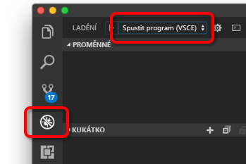

# <a name="quickstart-create-a-kubernetes-development-environment-with-azure-dev-spaces-nodejs"></a>Rychlý start: Vytvoření vývojového prostředí Kubernetes pomocí služby Azure Dev Spaces (Node.js)


[!INCLUDE[](includes/learning-objectives.md)]

[!INCLUDE[](includes/see-troubleshooting.md)]

Teď můžete v Azure vytvořit vývojové prostředí založené na systému Kubernetes.

[!INCLUDE[](includes/portal-aks-cluster.md)]

## <a name="install-the-azure-cli"></a>Instalace rozhraní příkazového řádku Azure CLI
Služba Azure Dev Spaces vyžaduje minimální nastavení místního počítače. Většina konfigurace vývojového prostředí se ukládá do cloudu, aby bylo možné ji sdílet s ostatními uživateli. Nejdřív si stáhněte a spusťte [rozhraní příkazového řádku Azure](/cli/azure/install-azure-cli?view=azure-cli-latest). 

> [!IMPORTANT]
> Pokud už máte rozhraní příkazového řádku Azure nainstalované, ujistěte se, že používáte verzi 2.0.32 nebo vyšší.

[!INCLUDE[](includes/sign-into-azure.md)]

[!INCLUDE[](includes/use-dev-spaces.md)]

[!INCLUDE[](includes/install-vscode-extension.md)]

Při čekání na vytvoření prostředí můžete začít psát kód.

## <a name="create-a-nodejs-container-in-kubernetes"></a>Vytvoření kontejneru Node.js v prostředí Kubernetes

V této části vytvoříte webovou aplikaci Node.js a spustíte ji v kontejneru v prostředí Kubernetes.

### <a name="create-a-nodejs-web-app"></a>Vytvoření webové aplikace Node.js
Stáhněte si kód z GitHubu. Přejděte na https://github.com/Azure/dev-spaces a vyberte **Clone or Download** (Klonovat nebo stáhnout), abyste úložiště GitHub stáhli do svého místního prostředí. Kód tohoto průvodce je tady: `samples/nodejs/getting-started/webfrontend`.

[!INCLUDE[](includes/azds-prep.md)]

[!INCLUDE[](includes/build-run-k8s-cli.md)]

### <a name="update-a-content-file"></a>Aktualizace souboru obsahu
Azure Dev Spaces neslouží jenom ke spuštění kódu v prostředí Kubernetes. Umožňuje také rychle opakovaně prohlížet změny kódu, ke kterým dochází v prostředí Kubernetes v cloudu.

1. Najděte soubor `./public/index.html` a upravte ho v HTML. Můžete třeba změnit barvu pozadí stránky na odstín modré:

    ```html
    <body style="background-color: #95B9C7; margin-left:10px; margin-right:10px;">
    ```

2. Uložte soubor. Za chvíli se v okně terminálu zobrazí zpráva o aktualizaci souboru ve spuštěném kontejneru.
1. Přejděte do prohlížeče a aktualizujte stránku. Měli byste vidět novou barvu.

Co se stalo? Úpravy souborů obsahu, jako je HTML a CSS, nevyžadují restartování procesu Node.js. Aktivní příkaz `azds up` automaticky synchronizuje změněné soubory obsahu přímo se spuštěným kontejnerem v Azure, abyste se mohli rychle podívat na změny obsahu.

### <a name="test-from-a-mobile-device"></a>Testování na mobilním zařízení
Pokud webovou aplikaci otevřete na mobilním zařízení, můžete si všimnout, že na malém zařízení se uživatelské rozhraní nezobrazuje správně.

Opravíte to tak, že přidáte metaznačku `viewport`:
1. Otevřete soubor `./public/index.html`.
1. Přidejte do stávajícího elementu `head` metaznačku `viewport`:

    ```html
    <head>
        <!-- Add this line -->
        <meta name="viewport" content="width=device-width, initial-scale=1">
    </head>
    ```

1. Uložte soubor.
1. Aktualizujte prohlížeč zařízení. Webová aplikace by se měla vykreslit správně. 

Na tomto příkladu je vidět, že některé problémy nezjistíte, dokud aplikaci neotestujete na zařízení, pro které je určená. Se službou VS Azure Dev Spaces můžete rychle iterovat kód a ověřovat změny na cílových zařízeních.

### <a name="update-a-code-file"></a>Aktualizace souboru s kódem
Aktualizace souborů s kódem na straně serveru je pracnější, protože aplikaci Node.js je potřeba restartovat.

1. V okně terminálu stiskněte `Ctrl+C`, abyste zastavili `azds up`.
1. Otevřete soubor s kódem nazvaný `server.js` a změňte úvodní zprávu služby: 

    ```javascript
    res.send('Hello from webfrontend running in Azure!');
    ```

3. Uložte soubor.
1. V okně terminálu spusťte `azds up`. 

Tím znovu sestavíte image kontejneru a znovu nasadíte Helm chart. Znovu načtěte stránku prohlížeče a podívejte se, jestli se promítly změny kódu.

Existuje ještě *rychlejší způsob* vývoje kódu, který si ukážeme v další části. 

## <a name="debug-a-container-in-kubernetes"></a>Ladění kontejneru v prostředí Kubernetes

[!INCLUDE[](includes/debug-intro.md)]

[!INCLUDE[](includes/init-debug-assets-vscode.md)]

### <a name="select-the-azds-debug-configuration"></a>Výběr konfigurace AZDS pro ladění
1. Pokud chcete zobrazit ladění, klikněte na boku editoru VS Code na **panelu aktivit** na ikonu Ladění.
1. Jako aktivní ladicí konfiguraci vyberte **Launch Program (AZDS)**.



> [!Note]
> Pokud na paletě příkazů nevidíte příkazy Azure Dev Spaces, ověřte, že máte nainstalované rozšíření VS Code pro Azure Dev Spaces.

### <a name="debug-the-container-in-kubernetes"></a>Ladění kontejneru v prostředí Kubernetes
Když chcete v prostředí Kubernetes ladit kód, stiskněte **F5**.

Podobně jako u příkazu `up` se na začátku ladění synchronizuje kód s vývojovým prostředím a sestaví se kontejner, který se nasadí v prostředí Kubernetes. Tentokrát se ale ladicí program připojí ke vzdálenému kontejneru.

[!INCLUDE[](includes/tip-vscode-status-bar-url.md)]

V serverovém souboru s kódem nastavte zarážku, třeba do `app.get('/api'...` v souboru `server.js`. Aktualizujte stránku prohlížeče nebo stiskněte aktualizační tlačítko. Měli byste narazit na zarážku, abyste mohli procházet kód.

Máte plný přístup k informacím o ladění, jako je zásobník volání, místní proměnné, informace o výjimkách apod., úplně stejně jako při lokálním spuštění kódu.

### <a name="edit-code-and-refresh-the-debug-session"></a>Úprava kódu a aktualizace ladicí relace
V aktivním ladicím programu změňte kód, třeba znovu změňte text úvodní zprávy:

```javascript
app.get('/api', function (req, res) {
    res.send('**** Hello from webfrontend running in Azure! ****');
});
```

Uložte soubor a v **podokně akcí ladicího programu** klikněte na tlačítko **Aktualizovat**. 


Místo opětovného sestavení a nasazení nové image kontejneru po každé provedené změně, což často dlouho trvá, služba Azure Dev Space mezi relacemi ladění restartuje proces Node.js, aby urychlila cyklus úprav/ladění.

Aktualizujte webovou aplikaci v prohlížeči nebo stiskněte tlačítko *Aktualizovat*. V uživatelském rozhraní by se měla zobrazit vaše upravená zpráva.

### <a name="use-nodemon-to-develop-even-faster"></a>Zrychlení vývoje nástrojem NodeMon
*Nodemon* je oblíbený nástroj, který používají vývojáři aplikací Node.js k rychlejšímu vývoji. Místo ručního restartování procesu Node po každé úpravě kódu na straně serveru vývojáři často nakonfigurují projekt Node tak, aby změny souboru monitoroval nástroj *nodemon*, který automaticky restartuje procesy na serveru. Při tomto stylu práce vývojář po úpravě kódu jenom aktualizuje prohlížeč.

V Azure Dev Spaces můžete používat řadu stejných vývojových pracovních postupů, jaké používáte při místním vývoji. Jako příklad může posloužit ukázkový projekt `webfrontend` nakonfigurovaný tak, aby používal nástroj *nodemon* (je nakonfigurovaný jako vývojová závislost v souboru `package.json`).

Vyzkoušejte následující kroky:
1. Zastavte ladicí program VS Code.
1. Na boku editoru VS Code na **panelu aktivit** klikněte na ikonu Ladění. 
1. Jako aktivní ladicí konfiguraci vyberte **Attach (AZDS)** (Připojit (AZDS)).
1. Stiskněte F5.

V této konfiguraci je kontejner nastavený tak, aby spustil *nodemon*. Po úpravě kódu na straně serveru *nodemon* automaticky restartuje proces Node úplně stejně jako při místním vývoji. 
1. Znovu upravte úvodní zprávu v souboru `server.js` a pak soubor uložte.
1. Obnovte prohlížeč nebo klikněte na tlačítko *Aktualizovat*, aby se změny projevily.

**Teď znáte metodu, která umožňuje rychlou iteraci kódu a ladění přímo v prostředí Kubernetes.**

## <a name="next-steps"></a>Další kroky

> [!div class="nextstepaction"]
> [Práce s více kontejnery a týmový vývoj](get-started-nodejs.md#call-a-service-running-in-a-separate-container)