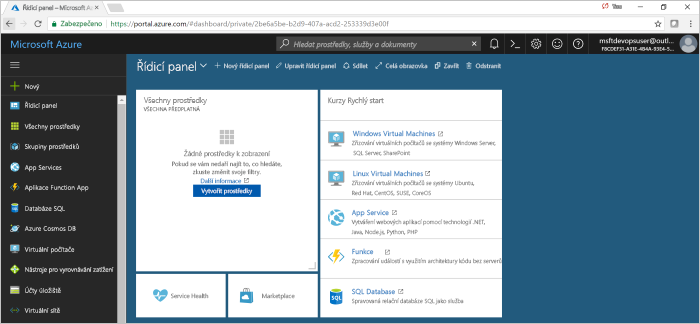
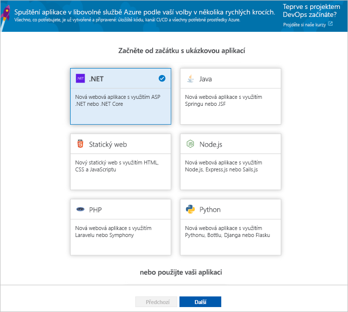

# Vytvoření kanálu CI/CD pro .NET pomocí projektů Azure DevOps

Konfigurace kontinuální integrace (CI) a průběžné doručování (CD) pro .NET core nebo aplikace ASP.NET s projekty DevOps. Projekty DevOps zjednodušuje počáteční konfiguraci sestavení a vydaná verze kanálu v kanálech Azure.

Pokud nemáte předplatné Azure, můžete ho získat zdarma prostřednictvím programu [Visual Studio Dev Essentials](https://visualstudio.microsoft.com/dev-essentials/).

## Přihlášení k webu Azure Portal

Projekty DevOps vytvoří kanál CI/CD v Azure DevOps. Můžete vytvořit novou organizaci Azure DevOps nebo použít existující organizace. Prostředky Azure DevOps Projects také vytvoří v rámci předplatného Azure podle vašeho výběru.

1. Přihlaste se na web [Microsoft Azure Portal](https://portal.azure.com).

1. V levém podokně vyberte **vytvořit prostředek** ikony v levém navigačním panelu a pak vyhledejte **DevOps Projects**.  

3.  Vyberte **Vytvořit**.

    

## Výběr ukázkové aplikace a služby Azure

1. Vyberte ukázkovou aplikaci **.NET**. Ukázky .NET zahrnují výběr open source architektury ASP.NET nebo multiplatformní architektury .NET Core.

   

2. Tato ukázka představuje aplikaci ASP.NET Core MVC. Vyberte **.NET Core** aplikační platformy, vyberte **Další**.    
    
3. Vyberte **webové aplikace Windows** jako cíl nasazení, vyberte **Další**. Volitelně můžete dalšími službami Azure pro vaše nasazení. Rozhraní framework aplikace, který jste zvolili dříve, určí typ cíle nasazení služby Azure k dispozici tady.

## Konfigurace Azure DevOps a předplatné Azure 

1. Zadejte **název projektu**.

2. Vytvořte nový zdarma **organizace Azure DevOps** nebo zvolte existující organizace z rozevíracího seznamu.

3. Vyberte vaše **předplatné Azure**, zadejte název vaší **webovou aplikaci** nebo přijmout výchozí nastavení a potom vyberte **provádí**. Po několika minutách se zobrazí přehled nasazení projekty DevOps na webu Azure Portal. 

4. Vyberte **přejít k prostředku** k zobrazení řídicího panelu Projekt DevOps. V pravém horním rohu, připněte **projektu** na řídicí panel pro rychlý přístup. Ukázkovou aplikaci je nastavený v úložišti ve vaší **organizace Azure DevOps**. Sestavení je spuštěno a aplikace je nasazená do Azure.

5. Řídicí panel poskytuje přehled o úložišti kódu, váš kanál CI/CD a vaší aplikace v Azure. Na pravé straně v části prostředky Azure vyberte **Procházet** zobrazíte běžící aplikaci.

    

## Potvrzení změn kódu a spuštění CI/CD

Projekty DevOps vytvoří úložiště Git v úložišti Azure nebo z Githubu. K zobrazení úložiště a proveďte změny kódu aplikace, postupujte takto:

1. Na levé straně řídicího panelu DevOps Projects, vyberte odkaz pro vaše **hlavní** větve. Tento odkaz otevře zobrazení nově vytvořeného úložiště Git.

2. V dalších několika krocích můžete použít webový prohlížeč a potvrdit změny kódu přímo **hlavní** větve. Taky můžete klonování úložiště Git v oblíbeném prostředí IDE tak, že vyberete **klonování** z horní části stránky úložiště. 

3. Na levé straně přejděte struktury souboru aplikace do **Application/aspnet-core-dotnet-core/Pages/Index.cshtml**.

4. Vyberte **upravit**a potom změňte nadpis h2. Zadejte například **rovnou začít s projekty Azure DevOps** nebo provést nějakou změnu.

      

5. Vyberte **potvrzení**, napište komentář a vyberte **potvrzení** znovu.

6. V prohlížeči přejdete na řídicí panel Projekt Azure DevOps.  Teď by se mělo zobrazit probíhající sestavení. Provedené změny se automaticky vytvořené a nasazené prostřednictvím kanálu CI/CD.

## Prozkoumejte kanálu CI/CD

Projekty Azure DevOps v předchozím kroku, automaticky nakonfiguruje úplný kanál CI/CD. Prozkoumejte kanál a podle potřeby ho upravte. Proveďte následující kroky a seznamte se s Azure DevOps sestavení a vydávání kanálů.

1. V horní části řídicího panelu DevOps Projects, vyberte **vytvářet kanály**.  
Tento odkaz otevře na kartě prohlížeče a vytvoření kanálu pro nový projekt Azure DevOps.

1. Vyberte tři tečky (...).  Tato akce otevře nabídku, kde můžete začít několika aktivity, například zařazování nového sestavení, pozastavení sestavení a úprava kanálu sestavení.

1. Vyberte **Upravit**.

    

1. V tomto podokně můžete prozkoumat různé úlohy pro vašeho kanálu sestavení.  
 Sestavení provádí různé úlohy, jako je například načítání zdrojů z úložiště Git, obnovení závislostí a publikování použít výstupy, které se používají pro nasazení.

1. V horní části kanálu sestavení vyberte název kanálu sestavení.

1. Změnit na něco více popisné, vyberte název vašeho kanálu sestavení **Uložit & frontu**a pak vyberte **Uložit**.

1. Pod názvem kanálu buildu vyberte **Historie**.   
V **historie** podokně se zobrazí záznam auditovaných nedávné změny pro sestavení.  Kanály Azure uchovává informace o změnách, které se provedly kanálu sestavení, a umožňuje porovnání verzí.

1. Vyberte **Triggery**.  
Projekty DevOps automaticky vytvoří aktivační událost CI, a každé potvrzení do úložiště spustí nové sestavení.  Volitelně můžete zvolit, které větve se do procesu CI zahrnou nebo se z něj vyloučí.

1. Vyberte **Uchování**.  
V závislosti na vašem scénáři můžete zadat zásady, které chcete zachovat nebo odebrat počet sestavení.

1. Vyberte **sestavení a vydání**a pak vyberte **vydání**.  
Projekty DevOps vytvoří kanál pro vydávání verzí pro správu nasazení do Azure.

1.  Na levé straně, vyberte tři tečky (...) vedle kanálu pro vydávání verzí a pak vyberte **upravit**.  
Kanál pro vydávání verzí obsahuje kanál, který definuje procesu vydávání verzí.  

1. V části **Artefakty** vyberte **Zahodit**.  Kanál buildu, který jste prozkoumali v předchozích krocích, vytvoří výstup pro artefakt. 

1. Vedle položky **vyřadit** ikonu, vyberte **trigger průběžného nasazování**.  
Tento kanál pro vydávání verzí má povoleno CD triggeru, který se spouští nasazení pokaždé, když je k dispozici nové artefakt sestavení. Volitelně můžete zakázat aktivační událost tak, aby vaše nasazení vyžaduje ruční spuštění.  

1. Na levé straně vyberte **úlohy**.   
Úkoly jsou aktivity, které proces nasazení provede. V tomto příkladu byl úkol vytvořen k nasazení do služby Azure App Service.

1. Na pravé straně vyberte **zobrazit verze**. Toto zobrazení ukazuje historii vydaných verzí.

1. Vyberte tři tečky (...) u jedné vydávání verzí a pak vyberte **otevřít**.  
Existuje několik nabídek, které chcete prozkoumat, jako je například souhrnu vydané verze, přidružené pracovní položky a testy.

1. Vyberte **Potvrzení**.   
Toto zobrazení ukazuje potvrzení změn kódu, které jsou spojeny s konkrétní nasazení. 

1. Vyberte **Protokoly**.  
Protokoly obsahují užitečné informace o procesu nasazení. Můžete je zobrazit během nasazení i po nich.

## Vyčištění prostředků

Azure App Service a další související prostředky, které jste vytvořili, když už nepotřebujete, můžete odstranit. Použití **odstranit** funkce na řídicím panelu projekty DevOps.

## Další postup

Další informace o úpravě kanálu buildu a verze tak, aby splňovaly požadavky vašeho týmu, najdete v tomto kurzu:

> [!div class="nextstepaction"]
> [Přizpůsobení procesu CD](https://docs.microsoft.com/azure/devops/pipelines/release/define-multistage-release-process?view=vsts)

## Videa

> [!VIDEO https://www.youtube.com/embed/itwqMf9aR0w]
