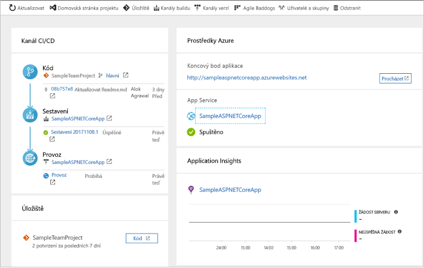
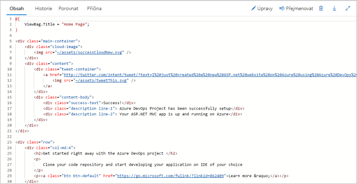
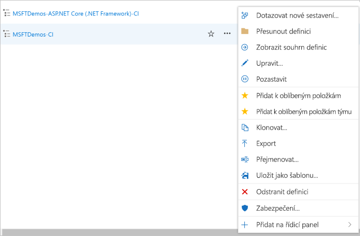

# Vytvoření kanálu CI/CD pro .NET s využitím Azure DevOps Starteru

Nakonfigurujte průběžnou integraci (CI) a průběžné doručování (CD) pro aplikaci .NET Core nebo ASP.NET s DevOps Starter. DevOps Starter zjednodušuje počáteční konfiguraci kanálu sestavení a vydání v Azure Pipelines.

Pokud nemáte předplatné Azure, můžete ho získat zdarma prostřednictvím programu [Visual Studio Dev Essentials](https://visualstudio.microsoft.com/dev-essentials/).

## Přihlášení k webu Azure Portal

DevOps Starter vytvoří kanál CI/CD v Azure DevOps. Můžete vytvořit novou organizaci Azure DevOps nebo použít stávající organizaci. DevOps Starter také vytvoří prostředky Azure v předplatném Azure podle vašeho výběru.

1. Přihlaste se k webu [Microsoft Azure Portal](https://portal.azure.com).

1. Do vyhledávacího pole zadejte **DevOps Starter** a pak vyberte. Kliknutím na **Přidat** vytvořte nový. 

    

## Výběr ukázkové aplikace a služby Azure

1. Vyberte ukázkovou aplikaci **.NET**. Ukázky .NET zahrnují výběr open source architektury ASP.NET nebo multiplatformní architektury .NET Core.

   
   
   > [!NOTE]
   > Výchozí možnost pro nastavení DevOps Starter je v **GitHubu**, ale toto nastavení můžete změnit v průvodci.
2. Tato ukázka představuje aplikaci ASP.NET Core MVC. Vyberte aplikační rozhraní **.NET Core** a pak vyberte **Další**.    
    
3. Jako cíl nasazení vyberte **Webová aplikace Windows** a pak vyberte **Další**. Volitelně můžete zvolit další služby Azure pro vaše nasazení. Aplikační rozhraní, které jste si zvolili dříve, určuje typ cíle nasazení služby Azure, který je k dispozici zde.

## Konfigurace Azure DevOps a předplatného Azure 

1. Zadejte **název projektu**.

2. Vytvořte novou bezplatnou **organizaci Azure DevOps** nebo z rozevíracího seznamu vyberte existující organizaci.

3. Vyberte své **předplatné Azure**, zadejte název **webové aplikace** nebo zvolte výchozí a potom vyberte **Hotovo**. Po několika minutách se v Azure Portal zobrazí přehled nasazení DevOps Starter. 

4. Vyberte **Přejít k prostředku** a zobrazte řídicí panel DevOps Starter. V pravém horním rohu připněte **projekt** na řídicí panel pro rychlý přístup. Ukázková aplikace se nastavuje v úložišti ve vaší **organizaci Azure DevOps**. Spustí se sestavení a vaše aplikace se nasadí do Azure.

5. Řídicí panel poskytuje přehled o vašem úložišti kódu, kanálu CI/CD a vaší aplikaci v Azure. Napravo v části prostředky Azure vyberte **Procházet** a zobrazte si spuštěnou aplikaci.

    

## Potvrzení změn kódu a spuštění CI/CD

DevOps Starter vytvořil úložiště Git v Azure Repos nebo GitHubu. Chcete-li zobrazit úložiště a provést změny kódu v aplikaci, postupujte následovně:

1. Na levé straně řídicího panelu DevOps Starter vyberte odkaz pro svou **Hlavní** větev. Tento odkaz otevře zobrazení nově vytvořeného úložiště Git.

2. V několika dalších krocích můžete pomocí webového prohlížeče vytvořit a potvrdit změny kódu přímo do **Hlavní** větve. Úložiště Git můžete také klonovat v oblíbených IDE tak, že vyberete **klonovat** v pravém horním rohu stránky úložiště. 

3. Vlevo přejděte ke struktuře souborů aplikace na **Application/ASPNET-Core-dotnet-Core/pages/index. cshtml**.

4. Vyberte **Upravit** a pak proveďte změnu nadpisu H2. Zadejte například text Začínáme hned **s Azure DevOps Starter** nebo Udělejte nějakou jinou změnu.

      

5. Vyberte **Potvrdit**, ponechte komentář a znovu vyberte **potvrzení** .

6. V prohlížeči přejdete na řídicí panel Azure DevOps Starter.  Teď by se mělo zobrazit probíhající sestavení. Změny, které jste provedli, jsou automaticky vytvořeny a nasazeny prostřednictvím kanálu CI/CD.

## Kontrola kanálu CI/CD

V předchozím kroku Azure DevOps Starter automaticky nakonfiguroval úplný kanál CI/CD. Prozkoumejte kanál a podle potřeby ho upravte. Při seznámení s kanály pro sestavování a vydávání Azure DevOps proveďte následující kroky.

1. V horní části řídicího panelu DevOps Starter vyberte **vytvořit kanály**. Tento odkaz otevře kartu prohlížeče a kanál sestavení Azure DevOps pro váš nový projekt.

1. Vyberte tři tečky (...).  Tato akce otevře nabídku, kde můžete spustit několik aktivit, jako je například zařazování nového sestavení do fronty, pozastavení sestavení a úprava kanálu sestavení.

1. Vyberte **Upravit**.

    

1. V tomto podokně můžete prozkoumávat různé úlohy pro svůj kanál sestavení. Sestavení provádí různé úkoly, jako je například načítání zdrojů z úložiště Git, obnovení závislostí a publikování výstupů používaných pro nasazení.

1. V horní části kanálu buildu, vyberte název kanálu buildu.

1. Změňte název vašeho kanálu sestavení na výstižnější, vyberte **uložit & fronty** a pak vyberte **Uložit**.

1. Pod názvem kanálu buildu vyberte **Historie**.   
V podokně **Historie** se zobrazí záznam pro audit vašich nedávných změn pro sestavení.  Azure Pipelines sleduje všechny změny provedené v kanálu sestavení a umožňuje porovnat verze.

1. Vyberte **triggery**. DevOps Starter automaticky vytvořil Trigger CI a každé potvrzení do úložiště spustí nové sestavení. Volitelně můžete zvolit, které větve se do procesu CI zahrnou nebo se z něj vyloučí.

1. Vyberte **Uchování**. V závislosti na vašem scénáři můžete určit zásady, které zachovají nebo odeberou určitý počet sestavení.

1. Vyberte **sestavení a vydání** a pak vyberte **vydané verze**.  
DevOps Starter vytvoří kanál pro vydávání verzí pro správu nasazení do Azure.

1.  Na levé straně vyberte tři tečky (...) vedle vašeho kanálu pro vydání a pak vyberte **Upravit**. Kanál verze obsahuje kanál, který definuje proces vydání.  

1. V části **Artefakty** vyberte **Zahodit**. Kanál buildu, který jste prozkoumali v předchozích krocích, vytvoří výstup pro artefakt. 

1. Vedle ikony **odkládacího umístění** vyberte **aktivační událost průběžného nasazování**. Tento kanál verze má povolený Trigger CD, který spouští nasazení pokaždé, když je k dispozici nový artefakt sestavení. Volitelně můžete aktivační událost zakázat, aby vaše nasazení vyžadovalo ruční spuštění.  

1. Na levé straně vyberte **úlohy**.  Úkoly jsou aktivity, které provádí proces nasazení. V tomto příkladu byl vytvořen úkol pro nasazení do Azure App Service.

1. Na pravé straně vyberte **Zobrazit vydané verze**. Toto zobrazení ukazuje historii vydaných verzí.

1. Vyberte tři tečky (...) vedle jedné z vašich vydání a pak vyberte **otevřít**. Existuje několik nabídek, které lze prozkoumat, například souhrn vydaných verzí, přidružené pracovní položky a testy.

1. Vyberte **Potvrzení**. Toto zobrazení ukazuje potvrzení kódu, která jsou přidružená ke konkrétnímu nasazení. 

1. Vyberte **Protokoly**. Protokoly obsahují užitečné informace o procesu nasazení. Můžete je zobrazit během nasazení i po nich.

## Vyčištění prostředků

Můžete odstranit Azure App Service a další související prostředky, které jste vytvořili, když už je nepotřebujete. Použijte funkci **Odstranit** na řídicím panelu DevOps Starter.

## Další kroky

Další informace o úpravě kanálu buildu a verze tak, aby splňovaly požadavky vašeho týmu, najdete v tomto kurzu:

> [!div class="nextstepaction"]
> [Přizpůsobení procesu CD](/azure/devops/pipelines/release/define-multistage-release-process?view=vsts)

## Videa

> [!VIDEO https://www.youtube.com/embed/itwqMf9aR0w]
