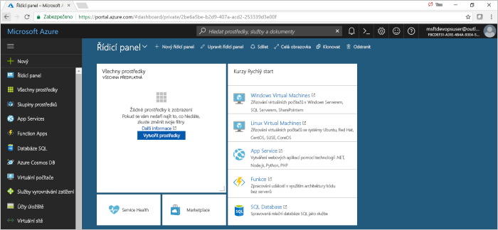
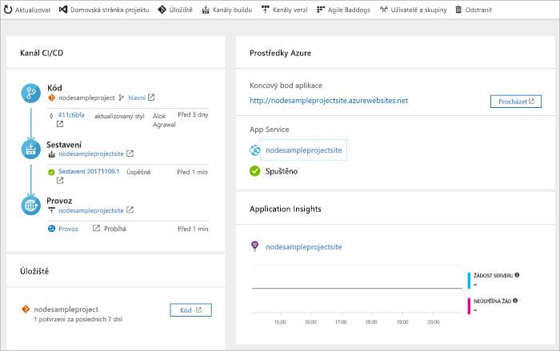

#  Rychlý Start: vytvoření kanálu CI/CD v Azure Pipelines pro Node. js s Azure DevOps Projects

Azure DevOps Projects představuje zjednodušené prostředí, které vytváří prostředky Azure a nastavuje kanál pro průběžnou integraci (CI) a průběžné doručování (CD) pro aplikaci Node. js v Azure Pipelines.  

Pokud nemáte předplatné Azure, můžete ho získat zdarma prostřednictvím programu [Visual Studio Dev Essentials](https://visualstudio.microsoft.com/dev-essentials/).

## Přihlášení k webu Azure Portal

DevOps Projects vytvoří v Azure Pipelines kanál CI/CD. Můžete vytvořit novou organizaci Azure DevOps nebo použít stávající organizaci. DevOps Projects taky vytvoří prostředky Azure v předplatném Azure podle vašeho výběru.

1. Přihlaste se na web [Microsoft Azure Portal](https://portal.azure.com).

1. V levém podokně vyberte **vytvořit prostředek**a pak vyhledejte **DevOps Projects**. 

    

## Výběr ukázkové aplikace a služby Azure

1. Vyberte ukázkovou aplikaci Node. js.  
    Ukázky Node.js zahrnují výběr několika architektur aplikace.

1. Výchozí ukázková architektura je Express. js. Nechejte výchozí nastavení a pak vyberte **Další**.  
    Výchozí cíl nasazení je **Webová aplikace ve Windows**.  Aplikační rozhraní, které jste si zvolili dříve, určuje typ cíle nasazení služby Azure, který je k dispozici zde.  

2. Ponechte výchozí službu a pak vyberte **Další**.
 
## Konfigurace Azure DevOps a předplatného Azure 

1. Vytvořte novou organizaci Azure DevOps nebo vyberte existující organizaci. 

    a. Zadejte název projektu.

    b. Vyberte své předplatné a umístění Azure, zadejte název vaší aplikace a potom vyberte **Hotovo**.  
    Po několika minutách se řídicí panel DevOps Projects zobrazí v Azure Portal. Ukázková aplikace je nastavená v úložišti ve vaší organizaci Azure DevOps, spustí se sestavení a vaše aplikace se nasadí do Azure. Tento řídicí panel poskytuje přehled o vašem úložišti kódu, kanálu CI/CD a vaší aplikaci v Azure.
     
3. Vyberte **Procházet** a zobrazte spuštěnou aplikaci.

     
    
DevOps Projects automaticky nakonfigurovali aktivační událost sestavení a vydání CI.  Nyní jste připraveni spolupracovat s týmem v aplikaci Node. js pomocí procesu CI/CD, který automaticky nasadí nejnovější práci na web.

## Potvrzení změn kódu a spuštění CI/CD

DevOps Projects vytvoří úložiště Git v Azure Repos nebo GitHubu. Proveďte následující kroky pro zobrazení úložiště a změny kódu v aplikaci.

1. Na levé straně řídicího panelu DevOps Projects vyberte odkaz pro svou hlavní větev.  
Tento odkaz otevře zobrazení nově vytvořeného úložiště Git.

1. Pokud chcete zobrazit adresu URL klonování úložiště, vyberte v pravém horním rohu v prohlížeči možnost **klonovat** .   
    Úložiště Git můžete naklonovat do svého oblíbeného integrovaného vývojového prostředí (IDE). V dalších několika krocích můžete k provedení změn kódu a jejich potvrzení přímo do hlavní větve použít webový prohlížeč.

1. Na levé straně prohlížeče otevřete soubor **views/index. pug** .

1. Vyberte **Upravit**a pak proveďte změnu nadpisu H2.  
    Zadejte například příkaz **Začínáme hned s Azure DevOps Projects** nebo udělejte jinou změnu.

1. Vyberte **Potvrdit**a potom změny uložte.

1. V prohlížeči přejdete na řídicí panel DevOps Projects.   
Nyní by se mělo zobrazit sestavení probíhá. Změny, které jste právě provedli, jsou automaticky vytvořeny a nasazeny prostřednictvím kanálu CI/CD.

## Prozkoumání kanálu Azure CI/CD

V předchozím kroku DevOps Projects automaticky nakonfigurovali úplný kanál CI/CD. Prozkoumejte kanál a podle potřeby ho upravte. Při seznámení s kanály sestavení a vydání proveďte následující kroky.

1. V horní části řídicího panelu DevOps Projects vyberte **vytvořit kanály**.  
Tento odkaz otevře kartu prohlížeče a kanál sestavení pro váš nový projekt.

1. Přejděte na pole **stav** a potom vyberte tři tečky (...).  
    Tato akce otevře nabídku, kde můžete spustit několik aktivit, jako je například zařazování nového sestavení do fronty, pozastavení sestavení a úprava kanálu sestavení.

1. Vyberte **Upravit**.

1. V tomto podokně můžete prozkoumávat různé úlohy pro svůj kanál sestavení.  
Sestavení provádí nejrůznější úlohy, jako je načítání zdrojů z úložiště Git, obnovení závislostí a publikování výstupů, které se používají pro nasazení.

1. V horní části kanálu sestavení vyberte název kanálu sestavení.

1. Změňte název vašeho kanálu sestavení na výstižnější, vyberte **uložit & fronty**a pak vyberte **Uložit**.

1. Pod názvem vašeho kanálu buildu vyberte **Historie**.   
V podokně **Historie** se zobrazí záznam pro audit vašich nedávných změn pro sestavení.  Azure Pipelines sleduje všechny změny provedené v kanálu sestavení a umožňuje porovnat verze.

1. Vyberte **Triggery**.   
 DevOps Projects automaticky vytvořil Trigger CI a každé potvrzení do úložiště spustí nové sestavení.  Volitelně můžete zvolit, které větve se do procesu CI zahrnou nebo se z něj vyloučí.

1. Vyberte **Uchování**.   
V závislosti na vašem scénáři můžete určit zásady, které zachovají nebo odeberou určitý počet sestavení.

1. Vyberte **sestavení a vydání**a pak vyberte **vydané verze**.  
 DevOps Projects vytvoří kanál pro vydávání verzí pro správu nasazení do Azure.

1. Na levé straně vyberte tři tečky (...) vedle vašeho kanálu pro vydání a pak vyberte **Upravit**.  
Kanál vydané verze definuje proces vydání.

12. V části **Artefakty** vyberte **Zahodit**.  
    Kanál buildu, který jste prozkoumali v předchozích krocích, vytvoří výstup pro artefakt. 

1. Vedle ikony **odkládacího umístění** vyberte **aktivační událost průběžného nasazování**.  
Tento kanál verze má povolený Trigger CD, který spouští nasazení pokaždé, když je k dispozici nový artefakt sestavení. Volitelně můžete aktivační událost zakázat, aby vaše nasazení vyžadovalo ruční spuštění. 

1. Na levé straně vyberte **úlohy**.   
Úkoly jsou aktivity, které provádí proces nasazení. V tomto příkladu byl vytvořen úkol pro nasazení do Azure App Service.

1. Na pravé straně vyberte **Zobrazit vydané verze**.  
Toto zobrazení ukazuje historii vydaných verzí.

1. Vyberte tři tečky (...) vedle jedné z vašich vydání a pak vyberte **otevřít**.  
Existuje několik nabídek, které lze prozkoumat, například souhrn vydaných verzí, přidružené pracovní položky a testy.

1. Vyberte **Potvrzení**.   
Toto zobrazení ukazuje potvrzení kódu, která jsou přidružená ke konkrétnímu nasazení.

1. Vyberte **Protokoly**.  
Protokoly obsahují užitečné informace o procesu nasazení. Můžete je zobrazit během nasazení i po nich.

## Vyčištění prostředků

Můžete odstranit Azure App Service a další související prostředky, které jste vytvořili, když už je nepotřebujete. Použijte funkci **Odstranit** na řídicím panelu DevOps Projects.

## Další kroky

Při konfiguraci procesu CI/CD byly automaticky vytvořeny kanály sestavení a vydání. Tyto kanály buildu a verze můžete upravit tak, aby splňovaly požadavky vašeho týmu. Další informace o kanálu CI/CD najdete tady:

> [!div class="nextstepaction"]
> [Přizpůsobení procesu CD](https://docs.microsoft.com/azure/devops/pipelines/release/define-multistage-release-process?view=vsts)

## Videa

> [!VIDEO https://www.youtube.com/embed/3etwjubReJs]
