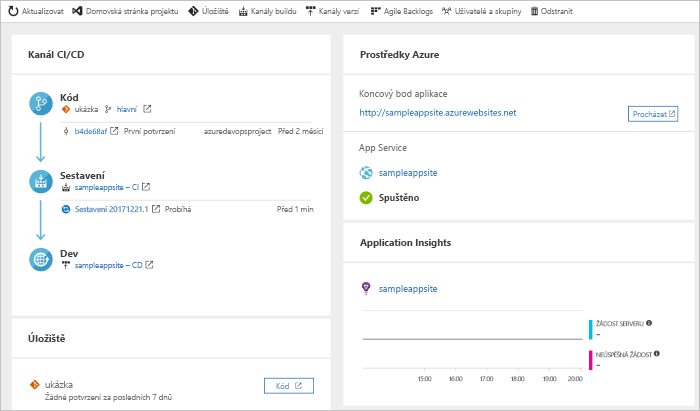

# Vytvoření kanálu CI/CD pro jazyk PHP s projekty Azure DevOps

Projekty Azure DevOps představuje zjednodušené prostředí, která vytváří prostředky Azure a nastavuje kontinuální integrace (CI) a kanál průběžného doručování (CD) pro svoji aplikaci v PHP v Azure kanály.  

Pokud nemáte předplatné Azure, můžete jej získat zdarma prostřednictvím [Visual Studio Dev Essentials](https://visualstudio.microsoft.com/dev-essentials/).

## Přihlášení k webu Azure Portal

 Projekty DevOps vytvoří kanál CI/CD v kanálech Azure. Můžete vytvořit bezplatné novou organizaci Azure DevOps nebo použít existující organizace. Prostředky Azure DevOps Projects také vytvoří v rámci předplatného Azure podle vašeho výběru.

1. Přihlaste se na web [Microsoft Azure Portal](https://portal.azure.com).

1. V levém podokně, vyberte **vytvořit prostředek** ikony a pak vyhledejte **DevOps Projects**.  

3. Vyberte **Vytvořit**.

    

## Výběr ukázkové aplikace a služby Azure

1. Vyberte ukázkovou aplikaci PHP.  
        Ukázky PHP zahrnují řadu několik aplikačních architektur. Výchozí ukázky rozhraní je Laravel. 
        
2. Ponechte výchozí nastavení a pak vyberte **Další**.  

1. Webové aplikace pro kontejnery je výchozí cíl nasazení.  
    Rozhraní framework aplikace, který jste zvolili dříve, určí typ cíli pro nasazení služby Azure, který je zde k dispozici.  Ponechat výchozí služby a pak vyberte **Další**.
 
## Konfigurace Azure DevOps a předplatné Azure 

1. Vytvořte novou organizaci Azure DevOps nebo vyberte existující organizace. 

    a. Zvolte název pro svůj projekt v Azure DevOps. 
    
    b. Vyberte předplatné Azure a umístění, zadejte název pro vaši aplikaci a pak vyberte **provádí**.   
        Po několika minutách se zobrazí řídicí panel projekty DevOps na webu Azure Portal. Ukázkovou aplikaci je nastavený v úložišti ve vaší organizaci Azure DevOps, spuštění sestavení a nasazení vaší aplikace do Azure. Tento řídicí panel poskytuje vhled do vašeho úložiště kódu, váš kanál CI/CD a vaši aplikaci v Azure.  
        
2. Vyberte **Procházet** k běžící aplikaci zobrazit.

     
    
 Projekty DevOps automaticky nakonfiguruje položky konfigurace sestavení a vydaná verze triggeru.  Teď jste připraveni při práci na aplikaci v PHP spolupracovat s týmem s využitím procesu CI/CD, který automaticky nasazuje nejnovější práci na web.

## Potvrzení změn kódu a spuštění CI/CD

 Projekty DevOps vytvoří úložiště Git v úložišti Azure nebo z Githubu. K zobrazení úložiště a proveďte změny kódu aplikace, proveďte následující kroky:

1. Na levé straně řídicího panelu DevOps Projects vyberte odkaz pro hlavní větev.   
    Tento odkaz otevře zobrazení nově vytvořeného úložiště Git.

1. Pokud chcete zobrazit adresu URL klonu úložiště, v pravé horní části prohlížeče vyberte **Clone** (Klonovat).   
    Úložiště Git můžete naklonovat do svého oblíbeného integrovaného vývojového prostředí (IDE). V dalších několika krocích pomocí webového prohlížeče zkontrolujte a potvrďte změny kódu přímo do hlavní větve.

1. Na levé straně, přejděte **resources/views/welcome.blade.php** souboru.

1. Vyberte **upravit**a pak proveďte změnu na část textu.  Změňte například text v některé ze značek div.

1. Vyberte **potvrzení**a pak uložte provedené změny.

1. V prohlížeči přejdete na řídicí panel DevOps Projects.  
Teď byste měli vidět probíhající sestavení. Změny, které jste právě provedli jsou automaticky vytvořené a nasazené prostřednictvím kanálu CI/CD.

## Prozkoumejte kanálu CI/CD

 Projekty DevOps automaticky nakonfiguruje úplný kanál CI/CD v kanálech Azure. Prozkoumejte kanál a podle potřeby ho upravte. Seznamte se s kanály sestavení a vydaných verzí, postupujte takto:

1. V horní části řídicího panelu DevOps Projects, vyberte **vytvářet kanály**.  
    Tento odkaz otevře na kartě prohlížeče a kanál sestavení pro nový projekt.

1. Přejděte **stav** pole a pak vyberte **tlačítko se třemi tečkami** (...).  
    Nabídka obsahuje několik možností, jako je například zařazování nového sestavení, pozastavení sestavení a úprava kanálu sestavení.

1. Vyberte **Upravit**.

1. V tomto podokně můžete prozkoumat různé úlohy pro vašeho kanálu sestavení.  
    Sestavení běží různé úlohy, jako je například načítání zdrojů z úložiště Git, obnovení závislostí a publikování výstupy, které se používají pro nasazení.

1. V horní části kanálu sestavení vyberte název kanálu sestavení.

1. Změnit název vašeho kanálu sestavení na něco více popisné, select, **Uložit & frontu**a pak vyberte **Uložit**.

1. Pod názvem kanálu buildu vyberte **Historie**.   
    **Historie** podokně se zobrazí záznam auditovaných nedávné změny pro sestavení. Kanály Azure uchovává informace o změnách, které se provedly kanálu sestavení, a umožňuje porovnání verzí.

1. Vyberte **Triggery**.  
      Projekty DevOps automaticky vytvoří aktivační událost CI, a každé potvrzení do úložiště spustí nové sestavení. Volitelně můžete zvolit, které větve se do procesu CI zahrnou nebo se z něj vyloučí.

1. Vyberte **Uchování**.   
    V závislosti na vašem scénáři můžete zadat zásady, které chcete zachovat nebo odebrat počet sestavení.

1. Vyberte **sestavení a vydání**a pak vyberte **vydání**.  
     Projekty DevOps vytvoří kanál pro vydávání verzí pro správu nasazení do Azure.

1. Vyberte tři tečky (...) vedle kanálu pro vydávání verzí a pak vyberte **upravit**.  
    Kanál pro vydávání verzí obsahuje kanál, který definuje procesu vydávání verzí. 

12. V části **Artefakty** vyberte **Zahodit**.  
    Kanál sestavení, kterou můžete prozkoumat v předchozích krocích vytvoří výstup, který se používá pro artefakt. 

1. Vedle položky **vyřadit** ikonu, vyberte **trigger průběžného nasazování**.   
    Tento kanál pro vydávání verzí má povoleno CD triggeru, který se spouští nasazení pokaždé, když je k dispozici nové artefakt sestavení.  Volitelně můžete zakázat aktivační událost tak, aby vaše nasazení vyžaduje ruční spuštění. 

1. Na levé straně vyberte **úlohy**.  
        Úkoly jsou aktivity, které proces nasazení provede.  V tomto příkladu byl úkol vytvořen k nasazení do služby Azure App Service.

1. Na pravé straně vyberte **zobrazit verze** zobrazíte historii verzí.

1. Vyberte tři tečky (...) u jedné vydávání verzí a pak vyberte **otevřít**.  
        Toto zobrazení obsahuje několik nabídek, které můžete prozkoumat, například souhrn verze, související pracovní položky a testy.

1. Vyberte **Potvrzení**.  
        Toto zobrazení ukazuje potvrzení změn kódu, které jsou spojeny s konkrétní nasazení. 

1. Vyberte **Protokoly**.  
        Protokoly obsahují užitečné informace o procesu nasazení. Můžete je zobrazit během nasazení i po nich.

## Vyčištění prostředků

Azure App Service a další související prostředky můžete odstranit, pokud už nepotřebujete. Použití **odstranit** funkce na řídicím panelu projekty DevOps.

## Další postup

Pokud jste nakonfigurovali procesu CI/CD, sestavení a kanály pro vydávání se automaticky vytvořily. Tyto kanály buildu a verze můžete upravit tak, aby splňovaly požadavky vašeho týmu. Další informace o kanálu CI/CD, najdete v tomto kurzu:

> [!div class="nextstepaction"]
> [Přizpůsobení procesu CD](https://docs.microsoft.com/azure/devops/pipelines/release/define-multistage-release-process?view=vsts)
