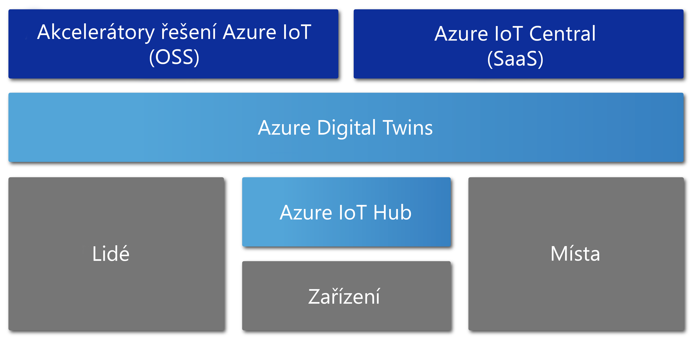

# Přehled služby Azure Digital Twins

Azure Digital Twins je služba Azure IoT, která vytváří komplexní modely fyzického prostředí. Mezi řadu jejích funkcí patří možnost vytvářet grafy prostorové inteligence pro modelování vztahů a interakcí mezi lidmi, prostory a zařízeními.

Azure Digital Twins umožňuje dotazovat data z fyzického prostoru, a ne z mnoha různorodých senzorů. Tato služba pomáhá vytvářet opakovatelně použitelná a vysoce škálovatelná prostředí přizpůsobená prostoru, která propojují streamovaná data v digitálním a fyzickém světě. Ať už předpovídáte potřeby údržby továrny, analyzujete v reálném čase energetické požadavky elektrické sítě nebo optimalizujete využití dostupného prostoru kanceláře, vaše aplikace jsou vylepšené o tyto jedinečně relevantní kontextové funkce.

Azure Digital Twins se uplatní ve všech typech prostředí. Příkladem můžou být sklady, kanceláře, školy, nemocnice, banky, stadiony, továrny, parkoviště, parky, inteligentní sítě a města. Představte si scénáře, jako je sledování denní teploty v několika státech, monitorování rušných cest dronů, identifikace autonomních vozidel, analýza úrovně obsazenosti budov nebo určení nejvytíženější pokladny ve vašem obchodě. Ať už je váš skutečný obchodní scénář jakýkoli, prostřednictvím služby Azure Digital Twins můžete zřídit odpovídající digitální instanci.

Následující video se službě Digital Twins věnuje podrobněji:

> [!VIDEO https://www.youtube.com/embed/TvN_NxpgyzQ]

## Klíčové funkce

Mezi klíčové funkce služby Azure Digital Twins patří:

### Graf prostorové inteligence

[*Graf prostorové inteligence*](./concepts-objectmodel-spatialgraph.md) neboli *prostorový graf* je virtuální reprezentace fyzického prostředí, která umožňuje modelovat vztahy mezi lidmi, prostory a zařízeními.

Představte si aplikaci inteligentních veřejných služeb, která může zahrnovat připojené měřiče odběru elektřiny v celém sousedství. Aby společnost zabývající se inteligentními veřejnými službami mohla přesně monitorovat a předpovídat odběr elektřiny a fakturaci, musí pro každé zařízení a každý senzor namodelovat kontext umístění a zákazníka, kterému se bude elektřina účtovat. Graf prostorové inteligence vám umožní modelovat tyto typy složitých vztahů.

### Objektové modely služby Digital Twins

[Objektové modely služby Digital Twins](./concepts-objectmodel-spatialgraph.md) jsou předdefinované protokoly zařízení a schémata dat odpovídající potřebám konkrétních domén řešení, které urychlují a zjednodušují vývoj.

Například aplikace pro sledování obsazenosti místností může využívat předdefinované typy prostorů, jako je kampus, budova, podlaží, místnost atd.

### Více tenantů a vnoření tenanti

Můžete vytvářet řešení, která se bezpečně škálují a která můžete opakovaně používat pro více tenantů. Můžete také vytvořit několik dílčích tenantů umožňujících izolovaný a zabezpečený přístup a používání.

Například aplikaci pro sledování využití prostoru je možné nakonfigurovat tak, aby izolovala data tenanta od dat ostatních tenantů v rámci jedné budovy nebo kombinovala data jednoho tenanta s více budovami.

### Pokročilé výpočetní funkce

Pokročilé výpočetní funkce označované jako [uživatelem definované funkce](./concepts-user-defined-functions.md) umožňují definovat a spouštět vlastní funkce pro příchozí [data zařízení](./concepts-device-ingress.md) a odesílat signály do předdefinovaných koncových bodů. Tato funkce zlepšuje možnosti přizpůsobení a automatizace úloh zařízení.

Například aplikace pro inteligentní zemědělství může zahrnovat uživatelem definovanou funkci, která vyhodnocuje údaje ze senzorů vlhkosti půdy i předpověď počasí a následně odesílá signály ohledně potřeby závlahy.

### Integrované řízení přístupu

Funkce správy přístupu a identit, jako jsou [řízení přístupu na základě role](./security-role-based-access-control.md) a [Azure Active Directory](./security-authenticating-apis.md), umožňují bezpečně řídit přístup jednotlivců a zařízení.

Například aplikace pro správu budov může být nakonfigurovaná tak, aby umožňovala uživatelům místnosti nastavit teplotu v určitém rozsahu a správcům budov umožňovala nastavit teplotu v jakékoli místnosti na libovolnou hodnotu.

### Ekosystém

Instanci služby Azure Digital Twins můžete propojit s řadou výkonných služeb Azure, včetně Azure Stream Analytics, AI a služeb Storage, a také s Azure Maps, Microsoft Mixed Reality, Dynamics 365 nebo Office 365.

Například inteligentní aplikace pro správu kancelářských budov může službu Azure Digital Twins používat k reprezentaci týmů a zařízení na různých podlažích. Zařízení budou streamovat živá data do zřízené instance služby Digital Twins a Azure Stream Analytics může tato data zpracovávat a poskytovat užitečné klíčové přehledy. Data je pak možné uložit ve službě Azure Storage, převést na formát souboru umožňující sdílení a distribuovat v rámci celé organizace pomocí Office 365.

## Řešení, kterým služba Azure Digital Twins přináší výhody

Služba Azure Digital Twins je vhodná pro reprezentaci fyzického světa a množství jeho vztahů, protože zjednodušuje modelování IoT, zpracování dat a událostí a sledování zařízení. Představte si několik následujících scénářů v různých odvětvích, kterým používání této služby přináší výhody:

* Zobrazení úrovně obsazenosti prostoru v průběhu času pro společnost zabývající se správou nemovitostí, která může shromažďovat informace o nejlepším nastavení kancelářské budovy.
* Aktivace lístků pracovních příkazů pro mobilní aplikaci, která zajišťuje vysílání ostrahy, plánování úklidových prací a další služby v obchodních prostorech nebo na sportovištích.
* Zobrazení obsazených místností uživatelům budov v reálném čase. Následná pomoc uživatelům s rezervací pracovních prostorů vyhovujících jejich požadavkům.
* Sledování umístění prostředků v rámci prostoru.
* Optimalizace nabíjení elektrických vozidel prostřednictvím modelování preferencí uživatelů a omezení energetické rozvodné sítě.

## Azure Digital Twins v kontextu ostatních služeb IoT

Azure Digital Twins se pomocí služby Azure IoT Hub připojuje k zařízením a senzorům IoT, které zajišťují stálou synchronizaci s fyzickým světem. Následující diagram ukazuje vztah služby Azure Digital Twins k ostatním službám Azure IoT:

Podrobnější popis zbytku ekosystému IoT najdete v tématu [Technologie a řešení Azure IoT](https://docs.microsoft.com/azure/iot-fundamentals/iot-services-and-technologies).

## Další kroky

Pokračujte ke krátké ukázce možností služby Azure Digital Twins:

> [!div class="nextstepaction"]
> [Rychlý start: Zjištění dostupných místností pomocí služby Azure Digital Twins](./quickstart-view-occupancy-dotnet.md)

Ponořte se hlouběji do aplikace pro správu budov s využitím služby Azure Digital Twins:

> [!div class="nextstepaction"]
> [Kurz: Nasazení služby Azure Digital Twins a konfigurace prostorového grafu](./tutorial-facilities-setup.md)

Seznamte se se základními koncepty služby Azure Digital Twins:

> [!div class="nextstepaction"]
> [Vysvětlení grafu prostorové inteligence a objektového modelu služby Digital Twins](./concepts-objectmodel-spatialgraph.md)
