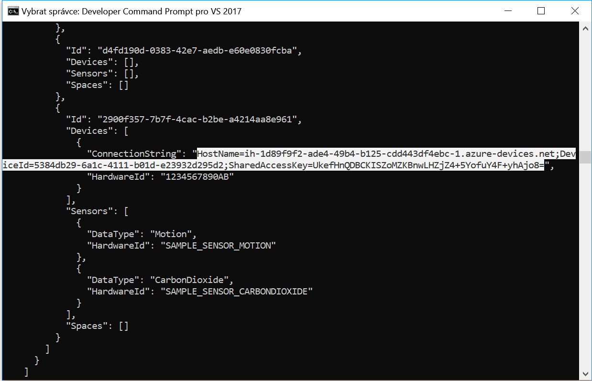
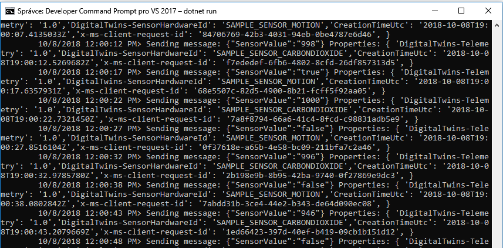
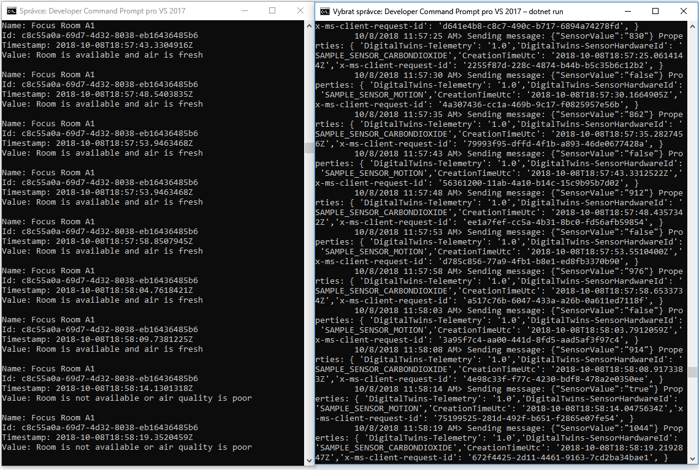

# <a name="quickstart-find-available-rooms-by-using-azure-digital-twins"></a>Rychlý start: Najít dostupné místnosti s použitím digitálních Dvojčat Azure

Služba Azure digitální dvojče umožňuje znovu vytvořit digitální obrázek vašemu fyzickému prostředí. Následně můžete dostávat oznámení od událostí ve vašem prostředí a přizpůsobovat své reakce na tato oznámení.

Tento rychlý start využívá [pár ukázek .NET](https://github.com/Azure-Samples/digital-twins-samples-csharp) digitalizaci imaginární kancelářskou budovu. To se dozvíte, jak se mají najít místnosti k dispozici v budovy. S digitální dvojče můžete přidružit mnoho senzorů s vaším prostředím. Také můžete zjistit při optimální pomocí simulovaných senzorů k oxidu uhličitého air kvalitu dostupné místo. Jednu z ukázkových aplikací generuje náhodné senzor data pro lepší vizualizaci v tomto scénáři.

Následující video shrnuje nastavení pro rychlý start:

>[!VIDEO https://www.youtube.com/embed/1izK266tbMI]

## <a name="prerequisites"></a>Požadavky

1. Pokud nemáte účet Azure, vytvořte si [bezplatný účet](https://azure.microsoft.com/free/?WT.mc_id=A261C142F) před tím, než začnete.

1. Dvě konzolové aplikace v tomto rychlém startu spustíte jsou zapsány pomocí C#. Nainstalujte [.NET Core SDK verze 2.1.403 nebo vyšší](https://www.microsoft.com/net/download) na vývojovém počítači. Pokud je nainstalovaná sada .NET Core SDK, zkontrolujte aktuální verzi C# na vývojovém počítači. Spustit `dotnet --version` v příkazovém řádku.

1. Stáhněte si [ukázka C# projektu](https://github.com/Azure-Samples/digital-twins-samples-csharp/archive/master.zip). Extrahujte archiv digitální twins-samples-csharp-master.zip.

## <a name="create-a-digital-twins-instance"></a>Vytvoření instance služby Digital Twins

Vytvořit novou instanci třídy digitální Dvojčat ve [portál](https://portal.azure.com) pomocí následujících kroků v této části.

[!INCLUDE [create-digital-twins-portal](../../includes/digital-twins-create-portal.md)]

## <a name="set-permissions-for-your-app"></a>Nastavení oprávnění pro aplikaci

Tento oddíl registruje ukázkovou aplikaci do služby Azure Active Directory (Azure AD), tak, aby měl přístup k vaší instanci digitální dvojče. Pokud už máte registrace aplikace Azure AD, znovu použijte pro vaši ukázku. Ujistěte se, jestli je nastavená způsobem popsaným v této části.

[!INCLUDE [digital-twins-permissions](../../includes/digital-twins-permissions.md)]

## <a name="build-application"></a>Sestavení aplikace

Pomocí následujících kroků sestavte aplikaci obsazení.

1. Otevřete příkazový řádek. Přejít do složky, ve které byly extrahovány vaše `digital-twins-samples-csharp-master.zip` soubory.
1. Spusťte `cd occupancy-quickstart/src`.
1. Spusťte `dotnet restore`.
1. Upravte soubor [appSettings.json](https://github.com/Azure-Samples/digital-twins-samples-csharp/blob/master/occupancy-quickstart/src/appSettings.json) a aktualizujte následující proměnné:
    - **ClientId**: Zadejte ID aplikace pro registraci aplikace Azure AD, jste si poznamenali v předchozí části.
    - **Tenant**: Zadejte ID adresáře tenanta Azure AD také jste si poznamenali v předchozí části.
    - **BaseUrl**: adresa URL rozhraní API správy vaší instance digitální dvojče je ve formátu `https://yourDigitalTwinsName.yourLocation.azuresmartspaces.net/management/api/v1.0/`. Nahraďte zástupné symboly v této adrese URL hodnotami pro vaši instanci v předchozí části.

    Aktualizovaný soubor uložte.

## <a name="provision-graph"></a>Zřízení grafu

Tento krok zřídí digitální dvojče prostorových grafu s:

- Několik mezer.
- Jedno zařízení.
- Dva senzory.
- Vlastní funkce.
- Jedno přiřazení role.

Prostorový graf zřizován s použitím [provisionSample.yaml](https://github.com/Azure-Samples/digital-twins-samples-csharp/blob/master/occupancy-quickstart/src/actions/provisionSample.yaml) souboru.

1. Spusťte `dotnet run ProvisionSample`.

    >[!NOTE]
    >Nástroj příkazového řádku Azure přihlášení zařízení se používá k ověření uživatele do služby Azure AD. Uživatel musí zadat daný kód pro ověření pomocí [přihlášení Microsoft](https://microsoft.com/devicelogin) stránky. Po zadání kódu postupujte podle pokynů k ověření. Uživatel musí ověřit, když je nástroj spuštěný.

    >[!TIP]
    > Při spuštění tohoto kroku zkontrolujte, zda že proměnných byly zkopírovány správně, pokud se zobrazí následující chybová zpráva: `EXIT: Unexpected error: The input is not a valid Base-64 string ...`

1. Zřizování krok může trvat několik minut. Také zřídí služby IoT Hub v rámci vaší digitální dvojče instance. Cyklicky projde až do služby IoT Hub se zobrazuje stav =`Running`.

    [](media/quickstart-view-occupancy-dotnet/digital-twins-provision-sample.png#lightbox)

1. Na konci provádění, zkopírujte `ConnectionString` zařízení pro použití v ukázkovém simulátor zařízení. Zkopírujte pouze řetězec uvedených v tomto obrázku.

    [](media/quickstart-view-occupancy-dotnet/digital-twins-connection-string.png#lightbox)

    >[!TIP]
    > Můžete zobrazit a upravit pomocí vaší prostorový graf [prohlížeč Azure digitální dvojče grafu](https://github.com/Azure/azure-digital-twins-graph-viewer).

Nechejte okno konzoly otevřené pro pozdější použití.

## <a name="send-sensor-data"></a>Odeslání dat ze senzorů

Pomocí následujících kroků Sestavte a spusťte aplikaci zařízení simulátoru snímače.

1. Otevřete nový příkazový řádek. Přejít na projekt, který jste stáhli, do složky `digital-twins-samples-csharp-master`.
1. Spusťte `cd device-connectivity`.
1. Spusťte `dotnet restore`.
1. Upravit [appsettings.json](https://github.com/Azure-Samples/digital-twins-samples-csharp/blob/master/device-connectivity/appsettings.json) aktualizovat **DeviceConnectionString** s předchozím `ConnectionString`. Aktualizovaný soubor uložte.
1. Spustit `dotnet run` aby začalo odesílat data ze senzorů. Uvidíte, že ho odesílat digitální dvojče, jak je znázorněno na následujícím obrázku.

     [](media/quickstart-view-occupancy-dotnet/digital-twins-device-connectivity.png#lightbox)

1. Umožní simulátor spustit tak, abyste mohli zobrazit výsledky souběžně s akce dalšího kroku. Toto okno zobrazuje simulovaných senzorů data odeslaná do digitální dvojče. Další krok dotazy v reálném čase, které se mají najít místnosti k dispozici s novou vzduchu.

    >[!TIP]
    > Při spuštění tohoto kroku, ujistěte se, že `DeviceConnectionString` zkopíroval správně, pokud se zobrazí následující chybová zpráva: `EXIT: Unexpected error: The input is not a valid Base-64 string ...`

## <a name="find-available-spaces-with-fresh-air"></a>Zjištění dostupných prostorů s čerstvým vzduchem

Ukázka senzor simuluje hodnoty náhodných dat pro dvě senzory. Jsou to pohybu a k oxidu uhličitého. K dispozici prostorů s novou air jsou definovány v ukázce žádné přítomnost v místnosti. Také budete definovat podle úrovně oxidu uhličitého v části 1 000 správy portfolia projektů. Pokud podmínka není splněna, není k dispozici místa nebo je špatná kvalita air.

1. Otevřete příkazový řádek, který jste použili ke spuštění kroku zřizování výše.
1. Spusťte `dotnet run GetAvailableAndFreshSpaces`.
1. Podívejte se na tento příkazový řádek a příkazového řádku data ze senzorů vedle sebe.

    Příkazový řádek senzoru odesílá data simulovaného pohybu a oxidu uhličitu do digitálních vláken každých pět sekund. Druhý příkazový řádek přečte graf v reálném čase a zjistí dostupné místnosti s čerstvým vzduchem na základě náhodných simulovaných dat. Zobrazí jedno z těchto podmínek téměř v reálném čase na základě dat ze senzorů, odeslání poslední:
   - `Room is available and air is fresh`
   - `Room is not available or air quality is poor`

     [](media/quickstart-view-occupancy-dotnet/digital-twins-get-available.png#lightbox)

Chcete-li pochopit, co se stalo v tomto rychlém startu a jaká rozhraní API byla volána, otevřete [Visual Studio Code](https://code.visualstudio.com/Download) v projektu pracovního prostoru kód v `digital-twins-samples-csharp`. Použijte následující příkaz:

```cmd
<path>\occupancy-quickstart\src>code ..\..\digital-twins-samples.code-workspace
```

V kurzech zanořovat hluboko do kódu. Že vás naučí, jak změnit konfigurační data a co se volá rozhraní API. Další informace o rozhraní API pro správu přejděte na stránku digitální dvojče Swagger:

```URL
https://YOUR_INSTANCE_NAME.YOUR_LOCATION.azuresmartspaces.net/management/swagger
```

| Název | Nahradit hodnotou |
| --- | --- |
| YOUR_INSTANCE_NAME | Název instance digitální dvojče |
| YOUR_LOCATION | Oblast serveru, ve které je vaše instance hostovaná |

Nebo můžete pro usnadnění práce, procházet a [digitální dvojče Swagger](https://docs.westcentralus.azuresmartspaces.net/management/swagger).

## <a name="clean-up-resources"></a>Vyčištění prostředků

V kurzech najdete podrobnosti o tom, jak:

- Vytvoření aplikace pro zařízení správci zvýšit produktivitu cestujícího.
- Provoz budovy efektivněji.

A pokračujte v kurzech, není nevyčišťujte prostředky vytvořené v rámci tohoto rychlého startu. Pokud pokračovat nechcete, odstraňte všechny prostředky vytvořené tímto rychlým startem.

1. Odstraňte složku, která byla vytvořena, když jste si stáhli ukázkové úložiště.
1. V nabídce na levé straně v [webu Azure portal](https://portal.azure.com)vyberte **všechny prostředky**. Pak vyberte prostředek digitální dvojče. V horní části **všechny prostředky** vyberte **odstranit**.

    > [!TIP]
    > Pokud jste dříve zjistili potíže s odstraněním instance digitálního vlákna, byla aktualizace služby opravena. Zkuste to prosím znovu odstraníte instanci.

## <a name="next-steps"></a>Další kroky

V tomto rychlém startu jsme použili jednoduchý scénář a ukázkové aplikace, které ukazují, jak se digitální vlákna dají použít k vyhledání místností s dobrými provozními podmínkami. Podrobná analýza tohoto scénáře najdete v článku v tomto kurzu:

>[!div class="nextstepaction"]
>[Kurz: Nasazení služby Azure Digital Twins a konfigurace prostorového grafu](tutorial-facilities-setup.md)
