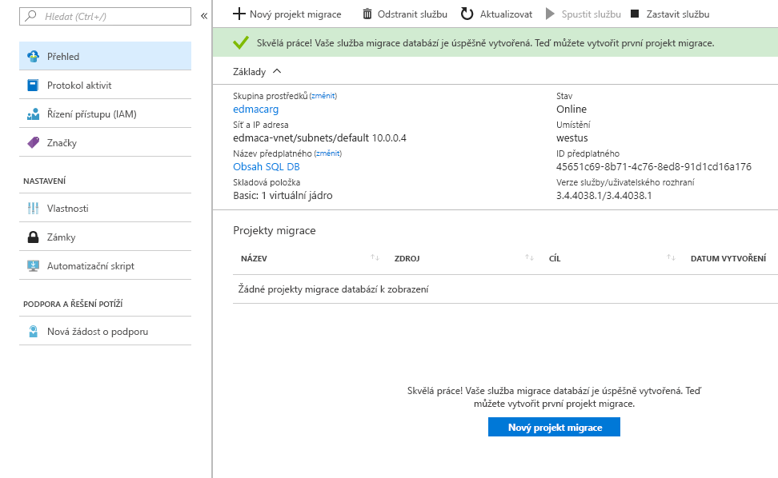

# Vytvoření instance služby Azure Database Migration Service pomocí webu Azure Portal
V tomto rychlém startu použijete Azure Portal k vytvoření instance služby Azure Database Migration Service.  Po vytvoření služby ji můžete použít k migraci dat z místního SQL Serveru do databáze SQL Azure.

Pokud ještě nemáte předplatné Azure, vytvořte si [bezplatný účet](https://azure.microsoft.com/free/) před tím, než začnete.

## Přihlášení k portálu Azure Portal
Otevřete webový prohlížeč, přejděte na web [Microsoft Azure Portal](https://portal.azure.com/) a pak zadejte svoje přihlašovací údaje pro přihlášení k portálu.

Výchozím zobrazením je váš řídicí panel služby.

## Registrace poskytovatele prostředků
Než vytvoříte první instanci služby Database Migration Service, zaregistrujte poskytovatele prostředků Microsoft.DataMigration.

1. Na webu Azure Portal vyberte **Všechny služby** a pak vyberte **Předplatná**.

2. Vyberte předplatné, ve kterém chcete vytvořit instanci služby Azure Database Migration Service, a pak vyberte **Poskytovatelé prostředků**.

3. Vyhledejte „migration“ a pak napravo od **Microsoft.DataMigration** vyberte **Zaregistrovat**.

    

## Vytvoření instance služby
1. Vyberte **+ Vytvořit prostředek** a vytvořte instanci služby Azure Database Migration Service.

2. Vyhledejte na marketplace „migration“, vyberte **Azure Database Migration Service** a pak na obrazovce **Azure Database Migration Service** vyberte **Vytvořit**.

3. Na obrazovce **Vytvořit službu Migration Service**: 

    - Zvolte zapamatovatelný a jedinečný **Název služby** pro identifikaci vaší instance služby Azure Database Migration Service.
    - Vyberte **Předplatné** Azure, ve kterém chcete instanci vytvořit.
    - Vyberte existující **skupinu prostředků** nebo vytvořte novou.
    - Zvolte **Umístění**, které je nejblíže vašemu zdrojovému nebo cílovému serveru.
    - Vyberte existující **virtuální síť** nebo vytvořte novou.

        Virtuální síť poskytuje službě Azure Database Migration Service přístup ke zdrojové databázi a cílovému prostředí.

        Další informace o vytvoření virtuální sítě na webu Azure Portal najdete v článku [Vytvoření virtuální sítě pomocí webu Azure Portal](https://aka.ms/vnet).

    - Jako **cenovou úroveň** vyberte Basic: 1 virtuální jádro.

        

4. Vyberte **Vytvořit**.

    Po chvíli bude vaše instance služby Azure Database Migration Service vytvořená a připravená k použití. Služba Database Migration Service bude vypadat jako na následujícím obrázku:

    

## Vyčištění prostředků
Všechny prostředky vytvořené v rámci tohoto rychlého startu můžete vyčistit odstraněním [skupiny prostředků Azure](../azure-resource-manager/resource-group-overview.md). Pokud chcete odstranit skupinu prostředků, přejděte do instance služby Azure Database Migration Service, kterou jste vytvořili. Vyberte název **skupiny prostředků** a pak vyberte **Odstranit skupinu prostředků**. Tato akce odstraní všechny prostředky ve skupině prostředků i samotnou skupinu.

## Další kroky
> [!div class="nextstepaction"]
> [Migrace místního SQL Serveru do služby Azure SQL Database](tutorial-sql-server-to-azure-sql.md)