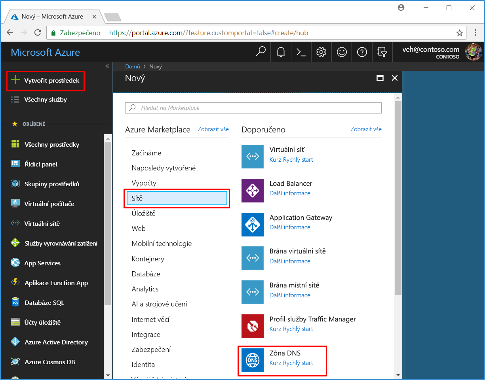
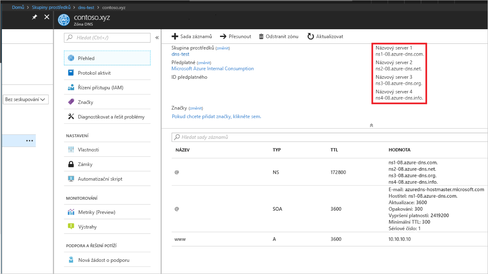

# <a name="quickstart-configure-azure-dns-for-name-resolution-by-using-the-portal"></a>Rychlý start: Konfigurace Azure DNS pro překlad názvů pomocí portálu

Azure DNS můžete nakonfigurovat k překladu názvů hostitelů ve veřejné doméně. Například, pokud jste zakoupili *contoso.com* název domény registrátora názvu domény, můžete nakonfigurovat Azure DNS na hostitele *contoso.com* domény a vyřešení *www.contoso.com* IP adresu vašeho webového serveru nebo webové aplikace.

V tomto rychlém startu vytvoříte testovací doménu a pak vytvořte záznam adres k vyřešení *www* na IP adresu *10.10.10.10*.

>[!IMPORTANT]
>Všechny názvy a IP adresy v rámci tohoto rychlého startu jsou příklady, které nepředstavují reálné situace. Rychlý Start také popisuje důsledky skutečných kde je to možné.

<!---
You can also perform these steps using [Azure PowerShell](dns-getstarted-powershell.md) or the cross-platform [Azure CLI](dns-getstarted-cli.md).
--->

Pokud ještě nemáte předplatné Azure, vytvořte si [bezplatný účet](https://azure.microsoft.com/free/?WT.mc_id=A261C142F) před tím, než začnete.

U všech postupů portálu přihlásit [webu Azure portal](https://portal.azure.com).

## <a name="create-a-dns-zone"></a>Vytvoření zóny DNS

Zóna DNS obsahuje záznamy DNS pro doménu. Pokud chcete začít hostovat svou doménu v Azure DNS, můžete vytvořit zónu DNS pro daný název domény. 

**Vytvoření zóny DNS:**

1. Vlevo nahoře vyberte **vytvořit prostředek**, pak **sítě**a potom **zónu DNS**.
   
1. Na **vytvořit zónu DNS** stránky zadejte nebo vyberte následující hodnoty:
   
   - **Název**: typ *contoso.xyz* pro účely tohoto příkladu rychlého startu. Název zóny DNS může být libovolná hodnota, která již není nakonfigurovaná na servery Azure DNS. Ve skutečné situaci byste použili doménu zakoupenou od registrátora názvu domény.
   - **Skupina prostředků**: vyberte **vytvořit nový**, zadejte *dns test*a vyberte **OK**. Název skupiny prostředků musí být jedinečný v rámci předplatného Azure. 
   
1. Vyberte **Vytvořit**.

   
   
Vytvoření zóny může trvat několik minut.

## <a name="create-a-dns-record"></a>Vytvoření záznamu DNS

Vytvoření položky DNS nebo záznamy pro vaši doménu v zóně DNS. Vytvořte nový záznam adresy nebo "A" záznam přeložit název hostitele na adresu IPv4.

**Chcete-li vytvořit záznam "A":**

1. Na webu Azure Portal v části **všechny prostředky**, otevřete **contoso.xyz** zónu DNS **dns test** skupinu prostředků. Můžete zadat *contoso.xyz* v **filtrovat podle názvu** pole našli snadněji.

1. V horní části **zónu DNS** stránce **+ sada záznamů**.

1. Na **přidat sadu záznamů** stránky zadejte nebo vyberte následující hodnoty:

   - **Název**: typ *www*. Název záznamu je název hostitele, který chcete přeložit na zadaná IP adresa.
   - **Typ**: vyberte **A**. "A" záznamy jsou nejčastěji používané, ale existují další typy záznamů pro servery e-mailu ("MX"), IP adresy IPv6 (AAAA) a tak dále. 
   - **Hodnota TTL**: typ *1*. *Time-to-live* DNS požadavku Určuje servery DNS a klienty jak dlouho může ukládat do mezipaměti odpovědi.
   - **Jednotka hodnoty TTL**: vyberte **hodin**. Toto je jednotka času **TTL** hodnotu. 
   - **IP adresa**: v tomto příkladu rychlého startu zadejte *10.10.10.10*. Tato hodnota je, že překládá název záznamu IP adresu. Ve skutečném scénáři by zadejte veřejnou IP adresu pro váš webový server.

Protože v tomto rychlém startu nepoužívá skutečné domény, není nutné nakonfigurovat názvové servery Azure DNS u registrátora názvu domény. Skutečné doménu měli byste kdokoli na Internetu, abychom mohli přeložit název hostitele pro připojení k webu nebo aplikaci. Budete navštivte web registrátora názvu domény nahraďte názvové servery Azure DNS záznamy názvového serveru. Další informace najdete v tématu [kurz: hostování domény v Azure DNS](dns-delegate-domain-azure-dns.md#delegate-the-domain).

## <a name="test-the-name-resolution"></a>Testování překladu IP adres

Teď, když máte testovací zóna DNS se záznam testu "A", můžete otestovat překlad názvů s nástroj zvaný *nslookup*. 

**K otestování překlad názvů DNS:**

1. Na webu Azure Portal v části **všechny prostředky**, otevřete **contoso.xyz** zónu DNS **dns test** skupinu prostředků. Můžete zadat *contoso.xyz* v **filtrovat podle názvu** pole našli snadněji.

1. Zkopírujte jeden z názvů názvových serverů ze seznamu na název serveru na **přehled** stránky. 
   
   
   
   >[!NOTE]
   >Ve skutečném scénáři zkopírujte všechny čtyři názvy názvových serverů, včetně koncových teček a využívat je pro nové názvy názvových serverů Azure DNS u svého registrátora domény. Další informace najdete v tématu [delegování domény do Azure DNS](dns-delegate-domain-azure-dns.md)
   
1. Otevřete příkazový řádek a spusťte následující příkaz:

   ```
   nslookup <host name> <name server name>
   ```
   
   Příklad:
   
   ```
   nslookup www.contoso.xyz ns1-08.azure-dns.com.
   ```
   
   By měl vypadat přibližně jako na následujícím obrázku:
   
   

Název hostitele **www.contoso.xyz** přeloží na **10.10.10.10**, stejně jako jste nakonfigurovali. Tento výsledek ověří, že překlad názvů funguje správně. 

## <a name="clean-up-resources"></a>Vyčištění prostředků

Pokud už nepotřebujete prostředky vytvořené v rámci tohoto rychlého startu, odeberte je tak, že odstraníte **dns test** skupinu prostředků. Otevřít **dns test** prostředku, skupiny a vyberte **odstranit skupinu prostředků**.

## <a name="next-steps"></a>Další postup

> [!div class="nextstepaction"]
> [Vytvoření záznamů DNS pro webovou aplikaci ve vlastní doméně](./dns-web-sites-custom-domain.md)