# <a name="create-and-route-blob-storage-events-with-the-azure-portal-and-event-grid"></a>Vytvoření a směrování událostí úložiště objektů blob pomocí webu Azure Portal a služby Event Grid

Azure Event Grid je služba zpracování událostí pro cloud. V tomto článku pomocí webu Azure Portal vytvoříte účet úložiště objektů blob, přihlásíte se k odběru událostí tohoto úložiště objektů blob a aktivujete událost pro zobrazení výsledku. Obvykle odesíláte události do koncového bodu, který data události zpracuje a provede akce. Pro zjednodušení tohoto článku však budete události odesílat do webové aplikace, která shromažďuje a zobrazuje zprávy.

[!INCLUDE [quickstarts-free-trial-note.md](../../includes/quickstarts-free-trial-note.md)]

Až budete hotovi, uvidíte, že se data události odeslala do webové aplikace.

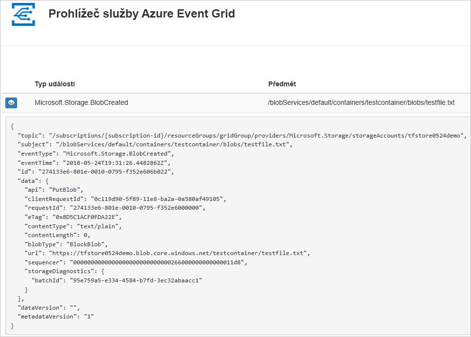

## <a name="create-a-storage-account"></a>vytvořit účet úložiště

Pokud chcete používat události úložiště objektů blob, potřebujete buď [účet úložiště objektů blob](../storage/common/storage-create-storage-account.md?toc=%2fazure%2fstorage%2fblobs%2ftoc.json#blob-storage-accounts), nebo [účet úložiště pro obecné účely v2](../storage/common/storage-account-options.md#general-purpose-v2). Účty pro **obecné účely v2 (GPv2)** jsou účty úložiště, které podporují všechny funkce všech služeb úložiště, včetně objektů blob, souborů, front a tabulek. **Účet úložiště objektů blob** je specializovaný účet úložiště pro ukládání nestrukturovaných dat v podobě objektů blob do služby Azure Storage. Účty úložiště objektů blob jsou podobné účtům úložiště pro obecné účely a mají stejně vysokou odolnost, dostupnost, škálovatelnost a výkonnost, a navíc mají 100% konzistentnost rozhraní API pro objekty blob bloku a doplňovací objekty blob. V případě aplikací, které vyžadují jenom úložiště objektů blob bloku nebo objektů blob doporučujeme používat účty úložiště objektů blob. 

1. Přihlaste se k [portálu Azure](https://portal.azure.com/).

1. Pokud chcete úložiště objektů blob, vyberte **Vytvořit prostředek**. 

   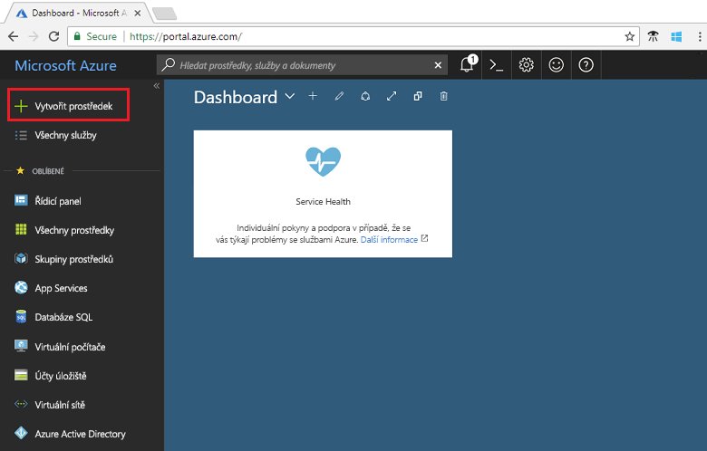

1. Výběrem **Úložiště** vyfiltrujte dostupné možnosti a vyberte **Účet úložiště – objekt blob, soubor, tabulka, fronta**.

   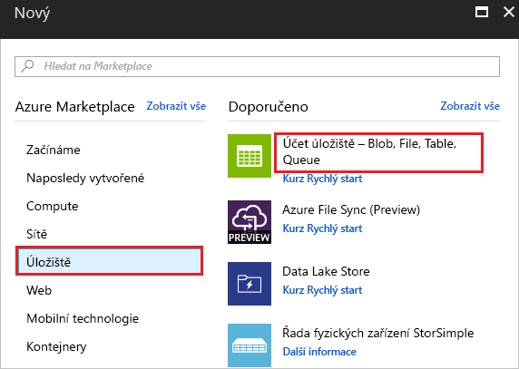

1. Zadejte hodnoty pro úložiště objektů blob, včetně jedinečného názvu účtu. Jako typ účtu vyberte **Úložiště objektů blob**. Jako umístění vyberte jedno z [umístění](overview.md), která podporují službu Event Grid. Až budete hotovi se zadáváním hodnot, vyberte **Vytvořit**.

   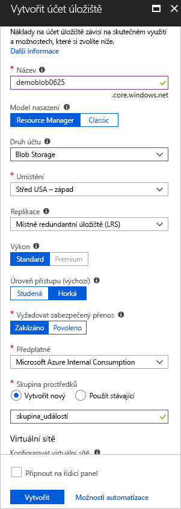

## <a name="create-a-message-endpoint"></a>Vytvoření koncového bodu zpráv

Před přihlášením k odběru událostí úložiště objektů blob vytvoříme koncový bod pro zprávy události. Koncový bod obvykle provede akce na základě dat události. Pro zjednodušení tohoto rychlého startu nasadíte [předem připravenou webovou aplikaci](https://github.com/dbarkol/azure-event-grid-viewer), která zobrazuje zprávy události. Nasazené řešení zahrnuje plán služby App Service, webovou aplikaci App Service a zdrojový kód z GitHubu.

1. Vyberte **Nasadit do Azure** a nasaďte řešení do svého předplatného. Na webu Azure Portal zadejte hodnoty pro parametry.

   <a href="https://portal.azure.com/#create/Microsoft.Template/uri/https%3A%2F%2Fraw.githubusercontent.com%2Fdbarkol%2Fazure-event-grid-viewer%2Fmaster%2Fazuredeploy.json" target="_blank"></a>

1. Dokončení nasazení může trvat několik minut. Po úspěšném nasazení si webovou aplikaci prohlédněte, abyste se ujistili, že funguje. Ve webovém prohlížeči přejděte na: `https://<your-site-name>.azurewebsites.net`

1. Zobrazí se web, na který se však zatím neodeslaly žádné události.

   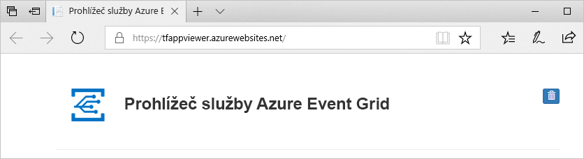

## <a name="subscribe-to-the-blob-storage"></a>Přihlášení k odběru úložiště objektů blob

K odběru tématu se přihlašujete, aby služba Event Grid věděla, které události chcete sledovat a kam má tyto události odesílat.

1. Na portálu vyberte své úložiště objektů blob a pak vyberte **Události**.

   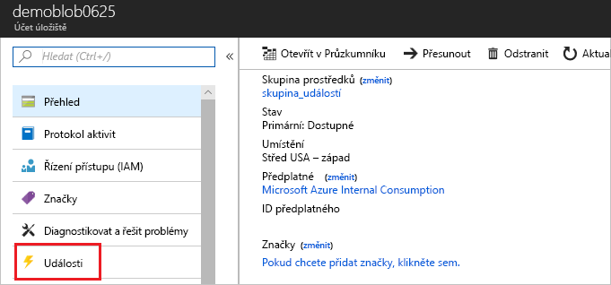

1. Pokud chcete do aplikace prohlížeče odesílat události, použijte jako koncový bod webhook. Vyberte **Další možnosti** a **Webhook**.

   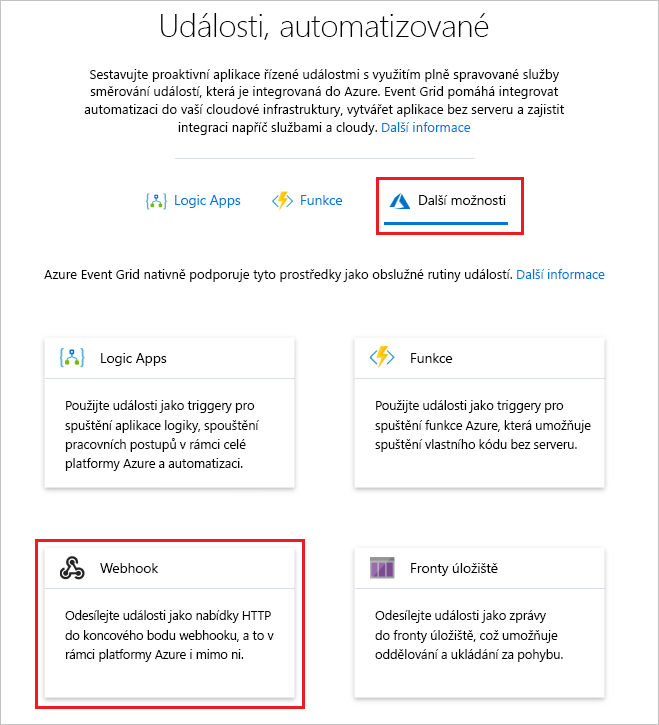

1. Odběr událostí obsahuje předem vyplněné hodnoty pro vaše úložiště objektů blob. Jako koncový bod webhooku zadejte adresu URL vaší webové aplikace a do adresy URL domovské stránky přidejte `api/updates`. Zadejte název vašeho předplatného. Až budete hotovi, vyberte **Vytvořit**.

   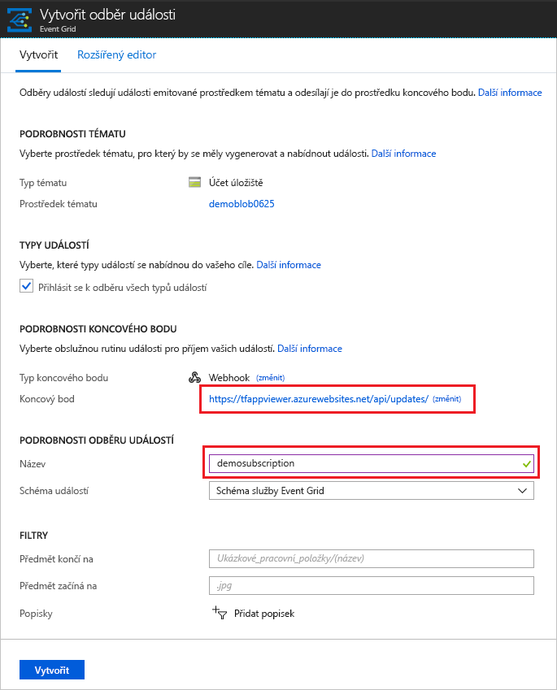

1. Podívejte se na webovou aplikaci znovu a všimněte si, že do ní byla odeslána událost ověření odběru. Vyberte ikonu oka a rozbalte data události. Služba Event Grid odešle událost ověření, aby koncový bod mohl ověřit, že data události chce přijímat. Webová aplikace obsahuje kód pro ověření odběru.

   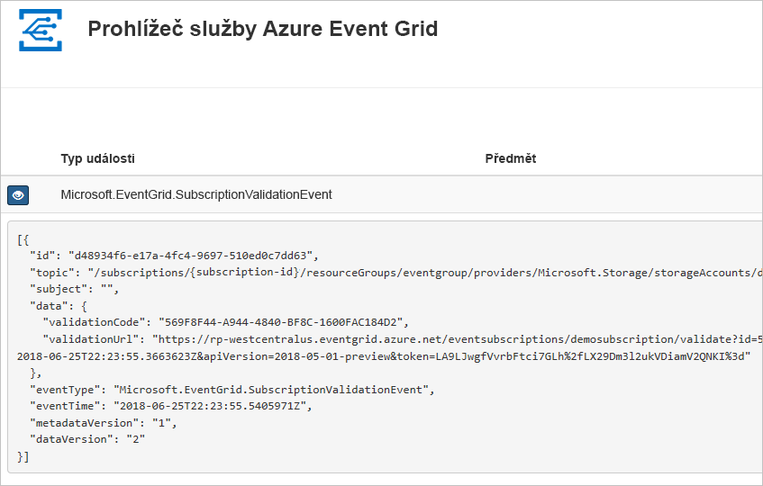

Nyní aktivujeme událost, abychom viděli, jak služba Event Grid distribuuje zprávu do vašeho koncového bodu.

## <a name="send-an-event-to-your-endpoint"></a>Odeslání události do koncového bodu

Událost pro úložiště objektů blob aktivujete nahráním souboru. Soubor nemusí obsahovat žádný konkrétní obsah. V tomto článku se předpokládá, že máte soubor testfile.txt, ale můžete použít jakýkoli soubor.

1. Jako úložiště objektů blob vyberte **Objekty blob**.

   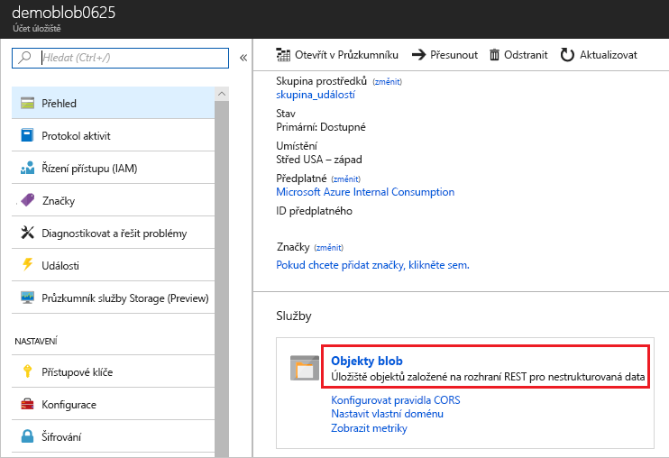

1. Vyberte **+ Kontejner**. Zadejte název kontejneru a použijte jakoukoli úroveň přístupu.

   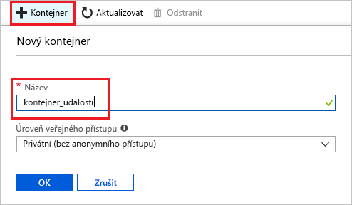

1. Vyberte nový kontejner.

   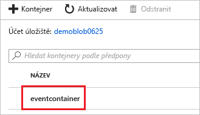

1. Pokud chcete nahrát soubor, vyberte **Nahrát**.

   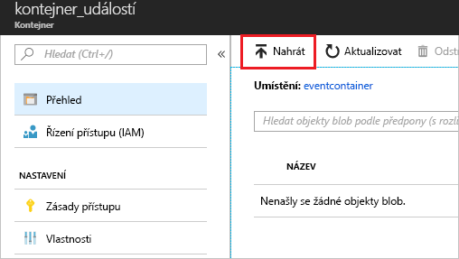

1. Přejděte k testovacímu souboru a nahrajte ho.

1. Právě jste aktivovali událost a služba Event Grid odeslala zprávu do koncového bodu, který jste nakonfigurovali při přihlášení k odběru. Zobrazte svou webovou aplikaci a všimněte si, že se přijala událost vytvoření objektu blob. 

  ```json
  {
    "topic": "/subscriptions/{subscription-id}/resourceGroups/eventgroup/providers/Microsoft.Storage/storageAccounts/demoblob0625",
    "subject": "/blobServices/default/containers/eventcontainer/blobs/testfile.txt",
    "eventType": "Microsoft.Storage.BlobCreated",
    "eventTime": "2018-06-25T22:50:41.1823131Z",
    "id": "89a2f9da-c01e-00bb-13d6-0c599506e4e3",
    "data": {
      "api": "PutBlockList",
      "clientRequestId": "41341a9b-e977-4a91-9000-c64125039047",
      "requestId": "89a2f9da-c01e-00bb-13d6-0c5995000000",
      "eTag": "0x8D5DAEE13C8F9ED",
      "contentType": "text/plain",
      "contentLength": 4,
      "blobType": "BlockBlob",
      "url": "https://demoblob0625.blob.core.windows.net/eventcontainer/testfile.txt",
      "sequencer": "00000000000000000000000000001C24000000000004712b",
      "storageDiagnostics": {
        "batchId": "ef633252-32fd-464b-8f5a-0d10d68885e6"
      }
    },
    "dataVersion": "",
    "metadataVersion": "1"
  }
  ```

## <a name="clean-up-resources"></a>Vyčištění prostředků

Pokud chcete pokračovat v práci s touto událostí, nevyčišťujte prostředky vytvořené v rámci tohoto článku. V opačném případě odstraňte prostředky, které jste v rámci tohoto článku vytvořili.

Vyberte skupinu prostředků a pak vyberte **Odstranit skupinu prostředků**.

## <a name="next-steps"></a>Další kroky

Když teď víte, jak vytvářet vlastní témata a odběry událostí, zjistěte, s čím vám služba Event Grid ještě může pomoct:

- [Informace o službě Event Grid](overview.md)
- [Směrování událostí služby Blob Storage do vlastního webového koncového bodu](../storage/blobs/storage-blob-event-quickstart.md?toc=%2fazure%2fevent-grid%2ftoc.json)
- [Monitorování změn virtuálního počítače pomocí služeb Azure Event Grid a Logic Apps](monitor-virtual-machine-changes-event-grid-logic-app.md)
- [Streamování velkých objemů dat do datového skladu](event-grid-event-hubs-integration.md)
