# <a name="quickstart-route-custom-events-to-web-endpoint-with-the-azure-portal-and-event-grid"></a>Rychlý start: Směrování vlastních událostí do webového koncového bodu pomocí webu Azure portal a Event gridu

Azure Event Grid je služba zpracování událostí pro cloud. V tomto článku vytvoříte pomocí webu Azure Portal vlastní téma, přihlásíte se k jeho odběru a aktivujete událost, abyste viděli výsledek. Obvykle odesíláte události do koncového bodu, který data události zpracuje a provede akce. Pro zjednodušení tohoto článku však budete události odesílat do webové aplikace, která shromažďuje a zobrazuje zprávy.

Až budete hotovi, uvidíte, že se data události odeslala do webové aplikace.

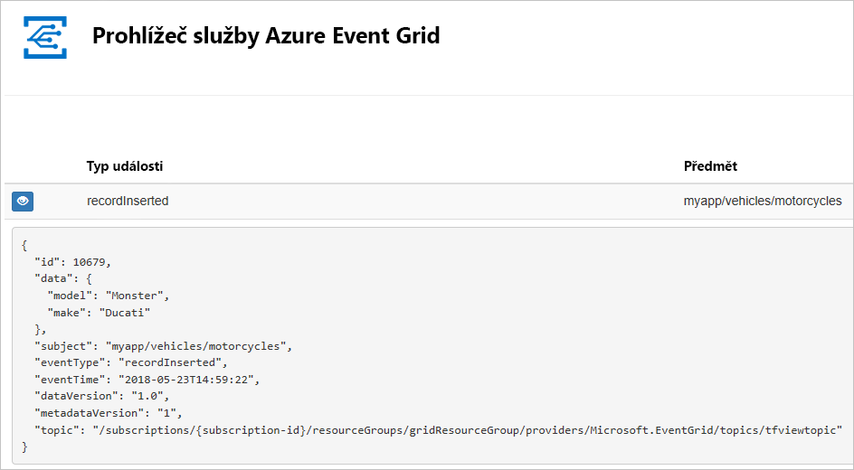

[!INCLUDE [quickstarts-free-trial-note.md](../../includes/quickstarts-free-trial-note.md)]

[!INCLUDE [event-grid-register-provider-portal.md](../../includes/event-grid-register-provider-portal.md)]

## <a name="create-a-custom-topic"></a>Vytvoření vlastního tématu

Téma Event Gridu poskytuje uživatelsky definovaný koncový bod, do kterého odesíláte události. 

1. Přihlaste se k [portálu Azure](https://portal.azure.com/).

1. Pokud chcete vytvořit vlastní téma, vyberte **Vytvořit prostředek**. 

   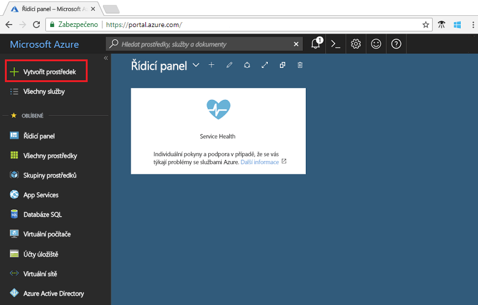

1. Vyhledejte *Téma Event Gridu* a vyberte ho z dostupných možností.

   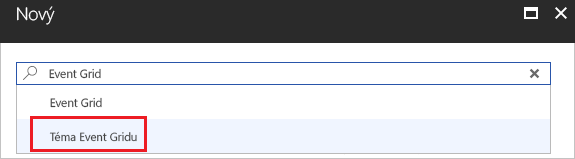

1. Vyberte **Vytvořit**.

   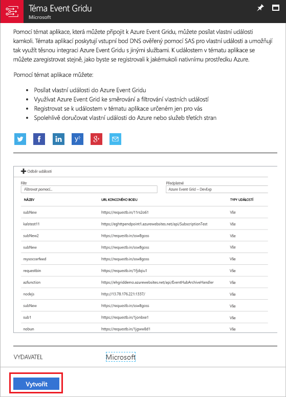

1. Zadejte jedinečný název vlastního tématu. Název tématu musí být jedinečný, protože je reprezentován položkou DNS. Nepoužívejte název zobrazený na obrázku. Místo toho vytvořte vlastní název – musí být dlouhý 3 až 50 znaků a obsahovat jenom hodnoty a – z, A-Z, 0-9, a "-". Zadejte název skupiny prostředků. Vyberte **Vytvořit**.

   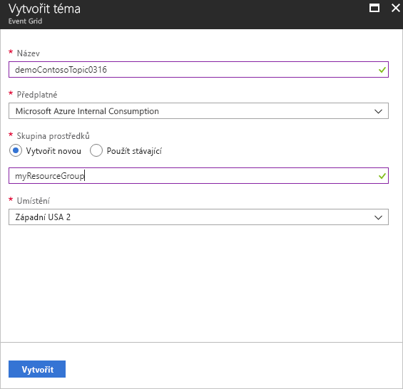

1. Po vytvoření vlastního tématu se zobrazí oznámení o úspěchu.

   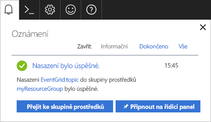

   Pokud se nasazení nepovedlo, zjistěte, co způsobilo chybu. Vyberte **Nasazení selhalo**.

   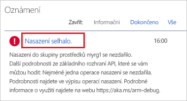

   Vyberte chybovou zprávu.

   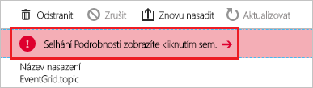

   Následující obrázek ukazuje nasazení, které selhalo, protože název vlastního tématu se už používá. Pokud se zobrazí tato chyba, zkuste nasazení znovu s jiným názvem.

   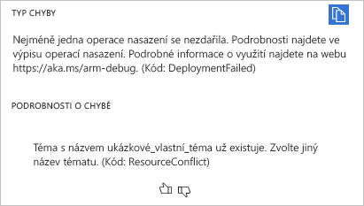

## <a name="create-a-message-endpoint"></a>Vytvoření koncového bodu zpráv

Před přihlášením k odběru vlastního tématu vytvoříme koncový bod pro zprávy události. Koncový bod obvykle provede akce na základě dat události. Pro zjednodušení tohoto rychlého startu nasadíte [předem připravenou webovou aplikaci](https://github.com/Azure-Samples/azure-event-grid-viewer), která zobrazuje zprávy události. Nasazené řešení zahrnuje plán služby App Service, webovou aplikaci App Service a zdrojový kód z GitHubu.

1. Vyberte **Nasadit do Azure** a nasaďte řešení do svého předplatného. Na webu Azure Portal zadejte hodnoty pro parametry.

   <a href="https://portal.azure.com/#create/Microsoft.Template/uri/https%3A%2F%2Fraw.githubusercontent.com%2FAzure-Samples%2Fazure-event-grid-viewer%2Fmaster%2Fazuredeploy.json" target="_blank"></a>

1. Dokončení nasazení může trvat několik minut. Po úspěšném nasazení si webovou aplikaci prohlédněte, abyste se ujistili, že funguje. Ve webovém prohlížeči přejděte na: `https://<your-site-name>.azurewebsites.net`

1. Zobrazí se web, na který se však zatím neodeslaly žádné události.

   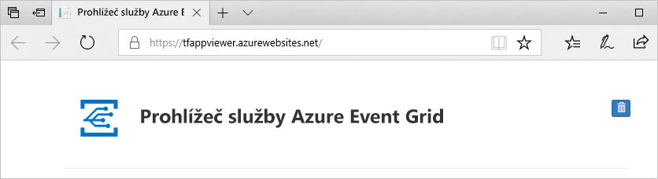

## <a name="subscribe-to-custom-topic"></a>Přihlášení k odběru vlastního tématu

K odběru tématu Event Gridu se přihlašujete, aby služba Event Grid věděla, které události chcete sledovat a kam má tyto události odesílat.

1. Na portálu vyberte své vlastní téma.

   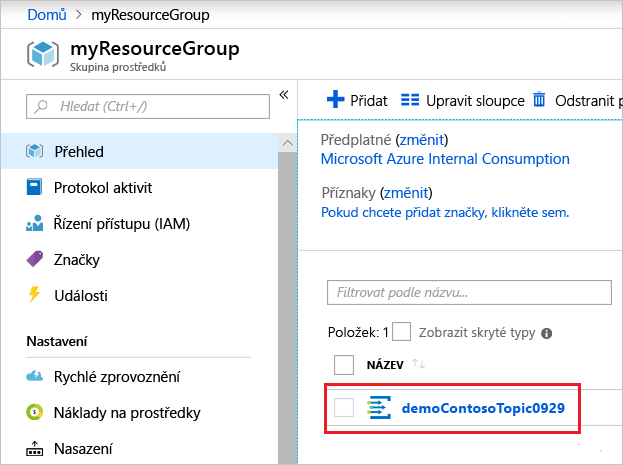

1. Vyberte **+ Odběr události**.

   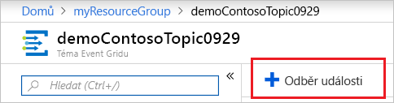

1. Jako typ koncového bodu vyberte **Webhook**. Zadejte název odběru události.

   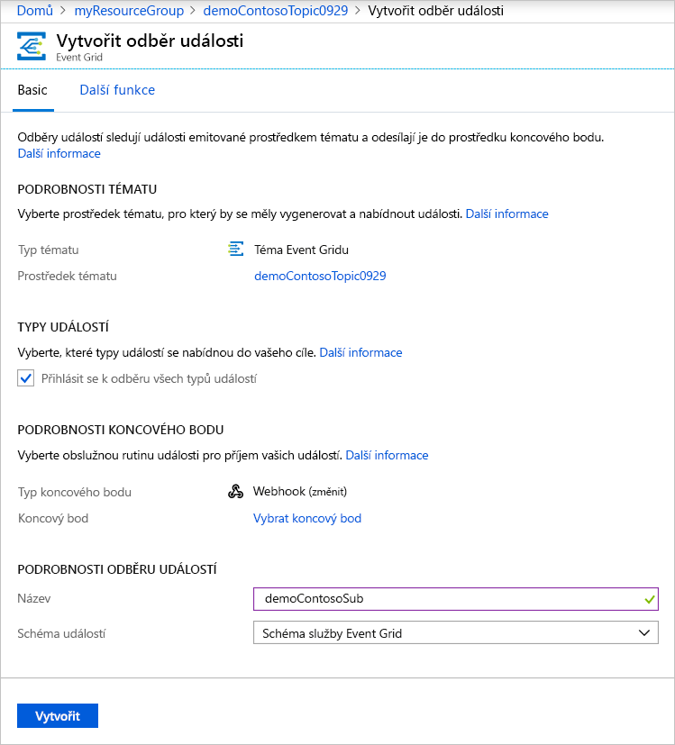

1. Zvolte **Vybrat koncový bod**. 

1. Jako koncový bod webhooku zadejte adresu URL vaší webové aplikace a do adresy URL domovské stránky přidejte `api/updates`. Zvolte **Potvrdit výběr**.

   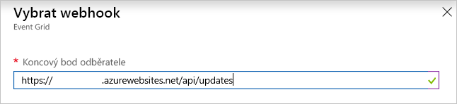

1. Po zadání hodnot odběru události zvolte **Vytvořit**.

Podívejte se na webovou aplikaci znovu a všimněte si, že do ní byla odeslána událost ověření odběru. Vyberte ikonu oka a rozbalte data události. Služba Event Grid odešle událost ověření, aby koncový bod mohl ověřit, že data události chce přijímat. Webová aplikace obsahuje kód pro ověření odběru.

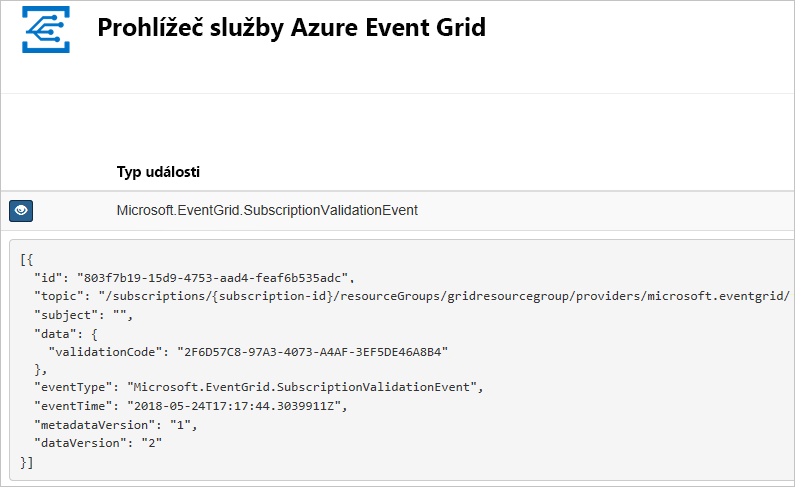

## <a name="send-an-event-to-your-topic"></a>Odeslání události do tématu

Nyní aktivujeme událost, abychom viděli, jak služba Event Grid distribuuje zprávu do vašeho koncového bodu. K odeslání testovací události do vlastního tématu použijte Azure CLI nebo PowerShell. Obvykle by aplikace nebo služba Azure odesílala data události.

V prvním příkladu se používá Azure CLI. Načte adresu URL a klíč vlastního tématu a data ukázkové události. Místo položky `<topic_name>` použijte název vlastního tématu. Vytvoří se ukázková data události. Element JSON `data` je datová část vaší události. V tomto poli může být libovolný JSON ve správném formátu. Můžete také použít pole subject (předmět) pro pokročilé směrování a filtrování. CURL je nástroj, který odesílá požadavky HTTP.

```azurecli-interactive
endpoint=$(az eventgrid topic show --name <topic_name> -g myResourceGroup --query "endpoint" --output tsv)
key=$(az eventgrid topic key list --name <topic_name> -g myResourceGroup --query "key1" --output tsv)

event='[ {"id": "'"$RANDOM"'", "eventType": "recordInserted", "subject": "myapp/vehicles/motorcycles", "eventTime": "'`date +%Y-%m-%dT%H:%M:%S%z`'", "data":{ "make": "Ducati", "model": "Monster"},"dataVersion": "1.0"} ]'

curl -X POST -H "aeg-sas-key: $key" -d "$event" $endpoint
```

V druhém příkladu se k provedení podobných kroků používá PowerShell.

```azurepowershell-interactive
$endpoint = (Get-AzureRmEventGridTopic -ResourceGroupName gridResourceGroup -Name <topic-name>).Endpoint
$keys = Get-AzureRmEventGridTopicKey -ResourceGroupName gridResourceGroup -Name <topic-name>

$eventID = Get-Random 99999

#Date format should be SortableDateTimePattern (ISO 8601)
$eventDate = Get-Date -Format s

#Construct body using Hashtable
$htbody = @{
    id= $eventID
    eventType="recordInserted"
    subject="myapp/vehicles/motorcycles"
    eventTime= $eventDate   
    data= @{
        make="Ducati"
        model="Monster"
    }
    dataVersion="1.0"
}

#Use ConvertTo-Json to convert event body from Hashtable to JSON Object
#Append square brackets to the converted JSON payload since they are expected in the event's JSON payload syntax
$body = "["+(ConvertTo-Json $htbody)+"]"

Invoke-WebRequest -Uri $endpoint -Method POST -Body $body -Headers @{"aeg-sas-key" = $keys.Key1}
```

Právě jste aktivovali událost a služba Event Grid odeslala zprávu do koncového bodu, který jste nakonfigurovali při přihlášení k odběru. Podívejte se na webovou aplikaci, abyste si zobrazili událost, kterou jste právě odeslali.

```json
[{
  "id": "1807",
  "eventType": "recordInserted",
  "subject": "myapp/vehicles/motorcycles",
  "eventTime": "2017-08-10T21:03:07+00:00",
  "data": {
    "make": "Ducati",
    "model": "Monster"
  },
  "dataVersion": "1.0",
  "metadataVersion": "1",
  "topic": "/subscriptions/{subscription-id}/resourceGroups/{resource-group}/providers/Microsoft.EventGrid/topics/{topic}"
}]
```


## <a name="clean-up-resources"></a>Vyčištění prostředků

Pokud chcete pokračovat v práci s touto událostí, nevyčišťujte prostředky vytvořené v rámci tohoto článku. V opačném případě odstraňte prostředky, které jste v rámci tohoto článku vytvořili.

Vyberte skupinu prostředků a pak vyberte **Odstranit skupinu prostředků**.

## <a name="next-steps"></a>Další postup

Když teď víte, jak vytvářet vlastní témata a odběry událostí, zjistěte, s čím vám služba Event Grid ještě může pomoct:

- [Informace o službě Event Grid](overview.md)
- [Směrování událostí služby Blob Storage do vlastního webového koncového bodu](../storage/blobs/storage-blob-event-quickstart.md?toc=%2fazure%2fevent-grid%2ftoc.json)
- [Monitorování změn virtuálního počítače pomocí služeb Azure Event Grid a Logic Apps](monitor-virtual-machine-changes-event-grid-logic-app.md)
- [Streamování velkých objemů dat do datového skladu](event-grid-event-hubs-integration.md)
