# <a name="create-and-route-custom-events-with-the-azure-portal-and-event-grid"></a>Vytvoření a směrování vlastních událostí pomocí webu Azure Portal a Event Gridu

Azure Event Grid je služba zpracování událostí pro cloud. V tomto článku pomocí webu Azure Portal vytvoříte vlastní téma, přihlásíte se k jeho odběru a aktivujete událost, abyste viděli výsledek. Událost odešlete do funkce Azure, která zaprotokoluje data události. Až budete hotovi, uvidíte, že se data události odeslala do koncového bodu a zaprotokolovala.

[!INCLUDE [quickstarts-free-trial-note.md](../../includes/quickstarts-free-trial-note.md)]

[!INCLUDE [event-grid-register-provider-portal.md](../../includes/event-grid-register-provider-portal.md)]

## <a name="create-a-custom-topic"></a>Vytvoření vlastního tématu

Téma Event Gridu poskytuje uživatelsky definovaný koncový bod, do kterého odesíláte události. 

1. Přihlaste se k webu [Azure Portal](https://portal.azure.com/).

1. Pokud chcete vytvořit vlastní téma, vyberte **Vytvořit prostředek**. 

   

1. Vyhledejte *Téma Event Gridu* a vyberte ho z dostupných možností.

   

1. Vyberte **Vytvořit**.

   

1. Zadejte jedinečný název vlastního tématu. Název tématu musí být jedinečný, protože je reprezentován položkou DNS. Nepoužívejte název zobrazený na obrázku. Místo toho vytvořte vlastní název. Zadejte název skupiny prostředků. Vyberte **Vytvořit**.

   

1. Po vytvoření vlastního tématu se zobrazí oznámení o úspěchu.

   

   Pokud se nasazení nepovedlo, zjistěte, co způsobilo chybu. Vyberte **Nasazení selhalo**.

   

   Vyberte chybovou zprávu.

   

   Následující obrázek ukazuje nasazení, které selhalo, protože název vlastního tématu se už používá. Pokud se zobrazí tato chyba, zkuste nasazení znovu s jiným názvem.

   

## <a name="create-an-azure-function"></a>Vytvoření funkce Azure

Před přihlášením k odběru tématu vytvoříme koncový bod pro zprávy události. V tomto článku vytvoříte pro koncový bod aplikaci funkcí pomocí služby Azure Functions.

1. Pokud chcete vytvořit funkci, vyberte **Vytvořit prostředek**.

   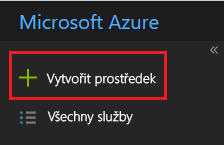

1. Vyberte **Compute** a **Function App**.

   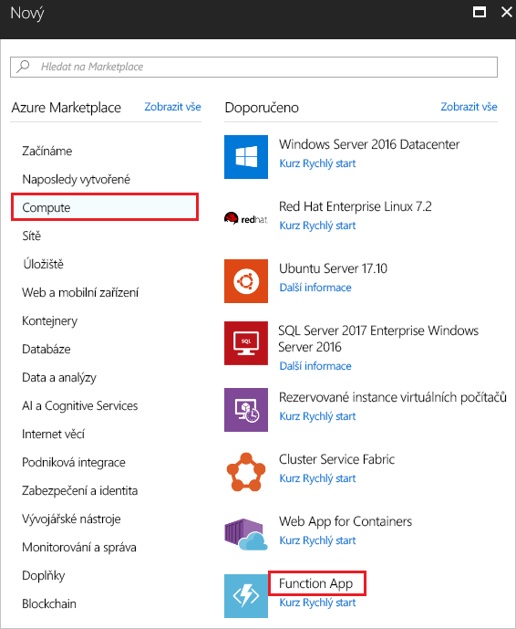

1. Zadejte jedinečný název funkce Azure. Nepoužívejte název zobrazený na obrázku. Vyberte skupinu prostředků, kterou jste vytvořili v rámci tohoto článku. Jako plán hostování použijte **Plán Consumption**. Použijte navrhovaný nový účet úložiště. Můžete vypnout Application Insights. Po zadání hodnot vyberte **Vytvořit**.

   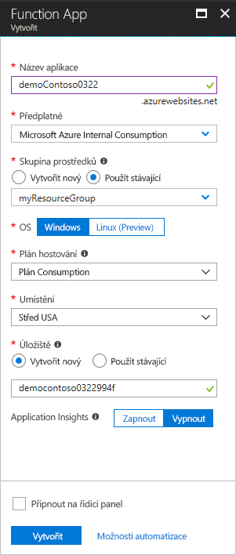

1. Po dokončení nasazení vyberte **Přejít k prostředku**.

   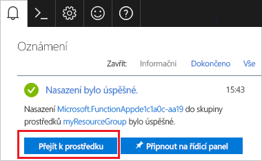

1. Vedle položky **Funkce** vyberte **+**.

   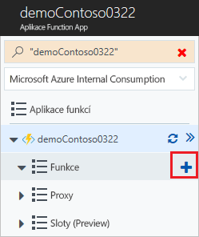

1. Z dostupných možností vyberte **Custom function** (Vlastní funkce).

   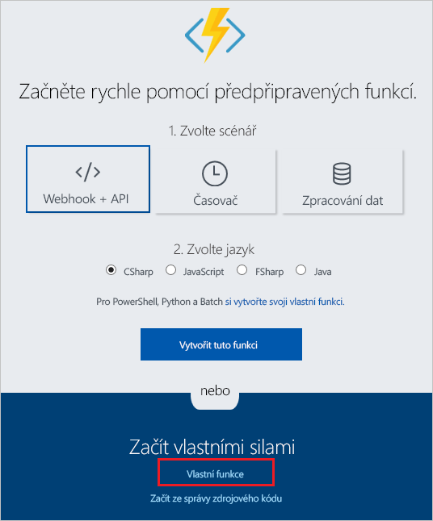

1. Posuňte se dolů, dokud nenajdete **Event Grid trigger** (Trigger služby Event Grid). Vyberte **C#**.

   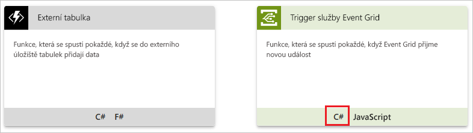

1. Přijměte výchozí hodnoty a vyberte **Create** (Vytvořit).

   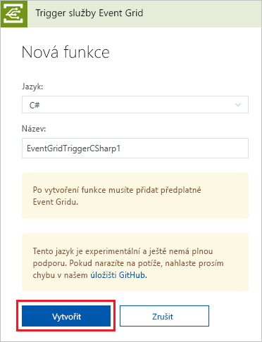

Vaše funkce je teď připravená přijímat události.

## <a name="subscribe-to-a-topic"></a>Přihlášení k odběru tématu

K odběru tématu se přihlašujete, aby služba Event Grid věděla, které události chcete sledovat a kam má tyto události odesílat.

1. Ve své funkci Azure vyberte **Přidání odběru Event Gridu**.

   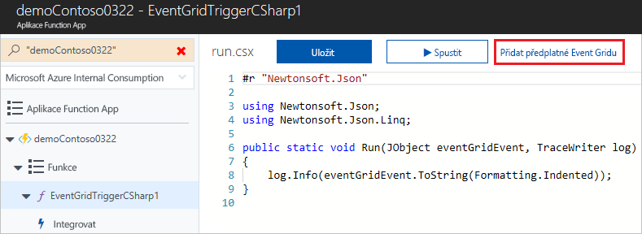

1. Zadejte hodnoty pro odběr. Jako typ tématu vyberte **Témata Event Gridu**. Jako předplatné a skupinu prostředků vyberte předplatné a skupinu prostředků, ve kterých jste vytvořili vlastní téma. Jako instanci vyberte název vlastního tématu. Jako koncový bod odběratele je předem vyplněná adresa URL funkce.

   

1. Před aktivací události otevřete protokoly funkce, kde se po odeslání zobrazí data události. V dolní části funkce Azure vyberte **Protokoly**.

   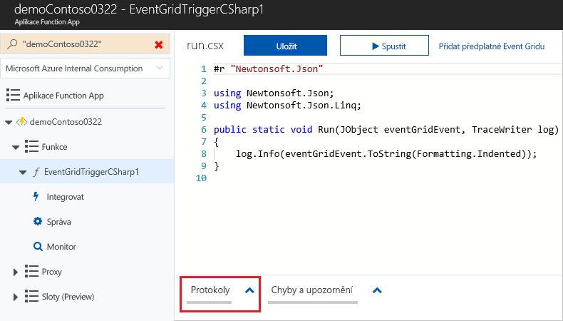

Nyní aktivujeme událost, abychom viděli, jak služba Event Grid distribuuje zprávu do vašeho koncového bodu. Pro zjednodušení tohoto článku odešlete ukázková data události do vlastního tématu pomocí služby Cloud Shell. Obvykle by aplikace nebo služba Azure odesílala data události.

[!INCLUDE [cloud-shell-try-it.md](../../includes/cloud-shell-try-it.md)]

## <a name="send-an-event-to-your-topic"></a>Odeslání události do tématu

K odeslání testovací události do vlastního tématu použijte Azure CLI nebo PowerShell.

V prvním příkladu se používá Azure CLI. Načte adresu URL a klíč tématu a data ukázkové události. Místo `<topic_name>` použijte název vašeho tématu. Pokud chcete zobrazit úplnou událost, použijte `echo "$body"`. Element JSON `data` je datová část vaší události. V tomto poli může být libovolný JSON ve správném formátu. Můžete také použít pole subject (předmět) pro pokročilé směrování a filtrování. CURL je nástroj, který odesílá požadavky HTTP.

```azurecli-interactive
endpoint=$(az eventgrid topic show --name <topic_name> -g myResourceGroup --query "endpoint" --output tsv)
key=$(az eventgrid topic key list --name <topic_name> -g myResourceGroup --query "key1" --output tsv)

body=$(eval echo "'$(curl https://raw.githubusercontent.com/Azure/azure-docs-json-samples/master/event-grid/customevent.json)'")

curl -X POST -H "aeg-sas-key: $key" -d "$body" $endpoint
```

V druhém příkladu se k provedení podobných kroků používá PowerShell.

```azurepowershell-interactive
$endpoint = (Get-AzureRmEventGridTopic -ResourceGroupName gridResourceGroup -Name <topic-name>).Endpoint
$keys = Get-AzureRmEventGridTopicKey -ResourceGroupName gridResourceGroup -Name <topic-name>

$eventID = Get-Random 99999

#Date format should be SortableDateTimePattern (ISO 8601)
$eventDate = Get-Date -Format s

#Construct body using Hashtable
$htbody = @{
    id= $eventID
    eventType="recordInserted"
    subject="myapp/vehicles/motorcycles"
    eventTime= $eventDate   
    data= @{
        make="Ducati"
        model="Monster"
    }
    dataVersion="1.0"
}

#Use ConvertTo-Json to convert event body from Hashtable to JSON Object
#Append square brackets to the converted JSON payload since they are expected in the event's JSON payload syntax
$body = "["+(ConvertTo-Json $htbody)+"]"

Invoke-WebRequest -Uri $endpoint -Method POST -Body $body -Headers @{"aeg-sas-key" = $keys.Key1}
```

Právě jste aktivovali událost a služba Event Grid odeslala zprávu do koncového bodu, který jste nakonfigurovali při přihlášení k odběru. Podívejte se na protokoly, kde se zobrazí data události.

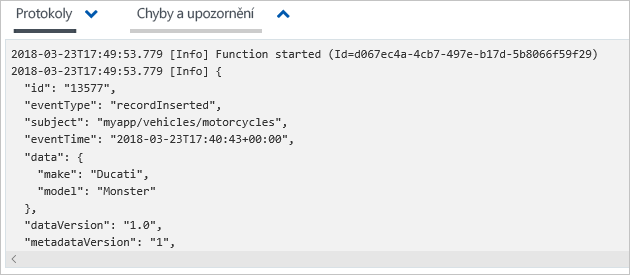

## <a name="clean-up-resources"></a>Vyčištění prostředků

Pokud chcete pokračovat v práci s touto událostí, nevyčišťujte prostředky vytvořené v rámci tohoto článku. V opačném případě odstraňte prostředky, které jste v rámci tohoto článku vytvořili.

Vyberte skupinu prostředků a pak vyberte **Odstranit skupinu prostředků**.

## <a name="next-steps"></a>Další kroky

Když teď víte, jak vytvářet vlastní témata a odběry událostí, zjistěte, s čím vám služba Event Grid ještě může pomoct:

- [Informace o službě Event Grid](overview.md)
- [Směrování událostí služby Blob Storage do vlastního webového koncového bodu](../storage/blobs/storage-blob-event-quickstart.md?toc=%2fazure%2fevent-grid%2ftoc.json)
- [Monitorování změn virtuálního počítače pomocí služeb Azure Event Grid a Logic Apps](monitor-virtual-machine-changes-event-grid-logic-app.md)
- [Streamování velkých objemů dat do datového skladu](event-grid-event-hubs-integration.md)
