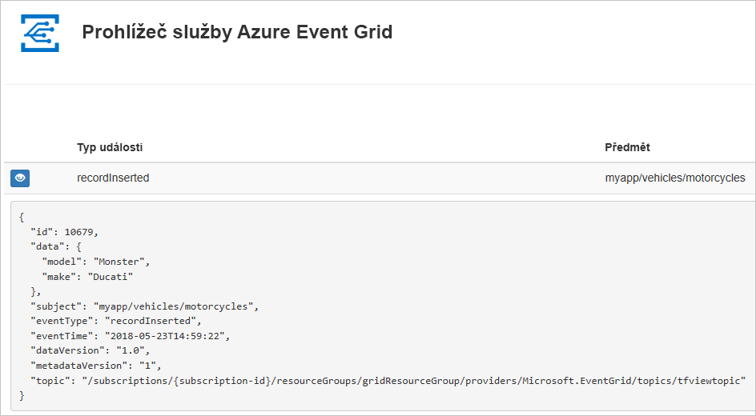
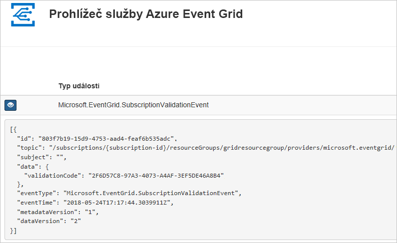

# <a name="quickstart-route-custom-events-to-web-endpoint-with-powershell-and-event-grid"></a>Rychlý start: Směrování vlastních událostí do webového koncového bodu pomocí Powershellu a Event gridu

Azure Event Grid je služba zpracování událostí pro cloud. V tomto článku pomocí Azure PowerShellu vytvoříte vlastní téma, přihlásíte se k jeho odběru a aktivujete událost, abyste viděli výsledek. Obvykle odesíláte události do koncového bodu, který data události zpracuje a provede akce. Pro zjednodušení tohoto článku však budete události odesílat do webové aplikace, která shromažďuje a zobrazuje zprávy.

Až budete hotovi, uvidíte, že se data události odeslala do webové aplikace.



[!INCLUDE [quickstarts-free-trial-note.md](../../includes/quickstarts-free-trial-note.md)]

Tento článek vyžaduje použití nejnovější verze Azure PowerShellu. Pokud potřebujete instalaci nebo upgrade, přečtěte si téma [Instalace a konfigurace Azure PowerShellu](/powershell/azure/azurerm/install-azurerm-ps).

## <a name="create-a-resource-group"></a>Vytvoření skupiny prostředků

Témata služby Event Grid jsou prostředky Azure a musí být umístěné ve skupině prostředků Azure. Skupina prostředků je logická kolekce, ve které se nasazují a spravují prostředky Azure.

Vytvořte skupinu prostředků pomocí příkazu [New-AzureRmResourceGroup](/powershell/module/azurerm.resources/new-azurermresourcegroup).

Následující příklad vytvoří skupinu prostředků *gridResourceGroup* v umístění *westus2*.

```powershell-interactive
New-AzureRmResourceGroup -Name gridResourceGroup -Location westus2
```

[!INCLUDE [event-grid-register-provider-powershell.md](../../includes/event-grid-register-provider-powershell.md)]

## <a name="create-a-custom-topic"></a>Vytvoření vlastního tématu

Téma Event Gridu poskytuje uživatelsky definovaný koncový bod, do kterého odesíláte události. Následující příklad vytvoří vlastní téma ve vaší skupině prostředků. Nahraďte `<your-topic-name>` jedinečným názvem vašeho tématu. Název tématu musí být jedinečný, protože je součástí položky DNS. Kromě toho musí být dlouhý 3 až 50 znaků a obsahovat jenom hodnoty a – z, A-Z, 0-9, a "-"

```powershell-interactive
$topicname="<your-topic-name>"

New-AzureRmEventGridTopic -ResourceGroupName gridResourceGroup -Location westus2 -Name $topicname
```

## <a name="create-a-message-endpoint"></a>Vytvoření koncového bodu zpráv

Před přihlášením k odběru tématu vytvoříme koncový bod pro zprávy události. Koncový bod obvykle provede akce na základě dat události. Pro zjednodušení tohoto rychlého startu nasadíte [předem připravenou webovou aplikaci](https://github.com/Azure-Samples/azure-event-grid-viewer), která zobrazuje zprávy události. Nasazené řešení zahrnuje plán služby App Service, webovou aplikaci App Service a zdrojový kód z GitHubu.

Nahraďte `<your-site-name>` jedinečným názvem vaší webové aplikace. Název webové aplikace musí být jedinečný, protože je součástí položky DNS.

```powershell-interactive
$sitename="<your-site-name>"

New-AzureRmResourceGroupDeployment `
  -ResourceGroupName gridResourceGroup `
  -TemplateUri "https://raw.githubusercontent.com/Azure-Samples/azure-event-grid-viewer/master/azuredeploy.json" `
  -siteName $sitename `
  -hostingPlanName viewerhost
```

Dokončení nasazení může trvat několik minut. Po úspěšném nasazení si webovou aplikaci prohlédněte, abyste se ujistili, že funguje. Ve webovém prohlížeči přejděte na: `https://<your-site-name>.azurewebsites.net`

Měli byste vidět web aktuálně bez zobrazených zpráv.

## <a name="subscribe-to-a-topic"></a>Přihlášení k odběru tématu

K odběru tématu se přihlašujete, aby služba Event Grid věděla, které události chcete sledovat a kam má tyto události odesílat. Následující příklad se přihlásí k odběru tématu, které jste vytvořili, a předá adresu URL z webové aplikace jako koncový bod pro oznámení události.

Koncový bod pro webovou aplikaci musí obsahovat příponu `/api/updates/`.

```powershell-interactive
$endpoint="https://$sitename.azurewebsites.net/api/updates"

New-AzureRmEventGridSubscription `
  -EventSubscriptionName demoViewerSub `
  -Endpoint $endpoint `
  -ResourceGroupName gridResourceGroup `
  -TopicName $topicname
```

Podívejte se na webovou aplikaci znovu a všimněte si, že do ní byla odeslána událost ověření odběru. Vyberte ikonu oka a rozbalte data události. Služba Event Grid odešle událost ověření, aby koncový bod mohl ověřit, že data události chce přijímat. Webová aplikace obsahuje kód pro ověření odběru.



## <a name="send-an-event-to-your-topic"></a>Odeslání události do tématu

Teď aktivujeme událost, abychom viděli, jak služba Event Grid distribuuje zprávu do vašeho koncového bodu. Nejprve získáme adresu URL a klíč tématu.

```powershell-interactive
$endpoint = (Get-AzureRmEventGridTopic -ResourceGroupName gridResourceGroup -Name $topicname).Endpoint
$keys = Get-AzureRmEventGridTopicKey -ResourceGroupName gridResourceGroup -Name $topicname
```

Pro zjednodušení tohoto článku nastavíme ukázková data události pro odeslání do vlastního tématu. Obvykle by aplikace nebo služba Azure odesílala data události. Následující příklad pomocí zatřiďovací tabulky vytvoří objekt `htbody` s daty události a pak ho převede na objekt datové části JSON `$body` ve správném formátu:

```powershell-interactive
$eventID = Get-Random 99999

#Date format should be SortableDateTimePattern (ISO 8601)
$eventDate = Get-Date -Format s

#Construct body using Hashtable
$htbody = @{
    id= $eventID
    eventType="recordInserted"
    subject="myapp/vehicles/motorcycles"
    eventTime= $eventDate   
    data= @{
        make="Ducati"
        model="Monster"
    }
    dataVersion="1.0"
}

#Use ConvertTo-Json to convert event body from Hashtable to JSON Object
#Append square brackets to the converted JSON payload since they are expected in the event's JSON payload syntax
$body = "["+(ConvertTo-Json $htbody)+"]"
```

Pokud zobrazíte proměnnou `$body`, zobrazí se celá událost. Element JSON `data` je datová část vaší události. V tomto poli může být libovolný JSON ve správném formátu. Můžete také použít pole subject (předmět) pro pokročilé směrování a filtrování.

Teď odešlete událost do tématu.

```powershell-interactive
Invoke-WebRequest -Uri $endpoint -Method POST -Body $body -Headers @{"aeg-sas-key" = $keys.Key1}
```

Právě jste aktivovali událost a služba Event Grid odeslala zprávu do koncového bodu, který jste nakonfigurovali při přihlášení k odběru. Podívejte se na webovou aplikaci, abyste si zobrazili událost, kterou jste právě odeslali.

```json
[{
  "id": "1807",
  "eventType": "recordInserted",
  "subject": "myapp/vehicles/motorcycles",
  "eventTime": "2018-01-25T15:58:13",
  "data": {
    "make": "Ducati",
    "model": "Monster"
  },
  "dataVersion": "1.0",
  "metadataVersion": "1",
  "topic": "/subscriptions/{subscription-id}/resourceGroups/{resource-group}/providers/Microsoft.EventGrid/topics/{topic}"
}]
```

## <a name="clean-up-resources"></a>Vyčištění prostředků

Pokud chcete pokračovat v práci s touto událostí nebo aplikací prohlížeče událostí, nevyčišťujte prostředky vytvořené v rámci tohoto článku. Jinak pomocí následujícího příkazu odstraňte prostředky, které jste v rámci tohoto článku vytvořili.

```powershell
Remove-AzureRmResourceGroup -Name gridResourceGroup
```

## <a name="next-steps"></a>Další postup

Když teď víte, jak vytvářet témata a odběry událostí, zjistěte, s čím vám služba Event Grid ještě může pomoct:

- [Informace o službě Event Grid](overview.md)
- [Směrování událostí služby Blob Storage do vlastního webového koncového bodu](../storage/blobs/storage-blob-event-quickstart.md?toc=%2fazure%2fevent-grid%2ftoc.json)
- [Monitorování změn virtuálního počítače pomocí služeb Azure Event Grid a Logic Apps](monitor-virtual-machine-changes-event-grid-logic-app.md)
- [Streamování velkých objemů dat do datového skladu](event-grid-event-hubs-integration.md)
