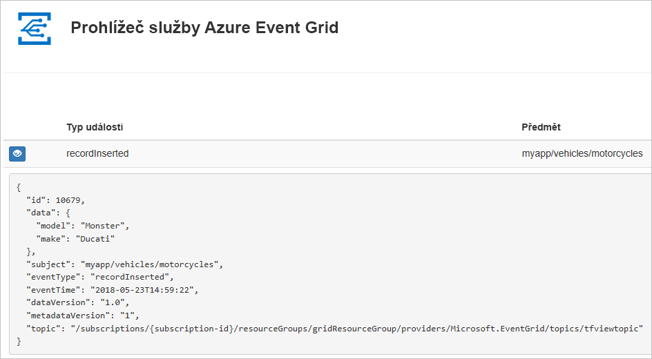
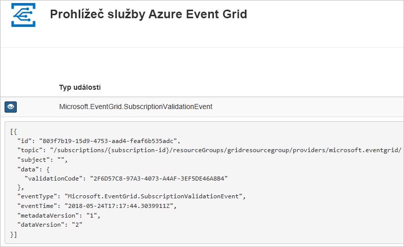

# <a name="quickstart-route-custom-events-to-web-endpoint-with-azure-cli-and-event-grid"></a>Rychlý start: Směrování vlastních událostí na webový koncový bod pomocí rozhraní příkazového řádku Azure a služby Event Grid

Azure Event Grid je služba zpracování událostí pro cloud. V tomto článku vytvoříte pomocí Azure CLI vlastní téma, přihlásíte se k jeho odběru a aktivujete událost, abyste viděli výsledek. Obvykle odesíláte události do koncového bodu, který data události zpracuje a provede akce. Pro zjednodušení tohoto článku však budete události odesílat do webové aplikace, která shromažďuje a zobrazuje zprávy.

Až budete hotovi, uvidíte, že se data události odeslala do webové aplikace.



[!INCLUDE [quickstarts-free-trial-note.md](../../includes/quickstarts-free-trial-note.md)]

[!INCLUDE [cloud-shell-try-it.md](../../includes/cloud-shell-try-it.md)]

Pokud se rozhodnete nainstalovat a používat rozhraní příkazového řádku (CLI) místně, pro účely tohoto článku musíte používat nejnovější verzi Azure CLI (2.0.24 nebo novější). Verzi zjistíte spuštěním příkazu `az --version`. Pokud potřebujete instalaci nebo upgrade, přečtěte si téma [Instalace Azure CLI](/cli/azure/install-azure-cli).

Pokud nepoužíváte Cloud Shell, musíte se nejprve přihlásit pomocí příkazu `az login`.

## <a name="create-a-resource-group"></a>Vytvoření skupiny prostředků

Témata služby Event Grid jsou prostředky Azure a musí být umístěné ve skupině prostředků Azure. Skupina prostředků je logická kolekce, ve které se nasazují a spravují prostředky Azure.

Vytvořte skupinu prostředků pomocí příkazu [az group create](/cli/azure/group#az-group-create). 

Následující příklad vytvoří skupinu prostředků *gridResourceGroup* v umístění *westus2*.

```azurecli-interactive
az group create --name gridResourceGroup --location westus2
```

[!INCLUDE [event-grid-register-provider-cli.md](../../includes/event-grid-register-provider-cli.md)]

## <a name="create-a-custom-topic"></a>Vytvoření vlastního tématu

Téma Event Gridu poskytuje uživatelsky definovaný koncový bod, do kterého odesíláte události. Následující příklad vytvoří vlastní téma ve vaší skupině prostředků. Nahraďte `<your-topic-name>` jedinečným názvem vašeho tématu. Název vlastního tématu musí být jedinečný, protože je součástí položky DNS. Kromě toho musí být dlouhý 3 až 50 znaků a obsahovat jenom hodnoty a – z, A-Z, 0-9, a "-"

```azurecli-interactive
topicname=<your-topic-name>

az eventgrid topic create --name $topicname -l westus2 -g gridResourceGroup
```

## <a name="create-a-message-endpoint"></a>Vytvoření koncového bodu zpráv

Před přihlášením k odběru vlastního tématu vytvoříme koncový bod pro zprávy události. Koncový bod obvykle provede akce na základě dat události. Pro zjednodušení tohoto rychlého startu nasadíte [předem připravenou webovou aplikaci](https://github.com/Azure-Samples/azure-event-grid-viewer), která zobrazuje zprávy události. Nasazené řešení zahrnuje plán služby App Service, webovou aplikaci App Service a zdrojový kód z GitHubu.

Nahraďte `<your-site-name>` jedinečným názvem vaší webové aplikace. Název webové aplikace musí být jedinečný, protože je součástí položky DNS.

```azurecli-interactive
sitename=<your-site-name>

az group deployment create \
  --resource-group gridResourceGroup \
  --template-uri "https://raw.githubusercontent.com/Azure-Samples/azure-event-grid-viewer/master/azuredeploy.json" \
  --parameters siteName=$sitename hostingPlanName=viewerhost
```

Dokončení nasazení může trvat několik minut. Po úspěšném nasazení si webovou aplikaci prohlédněte, abyste se ujistili, že funguje. Ve webovém prohlížeči přejděte na: `https://<your-site-name>.azurewebsites.net`

Měli byste vidět web aktuálně bez zobrazených zpráv.

## <a name="subscribe-to-a-custom-topic"></a>Přihlášení k odběru vlastního tématu

K odběru tématu Event Gridu se přihlašujete, aby služba Event Grid věděla, které události chcete sledovat a kam má tyto události odesílat. Následující příklad se přihlásí k odběru vlastního tématu, které jste vytvořili, a předá adresu URL z webové aplikace jako koncový bod pro oznámení události.

Koncový bod pro webovou aplikaci musí obsahovat příponu `/api/updates/`.

```azurecli-interactive
endpoint=https://$sitename.azurewebsites.net/api/updates

az eventgrid event-subscription create \
  -g gridResourceGroup \
  --topic-name $topicname \
  --name demoViewerSub \
  --endpoint $endpoint
```

Podívejte se na webovou aplikaci znovu a všimněte si, že do ní byla odeslána událost ověření odběru. Vyberte ikonu oka a rozbalte data události. Služba Event Grid odešle událost ověření, aby koncový bod mohl ověřit, že data události chce přijímat. Webová aplikace obsahuje kód pro ověření odběru.



## <a name="send-an-event-to-your-custom-topic"></a>Odeslání události do vlastního tématu

Teď aktivujeme událost, abychom viděli, jak služba Event Grid distribuuje zprávu do vašeho koncového bodu. Nejprve získáme adresu URL a klíč vlastního tématu.

```azurecli-interactive
endpoint=$(az eventgrid topic show --name $topicname -g gridResourceGroup --query "endpoint" --output tsv)
key=$(az eventgrid topic key list --name $topicname -g gridResourceGroup --query "key1" --output tsv)
```

V zájmu zjednodušení tohoto článku použijte k odeslání do vlastního tématu ukázková data události. Obvykle by aplikace nebo služba Azure odesílala data události. Následující příklad vytvoří ukázková data události:

```azurecli-interactive
event='[ {"id": "'"$RANDOM"'", "eventType": "recordInserted", "subject": "myapp/vehicles/motorcycles", "eventTime": "'`date +%Y-%m-%dT%H:%M:%S%z`'", "data":{ "make": "Ducati", "model": "Monster"},"dataVersion": "1.0"} ]'
```

Element JSON `data` je datová část vaší události. V tomto poli může být libovolný JSON ve správném formátu. Můžete také použít pole subject (předmět) pro pokročilé směrování a filtrování.

CURL je nástroj, který odesílá požadavky HTTP. V tomto článku používáme nástroj CURL k odeslání události do tématu. 

```azurecli-interactive
curl -X POST -H "aeg-sas-key: $key" -d "$event" $endpoint
```

Právě jste aktivovali událost a služba Event Grid odeslala zprávu do koncového bodu, který jste nakonfigurovali při přihlášení k odběru. Podívejte se na webovou aplikaci, abyste si zobrazili událost, kterou jste právě odeslali.

```json
[{
  "id": "1807",
  "eventType": "recordInserted",
  "subject": "myapp/vehicles/motorcycles",
  "eventTime": "2017-08-10T21:03:07+00:00",
  "data": {
    "make": "Ducati",
    "model": "Monster"
  },
  "dataVersion": "1.0",
  "metadataVersion": "1",
  "topic": "/subscriptions/{subscription-id}/resourceGroups/{resource-group}/providers/Microsoft.EventGrid/topics/{topic}"
}]
```

## <a name="clean-up-resources"></a>Vyčištění prostředků
Pokud chcete pokračovat v práci s touto událostí nebo aplikací prohlížeče událostí, nevyčišťujte prostředky vytvořené v rámci tohoto článku. Jinak pomocí následujícího příkazu odstraňte prostředky, které jste v rámci tohoto článku vytvořili.

```azurecli-interactive
az group delete --name gridResourceGroup
```

## <a name="next-steps"></a>Další postup

Když teď víte, jak vytvářet témata a odběry událostí, zjistěte, s čím vám služba Event Grid ještě může pomoct:

- [Informace o službě Event Grid](overview.md)
- [Směrování událostí služby Blob Storage do vlastního webového koncového bodu](../storage/blobs/storage-blob-event-quickstart.md?toc=%2fazure%2fevent-grid%2ftoc.json)
- [Monitorování změn virtuálního počítače pomocí služeb Azure Event Grid a Logic Apps](monitor-virtual-machine-changes-event-grid-logic-app.md)
- [Streamování velkých objemů dat do datového skladu](event-grid-event-hubs-integration.md)
