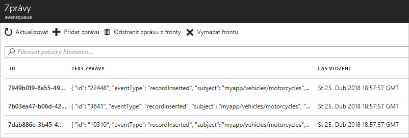

# <a name="route-custom-events-to-azure-queue-storage-with-azure-cli-and-event-grid"></a>Směrování vlastních událostí do Azure Queue Storage pomocí Azure CLI a Event Gridu

Azure Event Grid je služba zpracování událostí pro cloud. Azure Queue Storage je jednou z podporovaných obslužných rutin události. V tomto článku pomocí Azure CLI vytvoříte vlastní téma, přihlásíte se k jeho odběru a aktivujete událost, abyste viděli výsledek. Události odešlete do Queue Storage.

[!INCLUDE [quickstarts-free-trial-note.md](../../includes/quickstarts-free-trial-note.md)]

[!INCLUDE [event-grid-preview-feature-note.md](../../includes/event-grid-preview-feature-note.md)]

## <a name="create-a-resource-group"></a>Vytvoření skupiny prostředků

Témata služby Event Grid jsou prostředky Azure a musí být umístěné ve skupině prostředků Azure. Skupina prostředků je logická kolekce, ve které se nasazují a spravují prostředky Azure.

Vytvořte skupinu prostředků pomocí příkazu [az group create](/cli/azure/group#az_group_create). 

Následující příklad vytvoří skupinu prostředků *gridResourceGroup* v umístění *westus2*.

```azurecli-interactive
az group create --name gridResourceGroup --location westus2
```

## <a name="create-a-custom-topic"></a>Vytvoření vlastního tématu

Téma Event Gridu poskytuje uživatelsky definovaný koncový bod, do kterého odesíláte události. Následující příklad vytvoří vlastní téma ve vaší skupině prostředků. Nahraďte `<topic_name>` jedinečným názvem vašeho tématu. Název tématu musí být jedinečný, protože je reprezentován položkou DNS.

```azurecli-interactive
# if you have not already installed the extension, do it now.
# This extension is required for preview features.
az extension add --name eventgrid

az eventgrid topic create --name <topic_name> -l westus2 -g gridResourceGroup
```

## <a name="create-queue-storage"></a>Vytvoření Queue Storage

Před přihlášením k odběru tématu vytvoříme koncový bod pro zprávy události. Pro shromažďování událostí můžete vytvořit Queue Storage.

```azurecli-interactive
storagename="<unique-storage-name>"
queuename="eventqueue"

az storage account create -n $storagename -g gridResourceGroup -l westus2 --sku Standard_LRS
az storage queue create --name $queuename --account-name $storagename
```

## <a name="subscribe-to-a-topic"></a>Přihlášení k odběru tématu

K odběru tématu se přihlašujete, aby služba Event Grid věděla, které události chcete sledovat. Následující příklad se přihlásí k odběru tématu, které jste vytvořili, a předá ID prostředku Queue Storage pro koncový bod. Pomocí Azure CLI předáte ID Queue Storage jako koncový bod. Koncový bod je ve formátu:

`/subscriptions/<subscription-id>/resourcegroups/<resource-group-name>/providers/Microsoft.Storage/storageAccounts/<storage-name>/queueservices/default/queues/<queue-name>`

Následující skript načte ID prostředku účtu úložiště pro danou frontu. Vytvoří ID pro Queue Storage a přihlásí se k odběru tématu Event Gridu. Nastaví typ koncového bodu na `storagequeue` a použije ID fronty pro daný koncový bod.

```azurecli-interactive
storageid=$(az storage account show --name $storagename --resource-group gridResourceGroup --query id --output tsv)
queueid="$storageid/queueservices/default/queues/$queuename"

az eventgrid event-subscription create \
  --topic-name <topic_name> \
  -g gridResourceGroup \
  --name <event_subscription_name> \
  --endpoint-type storagequeue \
  --endpoint $queueid
```

Pokud k vytvoření odběru používáte rozhraní REST API, předáte ID účtu úložiště a název fronty jako samostatný parametr.

```json
"destination": {
  "endpointType": "storagequeue",
  "properties": {
    "queueName":"eventqueue",
    "resourceId": "/subscriptions/<subscription-id>/resourcegroups/<resource-group-name>/providers/Microsoft.Storage/storageAccounts/<storage-name>"
  }
  ...
```

## <a name="send-an-event-to-your-topic"></a>Odeslání události do tématu

Teď aktivujeme událost, abychom viděli, jak služba Event Grid distribuuje zprávu do vašeho koncového bodu. Nejprve získáme adresu URL a klíč vlastního tématu. Znovu místo `<topic_name>` použijte název vašeho tématu.

```azurecli-interactive
endpoint=$(az eventgrid topic show --name <topic_name> -g gridResourceGroup --query "endpoint" --output tsv)
key=$(az eventgrid topic key list --name <topic_name> -g gridResourceGroup --query "key1" --output tsv)
```

Pro zjednodušení tohoto článku použijte k odeslání do tématu ukázková data události. Obvykle by aplikace nebo služba Azure odesílala data události. CURL je nástroj, který odesílá požadavky HTTP. V tomto článku používáme nástroj CURL k odeslání události do tématu.  Následující příklad odešle tři události do tématu Event Gridu:

```azurecli-interactive
for i in 1 2 3
do
   body=$(eval echo "'$(curl https://raw.githubusercontent.com/Azure/azure-docs-json-samples/master/event-grid/customevent.json)'")
   curl -X POST -H "aeg-sas-key: $key" -d "$body" $endpoint
done
```

Přejděte na portálu na Queue Storage a všimněte si, že služba Event Grid odeslala tyto tři události do fronty.




## <a name="clean-up-resources"></a>Vyčištění prostředků
Pokud chcete pokračovat v práci s touto událostí, nevyčišťujte prostředky vytvořené v rámci tohoto článku. Jinak pomocí následujícího příkazu odstraňte prostředky, které jste v rámci tohoto článku vytvořili.

```azurecli-interactive
az group delete --name gridResourceGroup
```

## <a name="next-steps"></a>Další kroky

Když teď víte, jak vytvářet témata a odběry událostí, zjistěte, s čím vám služba Event Grid ještě může pomoct:

- [Informace o službě Event Grid](overview.md)
- [Směrování událostí služby Blob Storage do vlastního webového koncového bodu](../storage/blobs/storage-blob-event-quickstart.md?toc=%2fazure%2fevent-grid%2ftoc.json)
- [Monitorování změn virtuálního počítače pomocí služeb Azure Event Grid a Logic Apps](monitor-virtual-machine-changes-event-grid-logic-app.md)
- [Streamování velkých objemů dat do datového skladu](event-grid-event-hubs-integration.md)
