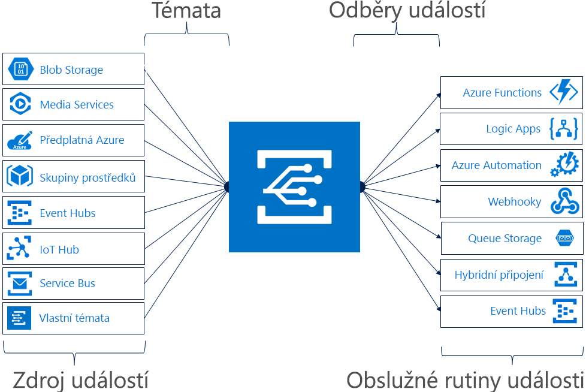

# Co je Azure Event Grid?

Azure Event Grid umožňuje snadno sestavovat aplikace pomocí architektur založených na událostech. Nejprve vyberte prostředek Azure, které chcete k přihlášení k odběru a dejte obslužná rutina události nebo koncový bod Webhooku pro odeslání události. Event Grid má integrovanou podporu událostí pocházejících ze služeb Azure, jako jsou služby Storage Blob a skupiny prostředků. Event Grid podporuje také vlastní události s využitím vlastních témat. 

Pomocí filtrů můžete směrovat konkrétní události do různých koncových bodů, zahájit vícesměrové vysílání do více koncových bodů a ujistit se o spolehlivém doručení událostí.

V současné době je Azure Event Grid k dispozici ve všech veřejných oblastech. Ještě není k dispozici v cloudech Azure Germany, Azure China nebo Azure Government.

Tento článek obsahuje přehled Azure Event Gridu. Pokud chcete začít pracovat s Event Gridem, přečtěte si článek [Vytvoření a směrování vlastních událostí pomocí služby Azure Event Grid](custom-event-quickstart.md). 

Tento obrázek ukazuje, jak služby Event Grid propojuje zdroje a obslužné rutiny a není úplný seznam podporovaných integrace.

## Zdroje událostí

Úplné podrobnosti o možnostech jednotlivých zdrojů a související články najdete v tématu věnovaném [zdrojům událostí](event-sources.md). V současné době podporují odesílání událostí do Event Gridu následující služby Azure:

* Předplatná Azure (operace správy)
* Container Registry
* Vlastní témata
* Event Hubs
* IoT Hub
* Media Services
* Skupiny prostředků (operace správy)
* Service Bus
* Storage Blob
* Storage univerzální v2 (GPv2)

## Obslužné rutiny událostí

Úplné podrobnosti o možnostech jednotlivých obslužných rutin a související články najdete v tématu věnovaném [obslužným rutinám událostí](event-handlers.md). V současné době podporují zpracování událostí z Event Gridu následující služby Azure: 

* Azure Automation
* Azure Functions
* Event Hubs
* Hybridní připojení
* Logic Apps
* Microsoft Flow
* Queue Storage
* Webhooky

## Koncepty

Azure Event Grid obsahuje pět konceptů, které vám pomůžou rychle začít s prací:

* **Události** – to, co se stalo.
* **Zdroje událostí** – kde k události došlo.
* **Témata** – koncový bod, kam vydavatelé odesílají události.
* **Odběry událostí** – koncový bod nebo integrovaný mechanismus pro směrování událostí, někdy k více než v obslužné rutině. Pomocí odběrů taky obslužné rutiny inteligentně filtrují příchozí události.
* **Obslužné rutiny událostí** – aplikace nebo služba reagující na danou událost.

Další informace o těchto konceptech najdete v článku [Koncepty ve službě Azure Event Grid](concepts.md).

## Možnosti

Toto jsou některé klíčové vlastnosti služby Azure Event Grid:

* **Jednoduchost** – kliknutím můžete nasměrovat události prostředku Azure do kterékoli obslužné rutiny události nebo koncového bodu.
* **Rozšířené filtrování** -filtru na události typu nebo události publikování cestu k Ujistěte se, že obslužné rutiny událostí zobrazí pouze relevantní události.
* **Větveného** -odběru několik koncových bodů pro stejnou událost posílat kopie události na tolik místa podle potřeby.
* **Spolehlivost** – 24 hodin opakování pomocí exponenciálního omezení rychlosti, abyste měli jistotu, události se doručují.
* **Platby za události** – plaťte jenom za to, do jaké míry Event Grid využíváte.
* **Vysoká propustnost** – sestavujte ve službě Event Grid úlohy s vysokým objemem díky podpoře milionů událostí za sekundu.
* **Integrované události** – integrované události s definovanými prostředky umožňují rychle zahájit práci.
* **Vlastní události** – využijte Event Grid ke směrování, filtrování a spolehlivému doručování vlastních událostí ve vaší aplikaci.

Porovnání služeb Event Grid, Event Hubs a Service Bus najdete v článku [Výběr mezi službami Azure, které doručují zprávy](compare-messaging-services.md).

## Co můžu dělat se službou Event Grid?

Azure Event gridu poskytuje několik funkcí, které významně zlepšit bez serveru, automatizace operací a [integrace](http://azure.com/integration) pracovat: 

### Architektury aplikací bez serveru

Event Grid propojuje zdroje dat a obslužné rutiny událostí. Například pomocí Event gridu aktivovat funkci bez serveru, která analyzuje obrázky, když se přidá do kontejneru úložiště objektů blob. 

### Automatizace operací

Event Grid umožňuje urychlit automatizaci a zjednodušit vynucování zásad. Například do Azure Automation při vytvoření virtuálního počítače nebo databáze SQL pomocí služby Event Grid. Pomocí události automaticky zkontrolujte, zda jsou kompatibilní, konfigurací služeb, vkládání metadat do provozních nástrojů, označování virtuálních počítačů nebo zakládání pracovních položek.

### Integrace aplikací

Event Grid propojuje vaši aplikaci s dalšími službami. Můžete třeba vytvořit vlastní téma pro odesílání dat událostí aplikace do služby Event Grid a využít tak její spolehlivé doručování, pokročilé směrování a přímou integraci s Azure. Nebo můžete použít Event Grid a Logic Apps zpracovávat data kdekoli, bez nutnosti psaní kódu. 

## Kolik stojí Event Grid?

Azure Event Grid využívá model plateb za události, takže platíte jenom za to, co využijete. Prvních 100 000 operací za měsíc je zdarma. Operace jsou definované jako příchozí události, pokusy o doručení, volání správy a filtrování podle přípony předmětu. Podrobnosti najdete na [stránce s cenami](https://azure.microsoft.com/pricing/details/event-grid/).

## Další postup

* [Směrování událostí objektů blob úložiště](../storage/blobs/storage-blob-event-quickstart.md?toc=%2fazure%2fevent-grid%2ftoc.json)  
  Pomocí služby Event Grid můžete reagovat na události objektů blob úložiště.
* [Vytváření vlastních událostí a přihlášení k jejich odběru](custom-event-quickstart.md)  
  Pusťte se rovnou do práce a pomocí rychlého startu pro Azure Event Grid začněte odesílat vlastní události do libovolného koncového bodu.
* [Použití Logic Apps jako obslužné rutiny událostí](monitor-virtual-machine-changes-event-grid-logic-app.md)  
  Kurz týkající se sestavení aplikace pomocí Logic Apps, která bude reagovat na události sdílené službou Event Grid.
* [Streamování velkých objemů dat do datového skladu](event-grid-event-hubs-integration.md)  
  Kurz, ve kterém se služba Azure Functions používá ke streamování dat ze služby Event Hubs do SQL Data Warehouse.
* [Referenční informace k rozhraní REST API služby Event Grid](/rest/api/eventgrid)  
  Obsahuje referenční obsah pro správu odběry událostí, směrování a filtrování.
