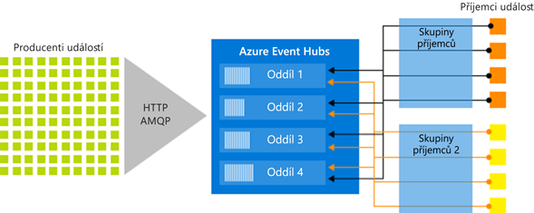

# Azure Event Hubs – Velké objemy dat platformy a události služba pro ingestování datových proudů
Azure Event Hubs je velké objemy dat, platformy a události služba pro ingestování datových proudů. Může přijímat a zpracovávat miliony událostí za sekundu. Data odeslaná do centra událostí je možné transformovat a uložit pomocí libovolného poskytovatele analýz v reálném čase nebo adaptérů pro dávkové zpracování a ukládání.

Některé scénáře, ve kterém můžete používat Event Hubs jsou následující scénáře:

- Detekce anomálií (podvody/odlehlé hodnoty)
- Protokolování aplikací
- Analytické kanály, jako například navštívené stránky
- Živé řídicí panely
- Archivace dat
- Zpracování transakcí
- Zpracování telemetrie uživatelů
- Streamování telemetrie zařízení 

## Proč používat Event Hubs

Data jsou cenná tehdy, když se datové zdroje dají snadno zpracovat a dají se z nich získat včasné přehledy. Event Hubs poskytuje platformu zpracování datového proudu distribuované s nízkou latencí a bezproblémovou integraci se službami data a analýzy uvnitř i mimo Azure k vytvoření kanálu, dokončení velké objemy dat.

Služba Event Hubs představuje „vstupní dveře“ pro kanál událostí, který se v architekturách řešení často nazývá *ingestor událostí*. Přijímač událostí je komponenta nebo služba, která se nachází mezi zdroji událostí a příjemci událostí a slouží k oddělení produkce datového proudu událostí od spotřeby těchto událostí. Event Hubs poskytuje jednotný streamovací platforma s vyrovnávací paměť doby uchovávání, oddělení producentů událostí z příjemci událostí. 

Následující části popisují klíčové funkce služby Azure Event Hubs: 

## PaaS (platforma jako služba) s plnou správou 

Event Hubs je plně spravovanou platformu as-a-Service (PaaS) s nízkou režií konfigurace nebo správy, takže vám soustředit se na vaše obchodní řešení. [Služba Event Hubs pro ekosystémy Apache Kafka](event-hubs-for-kafka-ecosystem-overview.md) vám umožňuje využívat možnosti PaaS Kafka bez nutnosti spravovat, konfigurovat nebo mít spuštěné vaše clustery.

## Podpora zpracování v reálném čase a dávkového zpracování

Ingestování, ukládání do vyrovnávací paměti, dlouhodobé ukládání a zpracování streamu je možné v reálném čase, takže můžete využívat užitečné přehledy hned. Služba Event Hubs využívá [modelu oddělených příjemců je pravidlo](event-hubs-features.md#partitions), povolení současně více aplikací ke zpracování datového proudu a umožňuje řídit rychlost zpracování.

[Zachycení](event-hubs-capture-overview.md) vašich dat v téměř reálném čase v [úložiště objektů Blob v Azure](https://azure.microsoft.com/services/storage/blobs/) nebo [Azure Data Lake Storage](https://azure.microsoft.com/services/data-lake-store/) pro dlouhodobé uchovávání dat nebo mikrodávek. zpracování. Toto chování pro stejný datový proud, který používáte pro odvození analýzy v reálném čase můžete dosáhnout. Nastavení sběru dat události je rychlé. Neexistují žádné administrativní náklady, aby běžel, a automaticky se škáluje s Event Hubs [jednotek propustnosti](event-hubs-features.md#throughput-units). Event Hubs vám umožní zaměřit se na zpracování dat a nikoli na sběr dat.

Azure Event Hubs se také dá integrovat s [Azure Functions](/azure/azure-functions/) jako architektura bez serveru.

## Škálovatelné 

Pomocí Event Hubs můžete začít se streamy v megabajtech a přejít na gigabajty nebo terabajty. Funkce [Automatické rozšiřování](event-hubs-auto-inflate.md) je jednou z mnoha dostupných možností škálování počtu jednotek propustnosti, aby to vyhovovalo vašim potřebám. 

## Ekosystém plný možností

[Event Hubs pro Apache Kafka ekosystémů](event-hubs-for-kafka-ecosystem-overview.md) umožňuje [Apache Kafka (1.0 nebo novější)](https://kafka.apache.org/) klienty a aplikace komunikovat s Event Hubs. Není potřeba nastavit, nakonfigurovat a spravovat vlastní clustery Kafka.
 
Díky širokému ekosystému dostupnému v různých [jazycích (.NET, Java, Python, Go, Node.js)](https://github.com/Azure/azure-event-hubs) můžete snadno začít zpracovávat streamy ze služby Event Hubs. Všechny podporované jazyky klientů poskytují integraci na nízké úrovni. Ekosystému také poskytuje bezproblémovou integraci se službami Azure, jako je Azure Stream Analytics a Azure Functions a umožňuje tak vytvářet architektur bez serveru.

## Klíčové komponenty architektury
Event Hubs obsahuje následující [klíčové komponenty](event-hubs-features.md):

- **Producentů událostí**: Každá entita, která odesílá data do centra událostí. Vydavatelé událostí můžou publikovat události pomocí protokolu HTTPS nebo AMQP 1.0 nebo Apache Kafka (1.0 nebo vyšší).
- **Oddíly**: Každý příjemce četl jenom konkrétní podmnožinu nebo oddíl datového proudu zpráv.
- **Skupiny příjemců**: Zobrazení (stavu, pozice nebo posunu) celého centra událostí. Příjemce skupiny povolit aplikacím mít samostatné zobrazení datového proudu událostí. Čtou datový proud nezávisle na sobě svým vlastním tempem a s použitím vlastních posunů.
- **Jednotky propustnosti**: Předem zakoupené jednotky kapacity, které řídí kapacita propustnosti služby Event Hubs.
- **Přijímače událostí**: Každá entita, která čte data událostí z centra událostí. Všichni příjemci služby Event Hubs připojují pomocí relace protokolu AMQP 1.0. Služba Event Hubs poskytuje události prostřednictvím relace, jakmile budou k dispozici. Všichni příjemci Kafka se připojují přes protokol Kafka 1.0 nebo novější.

Následující obrázek znázorňuje architekturu zpracování datového proudu Event Hubs:

## Další postup

Pokud chcete začít používat službu Event Hubs, podívejte se na následující články:

1. **Vytvoření centra událostí**: [Azure portal](event-hubs-create.md), [rozhraní příkazového řádku Azure](event-hubs-quickstart-cli.md), [prostředí Azure PowerShell](event-hubs-quickstart-powershell.md), [šablony Azure Resource Manageru](event-hubs-resource-manager-namespace-event-hub.md)
2. **Odesílání událostí do centra událostí**: [.NET Core](event-hubs-dotnet-standard-getstarted-send.md), [rozhraní .NET Framework](event-hubs-dotnet-framework-getstarted-send.md), [Java](event-hubs-java-get-started-send.md), [Python](event-hubs-python-get-started-send.md), [Node.js](event-hubs-node-get-started-send.md), [Přejít](event-hubs-go-get-started-send.md), [C](event-hubs-c-getstarted-send.md)
3. **Příjem událostí z centra událostí**: [.NET Core](event-hubs-dotnet-standard-getstarted-receive-eph.md), [rozhraní .NET Framework](event-hubs-dotnet-framework-getstarted-receive-eph.md), [Java](event-hubs-java-get-started-receive-eph.md), [Python](event-hubs-python-get-started-receive.md), [Node.js ](event-hubs-node-get-started-receive.md), [Přejít](event-hubs-go-get-started-receive-eph.md), [Apache Storm](event-hubs-storm-getstarted-receive.md)   

Další informace o službě Event Hubs najdete v následujících článcích:

- [Přehled funkcí Event Hubs](event-hubs-features.md)
- [Nejčastější dotazy](event-hubs-faq.md)

